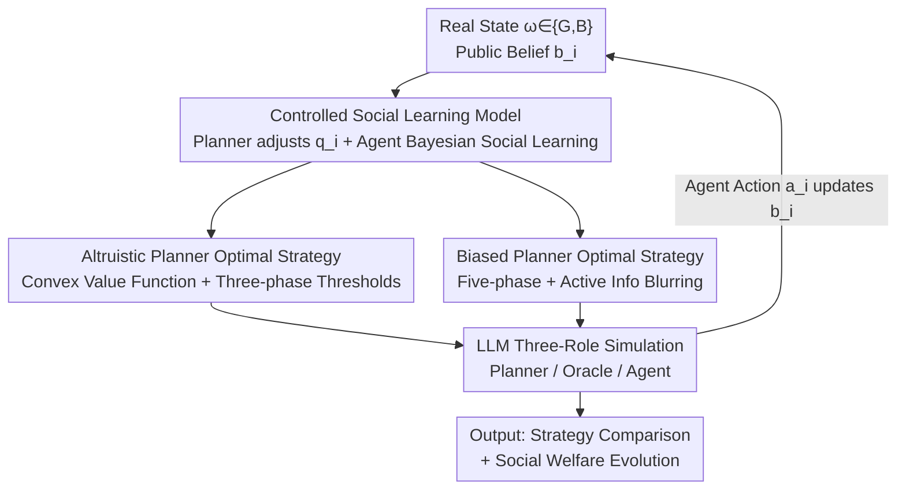

# Steering the Herd: A Framework for LLM-Based Control of Social Learning

**Conference**: ICLR 2026  
**OpenReview**: [https://openreview.net/forum?id=RtS4UqSmNt](https://openreview.net/forum?id=RtS4UqSmNt)  
**Area**: LLM Social Computing / Information Design / Social Learning  
**Keywords**: Social Learning, Information Intermediaries, LLM Planner, Information Cascades, Bayesian Persuasion

## TL;DR
This paper formalizes "LLMs acting as information intermediaries" as a **controlled sequential social learning** model. In this framework, a planner can only regulate the precision of each individual's private signal (without falsification or selection bias), while individuals update public beliefs by observing both private signals and the actions of their predecessors. The authors prove the convexity of the altruistic planner's value function and characterize the optimal strategies for both altruistic and biased planners (where the latter may actively "blur" information). Simulations involving LLMs acting as both planners and agents demonstrate that emerging LLM planner strategies align closely with theoretical optima.

## Background & Motivation
**Background**: LLMs increasingly serve as "information intermediaries"—search engines, news aggregators, personalized recommenders, and assistants for medical or political advice. These algorithms do not influence single users in a vacuum; they are embedded in a **word-of-mouth** social process where users receive private information from algorithms while observing the choices of others to make decisions.

**Limitations of Prior Work**: Classical social learning theories (Bikhchandani, Banerjee, etc.) describe how sequential individuals form information cascades (herding) by observing predecessors, but rarely consider a **centralized algorithmic planner** regulating information. Conversely, classical information design or Bayesian persuasion (Kamenica-Gentzkow) typically studies "one-to-one" sender-receiver dynamics, ignoring social learning between receivers. These two lines of research remain disconnected, lacking a tractable model that couples algorithmic regulation with social learning.

**Key Challenge**: The planner's choice at each step affects not only the current individual but also alters the **public belief** through that individual's action, creating an "informational externality" for all future individuals. This represents a coupling of dynamic programming and decentralized Bayesian decision-making, which is significantly more complex than single-step persuasion.

**Goal**: (1) Establish a tractable model combining dynamic control of information intermediaries with sequential social learning; (2) Characterize optimal strategies for altruistic and biased planners in evolving public beliefs; (3) Empirically test whether this theory holds when facing non-Bayesian agents using LLMs.

**Key Insight**: The authors intentionally impose a "transparency shackle" on the planner—it possesses the same historical information as individuals, cannot lie or selectively omit information, and can only adjust signal precision in an observable manner. Demonstrating significant manipulation of social welfare under such strict constraints highlights the inherent risks of information intermediaries.

**Core Idea**: The planner's problem is formulated as an infinite-horizon discounted MDP with the public belief $b_i$ as the state and signal precision $q_i$ as the control. Optimal strategies are derived via dynamic programming and validated by having LLMs play the roles of planners, agents, and signal generators.

## Method

### Overall Architecture
The model assumes a planner facing a **sequence of arriving Bayesian rational agents** $i=1,2,\dots$. There is a fixed but unknown state of the world $\omega\in\{G,B\}$ (e.g., a restaurant being good or bad), and a prior $P(\omega=G)=b_1$ is public. At each step, the planner selects a **signal precision** $q_i\in[0.5,1]$ for agent $i$, such that the binary private signal $s_i$ satisfies $P(s_i=\omega)=q_i$. The agent combines this private signal with the **action history of all predecessors** $H_i$ to choose an action $a_i\in\{G,B\}$. Correct actions ($a_i=\omega$) yield utility 0, while incorrect ones yield $-C$. All agents share a **public belief** $b_i=P(\omega=G\mid H_i)$, which serves as a sufficient statistic of history and forms a Markov process updated after each action.

The system is a closed loop: the planner selects precision based on current public belief $\to$ the agent acts based on private signal and public belief $\to$ the action is observed to update the public belief $\to$ the process moves to the next agent. In simulation, this loop is implemented by three LLM roles: **Planner** (selects precision), **Oracle** (generates a private signal at the specified precision), and **Agent** (acts based on a given persona, history, and private signal).

### Key Designs

**1. Controlled Sequential Social Learning: Embedding "Precision Tuning" into Belief Updates**

To address the gap between algorithmic regulation and social learning theories, this paper constructs a unified tractable model. The key is making **signal precision** $q_i$ the planner's only lever. The planner cannot lie or bias the content; it only determines how "clear" the private signal is. Agent $i$ uses history $H_i$ (equivalent to $b_i$) and private signal $s_i$ to calculate a private belief $\tilde b_i=P(\omega=G\mid H_i,q_i,s_i)$ and acts according to the more likely state. This yields a clean **threshold-based action rule**:

$$a_i=\begin{cases} s_i & 1-q_i\le b_i\le q_i\\ G & q_i<b_i\\ B & q_i<1-b_i\end{cases}$$

This rule reveals the core tension: only when precision $q_i$ falls within $[1-b_i,\,b_i]$ (or the symmetric interval) will the agent "follow the private signal," thereby **revealing** private information and driving the public belief update ($b_{i+1}=\tilde b_i$). If precision is too low or public belief is too strong, the agent ignores the private signal and follows the crowd, causing the public belief to stagnate—this is the classic **information cascade/herding**, an absorbing state. The planner must balance the cost of high-precision signals to sustain social learning against the risk of letting cascades settle early.

**2. Altruistic Planner's Strategy: Convexity and Three-phase Thresholds**

An altruistic planner aims to match agent actions to the true state ($a_i=\omega$), maximizing social welfare minus precision costs. The objective is an infinite-horizon MDP with discount factor $\delta$ and instantaneous reward $r_A(b_i,q_i)=-\beta(q_i)-C\,P(a_i\ne\omega\mid b_i,q_i)$. A core theoretical contribution is proving that **$V_A^*(\cdot)$ is a convex function of the public belief** (Theorem 2). This proof is non-trivial because agent actions depend on public beliefs, making expected utility non-linear; the authors bypass action-dependency to establish convexity, which is crucial for characterizing the optimal strategy.

The optimal altruistic strategy follows a **three-phase regime** (Theorem 3): when public beliefs are extreme, the planner stops investing and uses baseline precision $p$; when beliefs are near 0.5 (information is scarce), the planner invests in **maximum precision (1)** if costs allow, collapsing the belief to 0 or 1; in the intermediate range, the planner selects the **minimum precision necessary to make the agent follow the signal**, $\max(b,1-b)$. Notably, social learning optimality requires **stronger** public beliefs to stop investing compared to myopic benchmarks ($\delta=0$).

**3. Biased Planner's Strategy: Five Phases and Active Information Blurring**

A biased planner seeks to induce a specific action $G$ regardless of the truth, with reward $r_B(b_i,q_i)=-\beta(|q_i-p|)-C\,P(a_i=B\mid b_i,q_i)$. Its strategy is more complex, involving **five phases** (Theorem 5). Paradoxically, when the public belief is already **weakly favorable** to $G$ ($b\in[0.5,t_2)$), the planner may **reduce precision below $p$**, even down to $b-\epsilon$, to force the agent to ignore any potential "bad" private signal and follow the favorable cascade. This **active blurring/shrouding** of information locks the society into a biased cascade. Conversely, when beliefs approach an unfavorable cascade, the planner may invest heavily in precision as a "hail mary" to pull the public belief back.

**4. LLM Three-Role Simulation: Testing Theory on Non-Bayesian Agents**

While theory assumes Bayesian rationality, LLMs (and humans) exhibit systematic cognitive biases. To test robustness, the authors used LLMs as Planner, Oracle, and Agent in a "car purchasing" scenario. Initial tests identified three non-Bayesian biases: (NB1) Under-reaction to **prior-consistent** signals; (NB2) Over-reaction to **prior-inconsistent** signals; (NB3) Consequently requiring stronger public beliefs to enter a cascade. Despite these biases, **LLM planners emerged with strategies highly consistent with theoretical optima**, with deviations often being **strategic adaptations** to non-Bayesian behavior (e.g., avoiding extreme precisions of 0.5/1.0 and smoothing investment transitions).

## Key Experimental Results

Simulations were conducted in a "car purchase" scenario with a linear cost function $\beta(q)=k|q-p|$ and fixed error cost $C=1$, varying $k$, baseline $p$, and discount $\delta$.

### Main Results: LLM Strategy vs. Theoretical Optimal

| Setting | Altruistic Planner | Biased Planner |
|------|-----------|-----------|
| Qualitative Trend Match | Yes: Stop investing as belief strengthens | Yes: Heavy investment to escape bad cascades; blurring near midpoint |
| Strategy Deviation in Most Belief Intervals | < 10% | < 10% |
| LLM-specific Deviations | Avoidance of extreme precision; smoother tapering | Persistence of "hail mary" efforts at very low beliefs |

### Welfare Impact (Relative to No-Control Baseline)

| Setting | True State | Welfare Change | Mechanism |
|------|---------|-------------|------|
| Altruistic (Numerical/LLM) | Any | Monotonic improvement | Always improves learning |
| Biased · Mismatch ($\omega=B$, induce $G$) | B | **Decrease of 40–50%** | Active precision reduction; blurring |
| Hybrid (Optimal Strategy + LLM Agents) | — | Brittle performance; worse than LLM's own strategy | Strategies designed for Bayesian agents fail on non-Bayesian ones |

### Key Findings
- **Accounting for Social Learning is Crucial**: Both analytical and LLM planners significantly improve their utility by incorporating social learning dynamics; myopia leads to markedly worse outcomes.
- **Theory Robustness to Non-Bayesian Agents**: LLM planners facing biased agents still select strategies structurally similar to the non-trivial analytical optima, suggesting the theory does not strictly depend on perfect Bayesianism.
- **Cost of Model Misspecification**: Applying optimal Bayesian strategies to non-Bayesian LLM agents results in "brittle" performance. LLM planners' self-taught strategies, while similar to analytical solutions, are better tailored to human-like biases.

## Highlights & Insights
- **Ingenious Constraint Design**: Reducing the information design space to a single scalar $q_i\in[0.5,1]$ preserves tractability while mirroring real-world compliance scenarios where algorithms cannot lie but control clarity.
- **Counter-intuitive Blurring**: The discovery that biased planners intentionally **reduce** precision to lock societies into favorable cascades reveals a regulatory blind spot—intermediaries don't need to lie to manipulate public opinion.
- **Reusable Convexity Proof**: The technique used to establish value function convexity despite action-dependent rewards is valuable for other social learning control problems where actions feed back into states.
- **LLM as Economic Agent Paradigm**: Using LLMs to play both planner and agent roles allows for mutual anchoring between theory and simulation, using theory to explain emergent LLM behaviors (like investment smoothing).

## Limitations & Future Work
- **Strong Modeling Assumptions**: The model assumes planners and agents share identical histories, signals are binary symmetric, and precision is fully observable. Relaxing these would likely increase the threats posed by biased intermediaries.
- **Binary State and Action Space**: Real-world recommendation scenarios involve much higher-dimensional states and actions than the $\{G,B\}$ setup used here.
- **Limited Simulation Scenarios**: Simulations were confined to a single "car purchase" context. Whether cognitive biases (NB1-NB3) and strategy stability hold across diverse personas or factual contexts remains to be seen.
- **Future Directions**: Exploring planners capable of selective filtering or hidden framing, extending to multi-state/continuous models, and designing regulatory mechanisms to detect biased precision manipulation.

## Related Work & Insights
- **vs. Classical Social Learning (Bikhchandani 1992, Banerjee 1992)**: This work adds a **centralized planner** regulating signal precision to the standard unmanaged sequential cascade model.
- **vs. Controlled Social Learning (Wei & Anastasopoulos 2022; Smith et al. 2021)**: Unlike prior work requiring bi-directional communication or direct interference with agent decision rules, this model relies solely on precision regulation, making it more representative of "black-box" algorithmic intermediaries.
- **vs. Bayesian Persuasion (Kamenica-Gentzkow 2011)**: Moves beyond one-to-one static persuasion to a **dynamic sequential** problem where the planner re-optimizes for every agent in the presence of social learning.
- **vs. LLM Information Design (Duetting et al. 2025)**: While they use LLM oracles to optimize framing in single-turn interactions, this paper focuses on **repeated interactions and social learning dynamics**.

## Rating
- Novelty: ⭐⭐⭐⭐⭐ First tractable model coupling dynamic control of information intermediaries with sequential social learning, validated by LLM empirical behavior.
- Experimental Thoroughness: ⭐⭐⭐⭐ Solid theoretical foundations (convexity + multi-phase analysis), though LLM simulations are limited in scale and context.
- Writing Quality: ⭐⭐⭐⭐⭐ Progressive flow from intuition to formal modeling to simulation, with clear connections between theory and evidence.
- Value: ⭐⭐⭐⭐⭐ Provides a rigorous analytical basis for studying the impact and regulation of LLM-based information intermediaries.

<!-- RELATED:START -->

## Related Papers

- [\[ICLR 2026\] Language and Experience: A Computational Model of Social Learning in Complex Tasks](language_and_experience_a_computational_model_of_social_learning_in_complex_task.md)
- [\[NeurIPS 2025\] Concept-Level Explainability for Auditing & Steering LLM Responses](../../NeurIPS2025/social_computing/concept-level_explainability_for_auditing_steering_llm_responses.md)
- [\[AAAI 2026\] Bias Association Discovery Framework for Open-Ended LLM Generations](../../AAAI2026/social_computing/bias_association_discovery_framework_for_open-ended_llm_generations.md)
- [\[ICLR 2026\] SocialHarmBench: Revealing LLM Vulnerabilities to Socially Harmful Requests](socialharmbench_revealing_llm_vulnerabilities_to_socially_harmful_requests.md)
- [\[ICLR 2026\] GRADIEND: Feature Learning within Neural Networks Exemplified through Biases](gradiend_feature_learning_within_neural_networks_exemplified_through_biases.md)

<!-- RELATED:END -->
## Related Papers

- [\[NeurIPS 2025\] Concept-Level Explainability for Auditing & Steering LLM Responses](../../NeurIPS2025/social_computing/concept-level_explainability_for_auditing_steering_llm_responses.md)
- [\[AAAI 2026\] Bias Association Discovery Framework for Open-Ended LLM Generations](../../AAAI2026/social_computing/bias_association_discovery_framework_for_open-ended_llm_generations.md)
- [\[ICLR 2026\] SocialHarmBench: Revealing LLM Vulnerabilities to Socially Harmful Requests](socialharmbench_revealing_llm_vulnerabilities_to_socially_harmful_requests.md)
- [\[ICLR 2026\] GRADIEND: Feature Learning within Neural Networks Exemplified through Biases](gradiend_feature_learning_within_neural_networks_exemplified_through_biases.md)
- [\[ICLR 2026\] Measuring and Mitigating Rapport Bias of Large Language Models under Multi-Agent Social Interactions](measuring_and_mitigating_rapport_bias_of_large_language_models_under_multi-agent.md)

<!-- RELATED:END -->
