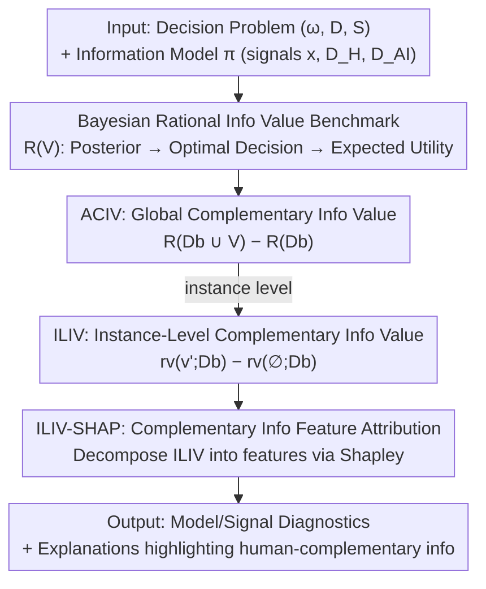

# The Value of Information in Human-AI Decision-Making

**Conference**: ICLR 2026  
**OpenReview**: [https://openreview.net/forum?id=rp2RDBRA0Y](https://openreview.net/forum?id=rp2RDBRA0Y)  
**Code**: https://github.com/Guoziyang27/decision_infovalue  
**Area**: Human-AI Collaborative Decision-Making / Explainability / Decision Theory  
**Keywords**: Value of Information, Human-AI Complementarity, Bayesian Decision Theory, SHAP Explanations, Decision Evaluation

## TL;DR
This paper proposes a framework based on Bayesian decision theory that uses "Value of Information" to quantify the maximum expected utility gain brought by each signal (AI predictions, human judgments, instance features) relative to existing decisions. Based on this, it designs a new explanation method, ILIV-SHAP, which highlights "human-complementary information." Experiments in house price prediction demonstrate that it improves human-AI team decision accuracy more effectively than standard SHAP.

## Background & Motivation

**Background**: Pairing human experts with AI models for decision-making (in medicine, finance, and law) is predicated on the expectation of "complementary performance"—where the team outperforms either individual moiety. Theoretically, complementarity exists when humans possess information inaccessible to the AI (e.g., context outside of medical records).

**Limitations of Prior Work**: Numerous empirical studies have found that human-AI teams often underperform compared to the AI alone. This conclusion is clouded by two ambiguities: first, **measurement issues**—performance is typically scored by ex-post decision accuracy without considering the "optimal performance achievable given available information at the moment of decision"; second, **attribution issues**—it is often unclear exactly what information humans and AI are using or which part of the information is being underutilized, making it impossible to design targeted interventions.

**Key Challenge**: To improve collaboration, one must first identify "which piece of information still holds untapped value for whom." However, existing methods lack both a theoretical benchmark—independent of human rationality—to measure the "achievable optimum" and an explainability tool capable of decomposing this value into specific features.

**Goal**: (1) Provide a decision-theoretic framework to characterize the "Value of Information" of any signal within a human-AI workflow; (2) Distinguish between global and instance-level value; (3) Transform instance-level value into an explanation technique that conveys to humans "where the AI's complementary information lies."

**Key Insight**: The authors argue that whether information is "valuable" depends on whether it can theoretically be integrated into a decision to increase utility. Consequently, a **Bayesian rational decision-maker** is used as the upper bound for "optimal information usage." The core insight is that any information truly utilized by a decision-maker will eventually be revealed through changes in their decisions. Thus, the **complementary value** of a signal relative to an existing decision can be measured by the difference in rational utility before and after providing that specific signal.

**Core Idea**: Value of information is defined as the "marginal gain in expected utility for a Bayesian rational DM before and after adding a new signal." This gain is refined from a global perspective (ACIV) to an instance level (ILIV). Subsequently, Shapley values are used to attribute ILIV to individual features, resulting in the ILIV-SHAP explanation.

## Method

### Overall Architecture

The input to the framework consists of a **decision problem** and an **information model**: the decision problem is defined by the triple $(\Omega, D, S)$—the utility-relevant state $\omega$, the decision space $D$, and the utility function $S(d,\omega)$; the information model represents all information available at the time of decision (including the agents' decisions themselves) as a set of signals $\Sigma_1,\dots,\Sigma_n$ and their joint distribution $\pi$ with the state. In a standard human-AI workflow, basic signals include $\{x, D_H, D_{AI}\}$—instance features, the human's initial judgment, and the AI prediction.

The output of the framework is the "Value of Information" for these signals. The core approach introduces a **Bayesian rational decision-maker** as an ideal benchmark for "extreme information utilization": it understands the prior and the conditional distribution of signals, updates to a posterior after observing signal realizations, and selects the decision that maximizes expected utility. Based on this, three levels of metrics are defined: first, the absolute information value IV (relative to a zero-information baseline); second, the **Global Complementary Information Value (ACIV)** relative to an agent's existing decision; and finally, the **Instance-Level Complementary Information Value (ILIV)** for individual instances. ILIV is then decomposed via Shapley attribution to produce **ILIV-SHAP** explanations, which inform the human which features in the AI prediction provide untapped complementary information.

### Key Designs

**1. Bayesian Rational Info Value Benchmark: Anchoring Info Value via "Theoretically Optimal Usage"**

The pain point is that empirical conclusions regarding "complementarity" are often muddied by measurement—using ex-post accuracy conflates "information having no value" with "humans failing to use information correctly." The solution here is to ask not "how humans actually performed," but "how well could one theoretically perform, given this information." Specifically, the expected utility of a rational DM under signal $V$ is:
$$R(V) := \mathbb{E}_{(v,\omega)\sim\pi}[S(d_r(v), \omega)], \quad d_r(v) = \arg\max_{d\in D}\mathbb{E}_{\omega\sim\pi(\omega|v)}[S(d,\omega)]$$
where $d_r(\cdot)$ is the optimal decision rule based on the posterior $\pi(\omega|v)$. Using the optimal fixed action under zero information (prior only) $R(\varnothing)=\max_d \mathbb{E}_{\omega\sim\pi}[S(d,\omega)]$ as a baseline, Information Value is defined as $IV(V) := R(V) - R(\varnothing)$. This is effective because $R(V)$ serves as the "upper bound of expected utility achievable by any strategy within the same experiment." Thus, regardless of whether actual humans are rational or how their decision process deviates, this benchmark remains valid; it cleanly separates "what information can provide" from "how well the agent utilized it."

**2. ACIV: Measuring the Remaining Untapped Value of a Signal Relative to Existing Decisions**

Absolute value is insufficient—what is truly sought is "how much more can be gained by adding signal $V$ on top of a decision already made by an agent." This defines **Global Complementary Information Value (ACIV)**:
$$ACIV(V; D_b) := R(D_b \cup V) - R(D_b)$$
Here, $D_b$ represents the decision of an agent (human, AI, or human-AI team). The intuition is that any information an agent actually uses will be reflected in changes to their decision $D_b$. If the ACIV of $V$ is small, either $V$ itself is irrelevant to the state, or the agent has already integrated $V$ (or equivalent information) into the decision. If ACIV is large, the agent could theoretically improve utility by incorporating $V$. By treating AI predictions as $V$ and human decisions as $D_b$, a high ACIV indicates that "the AI provides significant value beyond the human"; conversely, it can measure how much the human contributes beyond the AI—making it a bidirectional measure of "complementarity." For high-dimensional/continuous signals (images, text) where identical signal realizations are unobservable, the authors use Algorithm 1 to learn a posterior estimator $\hat a$ for approximation: fitting $\hat a(v, d^b)$ and $\hat a_b(d^b)$ and averaging the utility difference between their respective optimal decisions for each sample.

**3. ILIV: Refining Complementary Value from Distribution to Single Instances**

ACIV is the expectation over the entire data distribution and does not reveal "how much room for improvement a signal offers in a specific instance." **Instance-Level Complementary Information Value (ILIV)** fills this gap: for instances where the signal realization is $V=v$, if a rational DM observes $v'$ (allowing $v'\neq v$ for counterfactual evaluation) combined with existing decision $D_b$, the expected utility is $r_v(v'; D_b) = \mathbb{E}_{(d^b,\omega)\sim\pi(d^b,\omega|v)}[S(d_r(v'\cup d^b), \omega)]$. Thus:
$$ILIV_v(v'; D_b) := r_v(v'; D_b) - r_v(\varnothing; D_b)$$
This represents the gain in expected utility from knowing $v$ on this type of instance, relative to knowing only the agent's decision. It reaches its maximum when $v'=v$ (the signal is not misleading) as $ILIV_v(v;D_b)\ge ILIV_v(v';D_b)$. The flexibility of $v'$ allows the framework to describe utility changes caused by being "misled" (e.g., the loss from misjudging a true 21°C as 18°C), which forms the basis for ILIV-SHAP.

**4. ILIV-SHAP: Attributing Instance-Level Complementary Value to Features via Shapley**

Traditional saliency explanations (SHAP) convey the "average contribution of each feature to the predicted value," answering "why the AI predicted this" rather than "what part of this AI prediction contains complementary information I haven't utilized." ILIV-SHAP shifts the attribution target from the "predicted value" to the "complementary information value ILIV carried by the prediction." Following the Shapley framework, the importance of the $i$-th feature is:
$$\phi_i^{ILIV}(f, x) = \sum_{x'\subseteq x}\frac{|x'|!(m-|x'|-1)!}{m!}\big[ILIV_{f(x)}(g_f(x'); D_b) - ILIV_{f(x)}(g_f(x'\setminus x_i); D_b)\big]$$
where $g_f(x')$ is the expected model output when non-marginalized features are fixed to $x'$. It inherits SHAP's efficiency axiom (the sum of feature importances equals the information value of the model output) and the symmetry axiom. Additionally, because ILIV is monotonically non-decreasing as more features are included, sampling-based approximations (e.g., Kernel/Partition SHAP) are more stable for ILIV-SHAP than for standard SHAP. Highlighting features above a threshold results in an explanation that "points humans toward where the complementary information is."

### Loss & Training
The framework itself is analytical and does not require end-to-end training. The only component that needs to be "learned" is the posterior estimator $\hat a$ in Algorithm 1 (fitted using linear regression, GBM, or neural networks; Appendix I provides sensitivity analyses for these). It must be cross-validated and checked for calibration error, as a rational DM treats it as a true Bayesian posterior.

## Key Experimental Results

### Main Results: Human-AI Collaboration in House Price Prediction (Pre-registered Online Experiment)

421 Prolific participants performed decision-making on the Ames Housing dataset. Each person predicted once without AI and once after seeing the AI's output. A 2×3 design crossed two AI models (AI1 with high ACIV / AI2 with low ACIV) with three explanation types (ILIV-SHAP+SHAP / SHAP / None). AI1 utilized Feature X/Y, which were intentionally made less interpretable, thus providing complementary information to humans. Evaluation was based on the reduction in APE relative to solo human decisions.

| AI Model | Input Features | MAPE | R² | ACIV (MAPE) |
| :--- | :--- | :--- | :--- | :--- |
| AI1 | All 6 features (incl. X/Y) | 14.30% | 0.81 | 4.61% |
| AI2 | Only 4 interpretable features | 14.51% | 0.81 | 2.00% |

The two AI models had nearly identical prediction accuracy, but the ACIV ranking aligned with expectations (AI1 > AI2), proving that ACIV can identify which model is more complementary when accuracy alone cannot distinguish between them.

### Impact of Explanations on APE Reduction (Human-AI Team vs. Solo Human)

| Condition | APE Reduction [95% CI] | Note |
| :--- | :--- | :--- |
| AI1 + ILIV-SHAP & SHAP | **6.94%** [6.50, 7.38] | High complementarity model + Comp info explanation (Best) |
| AI1 + SHAP | 5.88% [5.47, 6.28] | Standard explanation |
| AI1 + None | 5.96% [5.50, 6.42] | Baseline |
| AI2 + ILIV-SHAP & SHAP | 5.31% [4.80, 5.83] | No advantage for ILIV-SHAP on low complementarity model |
| AI1 (Aggregated Explanations) | 6.24% [5.99, 6.50] | High ACIV model is better overall |
| AI2 (Aggregated Explanations) | 5.96% [5.68, 6.24] | Low ACIV model |

### Key Findings
- **ACIV as a Model Selection Signal**: When two AI models have nearly identical accuracy, the AI with higher ACIV leads to greater team improvement. This validates using information value rather than accuracy to select complementary models.
- **ILIV-SHAP Gains Depend on Existing Complementarity**: ILIV-SHAP+SHAP significantly outperformed standard SHAP or no explanation only when the AI actually carried complementary information (AI1). On the low-complementarity AI2, ILIV-SHAP offered no advantage—consistent with the theory that there is no "complementary information" to point out.
- **Real-Task Demonstrations**: In chest X-ray diagnosis, five image models and radiologist reports were **bidirectionally complementary** (each added value to the other), with ViT showing slightly higher information value. In deepfake detection, AI predictions provided ~65% of the total available information value while humans provided ~15%, but human-AI teams achieved only ~30%—suggesting humans fail to fully utilize AI information. Feature-level analysis showed "flickering face" had higher ACIV for human decisions, while "dark skin tone" had higher ACIV for AI predictions, revealing the different information dependencies of humans and AI.

## Highlights & Insights
- **Quantifying Complementarity**: It transforms "complementarity" from a vague intuition into a computable metric. ACIV/ILIV provides the marginal information value of a signal relative to existing decisions and is bidirectional (AI-to-human, human-to-AI), offering more precision than general team performance metrics.
- **The Elegance of the Rational Benchmark**: Using a Bayesian rational DM's utility as an upper bound means the conclusions "hold regardless of whether humans are rational." It does not model the human but sets a benchmark for "how much the information *could* contribute," decoupling info value from agent utilization.
- **Shifting Explanations toward Complementarity**: ILIV-SHAP shifts the attribution target from predicted values to ILIV. This is a transferable design paradigm: any scenario requiring an explanation of "where the AI complements you" can adopt this approach of applying Shapley attribution to decision-theoretic values.
- **Stability as a Byproduct of Monotonicity**: Because ILIV is monotonically non-decreasing with the number of features, sampling approximations are more stable for ILIV-SHAP than for standard SHAP—a "bonus" numerical benefit from changing the attribution target.

## Limitations & Future Work
- **Artificially Constructed Complementarity**: The house price experiment "manufactured" complementarity by renaming features as X/Y and reducing their interpretability. In real deployments, private information held by humans or AI is more complex; the real-world efficacy of ILIV-SHAP needs further validation.
- **Dependence on Posterior Estimators**: The calculations of ACIV/ILIV rely on the learned $\hat a$ as a true Bayesian posterior. If the estimator is poorly calibrated or overfits, the measured information value will be distorted, which is particularly challenging for high-dimensional signals (images, text).
- **Single/Well-Defined Utility Function Assumption**: The framework assumes a clear utility function. Although the appendix provides robustness analysis (Blackwell order) for all proper scoring rules, tasks where utility is completely unidentifiable remain an open problem.
- **Future Directions**: Applying the framework to real workflows where humans and AI hold genuinely distinct private information and evaluating whether ILIV-SHAP remains effective under factors like cognitive load.

## Related Work & Insights
- **vs. Guo et al. (2024)**: Both use "Bayesian optimal performance" as an upper bound. While Guo et al. model rational performance in choosing between human vs. AI recommendations, this paper further decomposes that upper bound into **complementary info value** relative to any agent's decision and refines it to the instance level for explanations.
- **vs. Traditional SHAP (Lundberg & Lee, 2017)**: SHAP explains "how features impact predictions," whereas ILIV-SHAP explains "how features impact the *complementary information value* of that prediction to a human." They share axioms but answer different questions; the latter's monotonic target improves sampling stability.
- **vs. Learning-to-defer / Information Asymmetry (Mozannar et al.; Straitouri et al.; Alur et al.)**: These works typically focus on "designing for complementarity" (e.g., learning when to defer). This paper provides an **explainable analytical framework** to quantify info value across all signals, guiding information-based interventions like model selection, data collection, and explanation design.

## Rating
- Novelty: ⭐⭐⭐⭐⭐ Bridging decision-theoretic info value, complementarity, and explainability is highly novel.
- Experimental Thoroughness: ⭐⭐⭐⭐ Solid combination of pre-registered experiments, real-world demonstrations (X-ray/Deepfake), and sensitivity analysis, though core complementarity was synthetic.
- Writing Quality: ⭐⭐⭐⭐ Definitions are progressive and clear, though math-heavy.
- Value: ⭐⭐⭐⭐⭐ Provides actionable theoretical tools and explanation methods for evaluating and improving human-AI collaboration.

<!-- RELATED:START -->

## Related Papers

- [\[ICLR 2026\] INTIMA: A Benchmark for Human-AI Companionship Behavior](intima_a_benchmark_for_human-ai_companionship_behavior.md)
- [\[ACL 2026\] Imperfectly Cooperative Human-AI Interactions: Comparing the Impacts of Human and AI Attributes in Simulated and User Studies](../../ACL2026/social_computing/imperfectly_cooperative_human-ai_interactions_comparing_the_impacts_of_human_and.md)
- [\[ICLR 2026\] Propaganda AI: An Analysis of Semantic Divergence in Large Language Models](propaganda_ai_an_analysis_of_semantic_divergence_in_large_language_models.md)
- [\[ICLR 2026\] Human or Machine? A Preliminary Turing Test for Speech-to-Speech Interaction](human_or_machine_a_preliminary_turing_test_for_speech-to-speech_interaction.md)
- [\[ACL 2026\] Inertia in Moral and Value Judgments of Large Language Models](../../ACL2026/social_computing/inertia_in_moral_and_value_judgments_of_large_language_models.md)

<!-- RELATED:END -->
## Related Papers

- [\[ACL 2026\] Imperfectly Cooperative Human-AI Interactions: Comparing the Impacts of Human and AI Attributes in Simulated and User Studies](../../ACL2026/social_computing/imperfectly_cooperative_human-ai_interactions_comparing_the_impacts_of_human_and.md)
- [\[ICLR 2026\] Propaganda AI: An Analysis of Semantic Divergence in Large Language Models](propaganda_ai_an_analysis_of_semantic_divergence_in_large_language_models.md)
- [\[ICLR 2026\] Human or Machine? A Preliminary Turing Test for Speech-to-Speech Interaction](human_or_machine_a_preliminary_turing_test_for_speech-to-speech_interaction.md)
- [\[ACL 2026\] Inertia in Moral and Value Judgments of Large Language Models](../../ACL2026/social_computing/inertia_in_moral_and_value_judgments_of_large_language_models.md)
- [\[ACL 2026\] Content Fuzzing for Escaping Information Cocoons on Social Media](../../ACL2026/social_computing/content_fuzzing_for_escaping_information_cocoons_on_digital_social_media.md)

<!-- RELATED:END -->
