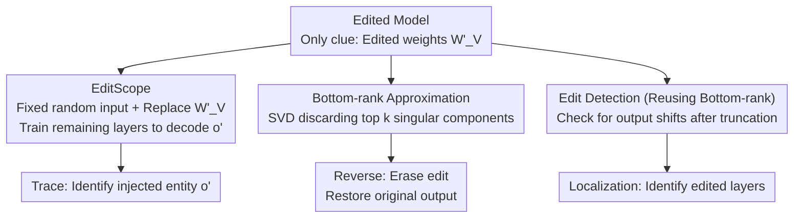

# Tracing and Reversing Edits in LLMs

**Conference**: ICLR 2026  
**arXiv**: [2505.20819](https://arxiv.org/abs/2505.20819)  
**Code**: [https://github.com/paulyoussef/trace-and-reverse/](https://github.com/paulyoussef/trace-and-reverse/)  
**Area**: Robotics  
**Keywords**: knowledge editing, model security, SVD, edit tracing, edit reversal

## TL;DR
Addressing the dual-use risks of knowledge editing (KE), this paper proposes EditScope to infer edited target entities from weights (up to 99% accuracy) and a training-free edit reversal method based on SVD bottom-rank approximation (up to 94% reversal rate), relying solely on edited weights without requiring edit prompts or original weight information.

## Background & Motivation

**Background**: Knowledge editing (KE) methods like ROME and MEMIT can update factual knowledge in LLMs at low cost via operations of the form $(s, r, o \to o')$, such as changing "The Chancellor of Germany is Scholz" to "Merz".

**Limitations of Prior Work**: KE poses dual-use risks—it can be used to update outdated information or maliciously exploited to inject misinformation, bias, or backdoors. Existing defense works assume a set of "potentially edited facts" for verification, which is impractical in real-world scenarios.

**Key Challenge**: How to identify and reverse malicious edits purely from edited weights without any knowledge of what was edited (unknown edit prompts, original weights, and edited facts)?

**Goal**: To formalize two tasks: (1) Trace edits—infer the edited target entity $o'$ from the edited weights; (2) Reverse edits—restore the original output of the model without any additional information.

**Key Insight**: Leveraging the structural characteristics of KE methods—methods like ROME produce rank-1 updates $W'_V = W_V + W_N$, where edit information is concentrated in components corresponding to the top singular values.

**Core Idea**: In edited weight matrices, edit information is concentrated in top-rank singular value components. Utilizing this property allows for high-precision tracing and training-free reversal of malicious knowledge edits.

## Method

### Overall Architecture
The defender receives only an edited model, with no knowledge of which facts were changed, the original weights, or the edit prompts. The only clue is the edited weight matrix $W'_V$ itself. The starting point is a structural observation: "locate-and-edit" methods like ROME only perform rank-1 updates $W'_V = W_V + W_N$, where injected information is highly concentrated in the largest singular value components. Around this observation, the paper provides three complementary tools for the defender using only the edited weights: ① "Trace"—using a small model called EditScope to decode the injected target entity $o'$ from $W'_V$; ② "Reverse"—performing Singular Value Decomposition (SVD) on $W'_V$ and discarding the top singular components to subtract the edit information and restore the original output; ③ "Detection"—reversing the same truncation operation to determine if a layer has been modified. The latter two require no training.

### Key Designs

**1. EditScope: Decoding injected entities using the edit matrix as input**

Edits like ROME cause the target entity to be severely overrepresented in the weights (overfitting to edited objects); the traces of the edit target are essentially etched into $W'_V$. EditScope utilizes this for direct "decoding": it prepares a fixed segment of random inputs $x_{fixed} = (t_1, \dots, t_m)$ ($m=5$ new tokens), replaces the weight matrix at the corresponding position with the candidate matrix $W'_{V_i}$, and trains the parameters of the remaining layers so the model outputs the corresponding edit target $o'_i$ under this fixed input. Training uses standard cross-entropy:

$$\mathcal{L} = -\sum_{j=1}^{|\mathcal{V}|} \mathbb{1}_{i=j} \cdot \log(Q_j)$$

The key ingenuity lies in the "irrelevant fixed random input": since the input has no relation to specific edited facts, the model must read information from the replaced weight matrix to answer correctly, forcing attention onto edit traces and completely bypassing the impractical prerequisite of "knowing the edit prompt."

**2. Bottom-rank Approximation: Subtracting edit information via SVD truncation**

Since methods like ROME perform rank-1 updates $W'_V = W_V + W_N$, edit information is highly concentrated in the largest singular value components. Reversal follows this logic: perform SVD $W'_V = U\Sigma V^T$, discard the top $k$ singular values and their components, and retain only the remaining low-rank parts:

$$\tilde{W'}_V^{(r,k)} = \sum_{i=k+1}^{r} \Sigma_{ii} u_i v_i^T$$

Removing top components is equivalent to subtracting the components injected by the edit. This hypothesis is supported by empirical data: on GPT2-XL at $k=1$, the cosine similarity between the update matrix $W_N$ and its rank-1 approximation is as high as 0.98—edits are indeed almost entirely compressed into the first singular direction. This process requires no training or original weights, only a single decomposition of the edited matrix.

**3. Post-edit Detection: Reusing bottom-rank approximation to locate modified layers**

In practical deployment, one must first identify which layers were modified to perform targeted reversal. This step reuses the truncation idea: if removing the top $k$ components of a weight matrix causes a drastic change in output, those top components likely carry anomalous information, indicating the layer was edited. Normal, unedited matrices do not collapse when a few top components are removed. Thus, the same SVD tool serves both detection and reversal.

### Loss & Training
EditScope is trained on 600 edit matrices (covering 20 relations), with 100 for validation. The test set consists of 300 ID samples and 330 OOD samples (from 11 relations unseen during training). Training lasts up to 100 epochs with early stopping (patience=3). The reversal method requires no training, relying solely on SVD decomposition and truncation.

## Key Experimental Results

### Main Results - EditScope Tracing Accuracy

| Model | ROME ID | ROME OOD | r-ROME ID | r-ROME OOD |
|------|---------|----------|-----------|------------|
| GPT2-XL | 99.40% | 99.70% | 99.73% | 99.70% |
| GPT-J-6B | 97.60% | 94.42% | 96.50% | 95.91% |
| LLAMA3-8B | 96.47% | 91.21% | 94.87% | 88.18% |
| QWEN2.5-7B | 91.20% | 87.45% | 88.53% | 85.45% |

### Ablation Study - Reversal Method (ROME, Optimal k)

| Model | Optimal k | Reversal Acc | Edit Acc↓ | KL Divergence (k=0 → k_opt) |
|------|--------|-----------|------------|----------------------|
| GPT2-XL | 11 | 94.52% | 1.29% | 6.038 → 0.010 |
| GPT-J-6B | 14 | 80.00% | 2.26% | 11.567 → 0.218 |
| LLAMA3-8B | 15 | 80.00% | 6.45% | 10.068 → 0.604 |
| QWEN2.5-7B | 13 | 62.90% | 26.13% | 8.988 → 1.615 |

### Key Findings
- **GPT series are easiest to trace and reverse**: GPT2-XL achieves 99% tracing and 94% reversal, as edit information is extremely concentrated in the $k=1$ component.
- **Larger/Newer models are harder to reverse**: QWEN2.5-7B reversal rate is only 62.9%, as edit information is distributed across more singular value components.
- **Good OOD Generalization**: EditScope maintains >85% accuracy on unseen relations.
- **Reversal does not damage model capability**: On benchmarks like CoLA and MMLU, reversed models perform nearly identically to their pre-edited states.
- **Significant drop in KL Divergence**: After reversal, the model's output distribution closely matches the original distribution (GPT2-XL: 6.038 → 0.010).

## Highlights & Insights
- **Defense design with minimal assumptions**: Tracing and reversal are possible without knowledge of edit prompts, original weights, or edited content—representing a truly practical defense scenario.
- **Elegant use of SVD**: The theoretical insight that rank-1 edits naturally map to top singular value components is concise and elegant. Bottom-rank approximation as a denoising technique could transfer to other scenarios requiring the removal of specific information from weights.
- **"Irrelevant input" design in EditScope**: Using fixed random tokens as input ensures the training process focuses solely on edit information within the weight matrix, avoiding dependency on edit prompts. This is a clever trick.

## Limitations & Future Work
- **Focus on rank-1 edits**: ROME/r-ROME are rank-1 updates; batch editing methods like MEMIT do not produce strictly rank-1 update matrices, potentially reducing reversal effectiveness.
- **Lower reversal rate for QWEN (62.9%)**: Newer model architectures might require more sophisticated SVD strategies.
- **Primary focus on single-edit scenarios**: While the appendix discusses batch and sequential edits, the main experiments target single edits.
- **Requirement to know the edited layer**: While layer detection methods are provided in the appendix, identifying the edit location remains a prerequisite challenge in practical deployment.
- **Computational overhead**: The cost of SVD for large matrices may become a bottleneck for ultra-large models.

## Related Work & Insights
- **vs Youssef et al. (2025c)**: They detect edits by analyzing hidden states/output probabilities, requiring a set of candidate edited facts; this work requires no prior knowledge.
- **vs Li et al. (2025)**: They determine the type of edit (misinformation/bias); this work traces the specific content of the edit.
- **vs AlphaEdit (Fang et al. 2025)**: AlphaEdit is an editing method; this paper verifies effectiveness against it in the appendix.
- This work also offers insights for model watermarking and IP protection—if edits can be traced, the source of specific knowledge in a model could potentially be tracked.

## Rating
- Novelty: ⭐⭐⭐⭐⭐ First to formalize edit tracing and reversal tasks with simple, effective methods.
- Experimental Thoroughness: ⭐⭐⭐⭐ Covered 4 models × 2 KE methods × 2 datasets, with extensive generalization experiments in the appendix.
- Writing Quality: ⭐⭐⭐⭐⭐ Clear problem definitions and rigorous methodological derivation.
- Value: ⭐⭐⭐⭐⭐ Significant practical implications for LLM security and defense.

<!-- RELATED:START -->

## Related Papers

- [\[ACL 2026\] SPAGBias: Uncovering and Tracing Structured Spatial Gender Bias in Large Language Models](../../ACL2026/social_computing/spagbias_uncovering_and_tracing_structured_spatial_gender_bias_in_large_language.md)
- [\[NeurIPS 2025\] Don't Let It Fade: Preserving Edits in Diffusion Language Models via Token Timestep Allocation](../../NeurIPS2025/social_computing/dont_let_it_fade_preserving_edits_in_diffusion_language_mode.md)
- [\[ICML 2026\] FLIPS: Instance-Fingerprinting for LLMs via Pseudo-Random Sequences](../../ICML2026/social_computing/flips_instance-fingerprinting_for_llms_via_pseudo-random_sequences.md)
- [\[ACL 2026\] Investigating Counterfactual Unfairness in LLMs towards Identities through Humor](../../ACL2026/social_computing/investigating_counterfactual_unfairness_in_llms_towards_identities_through_humor.md)
- [\[ACL 2026\] To Lie or Not to Lie? Investigating The Biased Spread of Global Lies by LLMs](../../ACL2026/social_computing/to_lie_or_not_to_lie_investigating_the_biased_spread_of_global_lies_by_llms.md)

<!-- RELATED:END -->
