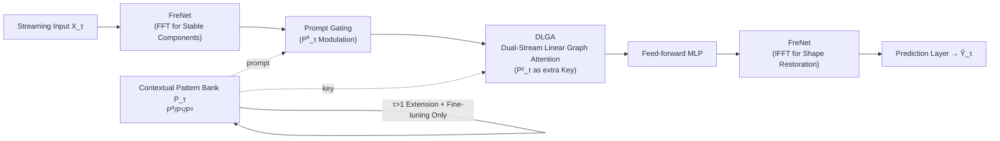

# A General Spatio-Temporal Backbone with Scalable Contextual Pattern Bank for Urban Continual Forecasting

**Conference**: ICLR 2026  
**OpenReview**: [https://openreview.net/forum?id=LHSea6DI8U](https://openreview.net/forum?id=LHSea6DI8U)  
**Code**: [https://github.com/Aoyu-Liu/STBP](https://github.com/Aoyu-Liu/STBP)  
**Area**: Spatio-Temporal Forecasting / Continual Learning  
**Keywords**: Continual Learning, Spatio-Temporal Graph Neural Networks, Frequency Domain Analysis, Linear Attention, Catastrophic Forgetting, Urban Traffic Prediction  

## TL;DR
STBP employs a general spatio-temporal backbone based on "frequency domain + linear graph attention" to extract stable and transferable representations, supplemented by an incrementally scalable "contextual pattern bank" acting as prompts. By freezing the backbone and expanding only the pattern bank, the model achieves anti-forgetting, robust modeling, and scalability on urban streaming data with growing nodes and shifting distributions.

## Background & Motivation
**Background**: Spatio-Temporal Graph Neural Networks (STGNNs) are primary tools for urban sensing tasks like traffic flow and air quality prediction. However, most follow a "fixed topology + offline training" paradigm, where graph structures are fixed before training and deployed statically.

**Limitations of Prior Work**: Real-world cities evolve continuously; sensor nodes expand, connectivity is dynamically reconstructed, and data distributions drift over time. When node sets grow, relying on structural modifications and continuous fine-tuning leads to significant performance degradation. Continual Spatio-Temporal Forecasting (CSTF) has emerged to address incremental learning without re-accessing historical data.

**Key Challenge**: Existing CSTF methods struggle with two issues: first, the general backbones used are often too simple (stacked Graph/Temporal Convolutions) to model dynamic spatio-temporal correlations and long-term distribution shifts; second, continual optimization strategies based on dynamic structural expansion are weakly coupled with the backbone, failing to balance **stability, adaptability, and interpretability**.

**Goal**: The authors identify four challenges for an ideal CSTF framework: ❶ handling distribution drift; ❷ modeling dynamic spatio-temporal correlations; ❸ mitigating catastrophic forgetting; ❹ designing an incremental strategy that collaborates efficiently with the backbone.

**Core Idea**: **Collaborative Division of Labor (Stable Backbone + Adaptive Pattern Bank)** — Design a general node-count-independent backbone that does not rely on pre-defined adjacency matrices. It uses frequency-domain modules to extract stable components against drift and lightweight linear graph attention for dynamic spatial correlations. This is paired with an incrementally scalable contextual pattern bank, which absorbs new scenarios via parameter expansion and guides the frozen backbone through gating/attention prompts to adapt to new distributions. The backbone manages "general stable patterns," while the pattern bank handles "node-level heterogeneous contexts."

## Method

### Overall Architecture
STBP consists of two major components: a **General Spatio-Temporal Backbone** (FreNet → DLGA → Feed-forward → FreNet → Prediction Layer) responsible for capturing spatio-temporal correlations in evolving networks, and a **Contextual Pattern Bank** $P_\tau \in \mathbb{R}^{N_\tau \times d}$, a set of trainable parameters that dynamically expands and is fine-tuned as data evolves. Workflow: In the initial stage ($\tau=1$), the backbone and pattern bank are trained jointly. In subsequent stages ($\tau>1$), the **backbone is frozen** to preserve historical knowledge, and **only the pattern bank is expanded and fine-tuned**. The expanded parameters serve as prompts to guide the frozen backbone in adapting to new distributions.

### Key Designs

**1. Contextual Pattern Bank: Storing "Historical Knowledge" as Scalable Prompts.** The pattern bank $P_\tau \in \mathbb{R}^{N_\tau \times d}$ uses trainable parameters to consolidate historical spatio-temporal patterns and generalize to new ones. The authors found it naturally distinguishes node **correlation** (similar trends/cycles) from **heterogeneity** (differences due to function, geography, or events). t-SNE visualizations show the pattern bank spontaneously forming meaningful clusters representing heterogeneity without explicit clustering constraints. During incremental stages, only parameter expansion is performed: $P'_\tau = P_{\tau-1} \,\|\, \Delta P_\tau$, where $\Delta P_\tau \in \mathbb{R}^{(N_\tau - N_{\tau-1})\times d}$ are parameters for new nodes. Since it stores high-level abstractions rather than raw data, it supports privacy-preserving, memory-efficient knowledge retention.

**2. Prompt-Based Guidance: Gating Modulation and Attention Keys.** The pattern bank is partitioned into three sets $P^{(i)}_\tau, i\in\{0,1,2\}$. $P^{(0)}$ and $P^{(1)}$ interact with the hidden representation $H_\tau$ via a gating function:

$$H'_\tau = P^{(1)}_\tau \cdot h_\theta\big(H_\tau \cdot (1 + P^{(0)}_\tau)\big)$$

Where $h_\theta$ is any sub-module. Modulating input with $(1+P^{(0)})$ and scaling output with $P^{(1)}$ allows adaptive modeling of node heterogeneity. $P^{(2)}$ serves as the key embedding in the attention module (Design 3), guiding the backbone to generalize correlation-aware information. This ensures the pattern bank is deeply coupled as a prompt rather than a simple external attachment.

**3. FreNet: Extracting Stable Low-Frequency Components.** To resist distribution drift in evolving environments, FreNet strengthens components like periodicity and trends. The backbone places FreNet at the start and end. The first transforms $X_\tau \in \mathbb{R}^{N_\tau \times T_h}$ to $H_\tau \in \mathbb{R}^{N_\tau \times d}$, applies FFT, and uses a learnable frequency embedding $F_\tau \in \mathbb{C}^{(d/2+1)}$ to adaptive amplify stable features:

$$H^f_\tau = \mathrm{IFFT}\big(\mathrm{FFT}(H_\tau) \odot F_\tau\big)$$

$H^f_\tau$ is then processed by $P^{(0)}_\tau$ gating and sent to DLGA. FreNet is more computationally efficient than RNNs/TCNs and superior at suppressing high-frequency noise.

**4. Dual-Stream Linear Graph Attention (DLGA): Linear Complexity Spatial Modeling.** DLGA models time-varying spatial correlations with $O(N)$ complexity using random feature mapping. It introduces a **dual-stream structure** by using the pattern bank $P^{(2)}_\tau$ as an additional key, allowing the model to evaluate the relationship between "evolving input patterns" and "stored knowledge":

$$\text{Attention} = \mathrm{Softmax}\big(QK^\top + Q(P^{(2)}_\tau)^\top\big)V \approx \phi(Q)\big(\phi(K)^\top V + \phi(P^{(2)}_\tau)^\top V\big)$$

By rearranging the computation order, DLGA avoids explicit adjacency matrices and models dynamic correlations with linear complexity, facilitating expansion as the node count grows.

## Key Experimental Results

### Main Results
Evaluated on three streaming datasets: PEMS-Stream, CA-Stream (traffic, 5-min intervals), and AIR-Stream (air quality, hourly). Standard 6:2:2 split; predicting the next 12 steps from 12 historical steps. Metrics: MAE / RMSE / MAPE (averaged across incremental periods).

| Dataset | Metric | TrafficStream | PECPM | STRAP | EAC | **STBP** |
|---|---|---|---|---|---|---|
| PEMS-Stream | MAE | 16.95 | 16.86 | 16.88 | 15.67 | **12.31** |
| PEMS-Stream | RMSE | 27.52 | 27.37 | 27.35 | 25.30 | **20.52** |
| PEMS-Stream | MAPE(%) | 21.66 | 21.73 | 22.17 | 20.42 | **15.65** |
| CA-Stream | MAE | 21.09 | 21.04 | 26.25 | 20.20 | **15.77** |
| CA-Stream | RMSE | 33.01 | 32.77 | 39.05 | 31.18 | **25.70** |
| AIR-Stream | MAE | 24.58 | 24.60 | 25.16 | 24.21 | **23.64** |

Compared to the strongest baseline, STBP reduces average MAE by **21.44% / 21.93% / 2.35%** on PEMS-Stream, CA-Stream, and AIR-Stream respectively. Standard STGNNs (GWNet, STID) performing full retraining were least effective. Methods using frozen backbones with lightweight prompts (EAC, STRAP, STBP) generally outperformed full parameter fine-tuning.

### Minor Experiment: Few-shot Learning
Training sets for subsequent incremental periods reduced to 10% (first period unchanged):

| Model | PEMS-Stream 10% MAE | CA-Stream 10% MAE |
|---|---|---|
| TrafficStream | 17.23 | 21.28 |
| EAC | 16.13 | 20.94 |
| **STBP** | **13.58** | **17.11** |

STBP identifies meaningful stable patterns even with limited data.

### Ablation Study
Tested five variants: ❶ Retrain (No pattern bank, retraining backbone); ❷ Online (No pattern bank, online fine-tuning); ❸ w/o Backbone (Pattern bank kept, backbone replaced with CNN+GCN); ❹ w/o DLGA (DLGA removed); ❺ EAC (Comparison).

### Key Findings
- Removing the pattern bank (Retrain / Online) leads to significant performance drops, confirming that **parameter expansion + pattern differentiation + prompt guidance** is central to mitigating forgetting.
- The backbone (FreNet + DLGA) itself is stronger than CNN+GCN variants, showing independent contribution to performance.
- Sensitivity analysis on channels (64 to 256) indicates performance stability across model widths.

## Highlights & Insights
- **Decoupled "Frozen Backbone + Evolving Pattern Bank" Design**: Clearly separates "general stable knowledge" from "node-level context." Freezing the former prevents forgetting, while expanding the latter captures distribution shifts.
- **Spontaneous Emergence of Patterns**: The pattern bank clusters into meaningful groups without explicit constraints, providing strong evidence for interpretability.
- **Pragmatic Engineering Trade-offs**: FreNet targets drift-resistant features, while DLGA ensures $O(N)$ scalability, directly addressing the practical needs of expanding urban graphs.
- **No Data Replay**: Storing high-level abstractions instead of raw history satisfies privacy and storage efficiency requirements for streaming deployment.

## Limitations & Future Work
- Gains on AIR-Stream are significantly lower than on traffic datasets, suggesting the method is most effective in scenarios with large-scale node expansion.
- The pattern bank expands monotonically; the paper does not extensively discuss compression or eviction mechanisms for extremely long-term streams.
- DLGA uses a linear approximation of Softmax; quantitative analysis of approximation errors in complex graphs is missing.
- Verification is limited to traffic and weather data; cross-domain generalization (e.g., power grids) remains to be explored.

## Related Work & Insights
- **Spatio-Temporal Forecasting**: Evolution from fixed adjacency (STGCN/DCRNN) to adaptive structures (GWNet) and parameter pools for spatial patterns (STID/HimNet). STBP extends the lineage of "trainable node parameters."
- **CSTF**: Comparisons with TrafficStream (replay), STRAP (retrieval-augmented), and EAC (prompt pool). STBP's differentiator is the deep coupling of a robust backbone (FreNet+DLGA) with the prompt-based pattern bank.
- **Insight**: The CV/NLP paradigm of "Frozen Foundation + Incremental Prompts" is effectively adapted here for spatio-temporal graphs, specifically addressing drift with the frequency domain and scalability with linear attention.

## Rating
- **Novelty**: ⭐⭐⭐⭐ — Integration of frequency-domain analysis and linear attention into a prompt-based continual learning framework is a novel take on CSTF.
- **Experimental Thoroughness**: ⭐⭐⭐⭐ — Comprehensive dataset coverage and robust baselines; slight deduction for limited data domains.
- **Writing Quality**: ⭐⭐⭐⭐ — Problems are clearly categorized into four challenges; the division of labor between components is well-articulated.
- **Value**: ⭐⭐⭐⭐ — High practical value for real-world streaming deployment with privacy and scalability constraints.

<!-- RELATED:START -->

## Related Papers

- [\[NeurIPS 2025\] StRap: Spatio-Temporal Pattern Retrieval for Out-of-Distribution Generalization](../../NeurIPS2025/time_series/strap_spatio-temporal_pattern_retrieval_for_out-of-distribution_generalization.md)
- [\[ICLR 2026\] STORM: Synergistic Cross-Scale Spatio-Temporal Modeling for Weather Forecasting](storm_synergistic_cross-scale_spatio-temporal_modeling_for_weather_forecasting.md)
- [\[ICLR 2026\] TEN-DM: Topology-Enhanced Diffusion Model for Spatio-Temporal Event Prediction](ten-dm_topology-enhanced_diffusion_model_for_spatio-temporal_event_prediction.md)
- [\[ICLR 2026\] ST-HHOL: Spatio-Temporal Hierarchical Hypergraph Online Learning for Crime Prediction](st-hhol_spatio-temporal_hierarchical_hypergraph_online_learning_for_crime_predic.md)
- [\[ICML 2026\] Nested Spatio-Temporal Time Series Forecasting](../../ICML2026/time_series/nested_spatio-temporal_time_series_forecasting.md)

<!-- RELATED:END -->
