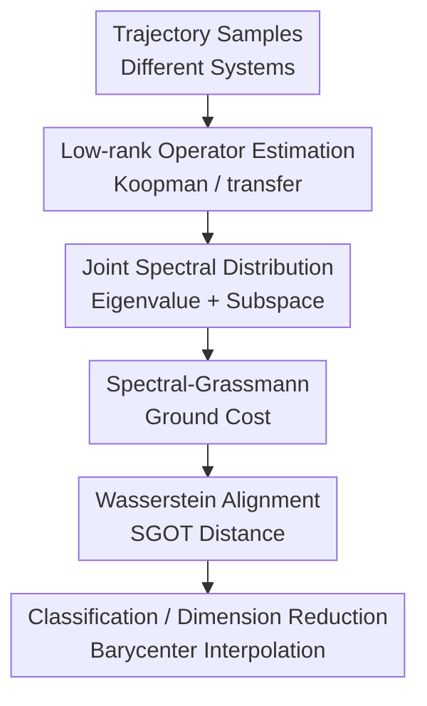

# A Spectral-Grassmann Wasserstein metric for operator representations of dynamical systems

**Conference**: ICLR2026  
**OpenReview**: [https://openreview.net/forum?id=B02EqvyiF3](https://openreview.net/forum?id=B02EqvyiF3)  
**Code**: No public code discovered yet  
**Area**: Time Series and Dynamical Systems  
**Keywords**: Koopman Operator, Dynamical System Metric, Optimal Transport, Grassmann Manifold, Spectral Decomposition

## TL;DR
This paper represents the Koopman / transfer operators of dynamical systems as discrete distributions consisting of "eigenvalues + spectral projection subspaces." It defines the Spectral-Grassmann Optimal Transport (SGOT) distance on spectral spaces and Grassmann geometry, enabling dynamical systems under different sampling frequencies to be compared, classified, and interpolated via Fréchet barycenters.

## Background & Motivation
**Background**: In many scientific and engineering scenarios, the object of study is not a static sample but a trajectory evolving over time: fluid velocity fields, molecular dynamics, robot states, and medical multivariate time series all fall into this category. If raw trajectories are compared directly, the results depend heavily on initial conditions, sampling frequencies, and observation noise. Therefore, recent years have seen the use of Koopman or transfer operators to lift nonlinear dynamical systems into a space of observation functions, using a linear operator to describe how the "current observable evolves into the future observable."

**Limitations of Prior Work**: Although operator representations linearize dynamics, measuring the "distance between two operators" is non-trivial. Direct norms like the Hilbert-Schmidt norm or operator norm can be calculated quickly but are susceptible to noise, basis selection, and scale, and lack interpretability regarding whether the distance stems from frequency shifts, decay rate changes, or modal subspace variations. Traditional LDS distances like the Martin pseudo-metric are better suited for linear state-space models and face issues of initial condition sensitivity or unstable definitions when transferred to nonlinear Koopman representations.

**Key Challenge**: The semantics of a dynamical system are primarily hidden in its spectral decomposition: eigenvalues correspond to oscillation frequencies and decay/divergence time scales, while eigenfunctions and spectral projections describe the corresponding dynamical modes. However, comparing only eigenvalues ignores "different modal shapes at the same frequency," and comparing only subspaces ignores "physical time scales for the same modal shape." Existing Optimal Transport (OT) spectral distances, while more interpretable, typically focus only on eigenvalues or apply only to self-adjoint/normal operators, often resulting in a pseudo-metric rather than a true metric.

**Goal**: The authors aim to construct a distance for operator representations that satisfies four criteria: first, it places different dynamical systems into a single comparable geometric space; second, the distance itself is a mathematical metric; third, it is insensitive to changes in trajectory sampling frequency, as a physical system should not change simply because of camera frame rates or sensor frequency; fourth, the computational complexity is low enough to be embedded in machine learning workflows like t-SNE, k-NN classification, and barycenter computation.

**Key Insight**: The key observation is that the spectral decomposition of a non-defective finite-rank operator is inherently an "unordered set": each spectral atom consists of an eigenvalue and its corresponding spectral projector/eigensubspace, and the ordering of different atoms is meaningless. Optimal Transport is naturally suited for comparing such unordered discrete distributions. By defining a ground cost that covers both spectral value differences and subspace differences, operator comparison becomes a Wasserstein distance between distributions.

**Core Idea**: Use a "joint spectral distribution" of spectral values and Grassmann subspaces to replace simple matrix norms. Then, use Wasserstein optimal transport to align the spectral atoms of two systems, resulting in an interpretable, sampling-frequency invariant, computable dynamical system distance with finite-sample convergence guarantees.

## Method
### Overall Architecture
The input to SGOT is not the point-to-point distance between raw trajectories but the Koopman/transfer operator estimated for each trajectory or system. The overall process consists of four steps: first, estimate a low-rank operator from trajectory data; second, perform spectral decomposition to transform the operator into a set of spectral atoms; third, construct a ground cost between atoms using eigenvalue differences and eigensubspace differences; finally, solve a discrete OT problem to obtain the Wasserstein distance between the two operator distributions. This distance can also be used as a Fréchet mean objective to find the barycenter of multiple dynamical systems.

Formally, the paper considers $N$ time-homogeneous Markov dynamical systems, each with a batch of adjacent state samples $D_k=\{(x_i^k,y_i^k)\}_{i=1}^{n_k}$ separated by an interval $\Delta t_k$. For the $k$-th system, the transfer operator $A_t$ acts on an observable $f$: $[A_t f](x)=\mathbb{E}[f(X_t)\mid X_0=x]$. If a generator $L$ describes the continuous-time dynamics, then $A_t=e^{Lt}$. The real part of eigenvalue $\lambda_j$ corresponds to the decay/divergence time scale, and the imaginary part corresponds to the oscillation frequency.

To compare different systems, the authors assume each system takes a finite number of leading spectral components near the origin, restricted to a common RKHS $H$. This assumption is crucial: different systems' true operators might act on different $L^2_{\pi_k}(X)$ spaces, making direct subtraction meaningless. A shared RKHS provides a common coordinate system where spectral projections and subspace distances can be defined.

### Key Designs
**1. Joint Spectral Distribution: Representing Operators as Transportable Spectral Atoms**

The first step of SGOT is not flattening a matrix into a vector but preserving the spectral structure of the operator. For a non-defective operator $T$ with rank at most $r$, let it have distinct eigenvalues $\lambda_j$ with geometric multiplicities $m_j$. The corresponding left/right eigenfunctions span a subspace $V_j$ in a Hilbert-Schmidt operator space. The paper maps $T$ to a discrete probability distribution:

$$
\mu(T)=\sum_{j=1}^{\ell}\frac{m_j}{m_{\mathrm{tot}}}\delta_{(\lambda_j,V_j)},\quad m_{\mathrm{tot}}=\sum_{j=1}^{\ell}m_j.
$$

This representation solves two common problems. First, the order of atoms in a spectral decomposition is arbitrary; OT coupling automatically finds the optimal match without manual sorting. Second, the multiplicity $m_j$ is integrated into the mass $m_j/m_{\mathrm{tot}}$, so a high-dimensional mode is weighted according to its spectral subspace dimension rather than being treated as a single point.

**2. Spectral-Grassmann Ground Cost: Comparing Time Scales and Modal Subspaces Simultaneously**

Comparing only eigenvalues would cause systems with the same frequency but different spatial structures to be misjudged as similar. Comparing only subspaces would miss changes in frequency and decay rates. The SGOT ground cost combines both:

$$
 d_\eta\big((\lambda,V),(\lambda',V')\big)=\eta |\lambda-\lambda'|+(1-\eta)d_G(V,V'),\quad \eta\in(0,1).
$$

Here $d_G$ is the subspace distance on the Grassmann manifold. The implementation uses the Hilbert-Schmidt norm of the difference in projections: $d_G(U,V)=\|P_U-P_V\|_{HS}$. This allows the cost to account for both the spectral position of the eigenvalue and the consistency of the spectral projector subspaces induced by left/right eigenfunctions.

**3. Sampling Frequency Invariance: Comparing via Generator Eigenvalues**

Dynamical systems are often sampled at different frequencies. Directly comparing eigenvalues of $A_{\Delta t}$ would mean that as the sampling interval changes, transfer eigenvalues change by $e^{\lambda \Delta t}$, magnifying the distance even if the underlying continuous system is identical. SGOT renormalizes eigenvalues back to the physical units of the generator, comparing frequencies and time scales rather than discrete step effects.

**4. Finite Samples and Barycenter: Integrating Distance into ML Workflows**

The paper connects the definition to estimable and optimizable algorithms. Operator estimation uses reduced-rank regression (RRR). For two estimated operators $\hat T_1, \hat T_2$, the SGOT cost matrix can be computed via cross-kernel matrices and eigenfunction coefficients. When $p=1$, a single cost element takes the form:

$$
C_{ij}=\eta|\lambda_i-\lambda'_j|+(1-\eta)\left(m_i+m_j-2\operatorname{Tr}\big((\beta_i^*M_y\beta_j)(\alpha_i^*M_x\alpha_j)\big)\right)^{1/2}.
$$

With rank $r$ and $n$ samples, the complexity is $O(n^2r^2+r^3\log r)$. The authors prove that the distance estimated by RRR converges to the true SGOT distance:

$$
|d_S(\hat T_1,\hat T_2)-d_S(T_1,T_2)|\lesssim n^{-\frac{\alpha-1}{2(\alpha+\beta)}}\ln(2\delta^{-1}).
$$

### A Complete Example
Consider the 2D linear oscillator experiment. A reference system consists of two harmonic oscillators at 0.5Hz and 1.0Hz. Distances are computed against four types of perturbed systems: shifting the 1.0Hz frequency, changing the decay rate, replacing sine wave modes with Fourier square wave modes, or changing the sampling frequency. 

Matrix norms show saturation or oscillation, creating local minima. Eigenvalue-only methods fail to capture the transition to square waves. Subspace-only methods lack physical time scale distinction. SGOT treats the shift from 1Hz to 1.5Hz as a spectral value movement and the shift from sine to square as a Grassmann subspace movement, resulting in a monotonic and continuous distance change.

### Loss & Training
SGOT is a distance metric based on operator estimation rather than a neural network training loss. Optimization appears in two places: RRR for estimating low-rank operators and the alternating optimization used to solve for the Fréchet barycenter.

For the barycenter, the objective is to find:

$$
\arg\min_{T\in S_r(H)}\sum_{k=1}^{N}\gamma_k d_S(T,T_k)^2.
$$

The authors parameterize the candidate barycenter $T_\theta$ and use inexact coordinate descent, alternating between computing OT plans and updating eigenvalues, control points, and eigenfunctions.

## Key Experimental Results

### Main Results
The experiments cover synthetic systems, UEA multivariate time series classification, and barycenter interpolation.

| Setting | Metric | Hilbert-Schmidt | Operator | Martin | SOT | GOT | SGOT |
|------|------|-----------------|----------|--------|-----|-----|------|
| Linear Kernel, 14 UEA datasets | Avg Rank (lower is better) | 3.29 ± 1.02 | 3.92 ± 1.10 | 5.30 ± 1.31 | 4.49 ± 1.15 | 2.66 ± 1.18 | **1.34 ± 0.79** |
| RBF Kernel, 5 small datasets | Avg Rank (lower is better) | 3.74 ± 1.27 | NA | 4.02 ± 0.98 | 3.28 ± 1.15 | 2.48 ± 1.19 | **1.48 ± 0.70** |
| Deep Feature Kernel, 14 UEA datasets | Avg Rank (lower is better) | 3.33 ± 1.56 | 4.14 ± 1.27 | 5.06 ± 1.48 | 3.84 ± 1.34 | 2.94 ± 1.33 | **1.71 ± 0.77** |

Specific accuracy results for the RBF kernel:

| Dataset | Hilbert-Schmidt | Martin | SOT | GOT | SGOT |
|--------|-----------------|--------|-----|-----|------|
| BasicMotions | 0.26 ± 0.17 | 0.77 ± 0.06 | 0.87 ± 0.05 | 0.69 ± 0.14 | **0.95 ± 0.02** |
| ERing | 0.74 ± 0.07 | 0.22 ± 0.05 | 0.38 ± 0.05 | 0.96 ± 0.01 | **0.98 ± 0.02** |
| Epilepsy | 0.31 ± 0.02 | 0.80 ± 0.01 | 0.77 ± 0.02 | 0.93 ± 0.02 | **0.95 ± 0.02** |
| FingerMovements | 0.53 ± 0.06 | 0.50 ± 0.03 | 0.53 ± 0.05 | 0.50 ± 0.06 | **0.53 ± 0.01** |
| NATOPS | 0.59 ± 0.06 | 0.25 ± 0.02 | 0.35 ± 0.02 | 0.78 ± 0.03 | **0.80 ± 0.05** |

### Ablation Study
The paper compares SGOT against its constituent parts: SOT (eigenvalues only) and GOT (subspaces only).

| Configuration | Key Metric | Description |
|------|----------|------|
| SOT: Spectral values only | Linear Avg Rank 4.49 | Interprets frequency/decay but ignores subspaces; performance lags significantly. |
| GOT: Grassmann subspaces only | Linear Avg Rank 2.66 | Stronger than SOT and stable to sampling frequency, but loses time scale info. |
| SGOT: Spectral values + Subspaces | Linear Avg Rank 1.34 | Complementary information; overall best performance across 14 datasets. |

### Key Findings
- SGOT aligns with the intuition that physical changes should result in continuous distance changes: it increases monotonically under frequency shifts and decay rate shifts where baselines oscillate.
- Sampling frequency experiments confirm invariance: SGOT remains stable when the same system is resampled from 100Hz to 300Hz.
- Classification experiments show the benefit of the joint cost is stable across linear, RBF, and deep feature kernels.
- Barycenter experiments show that SGOT can define meaningful "average" systems, whereas Hilbert-Schmidt averages can result in unrealistic over-damped systems.

## Highlights & Insights
- **Operator comparison as distribution comparison**: Treating spectral decompositions as unordered atoms for OT is an elegant solution to the lack of canonical ordering.
- **Combined Spectral and Projection View**: Unlike previous metrics that focus on either frequency or mode shape, SGOT treats them in a unified ground metric.
- **Addressing Sampling Frequency**: By using generator eigenvalues, the metric focuses on the underlying physics rather than the data collection protocol.
- **Beyond Evaluation to Barycenters**: Parametric optimization for Fréchet barycenters allows SGOT to be used for system interpolation and dictionary learning.

## Limitations & Future Work
- Dependency on Koopman / transfer operator estimation quality. Poor observable space or kernels will lead to unstable spectral decompositions.
- The focus is on non-defective finite-rank operators; the performance under continuous spectra or highly defective operators is not fully explored.
- The parameter $\eta$ still requires tuning, although heuristics are provided.
- Evaluation remains centered on classification and t-SNE; high-stakes tasks like causal regime shift or physical constraint satisfaction require more validation.

## Related Work & Insights
- **vs Hilbert-Schmidt / operator norm**: Norms are sensitive to coordinates and sampling; SGOT is more robust and physically interpretable.
- **vs Martin distance**: Martin is suited for LDS but can be ill-defined for nonlinear Koopman representations; SGOT is more general.
- **vs SOT / Koopman spectral OT**: SOT ignores spatial structures of eigenfunctions; SGOT fixes this with the Grassmann term.
- **vs GOT / Grassmann-only OT**: GOT loses physical time scales like frequency; SGOT reintegrates them.

## Rating
- Novelty: ⭐⭐⭐⭐⭐ 
- Experimental Thoroughness: ⭐⭐⭐⭐☆ 
- Writing Quality: ⭐⭐⭐⭐☆ 
- Value: ⭐⭐⭐⭐⭐ 

<!-- RELATED:START -->

## Related Papers

- [\[ICLR 2026\] Learning Mixtures of Linear Dynamical Systems via Hybrid Tensor-EM Method](learning_mixtures_of_linear_dynamical_systems_via_hybrid_tensor-em_method.md)
- [\[ICML 2026\] Self-Supervised Dynamical System Representations for Physiological Time-Series](../../ICML2026/time_series/self-supervised_dynamical_system_representations_for_physiological_time-series.md)
- [\[AAAI 2026\] Sonnet: Spectral Operator Neural Network for Multivariable Time Series Forecasting](../../AAAI2026/time_series/sonnet_spectral_operator_neural_network_for_multivariable_time_series_forecastin.md)
- [\[ICLR 2026\] Detection of Unknown Unknowns in Autonomous Systems](detection_of_unknown_unknowns_in_autonomous_systems.md)
- [\[ICLR 2026\] DistDF: Time-series Forecasting Needs Joint-distribution Wasserstein Alignment](distdf_time-series_forecasting_needs_joint-distribution_wasserstein_alignment.md)

<!-- RELATED:END -->
