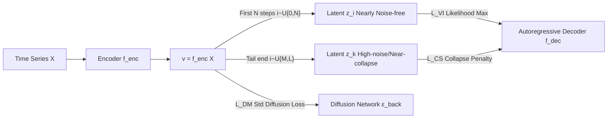

# A Study of Posterior Stability in Time-Series Latent Diffusion

**Conference**: ICLR 2026  
**OpenReview**: [https://openreview.net/forum?id=UbL2Fo0IvV](https://openreview.net/forum?id=UbL2Fo0IvV)  
**Code**: To be confirmed  
**Area**: Time-Series Generation / Latent Diffusion Models  
**Keywords**: Latent Diffusion, Posterior Collapse, Time-Series Generation, Variational Inference, Dependence Metrics  

## TL;DR
This paper systematically analyzes the posterior collapse issue in latent diffusion for time series—proving that collapse causes the model to degenerate into a weakened version of a VAE—and proposes the "Posterior-Stable Latent Diffusion" framework. It reinterprets the diffusion process as variational inference to eliminate the dangerous KL regularization and utilizes the diffusion process to simulate collapse to penalize decoder insensitivity toward latent variables.

## Background & Motivation
- **Background**: Latent diffusion (Rombach et al. 2022) has achieved significant success in image generation, offering much higher sampling efficiency than standard diffusion models, leading to its natural adoption in time-series generation.
- **Limitations of Prior Work**: When applying the "Autoencoder + Diffusion Model" framework to time series, **posterior collapse** occurs—the latent variable $z$ captures minimal information from the data, and the autoregressive decoder ignores $z$ during conditional generation $p_{gen}(X\mid z)$, relying instead on prefix observations. Using **dependence metrics**, this paper empirically finds that the influence of latent variables on the recurrent decoder decays almost **exponentially** over time steps.
- **Key Challenge**: Image latent diffusion uses feed-forward networks like U-Net as decoders, which are naturally sensitive to inputs; time-series decoders are autoregressive structures (RNN/Transformer), acting as "strong decoders" that easily bypass $z$. Furthermore, the KL regularization term inherited from VAEs pushes the posterior toward the prior, serving as the root cause of collapse—yet this regularization is **unnecessary** in the diffusion framework because the diffusion component is capable of sampling latent variables from complex (non-Gaussian) distributions.
- **Goal**: First, to formally "calculate" and "measure" the harms of posterior collapse, and then to provide a new framework that forces decoder sensitivity to latent variables without relying on KL regularization.
- **Core Idea**: **[Reinterpretation + Reverse Simulation]**—The **first few steps** of the forward diffusion process are treated as variational inference (replacing KL regularization), while the **later steps** (high noise, near-collapse) are used to actively simulate posterior collapse and impose penalties, thereby stabilizing the posterior from both ends.

## Method

### Overall Architecture
The framework is built on an observation: in the diffusion forward kernel $q_{forw}(z_i\mid z_0)=\mathcal{N}(z_i;\sqrt{\bar\alpha_i}z_0,(1-\bar\alpha_i)I)$, the coefficient $\bar\alpha_i$ monotonically decays from 1 to approximately 0 as step $i$ increases. If $z_0=v=f^{enc}(X)$, then $z_i$ retains $\bar\alpha_i\times100\%$ of the encoded information—approximating VAE variational inference (with slight noise) as $i\to0$, and reaching $q_{forw}(z_i\mid z_0)\approx\mathcal{N}(0,I)$ as $i\to L$, which exactly "replicates" posterior collapse. The authors reuse both ends of the diffusion process for these two purposes, combined with the original diffusion loss, to form a three-term joint training objective.

### Key Designs

**1. Degeneration Theorem: Proving "Harm" as a Formal Proposition.** The authors theoretically demonstrate that posterior collapse is not merely a slight performance drop. Proposition 3.1 (Gaussian Latent Variables) states: if the posterior $q_{VI}(z\mid X)$ of a standard latent diffusion collapses, the marginal distribution of the latent variables $q_{latent}(z)$ degenerates into a standard Gaussian $\mathcal{N}(0,I)$. This implies the diffusion module, responsible for approximating complex latent distributions, becomes a **redundant module**, and the entire latent diffusion collapses into an ordinary VAE with lower expressive power than the original diffusion model. This shifts the argument for "why collapse must be solved" from empirical intuition to formal proof.

**2. Dependence Metrics: Quantifying Decoder Behavior with Integrated Gradients.** To verify collapse on real data, the authors define **Dependence Metrics** inspired by integrated gradients. Let the latent variable be $x_0=z$ and the prefix be $X_{1:t-1}$. Using all-zero input $O_{0:t-1}$ as the baseline and $\gamma(s)=sX_{0:t-1}+(1-s)O_{0:t-1}$ as the interpolation line, the contribution of each input variable $x_j$ to the decoder representation $h_t$ is defined as:

$$m_{t,j}=\frac{1}{\lVert h_t-\tilde h_t\rVert^2}\Big\langle h_t-\tilde h_t,\ \sum_k x_{j,k}\int_0^1\frac{df^{dec}(\gamma(s))}{d\gamma_{j,k}(s)}ds\Big\rangle$$

Here, $m_{t,0}$ is called **Global Dependence** (decoder's reliance on $z$), and $m_{t,t-1}$ is **First-order Local Dependence** (reliance on the most recent observation). This metric is signed and satisfies the normalization property $\sum_{j=0}^{t-1}m_{t,j}=1$ (Proposition 3.3). Empirical findings show $m_{t,0}$ converges exponentially to 0 over time steps, confirming collapse. Interestingly, a "**Dependence Hallucination**" was observed: even when the time series is randomly shuffled and adjacent observations are uncorrelated, the decoder maintains a dependence of ~0.1–0.2 on $x_{t-1}$, indicating it overfits by fabricating dependency relationships.

**3. Diffusion as Variational Inference: Replacing KL Regularization with Initial Steps.** Given that the KL term is the source of collapse and the diffusion component can sample from complex priors, the authors remove the KL term entirely. Specifically: fix a small integer $N\ll L$, sample step $i$ from $\mathcal{U}\{0,N\}$, transform the encoder output $v$ into latent variable $z=z_i\sim q_{forw}(z_i\mid z_0=v)$ via the diffusion forward process, and use weighted negative log-likelihood as the variational inference loss:

$$L_{VI}=\mathbb{E}_{i\sim\mathcal{U}\{0,N\},z_0}\big[-\bar\alpha^{\gamma i}\,\ln p_{gen}(X\mid z=z_i)\big]$$

The weight $\bar\alpha^{\gamma i}$ ($\gamma\in\mathbb{N}^+$) decays as noise increases, suppressing interference from overly noisy latents. During testing, $z_i$ is sampled through the reverse diffusion process, ensuring compatibility between the prior and decoder without a KL term, allowing for a **free-form** rather than forced Gaussian prior.

**4. Reverse Simulation of Collapse: Actively Penalizing Insensitivity with Final Steps.** Removing KL alone is insufficient for the strong decoder problem. The authors use the **tail end** of the diffusion process ($i\to L$, where $z$ contains almost no info from $v$) to actively create a "collapsed state" and penalize the decoder for still being able to reconstruct data with high probability under such uninformative latents:

$$L_{CS}=\mathbb{E}_{i,z_i}\big[(1-\bar\alpha^{\lceil i/\eta\rceil})\,\ln p_{gen}(X\mid z=z_i)\big],\quad i\sim\mathcal{U}\{M,L\}$$

Where $M$ is close to $L$, and $\eta\ge1$ is used to weaken the influence of slightly informative latents. The intuition is: if a strong decoder predicts $x_j$ solely via history $\{x_k\mid k<j\}$, it will yield high likelihood even when $z$ is uninformative. $L_{CS}$ heavily penalizes this "bypass" shortcut, suppressing dependence hallucinations and forcing the decoder to utilize $z$. The final objective is the joint training of $L_{VI}+L_{DM}+L_{CS}$ (where $L_{DM}$ is standard diffusion denoising). The two decoder forward passes can be parallelized, resulting in only a small increase in training cost with inference remaining identical to the original latent diffusion.

## Key Experimental Results

### Main Results
Wasserstein distance (lower is better) across LSTM and Transformer backbones:

| Model | Backbone | MIMIC | WARDS | Earthquakes |
|---|---|---|---|---|
| Latent Diffusion | LSTM | 5.19 | 7.52 | 5.87 |
| + KL Annealing | LSTM | 4.28 | 5.74 | 3.88 |
| + Variable Masking | LSTM | 4.73 | 6.01 | 4.26 |
| + Skip Connections | LSTM | 3.91 | 4.95 | 3.74 |
| **Ours** | LSTM | **2.29** | **3.16** | **2.67** |
| Latent Diffusion | Transformer | 5.02 | 7.46 | 5.91 |
| + KL Annealing | Transformer | 4.31 | 5.54 | 3.51 |
| + Variable Masking | Transformer | 4.42 | 5.97 | 4.45 |
| + Skip Connections | Transformer | 3.75 | 4.67 | 3.69 |
| **Ours** | Transformer | **2.13** | **3.01** | **2.49** |

Comparison with recent baselines (Transformer backbone):

| Model | MIMIC | Earthquakes |
|---|---|---|
| Latent Diffusion | 5.02 | 5.91 |
| + Mutual Information Constraints | 3.59 | 3.85 |
| + Inverse Lipschitz Constraint | 3.01 | 3.42 |
| Neural STPP | 5.13 | 5.82 |
| Neural Latent Dynamic | 4.31 | 5.12 |
| Frequency Diffusion | 4.56 | 5.07 |
| **Ours** | **2.13** | **2.49** |

### Ablation Study
Ablation of hyperparameters $N$ (VI steps) and $M$ (collapse simulation start) (default $N=50, M=100$). Performance degrades if increased or decreased:

| Setting | Conclusion |
|---|---|
| $N=50, M=100$ (Default) | Optimal across datasets |
| $N$ too large/small | Performance decreases |
| $M$ too large/small | Performance decreases |

Configuration: $L=1000$ diffusion steps, $\gamma=2, \eta=1$. Values averaged over 10 random seeds (std < 0.05). Training completes within 10 hours on a 40G GPU.

### Key Findings
- **Posterior Stability**: After improvements, global dependence $m_{t,0}$ converges to ~0.5 (instead of 0), ensuring $z$ maintains control over the decoder throughout generation. In shuffled sequences, $m_{t,0}$ stays near 1 and local dependence becomes mostly negative, completely eliminating dependence hallucinations.
- **Generation Quality**: With a Transformer backbone on WARDS, the model outperforms "KL Annealing" by 2.53 points and consistently beats all collapse-mitigation baselines and other models like TimeGAN/Neural ODE.
- **Minimal Overhead**: Training time on MIMIC increased from 2h10m to 2h50m; inference time from 5m12s to 5m17s. Parallelizing the two decoder forward passes keeps costs low.

## Highlights & Insights
- **Harm-Symptom-Cure Loop**: Theoretical proof (Collapse = Degeneration), quantitative diagnosis (Dependence Metrics & Hallucinations), and a targeted solution. The logical chain is comprehensive.
- **Reuse of Diffusion Tails**: The dual use of one forward chain—proximal steps for VI and distal steps for collapse simulation—solves the "KL regularization" and "strong decoder" issues without introducing extra modules, making it engineeringly elegant.
- **Dependence Hallucination as a Diagnostic Tool**: Using shuffled sequences to detect whether a decoder relies on proximal observations despite lack of correlation is a valuable probe for overfitting/spurious dependence that could be applied to other autoregressive models.

## Limitations & Future Work
- The experiments focus on a limited set of real-world datasets (MIMIC, WARDS, Earthquakes, with some supplements in Appendix). Stability in ultra-long sequences and high-dimensional multivariate scenarios remains to be validated.
- Several hyperparameters ($N, M, \gamma, \eta$) are introduced. Although defaults and ablations are provided, adaptive selection across datasets still requires manual tuning.
- $L_{CS}$ acts as an indirect regularizer by penalizing simulated collapse. Whether a tighter theoretical bound for decoder sensitivity can be derived remains an open question.

## Related Work & Insights
- **Posterior Collapse Mitigation**: KL Annealing uses adaptive weights; Variable Masking blocks decoder inputs to force latent usage (but sacrifices expressivity); Skip Connections inject latents at each step (but may be ignored as constants). This paper argues these only partially alleviate the issue.
- **Other Time-Series Generative Models**: Comparisons include Neural ODE (good for irregular sequences) and TimeGAN.
- **Insight**: Decouple "sampler capability" from "regularization necessity." When the generative component (diffusion) can already approximate complex priors, legacy regularizations like KL can become burdens. This logic applies to other "Autoencoder + Strong Generative Head" combinations.

## Rating
- **Novelty**: ⭐⭐⭐⭐⭐ — Reusing diffusion ends for VI and collapse simulation, coupled with formal theorems and dependency diagnostics, is a novel and self-consistent perspective.
- **Experimental Thoroughness**: ⭐⭐⭐⭐ — Comprehensive across backbones and baselines with runtime analysis, though dataset scale and variety are somewhat limited.
- **Writing Quality**: ⭐⭐⭐⭐⭐ — Very clear narrative and connection between theory and empiricism. Mathematics and algorithms are well-documented.
- **Value**: ⭐⭐⭐⭐ — Provides a plug-and-play solution for time-series latent diffusion with nearly zero extra cost; the "dependence hallucination" tool has broader diagnostic value.

<!-- RELATED:START -->

## Related Papers

- [\[ICLR 2026\] Latent-to-Data Cascaded Diffusion Models for Unconditional Time Series Generation](latent-to-data_cascaded_diffusion_models_for_unconditional_time_series_generatio.md)
- [\[ICML 2026\] Latent Laplace Diffusion for Irregular Multivariate Time Series](../../ICML2026/time_series/latent_laplace_diffusion_for_irregular_multivariate_time_series.md)
- [\[ICLR 2026\] Understanding Transformers in Time Series Forecasting: A Case Study on MOIRAI](understanding_transformers_for_time_series_forecasting_a_case_study_on_moirai.md)
- [\[ICLR 2026\] ICDiffAD: Implicit Conditioning Diffusion Model for Time Series Anomaly Detection](icdiffad_implicit_conditioning_diffusion_model_for_time_series_anomaly_detection.md)
- [\[ICLR 2026\] MMPD: Diverse Time Series Forecasting via Multi-Mode Patch Diffusion Loss](mmpd_diverse_time_series_forecasting_via_multi-mode_patch_diffusion_loss.md)

<!-- RELATED:END -->
