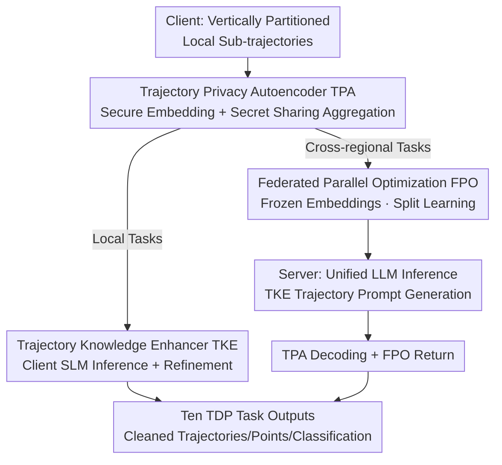

# A Unified Federated Framework for Trajectory Data Preparation via LLMs

**Conference**: ICLR 2026  
**OpenReview**: [https://openreview.net/forum?id=MIelckWrEK](https://openreview.net/forum?id=MIelckWrEK)  
**Code**: https://github.com/ZJU-DAILY/FedTDP  
**Area**: Time Series/Spatio-Temporal / Federated Learning / LLM Applications  
**Keywords**: Trajectory Data Preparation, Federated Learning, Vertical Partitioning, Privacy Protection, LLM Fine-tuning

## TL;DR
FedTDP unifies "Trajectory Data Preparation" (ten categories of tasks including denoising, completion, and map matching) into a cross-regional federated learning problem without sharing raw data. It utilizes a lightweight privacy autoencoder for data protection, a trajectory knowledge enhancer to transform general LLMs into "trajectory cleaning brains" with spatio-temporal awareness, and parallel optimization to reduce communication costs. It outperforms 13 SOTA methods across 10 tasks on 6 datasets.

## Background & Motivation
**Background**: Trajectory data (spatio-temporal movement records of people/vehicles) must undergo "Trajectory Data Preparation" (TDP) before use—including anomaly detection, gap completion, noise filtering, stay-point detection, map matching, trajectory-user linking, transportation mode identification, trajectory simplification, trajectory segmentation, and trajectory recovery. Previously, these tasks were handled independently with task-specific models.

**Limitations of Prior Work**: The authors identify two major drawbacks. **First (L1, Decentralization Requirement)**: Trajectory data is highly sensitive, and privacy regulations (China's PIPL, US FGDC) prohibit cross-regional sharing of raw mobility data; in reality, platforms like Uber Movement partition trips by administrative boundaries. This leads to "vertical partitioning"—each region only observes a segment of a trajectory. Models trained only on local segments fail at administrative boundaries and develop biased spatio-temporal patterns, particularly collapsing in completion or anomaly detection near boundaries. Existing federated learning (FL) mostly focuses on "horizontal partitioning" (different users across institutions), while cross-regional vertical partitioning remains systematically unstudied. **Second (L2, Lack of a Unified Framework)**: Every TDP task relies on narrowly defined specialized methods (HMM for map matching, RNN/GAN for completion, manual features for anomaly detection), requiring redesign or retraining for each task. This results in fragmented pipelines, wasted computational resources, and poor scalability.

**Key Challenge**: To simultaneously satisfy "data remains local" (privacy) and "one model for all tasks" (generalization). Simply combining FL and LLM is insufficient because this new problem (coined F-TDP, Federated Trajectory Data Preparation) exposes three unique challenges: **C1 Privacy**—many TDP tasks require cross-client context (e.g., completing a missing point requires preceding and succeeding points from adjacent regions), but raw data cannot be accessed across regions; **C2 Trajectory Knowledge Learning**—LLMs are designed for textual corpora and lack inherent understanding of temporal regularity and spatial dependencies in trajectories; **C3 Efficiency**—clients have limited compute and cannot store LLMs, necessitating server-side LLM placement, which introduces massive communication overhead, even with PEFT in a federated setting.

**Key Insight**: Treat each region as a client (storing partial trajectories) with a server-side LLM serving as the unified multi-task "cleaning brain." Each client is equipped with a lightweight Small Language Model (SLM) to handle local tasks, while (encrypted) representations are sent to the server-side LLM only for cross-regional tasks.

**Core Idea**: By integrating a "Privacy Autoencoder for data protection + Knowledge Enhancer for spatio-temporal LLM adaptation + Parallel Optimization for communication reduction," ten trajectory cleaning tasks are unified into a privacy-preserving federated LLM framework.

## Method

### Overall Architecture
FedTDP consists of a central server and multiple regional clients, with three modules addressing the challenges: **TPA (Trajectory Privacy Autoencoder)** for privacy (C1), **TKE (Trajectory Knowledge Enhancer)** for trajectory awareness (C2), and **FPO (Federated Parallel Optimization)** for efficiency (C3). A key component is the **SLM (Small Language Model)**: a lightweight counterpart to the server-side LLM deployed on each client.

The runtime involves two paths. **Local TDP** (segments handled within a single region): TKE generates trajectory-specific prompts for the client SLM, which produces initial results refined by TKE. **Cross-regional TDP** (trajectories spanning multiple regions): TPA encodes local trajectories into secure embeddings for transmission; FPO freezes transmitted data to reduce communication; at the server, TKE generates prompts for the LLM, and once the LLM produces results, TPA decodes embeddings back to trajectory representations, managed by FPO for return.

### Key Designs

**1. Trajectory Privacy Autoencoder TPA: Deterministic transformation replacing noise to preserve spatio-temporal correlation**

Regarding C1, the most direct privacy solution is Differential Privacy (DP), but DP relies on adding random noise, which destroys the spatio-temporal correlations (velocity, direction) essential for TDP tasks. TPA takes the opposite approach: it is a **deterministic, learnable** encoder-decoder transformation that independently encodes each spatio-temporal point $p_i$ into an embedding $e_i=\theta_{Enc}(p_i)$. Embeddings from different clients are aligned and aggregated at the server via anonymous user IDs $E=\bigcup_{i=1}^{|C|}E_i$, preserving both intra-client and inter-client dependencies. The server partitions the LLM output $\tilde{E}$ back to clients, where the decoder reconstructs the estimated trajectory $\tilde{p}_i=\mathrm{Dec}(\tilde{e}_i)$. TPA is extremely lightweight—a three-layer MLP with GELU, 256 hidden dimensions, and 32 embedding dimensions. The fundamental difference from DP is that DP may still leak probabilistic info of original locations/times within a privacy budget, whereas reconstructing raw trajectories from embeddings is computationally infeasible if the encoder/decoder remains private (formal guarantees in Appendix C.2).

However, transmitting embeddings alone is insufficient—attackers could use embedding or gradient inversion during aggregation. TPA thus incorporates a **decentralized secret sharing aggregation protocol**. Each pair of clients $(C_i,C_j)$ generates a local shared key $sk_{i,j}=sk_{j,i}$. During aggregation, TPA parameters are sliced into $|C|$ blocks; client $C_i$ masks its parameter blocks with keys from other clients—adding if $i>j$ and subtracting if $i<j$:

$$\tilde{P}^{(k)}_i = P^{(k)}_i + \sum_{j=1,j\neq i}^{|C|} a_{i,j}\cdot sk_{i,j},\quad a_{i,j}=\begin{cases}1,& i<j\\-1,& i>j\end{cases}$$

By Theorem 1, the sum of all masked parameter blocks equals the sum of original blocks (keys cancel out), yielding $\overline{P}^{(k)}=\frac{1}{|C|}\sum_i\tilde{P}^{(k)}_i=\frac{1}{|C|}\sum_i P^{(k)}_i$. This achieves **correct aggregation without exposing any single client’s parameters**, avoiding the efficiency or accuracy trade-offs of Homomorphic Encryption or DP.

**2. Trajectory Knowledge Enhancer TKE: Adapting text LLMs into spatio-temporal "trajectory brains" via mutual teaching**

For C2, TKE injects TDP knowledge into LLMs/SLMs using four components. **(i) Trajectory Prompt Engineering**: A four-tuple instruction paradigm (Task, Data, Information, Format) is designed—Task is the name/description, Data is the input (raw trajectory $T$ for local SLM, embeddings $E$ for cross-regional LLM), Information is optional context (e.g., road networks from OpenStreetMap), and Format is the task-specific output format. **(ii) Offsite-Tuning**: The LLM is split into $\theta_{LLM}=[A,F]$, where adapter $A$ handles task specialization and foundation $F$ extracts features. The server’s adapter $A$ is dispatched to clients and attached to the local SLM $\theta_{SLM}=[A,F']$. Clients fine-tune only $A$ (using LoRA) on local data, then return it for aggregation. FedTDP **does not** simply move a trained LLM adapter to the SLM; instead, it uses $A$ to boost SLM learning during training, requiring only hidden dimension alignment.

**(iii) LoRA Sparse Fine-tuning**: Based on the principle that "rapidly changing parameters contribute more to convergence," only the top $m$ layers with the highest LoRA parameter change rates are trained. The rate $R^{(r)}(L_i)=CR^{(r)}(L_i)/\sum_{j=1}^N CR^{(r)}(L_j)$ is calculated, where $CR^{(r)}(L_i)=|(L^{(r)}_i-L^{(r-1)}_i)/L^{(r-1)}_i|$; then $M=\lfloor m\cdot N\rfloor$ layers are randomly selected (Theorem 2) for the next round. **(iv) Bi-directional Knowledge Learning**: The SLM uses reverse KL to align with LLM high-frequency outputs $\min_{\theta_{SLM}}D_{KL}(P_{\theta_{SLM}}\|P_{\theta_{LLM}})$, and the LLM uses forward KL to align with SLM outputs (since only SLMs see raw trajectories). This mutual distillation allows the models to complement each other.

**3. Federated Parallel Optimization FPO: Split learning + Alternating optimization + Parallel training to reduce communication and time**

For C3, FPO utilizes three strategies. **Split Learning**: Training is split into client-side (TPA encoder/decoder + SLM) and server-side (LLM), allowing concurrent execution. **Alternating Optimization**: To reduce data transfer, the server freezes client-side embeddings for LLM training, while clients freeze server-side LLM outputs for TPA/SLM training—treating each other's data as constants. **Parallel Training**: Clients optimize TPA reconstruction loss $L_1$, reverse KL loss $L_2$, and task labels $L_3$ in parallel; the server optimizes forward KL loss $L_1$ and task labels $L_2$. Ablations show FPO reduces training time and communication to ~1/4 without sacrificing accuracy.

## Key Experimental Results

### Main Results
Evaluations were conducted on 6 real-world datasets (Train: GeoLife; Test: Porto/T-Drive/Tencent/Gowalla/SHL) across 10 TDP tasks, including few-shot and zero-shot scenarios. FedTDP leads in nearly all tasks.

| Dataset·Task | Metric | Strongest single-task/LLM baseline | FedTDP | Notes |
|--------|------|------|------|------|
| GeoLife·TI (Seen) | Acc | 81.29/73.78 (UrbanGPT) | **94.99/92.07** | Significant lead in completion |
| GeoLife·MM (Seen) | Acc | 53.17/51.13 (UrbanGPT) | **76.48/74.25** | Map matching +23 pts |
| Porto·AD (Unseen) | F1 | 53.54/46.26 (UniST) | **68.78/62.91** | Cross-domain anomaly detection |
| Tencent·MM (Unseen) | Acc | 49.58/41.61 (UrbanGPT) | **65.46/60.37** | Unseen domain map matching |
| SHL·TMI (Unseen) | F1 | 59.83/51.59 (UrbanGPT) | **71.54/63.67** | Transportation mode identification |

Summary: Compared to single-task SOTA (S-TDP), Gain is at least **18.38%**; compared to LLM tabular data preparation (FM4DP/MELD/TableGPT), Gain is at least **32.26%**; compared to spatio-temporal LLMs (PromptGAT/UniST/UrbanGPT), Gain is **4.84%–45.22%**.

### Ablation Study
Removing the three modules (metrics based on Fig. 5 description):

| Configuration | Performance Change | Overhead Change | Description |
|------|---------|------|------|
| Full model | Baseline | Baseline | Complete FedTDP |
| w/o TPA | Slight increase | Saves ~5GB/10 rounds | TPA's high-dim embeddings have a cost but are needed for privacy |
| w/o TKE | **Drops ≥27.52%** | Higher training cost | Most significant contributor to performance |
| w/o FPO | Almost no change | ~4x reduction in time/comm | Efficiency focus, non-destructive |

### Key Findings
- **TKE is critical**: Performance drops by over 27.52% without it, proving LLM generalization alone is insufficient for TDP without trajectory priors.
- **TPA is a "privacy bargain"**: It slightly reduces accuracy and adds ~5GB of communication but provides formal privacy guarantees.
- **FPO offers "free efficiency"**: Performance remains stable while training accelerates by ~4x; FedTDP training is 11.3–14.2x faster than other LLM methods.
- **Task variety improves generalization**: Performance degrades as training tasks are removed; training on only 1 task (AD) performs worse than single-task SOTA, highlighting the value of shared spatio-temporal knowledge from multi-task learning.

## Highlights & Insights
- **Defining "Vertical Trajectory Partitioning" (F-TDP)**: While most FL studies horizontal partitioning, this work highlights the real-world importance of trips cut by administrative boundaries.
- **Secret Sharing vs. DP/Encryption**: The additive mask cancellation trick ensures lossless aggregation without exposing individual parameters, bypassing the "privacy-utility trade-off" of DP.
- **Bi-directional Distillation + Offsite-Tuning**: SLMs provide raw data access while LLMs provide compute; mutual teaching via forward/reverse KL allows LLMs to learn local trajectory knowledge without the client needing to store the full LLM.
- **LoRA Sparse Tuning by Change Rate**: Using the principle "rapid change = high contribution" for probabilistic layer selection is a clever, lightweight resource-saving trick for federated PEFT.

## Limitations & Future Work
- **Manual Information Configuration**: Road networks/weather contexts are manually configured per task, limiting "out-of-the-box" automation for new regions.
- **Privacy Depends on Encoder Secrecy**: If the encoder/decoder is leaked, reconstruction is no longer "computationally infeasible." Security against inversion attacks on TPA itself needs more stress-testing.
- **Single Domain for Most Training**: Seen tasks use only 10% of GeoLife; while zero-shot transfer is shown, robustness across cities with vastly different sampling rates needs further validation.
- **High Total Communication Volume**: Training communication is the highest among compared methods (transmitting embeddings + parameters), though it wins on convergence speed and total rounds.

## Related Work & Insights
- **vs. Single-task TDP (GraphMM/Kamel/ATROM, etc.)**: These require separate models per task and fail to capture shared spatio-temporal knowledge; Ours unifies ten tasks with a +18.38% improvement and natural support for unseen tasks.
- **vs. LLM Tabular Data Prep (FM4DP/MELD/TableGPT)**: They treat trajectories as unordered rows; Ours preserves spatio-temporal dependencies via TPA and TKE (+32.26%).
- **vs. Spatio-Temporal LLM (PromptGAT/UniST/UrbanGPT)**: They lack TDP-specific knowledge and cannot adapt to 10 heterogeneous cleaning tasks (+4.84%–45.22%).
- **vs. Standard Federated Learning**: Most FL focuses on horizontal partitioning; FedTDP systematically addresses cross-regional vertical partitioning with lossless secret sharing.

## Rating
- Novelty: ⭐⭐⭐⭐⭐ First to define and solve "Federated TDP with Vertical Partitioning."
- Experimental Thoroughness: ⭐⭐⭐⭐⭐ 6 datasets, 10 tasks, 13 baselines; comprehensive ablation and generalization tests.
- Writing Quality: ⭐⭐⭐⭐ Clear structure and motivation; however, many privacy proofs and details are relegated to the appendix.
- Value: ⭐⭐⭐⭐⭐ High potential for urban computing/transportation under privacy regulations; secret sharing aggregation trick is broadly reusable.

<!-- RELATED:START -->

## Related Papers

- [\[ICLR 2026\] pyrregular: A Unified Framework for Irregular Time Series, with Classification Benchmarks](pyrregular_a_unified_framework_for_irregular_time_series_with_classification_ben.md)
- [\[ACL 2026\] A Unified Framework for Modeling Heterogeneous Financial Data via Dual-Granularity Prompting](../../ACL2026/time_series/a_unified_framework_for_modeling_heterogeneous_financial_data_via_dual-granulari.md)
- [\[ICLR 2026\] Towards Robust Real-World Multivariate Time Series Forecasting: A Unified Framework](towards_robust_real-world_multivariate_time_series_forecasting_a_unified_framewo.md)
- [\[ICLR 2026\] FeDaL: Federated Dataset Learning for General Time Series Foundation Models](fedal_federated_dataset_learning_for_general_time_series_foundation_models.md)
- [\[ICLR 2026\] Delta-XAI: A Unified Framework for Explaining Prediction Changes in Online Time Series Monitoring](delta-xai_a_unified_framework_for_explaining_prediction_changes_in_online_time_s.md)

<!-- RELATED:END -->
