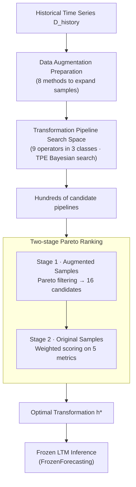

# Adapt Data to Model: Adaptive Transformation Optimization for Domain-shared Time Series Foundation Models

**Conference**: ICLR 2026  
**arXiv**: [2603.00629](https://arxiv.org/abs/2603.00629)  
**Code**: [https://github.com/thulab/TATO](https://github.com/thulab/TATO)  
**Area**: Self-supervised/Time Series Forecasting  
**Keywords**: Time series foundation models, data transformation optimization, zero-shot forecasting, frozen model inference, Bayesian optimization  

## TL;DR
The TATO framework is proposed to adapt frozen Large Time-series Models (LTMs) to diverse downstream domains without fine-tuning by automatically optimizing data preprocessing pipelines (including context trimming, scale normalization, and outlier correction), achieving an average MSE reduction of 13.6% and up to 65.4%.

## Background & Motivation

**Background**: Large Time-series Models (LTMs) such as Timer, Moirai, and Chronos have demonstrated zero-shot forecasting capabilities. However, their generalization remains limited when faced with distribution discrepancies across different data domains.

**Limitations of Prior Work**: The conventional approach involves fine-tuning models for each new domain, which leads to a linear increase in model instances relative to the number of domains, incurring high computational costs and compromising overall generalization.

**Key Challenge**: LTMs must simultaneously satisfy the conflicting requirements of being "cross-domain universal" and "domain-specific precise"—fine-tuning enhances specificity but degrades universality.

**Goal**: To adapt to different domains by optimizing the transformation of input data only, without modifying model parameters.

**Key Insight**: Observations indicate that simple data transformations (e.g., downsampling, outlier interpolation, differencing) can significantly improve LTM prediction quality (see three examples in Figure 1), suggesting that the primary issue is a "mismatch between data and model" rather than a lack of model capacity.

**Core Idea**: Formulate the discovery of data transformations as a hyperparameter optimization problem. Use Bayesian search to automatically identify the optimal preprocessing pipeline for a frozen model to adapt to multiple domains.

## Method

### Overall Architecture
TATO (Time-series Adaptive Transformation Optimization) addresses a specific question: if a frozen Large Time-series Model (LTM) performs poorly on a downstream domain, can performance be recovered by only modifying the data fed into it? To this end, the authors propose the "FrozenForecasting" paradigm—model weights remain fixed throughout, while only the data transformation pipeline is adjustable. Given a historical time series $D_{\text{history}}$, the process first applies data augmentation to increase diversity, followed by Bayesian optimization over a search space $\mathcal{H}$ of preprocessing operators. Finally, a two-stage ranking selects the most robust pipeline from hundreds of candidates. The optimization objective is to find the transformation configuration that minimizes loss:

$$h^* = \arg\min_{h \in \mathcal{H}} \mathcal{L}(M, D_{\text{history}}, h)$$

Here $M$ represents the frozen LTM, and $h^*$ is the final optimal transformation configuration applied directly during inference.

### Key Designs

**1. Data Augmentation Preparation: Ensuring Pipelines Withstand Distribution Shifts**

Optimization only observes the historical window $D_{\text{history}}$, while the actual target is the future window $D_{\text{future}}$, and their distributions may differ. Searching transformations directly on original historical samples risks overfitting to specific historical patterns. TATO "expands" historical samples before searching using 8 augmentation methods: magnitude/time flip, magnitude/time warp, noise injection (EWMA smoothing, jitter), translation, and adding slopes. These augmentations simulate extreme scenarios, forcing candidate pipelines to remain effective across a broader distribution, thereby reducing overfitting risk. The goal is to find pipelines robust to distribution perturbations rather than just optimal for historical data.

**2. Transformation Search Space: Covering Three Types of Data-Model Mismatch**

Mismatches between data and models typically fall into three categories: input length mismatch, scale/distribution mismatch, and outlier interference. TATO designs a search space consisting of 9 adjustable operators across these categories: context transformations (Trimmer for input length, Downsampler, Differencer), normalization transformations (Scaler, supporting Z-score / MinMax / BoxCox), and outlier transformations (Denoiser, e.g., k-sigma detection with interpolation, IQR filtering). Each operator appears in pairs: preprocessing is applied before the data enters the LTM, and post-processing performs the inverse transformation on the LTM output to restore the original scale. The search space $\mathcal{H}$ comprises the switches and hyperparameters of all operators, optimized via TPE (Tree-structured Parzen Estimator). Operator order is fixed by heuristic rules rather than searched: Trimmer is placed first to reduce computational load, and outlier handling precedes normalization to prevent outliers from contaminating normalization parameters.

**3. Two-stage Pareto Ranking: Prioritizing Robustness then Performance**

Bayesian search yields hundreds of candidate pipelines. Selecting a single one based on a single metric often leads to "unbalanced" candidates—performing well in one area but poorly in others. TATO splits selection into two steps. The first stage performs Pareto filtering on all augmented samples, eliminating pipelines dominated by others across all metric combinations. This reduces the pool to 16 candidates that are balanced and robust. The second stage then evaluates these 16 candidates **only on the original samples (without augmentation)**, using a weighted score across five metrics (MSE, MAE, RMSE, MAPE, MSPE). The second stage returns to the original distribution because augmented samples serve to filter for robustness, while final utility depends on real-world performance.

### Loss & Training
- Optimization requires only approximately 500 historical samples (<2% of the total training set). With 500 TPE Bayesian search trials, it typically completes within 2 minutes.
- Model parameters remain frozen with no gradient updates; only the data transformation configuration is "trained."
- Inference applies the searched $h^*$ with an additional overhead of less than 3 ms (batch size=1).

## Key Experimental Results

### Main Results
Evaluation across 192 scenarios (8 datasets × 4 prediction lengths × 6 LTM variants):

| Model | Average MSE↓ (vanilla) | Average MSE↓ (Ours) | Gain % |
|------|-------------------|-----------------|----------|
| Timer-UTSD | 0.3431 | 0.3225 | 6.0% |
| Timer-LOTSA | 0.3923 | 0.2950 | **24.8%** |
| Moirai-small | 0.4185 | 0.3799 | 9.2% |
| Moirai-base | 0.4066 | 0.3568 | 12.2% |
| Moirai-large | 0.4031 | 0.3465 | 14.0% |
| Chronos-tiny | 0.3770 | 0.3225 | 14.5% |
| **Average** | **0.3901** | **0.3372** | **13.6%** |

The largest improvement occurred on the Exchange dataset with the Timer-LOTSA model, where MSE was reduced by 65.4%.

### Ablation Study

| Configuration | Average MSE Gain % | Description |
|------|-------------|------|
| Full TATO | Best (baseline) | Complete framework |
| w/o Trimmer | Significant decline | Context trimming is critical for matching model inputs |
| w/o Scaler | Significant decline | Normalization is essential for cross-domain adaptation |
| w/o Denoiser | Slight mean increase, larger variance | Denoising helps specific samples but may reduce general robustness |
| w/o TwoStageRank | Slight mean increase, lower median | Pareto filtering ensures consistency |

### Key Findings
- Trimmer and Scaler are the most critical operators; their removal significantly degrades performance.
- Removing Denoiser or TwoStageRank slightly improves average performance but worsens variance and median performance—suggesting their role is to ensure robustness rather than peak performance.
- TATO shows the greatest improvements in scenarios where the original LTM performs poorly (e.g., Timer-LOTSA on Exchange: MSE 0.83→0.29), with smaller gains where performance is already high.
- Complementary to fine-tuning: Applying TATO to a universally fine-tuned model yields an additional 7.3% reduction in MSE.

## Highlights & Insights
- **Data-centric vs. Model-centric Paradigm Shift**: In an era where "everyone is tuning the model," this paper tunes the data while freezing the model. It is highly practical and completes optimization within 2 minutes for production deployment.
- **Two-stage Pareto selection mechanism**: This design—using augmented samples for robustness filtering and original samples for final ranking—is clever and transferable to any hyperparameter search scenario.
- **Refined Transformation Search Space**: Covering core time-series preprocessing needs with only 9 operators in 3 categories creates a compact yet expressive search space.

## Limitations & Future Work
- Currently supports **univariate** time series forecasting only; multivariate scenarios are designated as future work.
- In some cases, such as Timer-UTSD on the Weather dataset, TATO degraded performance (MSE increased by 22.5%), suggesting that transformations may negatively impact certain distribution characteristics.
- The search space is manually designed and lacks an adaptive operator discovery mechanism.
- While the 500-trial configuration is efficient, the total optimization time may become a bottleneck in scenarios with hundreds of distinct IoT domains.
- Insufficient comparison with Test-Time Adaptation (TTA) methods.

## Related Work & Insights
- **vs. Model Fine-tuning**: TATO maintains better universality without altering parameters, though its effects are limited when the model is already highly adapted (e.g., Timer-UTSD on Weather).
- **vs. TTA Methods (e.g., NewNorm)**: TATO is broader (not limited to normalization) and more lightweight, requiring no self-supervised training steps.
- **vs. AutoML/HPO**: TATO essentially treats data preprocessing transformations as hyperparameters for automated search, aligning with the search paradigms of AutoML frameworks like Auto-sklearn.

## Rating
- Novelty: ⭐⭐⭐⭐ The data-centric approach is fresh in the context of LTMs, and the FrozenForecasting paradigm is worth promoting.
- Experimental Thoroughness: ⭐⭐⭐⭐⭐ Comprehensive coverage across 192 scenarios, including ablation, efficiency, and fine-tuning complementarity.
- Writing Quality: ⭐⭐⭐⭐ Clear logic; the three motivating examples in Figure 1 are intuitive and compelling.
- Value: ⭐⭐⭐⭐ High practical utility, though current scope is limited to univariate scenarios.

<!-- RELATED:START -->

## Related Papers

- [\[ICLR 2026\] Relational Transformer: Toward Zero-Shot Foundation Models for Relational Data](relational_transformer_toward_zero-shot_foundation_models_for_relational_data.md)
- [\[ICLR 2026\] Understanding the Implicit Biases of Design Choices for Time Series Foundation Models](understanding_the_implicit_biases_of_design_choices_for_time_series_foundation_m.md)
- [\[ICLR 2026\] Beyond Accuracy: Are Time Series Foundation Models Well-Calibrated?](beyond_accuracy_are_time_series_foundation_models_well-calibrated.md)
- [\[ICLR 2026\] CauKer: Classification Time Series Foundation Models Can Be Pretrained on Synthetic Data](cauker_classification_time_series_foundation_models_can_be_pretrained_on_synthet.md)
- [\[ICLR 2026\] Repurposing Foundation Model for Generalizable Medical Time Series Classification](repurposing_foundation_model_for_generalizable_medical_time_series_classificatio.md)

<!-- RELATED:END -->
