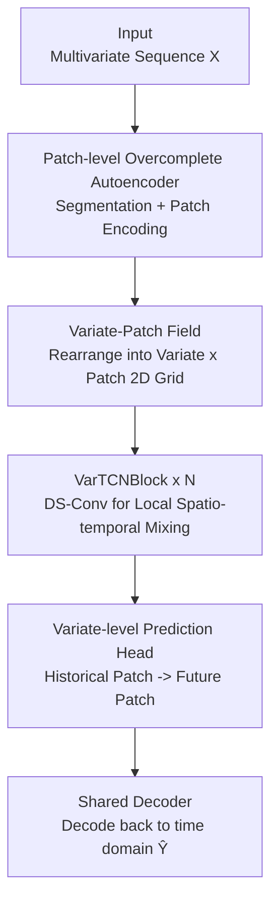

# Are Global Dependencies Necessary? Scalable Time Series Forecasting via Local Cross-Variate Modeling

**Conference**: ICLR2026  
**OpenReview**: [https://openreview.net/forum?id=CNVL194fO5](https://openreview.net/forum?id=CNVL194fO5)  
**Code**: https://github.com/iuaku/VPNet/  
**Area**: Time Series Forecasting  
**Keywords**: Multivariate Time Series Forecasting, Cross-Variate Dependency, Local Modeling, Depthwise Separable Convolution, Linear Complexity

## TL;DR
Addressing the bottleneck in multivariate time series forecasting where global attention for modeling cross-variate dependencies leads to quadratic complexity growth relative to the number of variables, this paper proposes the "Local Sufficiency Hypothesis"—suggesting that in dense systems, a finite local neighborhood likely contains sufficient predictive signals. Based on this, VPNet is designed: it rearranges patch embeddings into a 2D "Variate $\times$ Patch" field and uses depthwise separable 2D convolutions for local mixing. This ensures complexity grows linearly with the number of variables, achieving SOTA accuracy and significant efficiency advantages across 8 benchmarks.

## Background & Motivation
**Background**: The core difficulty of multivariate time series forecasting lies in modeling "cross-variate dependencies"—the complex, time-varying interactions between multiple co-evolving sequences. Recent mainstream approaches advance through two architectures: Transformer-based channel-mixing models (e.g., iTransformer), which explicitly search for global dependencies across all variables; and channel-independent models (e.g., PatchTST, DLinear, TimeMixer), where each variable is modeled individually without interaction.

**Limitations of Prior Work**: Both ends of the spectrum have significant flaws. While global attention is expressive, its overhead for the channel dimension scales quadratically with the number of variables $C$. When systems have hundreds or thousands of variables (e.g., 862 dimensions in Traffic, 321 in Electricity), memory and compute requirements become prohibitive. Channel-independent models are highly efficient but structurally discard cross-variate signals, losing predictive cues available between sequences.

**Key Challenge**: A tension exists between accuracy and scalability—attaining global expressivity requires a quadratic cost, while linear efficiency demands sacrificing cross-variate modeling. This paper questions this binary premise: in dense, high-dimensional systems, is it truly necessary to search for "global" dependencies?

**Goal**: To find a modeling approach that utilizes cross-variate signals while maintaining linear complexity relative to the number of variables, fundamentally resolving the accuracy-efficiency trade-off.

**Key Insight**: The authors observe that correlation heatmaps of real-world high-dimensional datasets (Weather, Electricity, Traffic, Solar) generally exhibit "strong and dense" structures. Since the dependency graph itself is sufficiently dense, for any target variable, a reasonably selected finite neighborhood will almost certainly contain informative neighbors. Global exhaustive search is not only unnecessary but may amplify noise.

**Core Idea**: Propose the "Local Sufficiency Hypothesis," using "local cross-variate convolution" instead of "global cross-variate attention" to maintain accuracy while compressing complexity to linear.

## Method

### Overall Architecture
VPNet (Variate–Patch Network) is a sequence-to-sequence forecasting architecture. The pipeline consists of four stages: first, a **patch-level overcomplete autoencoder** segments and encodes the raw sequences into robust local patch representations; next, **channelization** is performed to reinterpret these patch embeddings as a 2D "Variate $\times$ Patch" field (VP-Field), exposing the cross-variate structure on a plane where convolutional operators can act directly; then, several **VarTCNBlocks** are stacked to perform local spatio-temporal mixing on this field using depthwise separable 2D convolutions; finally, a **variate-level prediction head + shared decoder** maps the refined historical patch representations to future patches and decodes them back to the time domain.

The essence of the design is a provable intuition (Theorem 3.1): for a fixed target variable, assuming $r$ out of the remaining $C-1$ variables belong to the "information set" and variables are randomly permuted, the probability that a window $W_k$ of width $k$ contains at least one informative variable satisfies:

$$\Pr(E_k) \ge 1 - \exp\!\left(-\frac{kr}{C-1}\right).$$

This leads to a practical kernel width selection criterion: to cover informative variables with at least $1-\delta$ probability, one only needs $k \ge \frac{C-1}{r}\ln\frac{1}{\delta}$. This inequality provides quantitative support for "local is enough" and guides the initial width of the convolutional kernels on the variate axis.

### Key Designs

**1. Local Sufficiency Hypothesis: Replacing "Completeness" with "Sufficiency"**

This is the starting point of the paper and the theoretical anchor for subsequent architectural choices. it addresses the quadratic complexity of global attention—since variables in real dense systems are generally strongly correlated, "searching every pair" is wasteful. The authors formalize this as Theorem 3.1: under random permutation, the probability that a local window of width $k$ hits an informative variable approaches 1 exponentially with $kr/(C-1)$. Intuitively, the expected number of informative variables in a window is $\mu = kr/(C-1)$, and applying a Chernoff/Poisson-style bound yields the exponential lower bound. The significance is that it transforms "how large the local receptive field should be" from a heuristic into an engineering criterion based on formulas, and explains why in ablations, gains are huge when $k_v$ increases from 1 to 3 but diminish thereafter—effective signals in dense systems are concentrated in small neighborhoods, and expanding the window only introduces more irrelevant variables and dilutes the signal-to-noise ratio.

**2. Variate-Patch Field: Reinterpreting patch embeddings as a convolutional 2D plane**

This step is the conceptual core of the method and the fundamental departure from previous TCN models (e.g., ModernTCN, TimesNet). The problem is that to capture both "cross-variate" and "temporal" dependencies with convolution, data must be arranged in a 2D structure where local operators are meaningful. First, each patch of each variable is encoded into an $H$-dimensional latent vector by the autoencoder, forming an initial tensor $E \in \mathbb{R}^{B\times C\times P\times H}$; then, a permutation is applied:

$$Z^{(0)} = \mathrm{Permute}(E) \in \mathbb{R}^{B\times H\times C\times P}.$$

The key ingenuity is treating the patch embedding dimension $H$ as the "channel dimension" for 2D operators, while treating variables $C$ and patches $P$ as spatial grid axes—forming the VP-Field. Unlike TimesNet, which folds sequences based on periodicity to capture "intra-sequence" patterns, VPNet treats each patch as a holistic unit and expands both "variate" and "temporal" directions at a higher, more robust semantic level. Consequently, a standard 2D convolution can capture cross-variate and temporal dependencies simultaneously on this field without needing separate modeling paths.

**3. VarTCNBlock: A linear complexity engine via depthwise separable convolution + pointwise FFN**

This is the core computational unit of VPNet, implementing "local sufficiency." Standard convolutions remain dense in terms of channels even when arranged in a 2D field, causing overhead to explode. VarTCNBlock solves this by wrapping two components in a residual connection. First is **depthwise separable 2D convolution**: for each channel $h$ of the VP-Field, an independent small kernel $W^{(h)}\in\mathbb{R}^{k_v\times k_p}$ is used,

$$Y^{dw}_h = \mathrm{DWConv2D}\big(Z^{(l)}_{:,h,:,:},\, W^{(h)}\big),$$

which aggregates information only in the $k_v\times k_p$ local neighborhood. it explicitly models "temporally local cross-variate dependencies" with parameters and computations growing linearly with $C$—crucial for high-dimensional scenarios. Second is a **pointwise feed-forward network**: after $\mathrm{GELU}(\mathrm{BN}(Y^{dw}))$ for normalization and activation, a pointwise $1\times 1$ convolution forms an inverted bottleneck FFN (expanding channels by $r_{ff}$ and then compressing) to mix feature channels at each position. Finally, residuals are added: $Z^{(l+1)} = Z^{(l)} + Y^{ffn}$. The division of labor—depthwise convolution for local spatial mixing and pointwise convolution for feature channel mixing—is what reduces cross-variate interaction to linear complexity.

**4. Patch Autoencoder and Variate-level Prediction Head: Shared parameter projections**

To provide robust input to the convolutional field and restore the results to the time domain, VPNet uses shared projections at both ends. The input uses a patch-level **overcomplete** autoencoder (latent dimension $H>p$ to provide redundant capacity for expressing complex patch dynamics). Both the encoder and decoder are lightweight MLPs shared across variables and patches, acting as a "universal patch basis," accompanied by a reconstruction loss to combat distribution drift. The output uses a **variate-level prediction head**: for each variable, the sequence of historical patches output by the VarTCN stack is flattened into $u_{b,c}\in\mathbb{R}^{HP}$ and passed through a shared per-variate MLP to obtain future patch coefficients, reshaped into predicted patch embeddings $\hat{Z}$. Finally, the autoencoder's decoder is reused to reconstruct the time domain $\hat{Y}$. The prediction head is channel-independent (shared parameters) but operates on histories already mixed via VarTCN, saving parameters while allowing each variable to utilize aggregated cross-variate information.

### Loss & Training
The training objective combines prediction loss and reconstruction loss. Prediction uses MAE (L1), which is more robust to outliers: $\mathcal{L}_{pred}=\frac{1}{BSC}\sum |\hat{Y}-Y|_1$. Reconstruction loss constrains the autoencoder to restore original patches: $\mathcal{L}_{rec}=\frac{1}{BCP}\sum|\tilde{x}-x|_1$. Total loss is $\mathcal{L}_{total}=\mathcal{L}_{pred}+\mathcal{L}_{rec}$. Experiments use a fixed lookback window $L=96$ and forecast horizons $S\in\{96,192,336,720\}$, implemented in PyTorch on a single A100 40GB.

## Key Experimental Results

### Main Results
On 8 long-term forecasting benchmarks (averaging over 4 horizons), VPNet achieves overall SOTA, especially on high-dimensional datasets with dense cross-variate dependencies.

| Dataset | Metric | VPNet | Prev. SOTA | Gain |
|--------|------|-------|----------|------|
| Electricity | MSE | **0.162** | 0.178 (iTransformer) | ↓9.0% |
| Traffic | MSE | **0.421** | 0.485 (TimeMixer) / 0.572 (TimeKAN) | ↓up to 26% |
| Solar-Energy | MSE | **0.204** | 0.216 (TimeMixer) | ↓5.6% |
| Weather | MSE | **0.238** | 0.239 (Pathformer) | Slight Improvement |
| ETTm2 | MSE | **0.270** | 0.275 (TimeMixer) | ↓1.8% |
| ETTh2 | MSE | **0.356** | 0.365 (TimeMixer) | ↓2.5% |
| ETTh1 | MSE | 0.434 | **0.426** (TimeKAN) | Slightly worse |

On low-dimensional ETT datasets, VPNet consistently ranks in the top two, showing its versatility across high and low dimensional regimes.

### Ablation Study

| Configuration | Key Observation | Explanation |
|------|---------|------|
| $k_v=1$ (Channel-independent baseline) | Electricity MSE 0.184 | No cross-variate mixing |
| $k_v=3$ | 0.171 | Steep drop with local variable mixing |
| $k_v=7$ | 0.167 | Continued marginal improvement |
| $k_v=17/27$ | 0.162 / 0.160 | Still beneficial for high-dim, but diminishing returns |
| Variable Ordering (Original/Random/Degree/Spectral) | Almost identical scores (e.g., ECL ~0.171) | Highly robust to variable order |

### Key Findings
- **Local receptive field is the main driver**: The jump from $k_v = 1 \to 3$ is the largest, confirming the criticality of "local variable mixing." Further expansion yields diminishing returns or slight drops, supporting the Local Sufficiency Hypothesis—effective signals in dense systems are concentrated in small neighborhoods.
- **Unexpected robustness to variable ordering**: In a sensitive setup (fixed $k_v=3$, 2 layers with effective receptive field of 5), results across four ordering strategies were nearly identical. This suggests VPNet captures dependencies more complex than instantaneous correlations (possibly involving time-lagged relationships).
- **Watershed between dense and sparse dependencies**: In dense/redundant scenarios like Traffic/Electricity, random shuffling still allows local neighborhoods to cover multiple correlated variables, hence the robustness. However, in sparse scenarios, shuffling might fill a receptive field with irrelevant variables; there, correlation/structure-aware ordering could significantly boost performance.
- **Linear scalability with variables**: As variables grow from 321 (Electricity) to 862 (Traffic), iTransformer's peak memory nearly doubles (+99%, 2174 $\to$ 4376MB), whereas VPNet increases by only 67% (3308 $\to$ 5520MB), consistent with linear complexity.

## Highlights & Insights
- **Turning "local is enough" from intuition into a theorem**: Theorem 3.1 + Corollary provides an actionable criterion $k\ge\frac{C-1}{r}\ln\frac1\delta$. The approach of "proving probability first, then defining architecture hyperparameters" is more transferable than pure empirical tuning.
- **VP-Field is a clever and general rearrangement trick**: Treating patch embedding dimensions as convolutional channels and variate $\times$ patch as spatial grids allows 2D convolutions to capture both cross-variate and temporal dependencies simultaneously. This "rearrangement to reuse mature operators" is applicable to other structured data modeling needs.
- **Depthwise separable convolution as a cheap proxy for cross-variate modeling**: Using depthwise local mixing instead of global attention drops complexity to linear. Its strong structural prior acts as a regularizer on dense data, leading to more stable optimization—essential for deploying to real systems with thousands of variables.
- **Robustness to variable order is a counterintuitive but useful discovery**: This implies that in dense scenarios, local convolutions can be used without meticulous variable sorting, saving a preprocessing step.

## Limitations & Future Work
- **Weakness in sparse dependency scenarios**: The authors note that when dependencies are sparse, variable ordering becomes significant. Shuffling fills local receptive fields with noise. This means VPNet's "ordering-free" benefit only holds for dense systems.
- **Under-characterized boundaries of the local hypothesis**: The theorem relies on "random permutation + existence of $r$ informative variables." In real data, whether $r$ exists or if dependencies are truly randomly distributed is hard to verify. For systems with long-range, strongly lagged cross-variate coupling, local convolutions may be insufficient.
- **Adaptability of fixed kernel widths**: While $k_v$ has a theoretical starting point, it still requires empirical tuning, and optimal values vary across datasets. There is a lack of an adaptive receptive field mechanism.
- **Future Directions**: Exploring data-driven variable rearrangement/grouping learned jointly with local convolutions, or overlaying sparse long-range connections atop local convolutions to balance efficiency and coverage.

## Related Work & Insights
- **vs. iTransformer (Global cross-variate attention)**: iTransformer performs attention across all variables; it is expressive but scales quadratically with $C$. VPNet swaps this for local depthwise convolution for linear complexity, achieving even lower MSE on Electricity (0.162 vs 0.178) while scaling better, asserting "global is not necessary."
- **vs. PatchTST / DLinear (Channel-independent)**: These are efficient but discard cross-variate signals. VPNet restores cross-variate modeling via VP-Field + local convolution, effectively improving the channel-independent baseline ($k_v=1$) significantly with just a bit of local mixing.
- **vs. ModernTCN / TimesNet (TCN/2D Convolution)**: These fold single sequences into 2D to capture intra-sequence periodicity. VPNet defines its 2D grid as "variate $\times$ patch" to capture cross-variate structures, redefining the object of convolutional modeling.
- **vs. LANet / SANet (Local window/Sparse attention variants)**: The authors' custom attention variants performed worse than VPNet on dense data. This was attributed to TCN's structural prior acting as a stabilizer, whereas content-based attention is harder to converge without massive data.

## Rating
- Novelty: ⭐⭐⭐⭐ The "Local Sufficiency" hypothesis as a provable assumption and the resulting VP-Field + local convolution design is a fresh perspective, though local convolution itself is not new.
- Experimental Thoroughness: ⭐⭐⭐⭐ 8 benchmarks + multidimensional ablations (kernel width/ordering/attention variants/efficiency). Systematic validation on sparse dependency scenarios is slightly weaker.
- Writing Quality: ⭐⭐⭐⭐ Clear loop of logic from theory to motivation to architecture to experiments. Excellent alignment between text and figures.
- Value: ⭐⭐⭐⭐ Provides a practical solution for high-dimensional multivariate forecasting that balances accuracy and linear efficiency, holding high industrial value.

<!-- RELATED:START -->

## Related Papers

- [\[ICLR 2026\] STORM: Synergistic Cross-Scale Spatio-Temporal Modeling for Weather Forecasting](storm_synergistic_cross-scale_spatio-temporal_modeling_for_weather_forecasting.md)
- [\[ICLR 2026\] PHAT: Modeling Period Heterogeneity for Multivariate Time Series Forecasting](phat_modeling_period_heterogeneity_for_multivariate_time_series_forecasting.md)
- [\[CVPR 2025\] L2GTX: From Local to Global Time Series Explanations](../../CVPR2025/time_series/l2gtx_from_local_to_global_time_series_explanations.md)
- [\[ICLR 2026\] Routing Channel-Patch Dependencies in Time Series Forecasting with Graph Spectral Decomposition](routing_channel-patch_dependencies_in_time_series_forecasting_with_graph_spectra.md)
- [\[ICLR 2026\] Local Geometry Attention for Time Series Forecasting under Realistic Corruptions](local_geometry_attention_for_time_series_forecasting_under_realistic_corruptions.md)

<!-- RELATED:END -->
