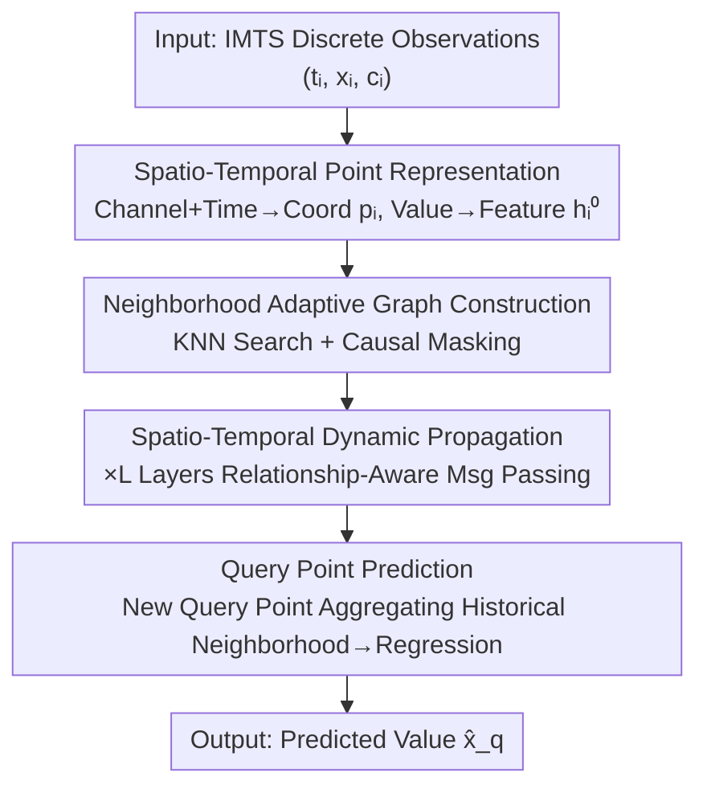

# ASTGI: Adaptive Spatio-Temporal Graph Interactions for Irregular Multivariate Time Series Forecasting

**Conference**: ICLR2026  
**OpenReview**: [https://openreview.net/forum?id=Wg9Rx5rjgo](https://openreview.net/forum?id=Wg9Rx5rjgo)  
**Code**: https://github.com/decisionintelligence/ASTGI  
**Area**: Irregular Multivariate Time Series / Time Series Forecasting / Graph Neural Networks  
**Keywords**: Irregular Multivariate Time Series, Spatio-Temporal Point Representation, Adaptive Causal Graph, Relation-Aware Propagation, Query Point Prediction

## TL;DR
ASTGI directly encodes each discrete observation in irregular multivariate time series as a "point" in a learnable spatio-temporal space, preserving the original sampling structure without interpolation or alignment. It dynamically constructs a causal graph for each point using nearest neighbor search and performs relation-aware message passing based on relative spatio-temporal positions. Finally, it unifies forecasting as "aggregating neighborhood information for a query point to perform regression," reducing MSE by approximately 6% compared to the second-best method across four public datasets.

## Background & Motivation

**Background**: Irregular Multivariate Time Series (IMTS) are ubiquitous in scenarios such as ICU vital sign monitoring, climate index tracking, and finance. IMTS possesses two inherent attributes: intra-series irregularity (the same variable observed at unequal time intervals) and inter-series asynchrony (observation timestamps of different variables are misaligned). These attributes make it difficult to directly apply standard models designed for regular time series.

**Limitations of Prior Work**: The authors categorize existing methods into two routes, each with significant drawbacks. The first is the "Structured Representation" route—forcing irregular data into a regular format for sequence models: interpolation methods (e.g., mTAN) generate points that were never truly observed, distorting the original sampling distribution; time alignment methods map all variables to a unified timeline and fill gaps, losing precise timing interval information; patch alignment methods (e.g., t-PatchGNN) slice the timeline into fixed-granularity blocks, where intra-block aggregation erases critical fine-grained dynamics. The second is the "Original Data" route—modeling discrete observations directly to avoid distortion, but relying on **pre-defined, non-adaptive** interaction rules: ODE-based methods (Latent-ODE, NeuralFlows) are constrained by the Markov assumption, where information only flows between temporally adjacent states, failing to capture long-range dependencies between non-adjacent events; static graph methods use fixed heuristic rules (e.g., same timestamp or same variable) for edge connection, making the topology insensitive to specific data contexts and unable to adapt to changes in system states.

**Key Challenge**: These two challenges are progressively coupled—accurate representation is a prerequisite for effective dependency modeling. If the first step of representation distorts the original information, subsequent dependency modeling is built on corrupted data. Furthermore, even with correct representation, fixed interaction rules cannot adaptively identify the specific neighbors that are truly relevant to the current observation point.

**Goal**: (1) Accurately represent original irregular sequences without introducing data distortion; (2) Flexibly and dynamically capture complex dependencies across time and variables.

**Key Insight**: The authors observe that since the problems stem from "forced regularization" and "fixed interaction rules," it is better to avoid regularization and preset global graph structures altogether. By treating each observation as a point in a spatio-temporal space, the determination of "who interacts with whom" can be adaptively decided by the adjacency of points in this learned space.

**Core Idea**: Replace "regularization followed by a fixed graph" with "dynamically constructing a causal neighborhood graph for each observation point + relation-aware propagation based on relative spatio-temporal positions." This approach preserves information while capturing context-dependent dynamic dependencies.

## Method

### Overall Architecture

An IMTS sample is formalized as a set of discrete observations $S=\{(t_i,x_i,c_i)\}_{i=1}^N$, where $t_i$ is the timestamp, $x_i$ is the observed value, and $c_i\in\{1,\dots,N_C\}$ is the variable index. Given a split time $t_s$, the sample is divided into a history set $S_{hist}$ ($t_i\le t_s$) and a query set $S_{query}$ ($t_j> t_s$). The model $F$ takes the history set and a set of query coordinates $Q=\{(t_j,c_j)\}$ as input to output the corresponding predicted values $\hat X_q$.

ASTGI is end-to-end differentiable and consists of four sequential stages: first, each discrete observation is encoded as a point in spatio-temporal space (**Spatio-Temporal Point Representation**); then, an adaptive directed weighted causal graph is built for each point using nearest neighbor search and causal masking (**Neighborhood Adaptive Graph Construction**); next, $L$ layers of message passing are stacked on these graphs, using relative spatio-temporal positions to compute messages and weights for iterative feature updates (**Spatio-Temporal Dynamic Propagation**); finally, any prediction request is treated as a new "query point," which aggregates its historical neighborhood information to regress the value (**Query Point Prediction**). The spatio-temporal coordinates $p_i$ remain fixed once calculated, serving as stable positional anchors, while only the feature vectors $h_i$ are refined during propagation.

### Key Designs

**1. Spatio-Temporal Point Representation: Preserving observations in a learnable space without interpolation or alignment**

Addressing the first pain point (distortion from regularization), ASTGI does not perform interpolation or alignment. Instead, it equips each observation $(t_i,x_i,c_i)$ with three encoders: a channel embedding uses a learnable matrix $E_C\in\mathbb{R}^{N_C\times d_c}$ to map the variable index $c_i$ to $e_{c_i}$, capturing intrinsic relationships between variables; a time encoder uses an MLP $\Phi_T:\mathbb{R}\to\mathbb{R}^{d_t}$ to map timestamp $t_i$ to $e_{t_i}$, learning complex temporal patterns; a value encoder uses another MLP $\Phi_X$ to map the observed value $x_i$ to an initial feature $h_i^{(0)}$. Concatenating the channel and time embeddings yields the spatio-temporal coordinate:

$$p_i = e_{c_i}\oplus e_{t_i}\in\mathbb{R}^{d_c+d_t},$$

which defines the position of the observation in a learned $(d_c+d_t)$-dimensional space. The "spatial" dimensions here are abstract dimensions learned from data rather than physical locations. This representation preserves every original observation point, avoiding the distortion of "synthetic points and lost intervals" inherent in interpolation/alignment.

**2. Neighborhood Adaptive Graph Construction: Dynamic, point-specific causal graphs over fixed rules**

Addressing the second pain point (fixed interaction rules), ASTGI constructs a directed weighted causal graph for each point $i$ in two steps. First, candidate neighborhood identification: $K$ nearest neighbors of $i$ are selected based on Euclidean distance $\|p_i-p_j\|_2$ in the learned spatio-temporal space to form $C(i)$. A **causal mask** is applied to exclude any points with timestamps later than $t_i$, ensuring information flows only from the past to the future, resulting in the valid neighbor set $N(i)$. Second, relation-aware scoring: the influence of neighbor $j$ on $i$ is quantified by a dynamic interaction weight $a_{ij}$, which is recomputed at each layer $l$. A relation vector is constructed at each layer:

$$r_{ij}^{(l)} = (p_i-p_j)\oplus h_i^{(l)}\oplus h_j^{(l)},$$

which combines the relative position $(p_i-p_j)$ with the current features of both points. This vector is fed into $\text{MLP}_{score}$ to obtain a raw score $s_{ij}$, followed by Softmax normalization over the valid neighborhood: $a_{ij}=\exp(s_{ij})/\sum_{k\in N(i)}\exp(s_{ik})$. This mechanism dynamically identifies truly relevant neighbors based on data context.

**3. Spatio-Temporal Dynamic Propagation: Modulating messages with relative displacement**

$L$ layers of propagation are stacked, each following a "message-aggregation-update" workflow. The message function depends not only on the sender's state $h_j^{(l)}$ but also takes the spatio-temporal displacement vector $(p_i-p_j)$ as input to modulate the information based on relative position: $m_{j\to i}^{(l)}=\text{MLP}_{msg}(h_j^{(l)}\oplus(p_i-p_j))$. The aggregation function uses the computed weights to perform a weighted sum over the causal neighborhood: $m_i^{(l)}=\sum_{j\in N(i)} a_{ij}\cdot m_{j\to i}^{(l)}$. The update function uses a residual connection + LayerNorm to integrate self-information with aggregated neighborhood information: $h_i^{(l+1)}=\text{LayerNorm}(h_i^{(l)}+\text{MLP}_{update}(m_i^{(l)}))$. While the graph topology $N(i)$ remains constant across layers, the weights $a_{ij}$ are recomputed, allowing the model to refine its focus as representations evolve.

**4. Query Point Prediction: Unifying prediction as neighborhood aggregation regression**

ASTGI integrates the prediction task into the same framework: a prediction request for target time $t_q$ and target variable $c_q$ is treated as a query point, mapped to position $p_q=e_{c_q}\oplus\Phi_T(t_q)$ using the same encoders. It selects $K$ nearest neighbors $N(q)$ from historical spatio-temporal points. Crucially, the model **intentionally does not reuse** the scoring/message networks from the propagation stage. Instead, specialized networks are designed for prediction—allowing the model to independently optimize the distinct sub-tasks of "iterative feature refinement" and "final numerical regression." A dedicated scoring network $\text{MLP}_{query\_score}$ calculates scores $s_{qi}=\text{MLP}_{query\_score}((p_q-p_i)\oplus h_i^{(L)})$, normalized into weights $a_{qi}$, followed by weighted fusion (where a value network $\text{MLP}_{value}$ extracts prediction-critical information):

$$h_q=\sum_{i\in N(q)} a_{qi}\cdot \text{MLP}_{value}(h_i^{(L)}).$$

Finally, $h_q$ is fed into a regression head $\Phi_{head}$ to output the prediction $\hat x_q=\Phi_{head}(h_q)$.

### Loss & Training
The model is end-to-end differentiable. During training, it takes the history set $S_{hist}$ and values for each query coordinate in $S_{query}$ to minimize the MSE:

$$\mathcal{L}=\frac{1}{|S_{query}|}\sum_{(t_j,x_j,c_j)\in S_{query}}(\hat x_j-x_j)^2.$$

Optimization is performed using AdamW for up to 300 epochs, with early stopping if the validation set does not improve for 5 epochs. Results are reported as mean $\pm$ standard deviation over 5 random seeds.

## Key Experimental Results

### Main Results
ASTGI was compared against 12 SOTA baselines on four public IMTS datasets (MIMIC, PhysioNet for medical; Human Activity for biomechanics; USHCN for climate) using an 80%/10%/10% split. ASTGI achieved the best performance across all datasets, with an average MSE reduction of approximately **6.04%** compared to the second-best model, Hi-Patch.

| Dataset | Metric | ASTGI | Second Best (Hi-Patch) | Note |
|:---|:---|:---|:---|:---|
| Human Activity | MSE | **0.0412** | 0.0435 | Best performance |
| USHCN | MSE | **0.1608** | 0.1749 | ~8% Reduction |
| PhysioNet | MSE | **0.3004** | 0.3071 | Best performance |
| MIMIC | MSE | **0.3909** | 0.4279 | ~8.6% Reduction |

ASTGI consistently leads across medical, biomechanical, and climate domains, demonstrating strong generalization and robustness.

### Ablation Study
Four ablation groups (MSE, using MIMIC as an example) verify the necessity of each component:

| Configuration | Human Activity | USHCN | PhysioNet | MIMIC | Description |
|:---|:---|:---|:---|:---|:---|
| w/o Learned Coordinates | 0.0421 | 0.1838 | 0.3034 | 0.4057 | Replace learnable embeddings with fixed non-parametric encoding |
| w/o Adaptive Graph | 0.0421 | 0.1830 | 0.3164 | 0.4065 | Change KNN search baseline back to original timestamps |
| w/o Relation-Aware | 0.0418 | 0.1930 | 0.3072 | 0.4194 | Remove displacement vector $(p_i-p_j)$ from weights/messages |
| rp. Mean Pooling | 0.0870 | 0.1699 | 0.4826 | 0.8807 | Replace weighted fusion with simple mean pooling in prediction |
| **ASTGI (full)** | **0.0412** | **0.1607** | **0.3004** | **0.3909** | Full model |

### Key Findings
- **Weighted fusion in prediction is critical**: Replacing it with mean pooling caused the MIMIC MSE to surge from 0.39 to 0.88, indicating that differentially weighting neighbors based on spatio-temporal relations is vital.
- **Learnable coordinate space > Fixed encoding**: Performance dropped with fixed encoding, proving that the adaptively learned metric space is key for capturing non-linear patterns and inter-variable correlations.
- **Adaptive Graph > Static Temporal Proximity**: Reverting KNN to original timestamps degraded performance, showing that finding neighbors in the learned metric space is more effective than using fixed rules like "temporally close."
- **Relation-awareness (displacement vector) is indispensable**: Removing $(p_i-p_j)$ increased MSE, confirming that modulating information by relative spatio-temporal position is critical for capturing dynamic relationship dependencies.
- **Hyperparameter Insensitivity**: Performance stabilizes once $K$ exceeds a certain threshold. A few layers $L$ are sufficient; too many layers risk over-smoothing.

## Highlights & Insights
- **Unified Prediction Framework**: Forecasting is unified as a neighborhood aggregation regression for query points. Historical and target points share the same spatio-temporal representation and graph interaction paradigm.
- **Decoupling of Fixed Coordinates and Flowing Features**: Spatio-Temporal coordinates $p_i$ act as stable anchors while features $h_i$ are iteratively refined. This preserves positional priors while allowing representations to evolve through propagation.
- **Fixed Topology with Dynamic Weights**: Graph structures $N(i)$ are built once, but interaction weights are recomputed per layer. This acts as "adaptive attention" over a fixed candidate set, balancing efficiency and adaptability.
- **Deliberate Separation of Propagation and Prediction Networks**: Decoupling the sub-tasks of "iterative feature refinement" and "final numerical regression" allows each to be optimized independently.

## Limitations & Future Work
- **Weak Interpretability of the Learned Space**: The "intrinsic relationship between variables" in the abstract spatial dimensions is difficult to explain intuitively, and the reason for neighbor selection lacks diagnostic visualization.
- **Overhead of KNN + Causal Masking**: Performing KNN search for every point in the history set could lead to high computational/memory costs for ultra-long sequences or large datasets.
- **Layer Depth vs. Over-smoothing**: As noted by the authors, large $L$ values risk over-smoothing on complex data, necessitating a careful balance.
- Evaluations focused on 4 standard IMTS benchmarks; performance in long-term forecasting or online/streaming scenarios requires further verification.

## Related Work & Insights
- **vs. Structured Representation (mTAN / Alignment / t-PatchGNN)**: These methods regularize data before modeling, costing accuracy due to synthetic points or blurred dynamics; ASTGI represents discrete observations directly, avoiding distortion.
- **vs. ODE-based (Latent-ODE / NeuralFlows)**: These are constrained by Markov assumptions and temporally adjacent interactions; ASTGI connects any neighbors in the learned space, enabling direct cross-time and cross-variable links.
- **vs. Static Graph Methods (GraFITi / t-PatchGNN)**: These use fixed heuristic edges; ASTGI constructs graphs dynamically for each point based on learned spatio-temporal positions and relative displacement.

## Rating
- Novelty: ⭐⭐⭐⭐ The paradigm of "every observation as a spatio-temporal point + per-point adaptive causal graph" is clean and compelling.
- Experimental Thoroughness: ⭐⭐⭐⭐ Solid testing across 3 domains, 12 baselines, and comprehensive ablations; lacking efficiency and long-term analysis.
- Writing Quality: ⭐⭐⭐⭐ Clear logic connecting challenges to modules.
- Value: ⭐⭐⭐⭐ Provides a reusable paradigm for IMTSF that models dynamic dependencies without regularization.

<!-- RELATED:START -->

## Related Papers

- [\[AAAI 2026\] Revitalizing Canonical Pre-Alignment for Irregular Multivariate Time Series Forecasting](../../AAAI2026/time_series/revitalizing_canonical_pre-alignment_for_irregular_multivariate_time_series_fore.md)
- [\[ICLR 2026\] Learning Recursive Multi-Scale Representations for Irregular Multivariate Time Series Forecasting](learning_recursive_multi-scale_representations_for_irregular_multivariate_time_s.md)
- [\[ICML 2026\] Nested Spatio-Temporal Time Series Forecasting](../../ICML2026/time_series/nested_spatio-temporal_time_series_forecasting.md)
- [\[ICLR 2026\] STORM: Synergistic Cross-Scale Spatio-Temporal Modeling for Weather Forecasting](storm_synergistic_cross-scale_spatio-temporal_modeling_for_weather_forecasting.md)
- [\[ICML 2025\] HyperIMTS: Hypergraph Neural Network for Irregular Multivariate Time Series Forecasting](../../ICML2025/time_series/hyperimts_hypergraph_neural_network_for_irregular_multivariate_time_series_forec.md)

<!-- RELATED:END -->
