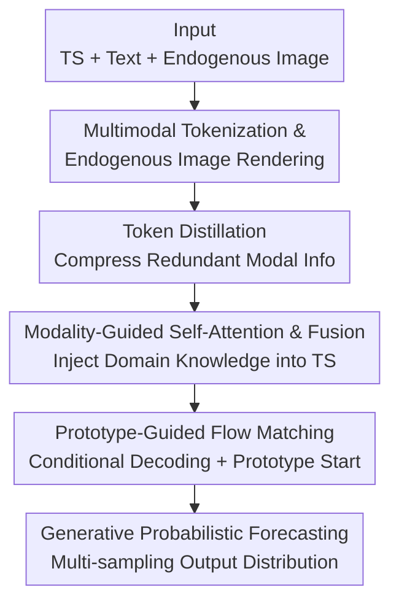

# Aurora: Towards Universal Generative Multimodal Time Series Forecasting

**Conference**: ICLR2026  
**OpenReview**: [https://openreview.net/forum?id=VVJ6Ck9JBl](https://openreview.net/forum?id=VVJ6Ck9JBl)  
**Code**: https://github.com/decisionintelligence/Aurora; Weights: https://huggingface.co/DecisionIntelligence/Aurora  
**Area**: Time Series Forecasting / Multimodal Foundation Models  
**Keywords**: Time Series Forecasting, Multimodal Foundation Models, Flow Matching, Zero-shot Prediction, Cross-domain Generalization

## TL;DR
Aurora is the first **multimodal time series foundation model**: it is pre-trained on a cross-domain corpus of "time series + textual description + endogenous images." It utilizes modality-guided attention to inject domain knowledge from text/images into time series modeling and employs "prototype-guided flow matching" for generative probabilistic forecasting. This allows it to achieve SOTA performance in both deterministic and probabilistic forecasting under zero-shot and few-shot cross-domain scenarios.

## Background & Motivation
**Background**: Recent time series forecasting has two main trajectories. One is **unimodal time series foundation models** (Sundial, Time-MoE, MOIRAI, Chronos, VisionTS, etc.), which are pre-trained on billion/trillion-scale pure time series corpora and gain cross-domain zero-shot capabilities through sensitivity to fine differences in historical signals. The other is **end-to-end multimodal supervised models** (Time-LLM, CALF, GPT4MTS, TATS, etc.), which leverage Large Language Models (LLMs) to feed textual domain knowledge into time series modeling to improve domain-specific accuracy.

**Limitations of Prior Work**: Both trajectories lack a critical piece. Unimodal foundation models only have the "time" modality and **lack explicit domain knowledge guidance**—when two historical curves look similar, the model predicts nearly identical futures, failing to distinguish between cases like "morning peak in Los Angeles" and "sudden temperature drop in Chicago caused by an Arctic blast." While multimodal models use text, they are **customized for end-to-end supervised scenarios and do not support zero-shot cross-domain inference**—requiring retraining for new domains.

**Key Challenge**: The fundamental difficulty of cross-domain generalization is that "similar histories may lead to completely different futures due to domain differences." Unimodal models lack **explicit domain knowledge**, while multimodal supervised models lack **zero-shot out-of-the-box capability**; the two cannot be achieved simultaneously.

**Goal**: To create a time series foundation model that can utilize multimodal domain knowledge, provide zero-shot cross-domain functionality, and output probability distributions rather than single points.

**Key Insight**: Domain knowledge is hidden in modalities outside of "time." Future trends are often described in **text** (e.g., a company announcing a partnership, a cold wave hitting an area), while intrinsic periodicity of sequences can be read from the geometric structure of **endogenous images** (rendering the time series as a 2D plot). Using these external knowledge types as "guidance" for time series modeling allows the model to distinguish different futures even when histories are similar.

**Core Idea**: Pre-train a cross-modal encoder to distill domain knowledge from text/images and inject it into time series representations via modality-guided attention. The decoder no longer starts from Gaussian noise but uses domain knowledge to retrieve "future prototypes" containing periodicity/trend skeletons as the starting point for flow matching to perform generative probabilistic forecasting.

## Method

### Overall Architecture
Aurora performs channel-independent modeling for each variable. The pipeline is divided into encoder and decoder stages. The **encoder** first tokenizes the three modalities (time series, text, endogenous images). It uses Token Distillation to compress redundant information from text/images into a few key tokens, then applies modality-guided multi-head self-attention to convert this domain knowledge into a correlation matrix injected into time series self-attention, and finally fuses the three modalities into a unified representation. The **decoder** uses a conditional decoder to expand the fused representation into $F$ future token conditions, followed by prototype-guided flow matching—retrieving future prototypes with periodicity/trend skeletons from a Prototype Bank as the starting point—to perform generative probabilistic forecasting. During pre-training, text is randomly masked, allowing the model to degrade to unimodal prediction during inference if text is unavailable (as endogenous images can always be computed from the raw sequence).

### Key Designs

**1. Multimodal Tokenization & Endogenous Image Rendering: Turning TS Periodicity into an Image**

The pain point is that unimodal models cannot read the inherent periodic geometry of sequences, and text models only use words. Aurora unifies the three modalities into tokens: Time series uses RevIN for non-stationarity followed by non-overlapping Patching + Linear Embedding to get $X_{time}\in\mathbb{R}^{n_{time}\times d_{time}}$; Text uses the Bert vocabulary directly to get $X_{text}$. The cleverest part is the **endogenous image**: FFT is applied to the sequence to find the dominant frequency $P$ ($A=\mathrm{Amp}(\mathrm{FFT}(X)),\ F=\arg\max(A),\ P=\lceil T/F\rceil$). The 1D sequence is folded into a 2D matrix $X_{2D}\in\mathbb{R}^{m\times P}$ based on $P$, then duplicated along the channel dimension, resized to Vit standard input dimensions, and rendered as $X_{3D}\in\mathbb{R}^{3\times w\times h}$. Finally, ImagePatching + Embedding produces image tokens. After "period-alignment," adjacent columns in the image are in phase, allowing the 2D inductive bias of ViT to read periodicity as geometric structure—a zero-label method to explicitly feed periodicity information to the model.

**2. Token Distillation: Compressing Redundant Text/Image Tokens into Semantic Centers**

Often, only a few words in a text affect future trends, and periodic info in endogenous images is sparse. Using all tokens from Bert/ViT is redundant and slow. Aurora uses VisionDistiller / TextDistiller (based on multi-head cross-attention): it introduces a set of **learnable vectors** $R_{image}\in\mathbb{R}^{K_{image}\times d_{image}}$, $R_{text}\in\mathbb{R}^{K_{text}\times d_{text}}$ as queries, with encoder outputs $\tilde{X}_{image}$, $\tilde{X}_{text}$ as keys/values, resulting in compressed $X_{image}\in\mathbb{R}^{K_{image}\times d_{image}}$, $X_{text}\in\mathbb{R}^{K_{text}\times d_{text}}$ ($K<n$). These learnable queries act like **semantic clustering centers**, gathering scattered modal info into key tokens, capturing domain knowledge while reducing downstream attention overhead.

**3. Modality-Guided Multi-Head Self-Attention: Rewriting TS Attention with Domain Knowledge**

How can distilled domain tokens influence time series modeling? Instead of simple concatenation, Aurora uses external modalities to **modulate the internal attention distribution of time series**. Cross-attention-based VisionGuider / TextGuider calculates (unnormalized) attention scores $V_{Attn}\in\mathbb{R}^{n_{time}\times K_{image}}$, $T_{Attn}\in\mathbb{R}^{n_{time}\times K_{text}}$ of time series relative to images and text. These are synthesized into a time-internal correlation matrix:

$$\mathrm{Corr}=V_{Attn}\cdot W\cdot T_{Attn}^{\top}\in\mathbb{R}^{n_{time}\times n_{time}}$$

Where $W\in\mathbb{R}^{K_{image}\times K_{text}}$ is a learnable metric matrix to fine-tune the distance between image/text semantics. This $\mathrm{Corr}$ matrix carries domain knowledge and is **added** directly to the time series self-attention scoring: $S=(QK^{\top}+\mathrm{Corr})/\sqrt{d_{time}},\ O=\mathrm{Softmax}(S)\cdot V$, followed by residual LayerNorm and FFN to get $X_{time}$. Finally, a Modality Fuser uses cross-attention to fuse the three modalities into $X_{fuse}=X_{time}+\tilde{X}_{image}+\tilde{X}_{text}$. This essentially lets "domain knowledge in text/images" determine which time series tokens should attend to each other, providing different attention structures for similar histories.

**4. Prototype-Guided Flow Matching: Starting Generation from "Future Prototypes" Instead of Gaussian Noise**

The decoder performs generative probabilistic forecasting. Aurora first uses a DiT-inspired ConditionDecoder (Causal-Transformer copies the last token of $X_{fuse}$ $F$ times to generate causal conditions; Cross-Transformer with RoPE refines them using $X_{fuse}$ as key/value) to get $F$ future conditions $X_{cond}$. The key innovation is the **starting point** of flow matching: DDPM and existing flow matching methods start from standard Gaussian noise, wasting the flexibility of flow matching as a "stochastic interpolator" that can start from any distribution. Aurora designs a **Prototype Bank** $P\in\mathbb{R}^{M\times p_{time}}$, containing $M$ learnable periodicity/trend prototypes initialized with sine, exponential, logarithmic, and polynomial bases. A Transformer-based **PrototypeRetriever** reads text/image representations and future token sinusoidal position encodings to output softmax weights $D\in\mathbb{R}^{F\times M}$ over the $M$ prototypes, producing the future prototype $\tilde{P}=D\cdot P$—which already contains skeletons of future periods and trends. Flow matching starts from $y_i^{(0)}=\tilde{P}_i+\epsilon_i$ (where $\epsilon_i\sim\mathcal{N}(0,I)$ injects randomness for probabilistic forecasting) and ends at ground truth $y_i^{(1)}=y_i$. It trains an MLP velocity field network $v_\theta^t$ (using AdaLN to inject condition $h_i=X_{cond_i}$) with energy-optimal conditional optimal transport paths, aiming for:

$$\mathcal{L}(\theta,h_i)=\mathbb{E}_{t,y_i^{(0)},y_i^{(1)}}\big\|v_\theta^t(y_i^{(t)}|h_i)-(y_i^{(1)}-y_i^{(0)})\big\|^2$$

where $y_i^{(t)}=t\,y_i^{(1)}+(1-t)\,y_i^{(0)}$. During inference, the model follows Algorithm 1 for discrete integration over $J$ steps from prototypes to predicted values. Since the starting point already contains periodicity/trend skeletons, flow matching only needs to "bridge the gap" rather than reconstruct from pure noise, making the process more stable and efficient.

### Loss & Training
- **Pre-training Goal**: Token-wise flow matching regression loss (Velocity field L2) as above.
- **Cross-domain Multimodal Corpus**: Large-scale open-source time series datasets were collected, and LLMs were used to generate domain-specific text descriptions for each sample to simulate downstream multimodal scenarios. Endogenous images were rendered from raw sequences.
- **Random Text Masking**: Text modalities are randomly masked during pre-training, enabling the model to degrade to unimodal forecasting (images are always available) when text is missing, which is key for its unimodal zero-shot support.
- **Base Components**: Modality encoders use pre-trained Bert (text) and ViT (images). The time series backbone is a channel-independent Transformer. Inputs pass through Instance Normalization / RevIN first.

## Key Experimental Results

### Main Results
Evaluation was conducted on 5 recognized benchmarks (TimeMMD, TSFM-Bench, ProbTS, TFB, EPF), covering four scenarios: unimodal/multimodal and deterministic/probabilistic. Benchmark datasets were strictly excluded from the pre-training corpus.

| Scenario | Benchmark | Metric | Aurora vs SOTA | Gain |
|----------|-----------|--------|----------------|------|
| Multimodal Zero-shot | TimeMMD | MSE | vs Sundial / VisionTS | ↓27.0% / ↓31.2% |
| Multimodal 10% Few-shot | TimeMMD | MSE | vs GPT4MTS / CALF (Full Sup.) | ↓12.8% / ↓24.5% |
| Unimodal Zero-shot (Det.) | TSFM-Bench | MSE | vs Time-MoE / ROSE | ↓15.1% / ↓22.9% |
| Unimodal Zero-shot (Prob.)| ProbTS | CRPS | vs CSDI / MOIRAI | ↓21.5% / ↓38.3% |

In the TimeMMD Multimodal Zero-shot table (Table 1), Aurora achieved 31 first places in MSE and 26 in MAE across 10 domains (10 domains × multi-settings), significantly outperforming Sundial (4/7) and VisionTS (0/4). Notably, in the Economy domain, MSE was 0.033 vs Sundial's 0.291; in Climate and Environment domains, **zero-shot** results from Aurora even outperformed fully supervised multimodal baselines.

### Ablation Study
Table 5 shows module ablation (MSE) across 9 domains in TimeMMD:

| Configuration | Economy | Climate | Traffic | Description |
|---------------|---------|---------|---------|-------------|
| Aurora (Full) | 0.033 | 0.865 | 0.161 | Full Model |
| Variant 1: w/o Modality-Guided SA | 0.277 | 1.176 | 0.244 | Reverts to standard MSA; no domain info injection |
| Variant 2: w/o Prototype-Guided FM | 0.045 | 1.008 | 0.273 | Starting point reverts to standard Gaussian noise |
| Variant 3: w/o both | 0.296 | 1.447 | 0.335 | Performance collapses when both are removed |

### Key Findings
- **Modality-guided self-attention is the primary driver of cross-domain generalization**: Removing it (Variant 1) caused Economy MSE to spike from 0.033 to 0.277, as the model lost the ability to distinguish "similar history, different cause" scenarios using text/image domain knowledge.
- **Prototype starts yield greater gains in periodic domains**: Removing prototypes (Variant 2) led to significant drops in strongly periodic domains like Traffic (0.161 → 0.273).
- **Cascading Effects**: When both are removed (Variant 3), performance "collapsed," with drops exceeding the sum of the individual removals, indicating synergy between domain knowledge injection and prototype starting points.
- **Sampling Scalability**: Increasing sampling steps monotonically reduced CRPS from 0.628 to 0.166 and NMAE from 0.292 to 0.187, showing the generative head can trade more computation for more accurate distribution estimation.

## Highlights & Insights
- **Endogenous image rendering turns "periodicity" into ViT-readable geometry**: Finding the main period via FFT and folding it into a 2D image allows the inductive bias of 2D vision backbones to serve time series periodicity modeling—a zero-label, plug-and-play modality expansion idea.
- **Domain knowledge as "temperature adjustment" rather than concatenation**: Injecting domain tokens as a $\mathrm{Corr}$ matrix into time series self-attention scores rather than simple concatenation allows external knowledge to rewrite "how time series tokens should attend to each other," which is more intuitive for domain-influenced dynamic structures.
- **"Prior injection" at the flow matching start**: Using a learnable prototype bank + retriever to construct a starting point with periodicity/trend skeletons simplifies flow matching from "reconstruction from pure noise" to "gap filling," improving stability and reducing steps. This approach is inspiring for any conditional generation task.
- **Random text masking for unimodal robustness**: A training trick that allows a single model to cover multimodal, unimodal, deterministic, and probabilistic scenarios, which is highly practical.

## Limitations & Future Work
- **Text quality depends on LLM generation**: Text descriptions for cross-domain corpora were synthesized by LLMs; real-world downstream text distribution/noise may differ, potentially affecting domain knowledge injection.
- **Periodicity assumption of endogenous images**: The FFT-based single-period folding method provides limited information for sequences with overlapping multi-periods or nearly no periodicity (trend/noise dominated).
- **Inference cost of generative heads**: Flow matching requires multi-step integration and multiple samplings to obtain a stable distribution. Although the prototype start reduces steps, it remains heavier than point regression models, requiring a trade-off in high-frequency scenarios.
- **Future Directions**: Expanding endogenous images to multi-frequency rendering, making the prototype bank incrementally extendable by domain, and replacing synthetic text with RAG-based real text are natural extensions.

## Related Work & Insights
- **vs. Unimodal TS Foundation Models (Sundial / Time-MoE / VisionTS)**: These models only have the time modality; predictions tend to be static when histories are similar. Aurora introduces text/image domain knowledge for explicit guidance. While VisionTS uses images, it only treats TS as images; Aurora uses images as periodic priors and adds textual trend priors.
- **vs. End-to-end Multimodal Supervised Models (Time-LLM / CALF / GPT4MTS / TATS)**: These rely on LLMs to fuse text for domain accuracy but are not zero-shot. Aurora follows the foundation model route, outperforming these fully supervised models with only 10% few-shot data.
- **vs. DDPM-based Probabilistic Forecasting (CSDI / TSDiff / TimeGrad)**: These perform SDE-style denoising from fixed Gaussian noise; Aurora uses flow matching as a stochastic interpolator and replaces the starting point with informative prototypes, leading to significantly better CRPS on ProbTS.

## Rating
- Novelty: ⭐⭐⭐⭐⭐ First multimodal TS foundation model; "endogenous image rendering + modality-guided attention + prototype-guided flow matching" are all targeted original designs.
- Experimental Thoroughness: ⭐⭐⭐⭐⭐ Coverage of 5 major benchmarks and 4 scenarios; ablation study clearly proves module synergy.
- Writing Quality: ⭐⭐⭐⭐ Complete methodology and clear diagrams, though notation is dense and some module details (condition decoder) are brief.
- Value: ⭐⭐⭐⭐⭐ Open-source model and weights; zero-shot capability and probabilistic forecasting offer high utility for decision intelligence.

<!-- RELATED:START -->

## Related Papers

- [\[AAAI 2026\] GAICo: A Deployed and Extensible Framework for Evaluating Diverse and Multimodal Generative AI Outputs](../../AAAI2026/time_series/gaico_a_deployed_and_extensible_framework_for_evaluating_diverse_and_multimodal_.md)
- [\[ICLR 2026\] GCGNet: Graph-Consistent Generative Network for Time Series Forecasting with Exogenous Variables](gcgnet_graph-consistent_generative_network_for_time_series_forecasting_with_exog.md)
- [\[ICLR 2026\] Towards Multimodal Time Series Anomaly Detection with Semantic Alignment and Condensed Interaction](towards_multimodal_time_series_anomaly_detection_with_semantic_alignment_and_con.md)
- [\[ICLR 2026\] Bridging Past and Future: Distribution-Aware Alignment for Time Series Forecasting](bridging_past_and_future_distribution-aware_alignment_for_time_series_forecastin.md)
- [\[ICLR 2026\] COSA: Context-aware Output-Space Adapter for Test-Time Adaptation in Time Series Forecasting](cosa_context-aware_output-space_adapter_for_test-time_adaptation_in_time_series_.md)

<!-- RELATED:END -->
