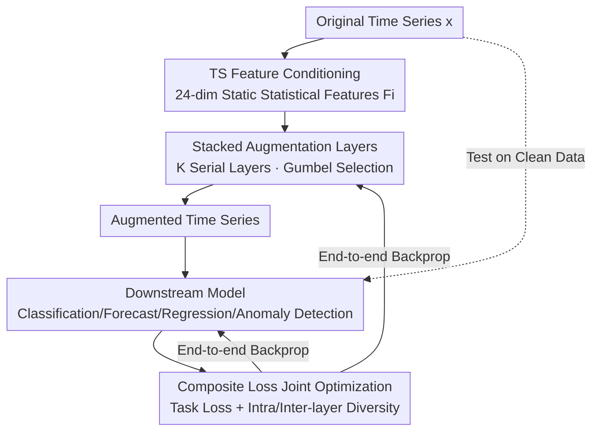

# AutoDA-Timeseries: Automated Data Augmentation for Time Series

**Conference**: ICLR2026  
**OpenReview**: [https://openreview.net/forum?id=vTLmHAkoIW](https://openreview.net/forum?id=vTLmHAkoIW)  
**Code**: https://github.com/NetManAIOps/AutoDA-Timeseries  
**Area**: Time Series Analysis / Automated Data Augmentation  
**Keywords**: Automated Data Augmentation, Time Series, Differentiable Strategy Search, Gumbel-Softmax, End-to-End Joint Optimization

## TL;DR
AutoDA-Timeseries is the first general automated data augmentation (AutoDA) framework for time series. It feeds the statistical features of each time series into a learnable policy generator. Stacked augmentation layers differentiably select transformation types and adaptively adjust their probabilities and intensities using Gumbel-Softmax. Optimized jointly with the downstream model in a single stage, it consistently outperforms existing strong baselines across five major tasks: classification, long/short-term forecasting, regression, and anomaly detection.

## Background & Motivation

**Background**: Because time series data is often scarce and highly homogeneous, almost all deep models rely on data augmentation. Current augmentation methods follow two main paradigms: first, **representation learning** (e.g., TS2Vec, InfoTS), which uses augmentation to construct contrastive views to pre-train a task-agnostic encoder for downstream transfer; second, **automated data augmentation (AutoDA)**, which directly searches for or generates augmentation policies to maximize downstream performance.

**Limitations of Prior Work**: Representation learning is **two-stage and decoupled**. The augmentation and encoder in the first stage only serve the contrastive objective and cannot perceive feedback from the downstream model. When the downstream model is not designed to consume contrastive representations (e.g., RNNs are naturally better at sequence-to-sequence prediction rather than capturing invariant representations emphasized by contrastive learning), the learned representations often mismatch the downstream architecture, limiting practical gains. While the AutoDA path is single-stage and aligns with downstream goals, existing methods are **almost exclusively designed for images**. Direct adaptation to time series suffers from three major flaws: (1) most are validated only on a single task, with questionable cross-task generalization; (2) they ignore unique time series attributes (autocorrelation, distribution, high-order features). Blindly applying image assumptions like "semantic preservation" through frequency warping can destroy temporal dependencies and degrade performance; (3) SOTA methods like RandAugment/TrivialAugment use **uniform sampling** to determine transformation type and intensity, treating all transformations equally without considering the vast difference in contribution across different time series indices.

**Key Challenge**: Prior research either offers a single-stage, downstream-aligned framework (AutoDA) that lacks time-series awareness or possesses time-series awareness but remains trapped in a decoupled two-stage process (representation learning). Both lack a unified mechanism that is "both aware of temporal features and capable of adaptively customizing augmentation intensity and probability for every individual sequence."

**Goal**: To build a universal, single-stage, end-to-end time series AutoDA framework that can (a) incorporate time series features into policy design, (b) adaptively optimize both **selection probability** and **intensity** of transformations, and (c) generalize across five mainstream task categories.

**Key Insight**: The authors observe that the effectiveness of an augmentation policy is governed by time-series features (such as autocorrelation); therefore, policy generation should be **conditioned on time-series features**. The uniform sampling used in image AutoDA fails precisely because it discards this conditional information.

**Core Idea**: Replace the uniform sampling in image AutoDA with an augmentation generator that is "conditioned on time-series statistical features and selects transformations and adjusts intensities differentiably layer-by-layer," and train it jointly with the downstream model using a composite loss.

## Method

### Overall Architecture

Let the dataset be $D=\{D_1,\dots,D_m\}$ and the downstream model be $M$ (parameters $\theta_M$). The set of available transformations is $\mathcal{T}=\{T_1,\dots,T_n\}$ (e.g., Jittering, Scaling, TimeWarp, FreqWarp, MagWarp, Slice, Resample, Raw, etc.). The goal is to learn an augmentation framework $A_\theta$ that outputs a policy $P_i=A_\theta(D_i)$ for each sequence $D_i$. This policy contains two vectors: the selection probability $p_i$ ($p_{i,j}\in[0,1]$ is the probability of selecting $T_j$) and intensity $t_i$ ($t_{i,j}\ge 0$ is the intensity of $T_j$). The entire process involves **bi-level joint optimization**: the inner loop trains the downstream model on augmented data $\theta_M^*=\arg\min_{\theta_M}\mathcal{L}(\theta_M, A_\theta(D))$, while the outer loop optimizes the augmentation framework parameters $\theta$ such that the trained model performs best on **original data** $\theta^*=\arg\min_\theta \mathcal{L}(\theta_M^*, D)$. Note that evaluation is performed on clean real data; augmentation is only used during training.

Specifically, the raw time series first passes through a feature extractor to obtain a 24-dimensional static statistical feature vector $F_i$, which is then fed into an adaptive policy generator. The generator consists of $K$ stacked serial augmentation layers. Each layer generates the current layer's probability and intensity based on the features and the previous layer's probability, selects a transformation differentiably using Gumbel-Softmax, and applies it. The augmented sequence from the final layer is fed into the downstream model, and "augmentation generator + downstream model" are jointly updated via backpropagation using a composite loss.

### Key Designs

**1. TS Feature-conditioned Policy Generation: Determining "What and How Much" by TS Attributes**

This addresses the flaw of image AutoDA's "ignoring TS features and uniform sampling." Following Qiu et al. (2024), the authors extract 24 descriptive statistics for each sequence (capturing autocorrelation, distribution, high-order features, etc., similar to catch22) to form the feature vector $F_i=f_e(D_i)$. Crucially, $F_i$ **remains static** across all augmentation layers. Since subsequent serial transformations modify the sequence, updating the features would lose the global context of the original sequence, amplify distortions, and destabilize training. Keeping it static allows "what the sequence originally looked like" to guide decisions at every layer. The probability and intensity of each augmentation layer are generated conditionally from this feature vector (via MLPs, see Design 2), explicitly delegating judgements—such as whether frequency warping will destroy a sequence's autocorrelation—to the data features rather than a one-size-fits-all rule.

**2. Stacked Augmentation Layers and Gumbel-Softmax Differentiable Sampling: Making Discrete Selection End-to-End Trainable**

The generator is a composition of $K$ augmentation layers $A_\theta=A^{(1)}_{\theta_1}\circ A^{(2)}_{\theta_2}\circ\cdots\circ A^{(K)}_{\theta_K}$. The $k$-th layer receives the sequence $D^{(k-1)}_i$ from the previous layer, the previous probability vector $p^{(k-1)}_i$ (initialized to 0 for the first layer), and global features $F_i$. Two MLPs generate the current layer's probability and intensity: $p^{(k)}_i=f^{(k)}_p(p^{(k-1)}_i, F_i)$ and $t^{(k)}_i=f^{(k)}_t(p^{(k-1)}_i, F_i)$. The difficulty lies in the discrete nature of transformation selection, which is non-differentiable. The authors use Gumbel-Softmax $\sigma_{gs}$ to approximate sampling: $T_{r_k}=\sigma_{gs}(\mathcal{T}, p^{(k)}_i)$, and apply it with intensity $t^{(k)}_{i,r_k}$ to obtain $D^{(k)}_i=T_{r_k}(D^{(k-1)}_i, t^{(k)}_{i,r_k})$. This keeps the selection process differentiable, allowing all layer parameters in the augmentation chain to be updated via gradients alongside the downstream model. Stacking multiple layers enables the exploration of rich "transformation sequence" combinations (e.g., jittering then time-warping), producing more diverse and useful augmented data than single transformations.

**3. End-to-End Joint Optimization under Composite Loss: Balancing "Task Performance" and "Augmentation Diversity" with Learnable Weights**

Optimizing only the task loss would cause the generator to collapse into a few transformations, losing diversity. Beyond the task loss, the authors add two diversity regularizations and use **learnable weights** to automatically balance multi-task objectives (inspired by Liebel & Körner, 2018), resulting in a composite loss:

$$\mathcal{L}_{composite}=\sum_{z=1,2,3}\left(\frac{1}{2w_z^2}\mathcal{L}_z+\ln(1+w_z^2)\right)$$

Where $\mathcal{L}_1$ is the task loss (MSE for forecasting, Cross-Entropy for classification, etc.); $\mathcal{L}_2$ is the **intra-layer diversity loss**, calculated as the sum of Shannon entropy $H(p^{(k)}_i)=-\sum_{j=1}^n p^{(k)}_{i,j}\log(p^{(k)}_{i,j}+\epsilon)$ ($\epsilon=10^{-10}$) across layers to prevent single-layer collapse into one transformation; and $\mathcal{L}_3$ is the **inter-layer diversity loss**, measuring differences between adjacent layers via KL divergence $\sum_{k=2}^K \mathbb{E}_i[\mathrm{KL}(p^{(k-1)}_i\Vert p^{(k)}_i)]$ to avoid identical policies across layers. The learnable weights $w_z^2$ automatically find the balance between "diversity" and "task performance" during training—eliminating manual tuning and ensuring the framework generalizes across five different tasks.

**4. Exploration-Exploitation Balance: Learnable Temperature + Raw Bias**

Diversity regularization alone is insufficient. The authors introduce two more mechanisms to control the "exploration-exploitation" tempo. First is the **learnable Gumbel-Softmax temperature**: each augmentation layer maintains its own temperature parameter optimized via backpropagation. Higher temperatures encourage uniform selection (exploration), while decreasing temperatures lead to more deterministic choices (exploitation of the most promising transformations). Visualization (Figure 5) shows bottom layers converge quickly to few operators (like Raw, indicating deterministic exploitation), while higher layers maintain high entropy (indicating exploration), forming a hierarchical division of labor. Second is the **Raw bias**: use the original data without any transformation with probability $p_{rb}$—

$$T_{r_k}=\begin{cases}\sigma_{gs}(\mathcal{T}, p^{(k)}_i) & \text{with probability }(1-p_{rb})\\ T_1\,(\text{Raw}) & \text{with probability }p_{rb}\end{cases}$$

This injects a proportion of real samples into training, preventing the downstream model from overfitting to synthetic distributions that might be overly modified by augmentation.

### Loss & Training
Training utilizes the composite loss $\mathcal{L}_{composite}$ to simultaneously update the augmentation generator and the downstream model in a single-stage, end-to-end manner. Diversity weights $w_z$ and Gumbel-Softmax temperatures for each layer are all learnable parameters. During the testing phase, augmentation is disabled, and evaluation is conducted on original real data.

## Key Experimental Results

Five major tasks: Classification (UEA 26 subset), Long-term Forecasting (ETT/Exchange/Weather), Short-term Forecasting (M4 6 subsets), Regression (UEA & UCR 6 subsets), Anomaly Detection (MSL/SMAP/SMD). Each task is validated with two types of downstream models to test generalization (e.g., TCN and ROCKET for classification, RNN and Autoformer for forecasting).

### Main Results

| Task | Downstream Model | Metric | NoAug | Prev. SOTA | Ours |
|------|----------|------|-------|--------------|------|
| Classification | TCN | Accuracy↑ | 0.685 | A2Aug 0.709 | **0.730** (+6.7%) |
| Classification | ROCKET | Accuracy↑ | 0.686 | A2Aug 0.704 | **0.721** (+5.2%) |
| Long-term Forecast | RNN | MSE↓ | 0.5408 | Uniform. 0.4416 | **0.3968** |
| Long-term Forecast | Autoformer | MSE↓ | 2.4274 | A2Aug 2.0155 | **1.9098** |
| Short-term Forecast | RNN | SMAPE↓ | 11.384 | Trivial. 11.482 | **11.068** |
| Regression | MLP | MSE↓ | 1.2937 | A2Aug 1.2157 | **1.0350** |
| Anomaly Detection | UNet | F1↑ | 0.6991 | Uniform. 0.7171 | **0.7478** |
| Anomaly Detection | VAE | F1↑ | 0.5592 | Rand. 0.5610 | **0.5761** |

Radar charts (Figure 3) show that AutoDA-Timeseries covers the largest area across five tasks and is the only method to achieve optimal results on all tasks.

### Related Work & Insights

| Observation | Data | Explanation |
|------|------|------|
| Direct transfer of Image AutoDA fails | RandAugment/Uniform/Trivial mostly yield negative gains | Validates the cost of "ignoring TS features" |
| Rep. learning is unstable | TS2Vec TCN Classification 0.584 (−14.8%), ROCKET 0.590 (−14.0%) | Severe performance drop due to decoupling and architecture mismatch |
| RNN suffers more than Autoformer | Rep. learning degrades more relatively on RNNs | Autoformer is better at absorbing learned representations |

### Key Findings
- **Feature conditioning is the root of effectiveness**: catch22 feature space consistency analysis (Figure 6) shows that augmented data features are highly consistent with original data, proving the framework preserves essential temporal properties—directly supporting the "feature-conditioned" motivation.
- **Natural emergence of hierarchical roles**: Bottom layers converge quickly (exploitation) while top layers maintain high entropy (exploration). Learnable temperatures allow this stable-diverse complementarity to emerge without manual tuning.
- **Sensitive tasks show greater advantages**: Regression and anomaly detection are extremely sensitive to augmentation quality (improper transforms erase or fake anomalies). Ours remains dominant here, indicating that adaptive policies significantly enhance robustness.

## Highlights & Insights
- **Explicitly elevating "TS Features" to conditional variables for policy**: This is the fundamental difference from image AutoDA. Using a 24rd-dim statistical feature to drive MLPs for probability and intensity, and keeping it static to anchor global context, is a clean and transferable strategy.
- **Differentiable discrete augmentation selection**: Gumbel-Softmax + stacked layers convert discrete "selection of transform sequences" into an end-to-end trainable process, avoiding the high costs of proxy models in AutoAugment and the proxy-downstream mismatch.
- **Composite loss with learnable weights**: Using $\frac{1}{2w^2}\mathcal{L}+\ln(1+w^2)$ to automatically balance task loss with diversity avoids manual weight tuning and is engineering-critical for the "one framework for five tasks" capability.
- **The pragmatic "Raw Bias" design**: Falling back to original data with a certain probability is a simple but effective way to mitigate overfitting to synthetic distributions.

## Limitations & Future Work
- **Author's Admission**: Future work needs to scale to real-world TS applications, where cross-domain dynamics are more complex—implying current validation is primarily on standard benchmarks.
- **Ours**: (1) The transformation set $\mathcal{T}$ is still a predefined library of fixed operators; the framework learns "how to combine" rather than "inventing" new transforms; (2) Hyperparameters like $K$ (layers) and $p_{rb}$ (Raw bias) were not analyzed for cross-task sensitivity in the main text; (3) Multi-layer serial + Gumbel sampling + composite loss brings extra training overhead; efficiency comparisons with simple random DA were not quantified; (4) The sign direction for $\mathcal{L}_2$ entropy as a "diversity loss" in a minimization framework should be verified against the original implementation (⚠️ Subject to source code).

## Related Work & Insights
- **vs Representation Learning (TS2Vec / InfoTS / AutoTCL)**: They are two-stage; augmentation only serves contrastive goals and is blind to downstream feedback. Ours is single-stage end-to-end; augmentation directly aligns with downstream loss, bypassing representation-architecture mismatch.
- **vs Image AutoDA (RandAugment / TrivialAugment / UniformAugment / A2Aug)**: They use uniform sampling and ignore modal features. Ours conditions on TS statistics and adaptively tunes probability/intensity for temporal characteristics.
- **vs Proxy-based AutoDA (AutoAugment / TANDA)**: They train small proxy models for policy evaluation, which is costly and prone to mismatch. Ours is non-proxy, differentiable, and jointly optimized with the downstream model.
- **vs ReAugment**: ReAugment uses VAE reconstruction + RL for latent variables. Ours uses a lighter differentiable policy layer + Gumbel-Softmax without needing RL.

## Rating
- Novelty: ⭐⭐⭐⭐ First general AutoDA for TS; the combination of feature conditioning and differentiable stacked layers is a solid contribution.
- Experimental Thoroughness: ⭐⭐⭐⭐⭐ Covers five tasks, dual downstream models per task, comprehensive baseline comparison, and provides consistency/evolution visualizations.
- Writing Quality: ⭐⭐⭐⭐ Motivation is logically sequenced; method formulas are complete; some loss direction details require code cross-referencing.
- Value: ⭐⭐⭐⭐ Plug-and-play, cross-task universal; high practical value for data-scarce time series tasks.

<!-- RELATED:START -->

## Related Papers

- [\[ICLR 2026\] Can we generate portable representations for clinical time series data using LLMs?](can_we_generate_portable_representations_for_clinical_time_series_data_using_llm.md)
- [\[ICLR 2026\] CauKer: Classification Time Series Foundation Models Can Be Pretrained on Synthetic Data](cauker_classification_time_series_foundation_models_can_be_pretrained_on_synthet.md)
- [\[ICLR 2026\] Rating Quality of Diverse Time Series Data by Meta-learning from LLM Judgment](rating_quality_of_diverse_time_series_data_by_meta-learning_from_llm_judgment.md)
- [\[AAAI 2026\] Task-Aware Retrieval Augmentation for Dynamic Recommendation](../../AAAI2026/time_series/task-aware_retrieval_augmentation_for_dynamic_recommendation.md)
- [\[ICLR 2026\] Latent-to-Data Cascaded Diffusion Models for Unconditional Time Series Generation](latent-to-data_cascaded_diffusion_models_for_unconditional_time_series_generatio.md)

<!-- RELATED:END -->
