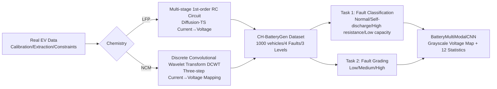

# Battery Fault: A Comprehensive Dataset and Benchmark for Battery Fault Diagnosis

**Conference**: ICLR 2026  
**OpenReview**: [https://openreview.net/forum?id=jSM71b1JsV](https://openreview.net/forum?id=jSM71b1JsV)  
**Code**: [https://github.com/CH-BatteryGen/dataset-warehouse](https://github.com/CH-BatteryGen/dataset-warehouse)  
**Area**: Time Series / Datasets and Benchmarks / Battery Fault Diagnosis  
**Keywords**: Battery Fault Diagnosis, Time Series, Generative Data Augmentation, Electric Vehicles, LFP/NCM, Benchmark Dataset  

## TL;DR
This paper constructs CH-BatteryGen, the first battery system fault diagnosis dataset for electric vehicles (EVs) under real-world operating conditions. By combining "real vehicle data + mechanism-constrained generation models," it balances authenticity and scale, covering 1000 vehicles, two mainstream chemical systems, four fault labels, and three severity levels, accompanied by two benchmark tasks: fault classification and fault grading.

## Background & Motivation
**Background**: With the large-scale popularization of electric vehicles (EVs), battery safety has become a research focus. Internal short circuits and thermal runaway can trigger fires or explosions, and range typically drops by more than 20% when capacity fades below 80%. Data-driven battery fault diagnosis algorithms are considered key to reducing safety risks but rely heavily on large-scale, fine-grained labeled operating data.

**Limitations of Prior Work**: Existing public datasets suffer from three major shortcomings: (1) **Insufficient scale and coarse labels**: Although EVBattery has 1.2 million charging segments, it only provides binary "normal/abnormal" labels, failing to characterize fine-grained patterns like lithium plating or internal short circuits; BatteryML and BatteryLife only label capacity degradation levels or "capacity below 80%," missing specific fault types. (2) **Narrow condition coverage**: Laboratory datasets like NASA and HNEI differ significantly from real-world vehicle scenarios, lacking key information such as temperature distribution and cell consistency. (3) **Lack of a unified benchmark**: Most works follow RMSE metrics for SOH estimation using private data and often ignore class imbalance (missed detection rates can reach 30% when fault samples account for only 5%), making fair comparisons between algorithms impossible.

**Key Challenge**: Real-world vehicle fault data cannot be directly disclosed due to commercial secrets and data security, while laboratory data is detached from real-world operating conditions—the **contradiction between authenticity and shareability/scalability** is the bottleneck of the entire field.

**Goal**: Construct a battery fault diagnosis benchmark platform that is close to real-world operating conditions, legally shareable, and scalable, complete with a unified multi-task evaluation framework.

**Core Idea**: **Use large-scale real-world vehicle data to calibrate mechanism and statistical constraints, and then use mechanism-constrained generative models to synthesize publicly releasable fault data.** This circumvents data security restrictions while retaining real-world condition characteristics. Based on this, a dual-task benchmark of "fault classification + fault grading" is designed to systematically compare traditional machine learning and deep learning methods.

## Method

### Overall Architecture
The core of CH-BatteryGen is a pipeline of "real data calibration → mechanism-constrained generation → multi-task benchmark evaluation." Large-scale real EV operating data are used for parameter extraction and statistical constraint modeling. For LFP and NCM chemical systems, equivalent circuit and wavelet transform models are used to map generated current sequences to voltage time series, respectively. The final output is a standardized dataset of 1000 vehicles, four fault labels, and three severity levels. It supports two tasks—fault classification and fault grading—and proposes an image-numerical multimodal CNN as a strong baseline.

### Key Designs

**1. Mechanism-Constrained Fault Data Generation: Preserving electrochemical features in synthetic data.** Since real labeled vehicle telemetry data is restricted, this paper avoids end-to-end black-box generation. Instead, real data is used for **calibration, parameter extraction, statistical constraint modeling, and internal validation**, and data is generated under physical-data dual constraints for public release. Different strategies are used for the two chemical systems: for LFP batteries, multiple first-order RC equivalent circuits are connected in series, using charging/discharging current generated by Diffusion-TS as input to map "current to voltage time series" by simulating ohmic drop, polarization effects, and hysteresis. For NCM batteries, a mapping model is constructed using Discrete Convolutional Wavelet Transform (DCWT). Compared with real test data, the average deviation of the generated cell voltage is within 10 mV, with a maximum of no more than 30 mV, effectively reproducing voltage characteristics of real faults.

**2. Fine-Grained Labeling System of Four Fault Types × Three Severity Levels.** The dataset assigns a fault label to each vehicle, covering Normal, Self-discharge, High Internal Resistance, and Low Capacity. For faulty vehicles, Severity is categorized into Low, Medium, and High based on cell-level parameter statistics within the pack. Consistency is ensured by defining a fault index $\text{fault\_index}$ using the 95th percentile parameters (e.g., capacity/resistance of 96 cells, excluding outliers): Self-discharge is graded by leakage capacity (Ah/Day), High internal resistance by $R/R_{95}$ (e.g., $1.5 \le \text{fault\_index} < 2.5$ for Low), and Low capacity by $Q/Q_{95}$ (e.g., $\text{fault\_index} < 0.84$ for High). Different faults have clear physical representations on the charge/discharge curves: self-discharge slows down the voltage rise at the beginning of charging and causes a sudden drop with high-frequency oscillation during discharge; high internal resistance raises the charging plateau and causes a steeper drop at the start of discharge due to ohmic drop; low capacity reaches the cutoff voltage earlier with a lower and shorter plateau. This dual-layer labeling compensates for the lack of fine-grained labels in existing datasets.

**3. Multimodal Benchmark Model BatteryMultiModalCNN: Fusing image and numerical features.** To handle multi-scale fault features across different pack sizes and cell counts, a dual-path fusion model is proposed. The image path normalizes the time axis of each voltage curve to $[0,1]$ and plots it as a $512 \times 512$ grayscale image without axes. After median filtering and super-resolution enhancement, it is fed into a modified pre-trained ResNet50 (input layer changed to single-channel grayscale) with a CBAM attention module to focus on fault-related features. The numerical path extracts 12 global statistics from the voltage sequence, such as mean, standard deviation, extrema, range, and consistency measures, mapping them to 64 dimensions via two fully connected layers. The features are concatenated for classification. Grayscale images capture curve morphology, while statistics capture inter-cell differences and severity.

**4. Dual-Granularity Partitioning and Engineering-Oriented Evaluation Protocol.** To ensure reliable evaluation without information leakage, two data splitting strategies are provided: **Segment-level splitting** uses stratified sampling of individual charge/discharge segments (8:2); **Strict vehicle-level splitting** forces all segments of the same vehicle into the same side. This ensures that no segment of a test vehicle appeared in the training set, eliminating vehicle-specific pattern leakage and providing a more conservative cross-instance evaluation. Metrics include Accuracy, Recall, and F1-score—aligning with engineering needs for both reliability and low false-negative rates.

## Key Experimental Results

### Main Results: Fault Classification (4 classes) F1-score
Comparing traditional methods (RF, SVM) and deep models (LSTM, CNN) across LFP/NCM × Charge/Discharge × Segment/Vehicle levels:

| Task | Model | LFP charge | LFP discharge | NCM charge | NCM discharge |
|------|-------|-----------|---------------|-----------|---------------|
| Segment-level | RF | 0.6908 | 0.6860 | 0.7582 | 0.6808 |
| Segment-level | SVM | 0.7077 | 0.6222 | 0.8033 | 0.7272 |
| Segment-level | LSTM | 0.8558 | 0.8273 | 0.8676 | 0.8374 |
| Segment-level | **CNN (Ours)** | 0.8647 | **0.9206** | 0.8823 | 0.8732 |
| Vehicle-level | RF | 0.7511 | 0.7051 | 0.7782 | 0.7380 |
| Vehicle-level | SVM | 0.6025 | 0.6391 | 0.8129 | 0.7935 |
| Vehicle-level | LSTM | 0.7685 | 0.8664 | 0.8313 | 0.7460 |
| Vehicle-level | **CNN (Ours)** | 0.8899 | **0.9280** | 0.8897 | 0.8580 |

CNN outperforms others in all settings, reaching an F1 of 0.9280 on LFP discharge at the vehicle level; traditional methods generally fall below 0.71 under discharge conditions.

### Fault Grading (3 levels) F1-score (LFP only)

| Task | Model | LFP charge | LFP discharge |
|------|-------|-----------|---------------|
| Segment-level | RF | 0.5976 | 0.5288 |
| Segment-level | SVM | 0.6419 | 0.5323 |
| Segment-level | LSTM | 0.7289 | 0.7053 |
| Segment-level | **CNN (Ours)** | 0.8031 | 0.7442 |
| Vehicle-level | LSTM | 0.7273 | 0.7205 |
| Vehicle-level | **CNN (Ours)** | **0.8813** | 0.7823 |

### Key Findings
- **CNN leads across the board and is more robust**: CNN consistently achieves the best F1 across classification and grading tasks, two chemistries, and two operating conditions, peaking at 0.8813 for grading.
- **Significant sensitivity across scenarios**: Traditional methods experience an F1 drop of over 20% in discharge conditions, while deep models degrade less—discharge data is more complex but critical for testing model robustness.
- **Grading is harder than classification**: Fault grading is more challenging overall. Noise under discharge conditions makes "Low/Medium" faults easily confused, exposing current models' limitations in fine-grained feature extraction.
- **Chemistry differences**: In NCM scenarios, some "self-discharge" and "high internal resistance" samples are misjudged as normal, indicating that fault boundaries are less distinct than in LFP.

## Highlights & Insights
- **"Mechanism-constrained generation" solves the data sharing dilemma**: Using real data for calibration and generated data for release is a pragmatic path for opening sensitive industrial data while preserving real-world characteristics (voltage deviation ≤30 mV).
- **First EV system-level fault diagnosis dataset for real-world conditions**: Fills the gap where existing datasets only cover SOH/RUL and lack fine-grained fault labels, while providing both charging and discharging data.
- **Sincere dual-granularity leakage prevention**: Strict vehicle-level partitioning avoids the common but often ignored leakage trap of "segments of the same vehicle across train/test," making reported metrics more credible.
- **Multimodal transformation of time-series into image + statistics**: The combination of grayscale voltage maps and 12-dimensional statistics allows mature visual backbones like ResNet50 to be applied to battery diagnosis.

## Limitations & Future Work
- **Limited chemistry coverage**: Currently only NCM and LFP are included; newer systems like sodium-ion or zinc-ion are not covered.
- **Narrow fault label variety**: Beyond the four categories, more specific patterns like lithium plating or internal short circuits are not yet individually labeled.
- **Insufficient extreme condition data**: Samples for high-rate fast charging and extreme temperatures are scarce, and grading tasks still confuse low/medium faults under discharge noise.
- **Reality boundary of synthetic data**: Despite distribution validation, the gap between generated and real faults in long-tailed or rare patterns needs further external validation.
- **Room for improvement in grading**: Fine-grained severity identification remains an open problem, requiring enhanced feature extraction for complex conditions.

## Related Work & Insights
- **Fault Diagnosis Datasets**: EVBattery (1.2M segments, binary), BatteryML (383 cycles, degradation levels), BatteryLife (multi-chemistry, coarse labels); their common weakness is coarse labeling and detachment from real-world operations, which this paper addresses via "fine-grained labels + real-world condition generation."
- **Diagnosis Algorithm Spectrum**: Traditional methods rely on manual features (SVM with frequency features for resistance detection, RF using current-voltage slopes for self-discharge) but have poor generalization. Deep models rely on automatic feature extraction (LSTM for internal short circuits, GRU+Attention for recall), performing better but mostly using private data and lacking standardized comparisons.
- **Insights**: Dataset differences significantly impact algorithm evaluation; a unified, reproducible benchmark is a prerequisite for engineering deployment. The "mechanism + generation" paradigm can be extended to other sensitive industrial time-series data like power grids or aero-engines.

## Rating
- **Novelty**: ⭐⭐⭐⭐ — Primary contribution is the dataset; the "mechanism-constrained generation" for compliant release of real-condition fault data is novel and practical, though the models themselves are mature combinations.
- **Experimental Thoroughness**: ⭐⭐⭐⭐ — Covers two chemistries × charge/discharge × segment/vehicle granularity × 4 models × 2 tasks; however, grading was only performed on LFP, and more cross-validation with different backbones is needed.
- **Writing Quality**: ⭐⭐⭐⭐ — Clear motivation, detailed tables, and well-explained leakage prevention; some mechanism details are moved to the appendix.
- **Value**: ⭐⭐⭐⭐ — The first real-world condition EV system-level fault diagnosis benchmark. It is open-sourced and clearly promotes research in battery safety and data-driven diagnosis.

<!-- RELATED:START -->

## Related Papers

- [\[ICLR 2026\] Omni-iEEG: A Large-Scale, Comprehensive iEEG Dataset and Benchmark for Epilepsy Research](omni-ieeg_a_large-scale_comprehensive_ieeg_dataset_and_benchmark_for_epilepsy_re.md)
- [\[ICLR 2026\] FeDaL: Federated Dataset Learning for General Time Series Foundation Models](fedal_federated_dataset_learning_for_general_time_series_foundation_models.md)
- [\[ICCV 2025\] VLRMBench: A Comprehensive and Challenging Benchmark for Vision-Language Reward Models](../../ICCV2025/time_series/vlrmbench_a_comprehensive_and_challenging_benchmark_for_vision-language_reward_m.md)
- [\[ICLR 2026\] CTBench: Cryptocurrency Time Series Generation Benchmark](ctbench_cryptocurrency_time_series_generation_benchmark.md)
- [\[ACL 2026\] Time-RA: Towards Time Series Reasoning for Anomaly Diagnosis with LLM Feedback](../../ACL2026/time_series/time-ra_towards_time_series_reasoning_for_anomaly_diagnosis_with_llm_feedback.md)

<!-- RELATED:END -->
