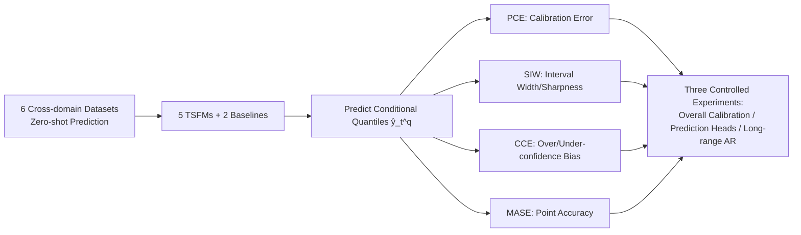

# Beyond Accuracy: Are Time Series Foundation Models Well-Calibrated?

**Conference**: ICLR 2026  
**OpenReview**: [https://openreview.net/forum?id=nGBN7UjHcy](https://openreview.net/forum?id=nGBN7UjHcy)  
**Code**: [https://github.com/Coaster41/Beyond-Accuracy-TSFM-Calibration](https://github.com/Coaster41/Beyond-Accuracy-TSFM-Calibration)  
**Area**: Time Series Foundation Models / Uncertainty Calibration  
**Keywords**: Time Series Foundation Models, Probabilistic Calibration, PCE, Overconfidence, Autoregressive Forecasting, Prediction Heads  

## TL;DR
The authors evaluate 5 Time Series Foundation Models (TSFMs) and 2 traditional baselines using a metric system specifically designed to measure "calibration rather than sharpness." They find that TSFMs not only provide more accurate point predictions but also consistently outperform baselines in probabilistic calibration, without exhibiting the systematic overconfidence typical of vision or language foundation models.

## Background & Motivation
**Background**: Time Series Foundation Models (TSFMs, such as Chronos-Bolt, TimesFM, Moirai 2.0, TiRex, and YingLong) are becoming mainstream in time series forecasting. Pre-trained on massive cross-domain data, they enable zero-shot or few-shot forecasting on arbitrary sequences without the need for per-sequence modeling. These models output conditional distributions of future values rather than single points, which is crucial for decision-making in scenarios like anomaly detection and healthcare.

**Limitations of Prior Work**: Previous evaluations focused almost exclusively on point accuracy, with very little research on whether "predicted probabilities align with actual data" (i.e., calibration). Worse, common metrics like CRPS, WQL, and MSIS were proven by Chung et al. (2021) to mix **calibration** and **sharpness** (concentration of the distribution), biasing results toward sharp/accurate predictions. Figure 1 provides a counterexample where WQL incorrectly ranks ARIMA as the "best calibrated" model on the Glucose dataset.

**Key Challenge**: While researchers want to know if TSFM uncertainty estimates are trustworthy, existing metrics fail to decouple calibration from sharpness, making the established conclusion that "TSFMs are well-calibrated" unreliable.

**Goal**: Using metrics that purely measure calibration, this paper systematically answers four questions: Are TSFMs well-calibrated? Is there systematic over- or under-confidence? How do different prediction heads affect calibration? How does calibration change under long-range autoregressive forecasting?

**Core Idea**: **[Pure Calibration Evaluation]** The authors introduce PCE, SIW, and CCE metrics to measure calibration error, sharpness, and bias, respectively. By escaping the confusion trap of WQL, they conduct the first large-scale calibration study of 5 TSFMs and 2 baselines across 6 cross-domain datasets, utilizing controlled experiments involving prediction head replacement and autoregressive method comparisons.

## Method

### Overall Architecture
Instead of proposing a new model, the paper establishes a **calibration evaluation protocol**. Fixing a set of quantiles $q\in\{0.1,\dots,0.9\}$, they decompose "calibration error—sharpness—bias" using three complementary metrics. They then compare foundation models vs. baselines, different prediction heads, and various autoregressive implementations across these dimensions.

### Key Designs

**1. PCE: The core metric for decoupling calibration from sharpness.** The paper utilizes Probabilistic Calibration Error to directly measure the "gap between empirical CDF and predicted CDF." For each quantile $q$, it calculates the actual frequency at which the ground truth falls below the predicted quantile and compares it to the nominal probability:
$$\text{PCE}=\frac{1}{|Q|}\sum_{q\in Q}\left|q-\frac{1}{L}\sum_{t=T+1}^{T+L}\mathbb{1}[y_t\le \hat{y}_t^q]\right|.$$
PCE values range from $[0,0.5]$, where lower is better. If a 90% quantile covers exactly 90% of the ground truth, the corresponding term is 0. Unlike WQL, it does not reward "sharper" predictions, avoiding traps like the one shown in Figure 1. This is the foundation of the evaluation.

**2. SIW + CCE: Determining over- or under-confidence.** PCE alone is insufficient, as a "lazy model" predicting only the marginal distribution could also be well-calibrated. Thus, sharpness and bias must be analyzed. Scaled Interval Width measures sharpness using symmetric quantile intervals: $\text{SIW}_s=\frac{1}{L}\sum_t \frac{\hat{y}_t^{q_{high}}-\hat{y}_t^{q_{low}}}{y^{q_{high}}-y^{q_{low}}}$, where smaller values indicate higher confidence. Centered Calibration Error compares the actual proportion of data falling within the confidence interval to the nominal confidence $s$:
$$\text{CCE}=\frac{1}{|S|}\sum_{s\in S}\left(s-\frac{1}{L}\sum_{t=T+1}^{T+L}\mathbb{1}\!\left[\hat{y}_t^{q_{low}}\le y_t\le \hat{y}_t^{q_{high}}\right]\right).$$
Combining these reveals the direction of bias: Positive CCE and small SIW $\to$ interval too narrow, ground truth falls outside $\to$ **overconfident**; Negative CCE and large SIW $\to$ interval too wide $\to$ **underconfident**.

**3. Plug-and-play prediction head experiments.** To isolate the impact of the backbone vs. the prediction head, the authors used a large dataset (TSMixup), unrelated to the test sets, to retrain four types of heads for each frozen TSFM backbone: Quantile, Gaussian, Student's t, and Mixture (Gaussian, t, log-normal, Laplace). The retrained Quantile head serves as a control to ensure the four heads represent a fair comparison under the same backbone.

**4. Long-range autoregressive (AR) method comparison.** When the target forecast length $L$ exceeds the model's look-ahead window $H$, AR is required. The paper compares three AR implementations: Naive point-wise AR (feeding the mean back, used by Chronos-Bolt/TimesFM), Branching (maintaining independent contexts for each quantile, used by Moirai 2.0), and Trajectory (sampling $n\gg|Q|$ independent paths, used by Toto). These are compared with native long-range models (TiRex/YingLong) to assess the trade-offs between computational cost and calibration error.

## Key Experimental Results

The setup includes 5 TSFMs + 2 baselines across 6 datasets (Reviews, Shopping, Glucose, Heart-Rate, Crime, Patents) with total predictions ranging from thousands to 360,000.

### Main Results: Overall Calibration and Bias

| Dimension | Metric | TSFM Performance | Baseline Performance |
|-----------|--------|-----------------|----------------------|
| Point Accuracy | MASE | Generally superior to baselines | Poorer |
| Calibration Error | PCE | Mostly near or below 5%, stable beyond 64 steps | Consistently higher |
| Bias | CCE | No systematic over/under-confidence | Consistently **underconfident** |

Note: On the Patents dataset, all methods show high PCE due to high non-linearity and low predictability.

### Ablation Study: Prediction Head / Long-range AR

| Experiment | Key Comparison | Conclusion |
|------------|----------------|------------|
| Prediction Head | Quantile vs. t vs. Mixture vs. Gaussian | First three show little difference; **Gaussian head is consistently underconfident and worst calibrated.** |
| Long-range AR | Branching vs. Trajectory, $H\in\{16,32,64,128\}$ | Shorter windows lead to overconfidence; **Trajectory method outperforms Branching**; Non-AR (TiRex/YingLong) are optimal and most efficient. |

### Key Findings
- TSFMs generally achieve PCE below 5%, and no single TSFM significantly dominates, suggesting this is a general property of the model class.
- TSFMs **are not overconfident like vision/language foundation models**. The authors attribute this to TSFMs being trained directly with calibration-aware losses (minimizing WQL), whereas CV/NLP models optimize for reconstruction or classification error.
- Limited expressiveness in Gaussian heads leads to underconfidence and higher calibration error; more expressive distributions do not overfit and calibrate better.
- In long-range forecasting, all AR methods tend toward overconfidence. Branching methods show high CCE (>0.15) for short windows (16/32), which improves as the window increases. Trajectory methods are more expensive but better calibrated.

## Highlights & Insights
- **Metric Correction**: Using a specific counterexample (Figure 1), the paper shatters the assumption that "good WQL equals good calibration," providing methodological value beyond simple benchmarking.
- **Counter-intuitive Cross-modal Conclusion**: Unlike vision/language models, TSFMs are not overconfident. The root cause is identified as "calibration-aware training losses"—a clean, transferable explanation.
- **Elegant Prediction Head Experiment**: Freezing the backbone and retraining heads on independent data allows for true decoupling of "representation" and "head architecture."
- **Clear Advice for Practitioners**: Avoid Gaussian heads; for long-range forecasting, prioritize native long-window models or trajectory-based AR.

## Limitations & Future Work
- Evaluation is limited to **zero-shot univariate** forecasting, excluding fine-tuning and multivariate scenarios which might change calibration conclusions.
- Calibration is assessed only for fixed quantiles $\{0.1,\dots,0.9\}$; higher resolution or tail-end calibration was not explored.
- Did not investigate calibration under **distribution shift/non-stationarity**, which is a known issue for deep classification models and critical for time series.
- The claim that "TSFM calibration stems from calibration-aware loss" is a reasonable hypothesis but lacks causal verification through training-loss ablation.

## Related Work & Insights
This work connects two threads: calibration research in deep learning (e.g., Guo et al. on vision overconfidence) and time series probabilistic evaluation (CRPS/WQL/MSIS). A key theoretical basis is the proof by Chung et al. (2021) that traditional metrics mix calibration and sharpness. The insight is that **the choice of evaluation metrics can change the conclusion**; any claim of "well-calibrated models" must first ensure the metric is not contaminated by sharpness.

## Rating
- Novelty: ⭐⭐⭐⭐ Does not propose a new model, but is the first to systematically re-evaluate TSFM calibration using pure metrics, yielding counter-intuitive and valuable insights.
- Experimental Thoroughness: ⭐⭐⭐⭐ 5 models × 2 baselines × 6 datasets, covering three types of controlled experiments with synthetic data controls.
- Writing Quality: ⭐⭐⭐⭐ Clear motivation, rigorous metric definitions, and a compelling use of counterexamples.
- Value: ⭐⭐⭐⭐ Provides a reusable protocol and practical guidelines for TSFM uncertainty assessment, critical for downstream decision-making.

<!-- RELATED:START -->

## Related Papers

- [\[ICLR 2026\] Understanding the Implicit Biases of Design Choices for Time Series Foundation Models](understanding_the_implicit_biases_of_design_choices_for_time_series_foundation_m.md)
- [\[ICLR 2026\] When Foundation Models Are One-Liners: Limitations and Future Directions for Time Series Anomaly Detection](when_foundation_models_are_one-liners_limitations_and_future_directions_for_time.md)
- [\[ICLR 2026\] Adapt Data to Model: Adaptive Transformation Optimization for Domain-shared Time Series Foundation Models](adapt_data_to_model_adaptive_transformation_optimization_for_domain-shared_time_.md)
- [\[ICLR 2026\] FeDaL: Federated Dataset Learning for General Time Series Foundation Models](fedal_federated_dataset_learning_for_general_time_series_foundation_models.md)
- [\[ICLR 2026\] CauKer: Classification Time Series Foundation Models Can Be Pretrained on Synthetic Data](cauker_classification_time_series_foundation_models_can_be_pretrained_on_synthet.md)

<!-- RELATED:END -->
