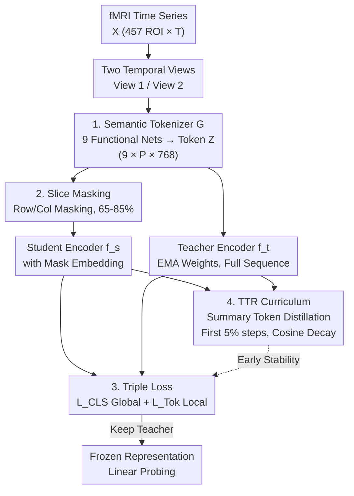

# Brain-Semantoks: Learning Semantic Tokens of Brain Dynamics with a Self-Distilled Foundation Model

**Conference**: ICLR2026  
**arXiv**: [2512.11582](https://arxiv.org/abs/2512.11582)  
**Code**: [https://github.com/SamGijsen/Brain-Semantoks](https://github.com/SamGijsen/Brain-Semantoks)  
**Area**: Time Series  
**Keywords**: fMRI Foundation Model, Self-Distillation, Semantic Tokenizer, Brain Dynamic Representation Learning, Linear Probing

## TL;DR
Brain-Semantoks is proposed as an fMRI foundation model based on a semantic tokenizer and a self-distillation objective. It aggregates brain functional networks into robust semantic tokens and learns abstract brain dynamic representations through consistency across temporal views, achieving SOTA performance under linear probing settings.

## Background & Motivation

**Background**: fMRI foundation models have developed rapidly, with pioneering works such as BrainLM, Brain-JEPA, and NeuroSTORM adopting mask-and-reconstruct objectives. These methods focus on low-level signal prediction—BrainLM reconstructs BOLD signals in the input space, Brain-JEPA performs prediction in latent space to avoid noise modeling, and NeuroSTORM performs spatiotemporal reconstruction on 4D voxels.

**Key Challenge**: A fundamental mismatch exists between reconstruction objectives and downstream task goals. Downstream tasks (e.g., disease diagnosis, cognitive assessment) require stable, high-level phenotypic signatures, whereas representations learned via reconstruction are sensitive to noise and temporal fluctuations, necessitating heavy fine-tuning. This reliance on fine-tuning weakens the utility of foundation models, especially in fMRI where datasets vary significantly in subject populations, hardware, and acquisition protocols.

**Goal**: Effective prediction of stable phenotypes requires a shift from "reconstruction" to "abstraction"—the goal is not to precisely encode BOLD signals but to extract underlying phenotypic features.

**Key Insight**: (1) Time series from individual ROIs are noisy and semantically ambiguous, making them unsuitable as input tokens for Transformers; (2) The functional organization of the brain (e.g., Default Mode Network) provides strong neuroscientific priors for constructing semantic tokens.

**Core Idea**: A semantic tokenizer at the functional network level is used to aggregate noisy regional signals into robust tokens, followed by a self-distillation objective to learn abstract representations that are stable across time.

## Method

### Overall Architecture
Brain-Semantoks utilizes a student-teacher self-distillation architecture. The training pipeline does not reconstruct any BOLD signals but aligns representations from two temporal views. The input fMRI time series $X \in \mathbb{R}^{C \times T}$ ($C=457$ brain regions) is cropped into two long segments as different temporal views. A semantic tokenizer then aggregates noisy ROI signals into functional network-level tokens. The token sequence follows two paths: the student branch undergoes slice masking (covering large blocks) before entering a Transformer encoder; the teacher branch processes the complete sequence through an identical encoder, with teacher weights updated via Exponential Moving Average (EMA) of the student. The outputs are aligned by a triple cross-view loss—a global loss for stable phenotypes, a token-level loss for local temporal features, and TTR to constrain the token space and stabilize self-distillation in early training. After training, the student is discarded, and the frozen teacher representations are used for linear probing.

### Key Designs

**1. Semantic Tokenizer: Aggregating Noisy ROI Signals into Semantic Tokens**

Individual ROI time series have low signal-to-noise ratios and ambiguous semantics. Using them directly as Transformer tokens is redundant and difficult to learn. The authors utilize neuroscientific priors of brain functional organization to divide 457 ROIs into 9 functional networks (Yeo 7-network cortical parcellation plus subcortical and cerebellar regions). Each network has an independent tokenizer $g_n$ processing its internal ROI timings. The temporal dimension is partitioned into $P$ long segments. Each segment extracts multi-scale temporal patterns via a dual-branch structure (standard and structured convolutions), outputting a token tensor $Z \in \mathbb{R}^{N \times P \times D}$ (9 networks × $P$ patches × 768 dimensions). This compresses the sequence length from 457 ROIs to $N \times P = 45$, effectively grouping "characters" into "words" to form semantically rich and stable network-level tokens.

**2. Slice Masking: Forcing the Model to Learn Complex Inter-network and Temporal Relations**

Tokens are arranged in an $N \times P$ matrix. One masking method is randomly selected per step: network slicing (masking an entire row, i.e., all segments of a functional network) or temporal slicing (masking several continuous columns). The masking ratio is high, $\mathcal{U}[0.65, 0.85]$, and applied in blocks. This structured high-ratio masking prevents the model from relying on simple interpolation of adjacent segments, forcing it to model high-level dependencies across networks and time slices.

**3. Triple Loss: Division of Labor Between Global Stability and Local Temporal Sensitivity**

The training objective consists of three cross-view distillation terms. The global loss $\mathcal{L}_{CLS}$ performs bidirectional distillation between student and teacher [CLS] tokens across two temporal views to learn stable phenotypic signatures, using a coding rate regularization term to prevent dimensional collapse. The token-level loss $\mathcal{L}_{Tok}$ requires the student to reconstruct masked network tokens to match teacher outputs within a single view, capturing time-sensitive local features. The third term, $\mathcal{L}_{TTR}$ (Teacher-guided Temporal Regularization), averages $P$ patch embeddings for each network into a single summary token for cross-view distillation, guiding the model to capture time-averaged network signatures. Ablation shows that removing $\mathcal{L}_{CLS}$ drops the average score from 52.39 to 47.32, proving the global branch is critical for stable representations.

**4. TTR Curriculum: Early Constraining of Token Space to Stabilize Self-Distillation**

Running self-distillation directly on low-SNR fMRI is prone to training instability and representation collapse. TTR is activated only during the first 5% of training steps and سپس decays to zero via a cosine schedule. It initially compresses the alignable token space from $N \times P + 1$ to $N + 1$, providing a lower-dimensional, easily reachable initial solution. Once representations stabilize, it is phased out to allow the model to model finer temporal dynamics. Ablation confirms this timing: omitting TTR drops performance to 50.88 due to instability, while keeping it for 100% of training results in 49.60 due to over-constraining.

### Loss & Training
Temporal crop length $T_{crop}=100$, patch length 20, resulting in 5 patches per network across 9 functional networks. Transformer width $D_f=768$ with 8 layers; projection head consists of two hidden layers $D_h=1024$ and output dimension $D_{proj}=128$. Pre-training was conducted on 39,139 resting-state fMRI scans from UK Biobank. Training completes in under 2 hours on a single GPU (<20GB VRAM). Z-scoring is used instead of robust scaling to eliminate DC offsets across datasets, improving cross-dataset migration.

## Key Experimental Results

### Main Results (Linear Probing: Frozen Weights + Single Linear Layer)

| Dataset/Task | BrainLM | Brain-JEPA | **Ours** |
|--------------|---------|------------|---------------------|
| ABIDE (ASD)  | 53.84   | 52.92      | **65.13**           |
| HBN CELF     | 42.03   | 41.50      | **42.18**           |
| HBN WISC     | 38.26   | 38.34      | **40.87**           |
| UKB Sex      | 86.71   | 83.23      | **87.52**           |
| UKB Age      | 30.16   | 30.60      | **31.15**           |
| SRPBS SZ     | 57.61   | 57.63      | **69.26**           |
| SRPBS MDD    | 55.72   | 52.72      | **62.60**           |

- Ours achieved the highest scores in 8 out of 9 tasks, with significant advantages in clinical diagnosis (ASD +12, SZ +12, MDD +7).

### Comparison with Supervised Methods
- Linear probing alone exceeds all fully supervised end-to-end baselines (FC, BNT, BolT, BrainMass) and fine-tuned versions of BrainLM/Brain-JEPA.
- Average performance across 12 tasks: 52.72% vs. 50.68% (best supervised), proving the learned representations are widely applicable without fine-tuning.

### Generalization to Task fMRI (Hariri Emotion Task)
- Linear probing with Brain-Semantoks reached 93.84-96.50%, significantly outperforming Brain-JEPA's 81.06-82.29%.
- The masking distillation framework and patch construction strategy successfully address the pre-training-inference time scale mismatch.

### Scaling Laws
- Provides the first detailed scaling analysis for fMRI foundation models.
- Linear probing performance grows as a power law with the logarithm of pre-training data volume.
- Consistent scaling gains are observed on OOD tasks without reaching a performance plateau.
- Sustained performance improvements were noted even when HBN data had an age gap of >20 years compared to UKB.

### Ablation Study

| Configuration | Avg Score | Description |
|---------------|-----------|-------------|
| Full Brain-Semantoks | 52.39 | Semantic Tokenizer + TTR + CLS + Tok |
| w/o TTR (0%) | 50.88 | Training instability, -1.5 performance |
| TTR Always (100%) | 49.60 | Over-constrained, worse performance |
| w/o CLS Loss | 47.32 | Global representation loss is critical |
| Linear Proj replaces Tokenizer | Significant Gap | Leads to partial collapse, cosine similarity jumps to 0.95 |
| Random Masking replaces Slice | 51.03 | Slice masking reduces interpolation learning |

## Highlights & Insights

- **Paradigm Shift from Reconstruction to Abstraction**: Unlike previous fMRI foundation models using reconstruction targets, Brain-Semantoks explicitly targets abstract representation learning, leading to massive gains in linear probing.
- **Ingenious Semantic Tokenizer**: Merging neuroscientific priors (functional networks) into the architecture compresses sequence length (457→45) and aggregates noisy regional signals into semantic tokens, analogous to word aggregation in NLP.
- **TTR Curriculum Learning**: Solves the instability of combining low SNR data with self-distillation. Activating it only for the first 5% of steps balances stability and flexibility.
- **Z-scoring > Robust Scaling**: A simple change in normalization strategy resolves inconsistent DC offsets during cross-dataset transfer, reflecting an important engineering contribution.
- **First fMRI Scaling Law Analysis**: Demonstrates that OOD performance improves reliably with data volume, increasing confidence in fMRI foundation models.

## Limitations & Future Work

- Functional network division relies on a fixed Yeo 7-network parcellation; future work could explore learning ROI groupings from data.
- Pre-training only uses resting-state fMRI (UKB); integrating task-based data might further improve representation quality.
- Downstream continuous targets were discretized into multi-class labels, which may not fully reflect the representation's capability for regression tasks.
- While scaling analysis shows no plateau, it is limited by UKB data size (~39K); the effects of larger-scale pre-training remain unknown.
- Single GPU training is efficient (<2h), but whether the 8-layer Transformer capacity limits learning of more complex patterns is unexplored.

## Related Work & Insights

- **vs. BrainLM/Brain-JEPA**: These utilize ROI-level mask reconstruction; Brain-Semantoks performs semantic distillation at the network level, with linear probing performance significantly higher (over 10% gap in OOD clinical tasks).
- **vs. BrainMass**: BrainMass uses static functional connectivity matrices, ignoring temporal dynamics; Brain-Semantoks explicitly models temporal information.
- **vs. DINO/iBOT/SimDINO**: Brain-Semantoks successfully transfers the visual self-distillation paradigm to fMRI while introducing domain-specific semantic tokenizers and TTR stability curricula.
- **Inspiration**: Functional networks as semantic tokenizers can be extended to other brain imaging modalities (EEG, MEG); the TTR strategy of "learning averages before details" could benefit self-distillation on other low-SNR data.

## Rating
- Novelty: ⭐⭐⭐⭐⭐ Paradigm shift (reconstruction to abstraction), original designs for Tokenizer and TTR.
- Experimental Thoroughness: ⭐⭐⭐⭐⭐ Extensive tasks (11) across 6 datasets, includes linear probing, fine-tuning, ablation, scaling, and interpretability.
- Writing Quality: ⭐⭐⭐⭐ Clear motivation, logical progression, systematic ablation.
- Value: ⭐⭐⭐⭐⭐ Establishes a new paradigm for fMRI foundation models where linear probing exceeds supervised methods, offering high practical value.

<!-- RELATED:START -->

## Related Papers

- [\[ICLR 2026\] Inferring brain plasticity rule under long-term stimulation with structured recurrent dynamics](inferring_brain_plasticity_rule_under_long-term_stimulation_with_structured_recu.md)
- [\[ICLR 2026\] Panda: A Pretrained Forecast Model for Chaotic Dynamics](panda_a_pretrained_forecast_model_for_chaotic_dynamics.md)
- [\[ICLR 2026\] UniCA: Unified Covariate Adaptation for Time Series Foundation Model](unica_unified_covariate_adaptation_for_time_series_foundation_model.md)
- [\[ICLR 2026\] Uni-NTFM: A Unified Foundation Model for EEG Signal Representation Learning](uni-ntfm_a_unified_foundation_model_for_eeg_signal_representation_learning.md)
- [\[ICLR 2026\] DeepFRC: An End-to-End Deep Learning Model for Functional Registration and Classification](deepfrc_an_end-to-end_deep_learning_model_for_functional_registration_and_classi.md)

<!-- RELATED:END -->
