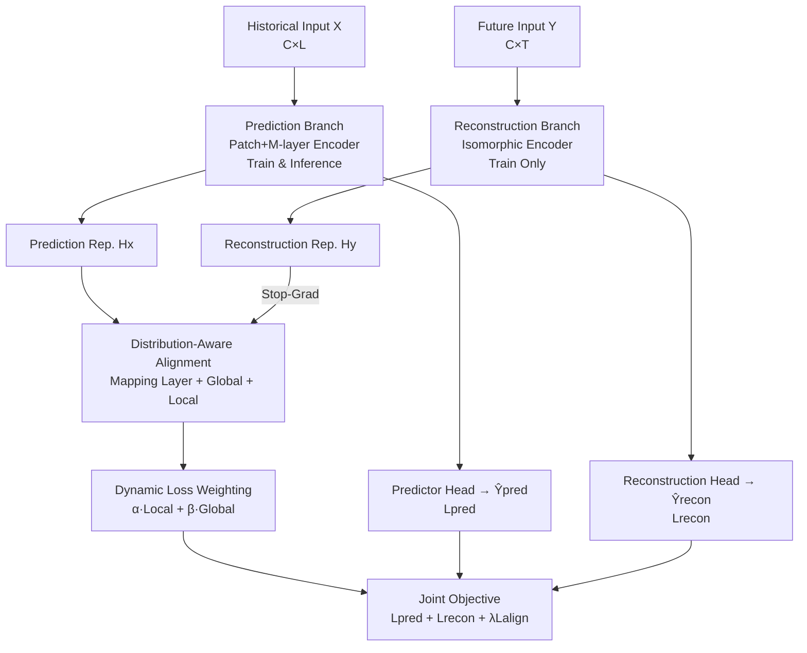

# Bridging Past and Future: Distribution-Aware Alignment for Time Series Forecasting

**Conference**: ICLR2026  
**OpenReview**: [https://openreview.net/forum?id=pQzQfslqlD](https://openreview.net/forum?id=pQzQfslqlD)  
**Code**: https://github.com/TROUBADOUR000/TimeAlign  
**Area**: Time Series Forecasting / Representation Learning  
**Keywords**: Time series forecasting, distribution alignment, reconstruction, representation learning, frequency domain

## TL;DR
To address the distribution mismatch in time series forecasting caused by "forcing historical statistical patterns onto future distributions," this paper proposes TimeAlign—a plug-and-play dual-branch framework. It utilizes a "future reconstruction" branch (present only during training) to provide a target distribution for alignment. By employing global and local alignment, the prediction branch's representation is pulled toward the true future distribution, reducing MSE/MAE by 3.27%/5.20% relative to the state-of-the-art across 8 benchmarks.

## Background & Motivation

**Background**: While representation learning (contrastive learning, self-supervised learning) has achieved great success in vision and NLP, its effectiveness in Time Series Forecasting (TSF) remains limited. Current mainstream deep predictors mostly follow the "Encoder-Predictor" paradigm: encoding the historical window $X$ into a latent representation and directly mapping it to the future $Y$.

**Limitations of Prior Work**: The authors decompose the failure of this unidirectional paradigm into three pieces of evidence. First, **low-frequency shortcuts**: when training is driven solely by MSE/MAE loss, models tend to oscillate around the learned mean or repeat low-frequency periodic signals from history. This results in unrealistically high cosine similarity between predicted patches, while high-frequency components reflecting sudden changes are severely underestimated. Second, **past-future distribution mismatch**: learned high-dimensional representations are biased toward historical statistical characteristics, making it difficult to map historical representations directly to the target future distribution. Third, **structural defects of the unidirectional paradigm**: the layer-wise deep encoding of historical information acts as a "frequency smoother," gradually erasing fine-grained high-frequency structures that often encode sudden events, leading to persistently low correlation between predictions and ground truth in the high-frequency domain.

**Key Challenge**: The fundamental issue lies in the unidirectional structure of "inferring the future only from the past"—it fails to constrain representations to fit the future distribution and loses high-frequency details critical for robust forecasting during deep encoding.

**Goal**: To design a framework that bridges the past and the future by alleviating distribution drift while faithfully preserving multi-band dynamics.

**Key Insight**: The authors observe that **reconstruction naturally provides a reference aligned with the future distribution**. Since the reconstruction task involves recovering $Y$ from $Y$ itself, its embeddings inherently fall within the target distribution. To faithfully reconstruct signals, the model must simultaneously attend to coarse-grained periodic structures and fine-grained high-frequency changes. By using a "future reconstruction" branch to guide the "prediction" branch, prediction representations can be constrained to be distribution-aware and detail-preserving.

**Core Idea**: An auxiliary "future reconstruction" branch, existing only during training, serves as an anchor. The intermediate representations of the prediction branch are aligned to this anchor—replacing the original unidirectional prediction with a prediction–reconstruction–alignment paradigm.

## Method

### Overall Architecture

Formally, TSF aims to learn $F_\theta(\cdot)$ to predict the future $\hat{Y}_{pred} \in \mathbb{R}^{C\times T}$ given history $X \in \mathbb{R}^{C\times L}$. TimeAlign introduces an additional reconstruction model $G_\phi(\cdot)$ that **directly maps the future $Y$ back to its own reconstruction $\hat{Y}_{recon}=G_\phi(Y)$**, thereby learning a compact representation $H_y$ that characterizes the target distribution independently of history. $H_y$ is then used as a reference to align the latent representation $H_x$ of the prediction branch.

The framework consists of four components: a **prediction branch** (used in both training and inference; the backbone can be any predictor) that maps history to $\hat{Y}_{pred}$; a **reconstruction branch** (training-only; discarded during inference) that reconstructs $\hat{Y}_{recon}$ from the future to provide $H_y$; a **distribution-aware alignment module** that pulls $H_x$ toward $H_y$ using global and local mechanisms at each layer; and a **lightweight encoder** serving as the implementation for both branches. The two branches share the same patch count $N$ and $M$-layer encoder structure. The prediction, reconstruction, and alignment losses are optimized jointly. Notably, at inference time, only the prediction branch remains, meaning the performance gain stems entirely from the alignment training without additional inference overhead.

### Key Designs

**1. Future Reconstruction Branch: Providing an "Anchor" in the Target Distribution**

This directly addresses the past-future distribution mismatch. Instead of forcing the model to guess the future using historical statistics, the reconstruction branch $G_\phi$ encodes the future $Y$ via patching: $Y_p=\text{Linear}(\text{Patching}(Y))$, passes it through $M$ layers of `linear-activation-linear + residual` encoders ($H_y^l=H_y^{l-1}+\text{Linear}(\sigma(\text{Linear}(H_y^{l-1})))$), and outputs $\hat{Y}_{recon}=\text{Linear}(H_y^M)$. Since $H_y$ is derived from $Y$, it naturally fits the target distribution and preserves both low-frequency and high-frequency details. Theoretically (Appendix B), they prove that the estimate $M_2$ obtained by minimizing reconstruction error is closer to the optimal $M^*$ than the purely empirical estimate $M_1$.

**2. Asymmetric Alignment with Extra Mapping: Stable Teacher-Student Learning**

Directly aligning $H_x$ and $H_y$ is too rigid due to distribution drift. A lightweight linear mapping $\tilde{H}_x^i=\text{Linear}(H_x^i)$ is added to the prediction branch for temporal relocation and normalization. Crucially, **gradients only flow back through the prediction branch via this linear layer, while the reconstruction branch is protected by a stop-gradient**. This asymmetric gradient flow, inspired by SimSiam, ensures the reconstruction branch provides a stable supervisory signal without being distorted by the alignment process.

**3. Complementary Local + Global Alignment: Detail and Structure Control**

**Local Alignment** ensures patch-wise fine-grained consistency to capture sharp transitions and high-frequency details by measuring spectral energy projection. Let $h_{x,j}^i$ be the $j$-th patch of the $i$-th layer:

$$L^i_{local}=\frac{1}{n^2}\sum_{j=1}^{n}\text{GELU}\Big(1-\tilde{h}^i_{x,j}\cdot h^i_{y,j}-\delta_{loc}\Big)$$

**Global Alignment** ensures consistency between the relative distance matrices of the two feature sets, capturing large-scale temporal dependencies:

$$L^i_{global}=\frac{1}{n^2}\sum_{j=1}^{n}\text{GELU}\Big(\tilde{h}^i_{x,j}(\tilde{h}^i_{x,j})^\top - h^i_{y,j}(h^i_{y,j})^\top - \delta_{glo}\Big)$$

Margins $\delta_{loc}$ and $\delta_{glo}$ act as "buffers" to prevent overfitting on simple samples and focus optimization on difficult-to-align samples.

**4. Dynamic Loss Weighting: Adaptive Balancing**

To prevent one objective from dominating across different datasets, weights are calculated adaptively:

$$\alpha=\frac{L_{local}+L_{global}}{L_{local}},\quad \beta=\frac{L_{local}+L_{global}}{L_{global}}$$

This strategy increases the weight of the smaller loss to balance contributions. The overall alignment loss is $L_{align}=\frac{1}{M}\sum_{i=1}^{M}(\alpha L^i_{local}+\beta L^i_{global})$. From a Mutual Information Maximization (MIM) perspective (Appendix C), TimeAlign acts as an implicit mutual information enhancer for $H_x$ and $Y$.

### Loss & Training
The joint objective is $L=L_{pred}+L_{recon}+\lambda L_{align}$, where $L_{pred}$ and $L_{recon}$ use MAE loss. Experiments were conducted on a single V100 32GB GPU, with lookback lengths grid-searched across $\{96,192,336,512,720\}$.

## Key Experimental Results

### Main Results

8 real-world datasets, averaged across prediction lengths $T\in\{96,192,336,720\}$.

| Dataset | Metric | TimeAlign | Runner-up (TVNet) | iTransformer | DLinear |
|---------|--------|-----------|-------------------|--------------|---------|
| ETTm1 | MSE/MAE | **0.340/0.367** | 0.348/0.379 | 0.362/0.391 | 0.356/0.378 |
| ETTm2 | MSE/MAE | **0.243/0.302** | 0.251/0.311 | 0.269/0.329 | 0.259/0.324 |
| Weather | MSE/MAE | **0.214/0.244** | 0.221/0.261 | 0.233/0.271 | 0.242/0.293 |
| Electricity | MSE/MAE | **0.154/0.244** | 0.165/0.254 | 0.164/0.261 | 0.166/0.264 |
| Traffic | MSE/MAE | **0.378/0.240** | 0.396/0.268 | 0.397/0.282 | 0.418/0.287 |
| Solar | MSE/MAE | **0.192/0.214** | 0.228/0.277 | 0.202/0.248 | 0.224/0.226 |

Compared to the runner-up TVNet, TimeAlign reduces MSE/MAE by **3.27%/5.20%** on average. The p-value of $1.37\text{e}{-8}$ in the Wilcoxon test indicates high statistical significance.

### Ablation Study

| Config | ETTm1 MSE/MAE | Weather MSE/MAE | Electricity MSE/MAE | Note |
|--------|---------------|-----------------|---------------------|------|
| (1) w/o Align | 0.349/0.370 | 0.225/0.254 | 0.159/0.248 | Prediction branch only |
| (2) Local only | 0.344/0.372 | 0.220/0.249 | 0.157/0.247 | Local alignment added |
| (3) Global only | 0.342/0.369 | 0.218/0.247 | 0.157/0.246 | Global alignment added |
| (4) Local+Global | **0.340/0.367** | **0.214/0.244** | **0.154/0.244** | Full model |

### Key Findings
- **Global Alignment > Local Alignment**: Global alignment provides coarse distribution-level guidance, while local alignment focuses on fine-grained point-wise correction. Both are necessary.
- **Plug-and-play Effectiveness**: Adding TimeAlign to iTransformer and DLinear improves MSE/MAE by 1%–4% on most benchmarks while increasing the prediction-ground truth cosine similarity.
- **Faster Convergence & Zero Inference Overhead**: Plug-in versions reached validation loss targets 3000 iterations earlier in Traffic with minimal GPU memory increase and zero extra inference latency.
- **Frequency Correction**: Spectral analysis confirms that gains primarily come from correcting the frequency mismatch between history and future. t-SNE shows TimeAlign's predictions align almost perfectly with the ground truth manifold.

## Highlights & Insights
- **Reconstruction as an Anchor**: Instead of complex normalization for de-drifting, training with a reconstruction branch provides the true target distribution. This "cheating" during training improves the "exam" during inference without extra costs.
- **Repurposed Asymmetric Gradients**: Borrowing stop-gradients from SimSiam ensures a stable reference, preventing the two branches from collapsing toward a trivial solution.
- **Spectral Explanation**: Interpreting local alignment as spectral energy projection provides a frequency-domain rationale for the performance gains.
- **Dynamic Balancing**: The weighting scheme automatically balances objectives across datasets, eliminating manual hyperparameter tuning.

## Limitations & Future Work
- Slight performance degradation on Weather and Solar when used as a plug-in, potentially due to extreme outliers and zero-padding distorting the distribution and magnifying alignment loss.
- Competitive but not strictly superior performance on ETTh1/h2.
- The theoretical benefits depend on certain approximations (e.g., Gaussian assumptions) and serve more as qualitative guidance.
- The requirement of full future $Y$ during training limits applicability to online or partially visible future scenarios without redesigning the reconstruction anchor.

## Related Work & Insights
- **vs. Contrastive Learning**: Unlike contrastive methods requiring negative samples, TimeAlign uses a reconstruction-based anchor to pull representations toward the target distribution.
- **vs. Normalization Methods (e.g., RevIN)**: While normalization accounts for statistical shifts, TimeAlign performs alignment in the **representation space**, preserving high-frequency details.
- **vs. Architectural Innovations**: TimeAlign is orthogonal to backbones like iTransformer or PatchTST, providing consistent gains when used as a plug-in.

## Rating
- Novelty: ⭐⭐⭐⭐⭐ 
- Experimental Thoroughness: ⭐⭐⭐⭐ 
- Writing Quality: ⭐⭐⭐⭐ 
- Value: ⭐⭐⭐⭐⭐ 

<!-- RELATED:START -->

## Related Papers

- [\[ICLR 2026\] DistDF: Time-series Forecasting Needs Joint-distribution Wasserstein Alignment](distdf_time-series_forecasting_needs_joint-distribution_wasserstein_alignment.md)
- [\[ICLR 2026\] COSA: Context-aware Output-Space Adapter for Test-Time Adaptation in Time Series Forecasting](cosa_context-aware_output-space_adapter_for_test-time_adaptation_in_time_series_.md)
- [\[ICLR 2026\] CoRA: Boosting Time Series Foundation Models for Multivariate Forecasting through Correlation-aware Adapter](cora_boosting_time_series_foundation_models_for_multivariate_forecasting_through.md)
- [\[ICLR 2026\] Aurora: Towards Universal Generative Multimodal Time Series Forecasting](aurora_towards_universal_generative_multimodal_time_series_forecasting.md)
- [\[ICML 2026\] PATRA: Pattern-Aware Alignment and Balanced Reasoning for Time Series Question Answering](../../ICML2026/time_series/patra_pattern-aware_alignment_and_balanced_reasoning_for_time_series_question_an.md)

<!-- RELATED:END -->
