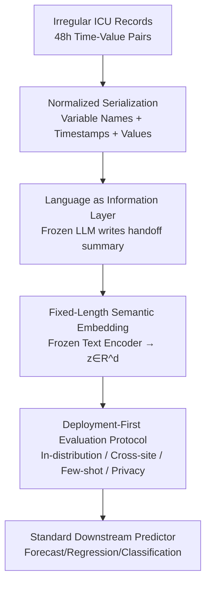

# Can we generate portable representations for clinical time series data using LLMs?

**Conference**: ICLR2026  
**OpenReview**: [https://openreview.net/forum?id=pXw0uRTSKT](https://openreview.net/forum?id=pXw0uRTSKT)  
**Code**: https://github.com/Jerryji007/Record2Vec-ICLR2026  
**Area**: Clinical Time Series / Representation Learning / LLM Application / Cross-hospital Transfer  
**Keywords**: Portable Representations, ICU Time Series, LLM Summarization, Text Embeddings, Distribution Shift

## TL;DR
This paper proposes **Record2Vec**: using a frozen LLM to convert irregular ICU time-series records into concise clinical handoff-style natural language summaries, then encoding these summaries into fixed-length vectors using a frozen text embedding model for a standard predictor. Across three hospital cohorts and five task categories, it is not only competitive in-distribution but, more importantly, experiences less performance decay during cross-hospital transfer, requires less data for few-shot scenarios, and does not increase demographic privacy leakage.

## Background & Motivation
**Background**: The deployment of clinical machine learning models currently proceeds "hospital by hospital." A team must build a model, run silent trials, and tune thresholds and features at Hospital A before going live; when moving to Hospital B, the process starts over. With every new hospital, data distributions, population compositions, and disease incidences change (due to different lab policies, case mixes, and prevalence), leading to degraded model performance and prolonged deployment cycles.

**Limitations of Prior Work**: Current mainstream solutions treat the **model** as the object to be moved across institutions. Interoperability standards like OMOP or FHIR only unify data **formats**, which does not guarantee that input representations remain discriminative at new sites, and unifying formats often strips away critical clinical context. Methods like domain adaptation or invariant risk minimization (IRM) require the model to be **adapted** to the target hospital, incurring the cost of additional target-site data, labels, and calibration. Foundation models pre-trained on EHRs, while performing well in-distribution and reducing task engineering, are often tied to specific sensor schemas or sampling patterns, still necessitating fine-tuning for cross-site migration.

**Key Challenge**: While efforts have focused on "standardizing data formats (which may lose clinical semantics)" or "re-calibrating models," a complementary perspective has been overlooked—**the most difficult thing to transport is not the model, but the input representation**. If heterogeneous EHRs could be mapped into a semantically aligned, site-agnostic interface, standard predictors wouldn't require extensive site-specific adaptation.

**Key Insight**: Clinicians already solve a similar problem. When taking over a new patient or during a shift change, doctors interpret heterogeneous measurements through a **structured narrative handoff**—highlighting critical clinical context while abstracting away trivial measurement differences. The hypothesis of this paper is: Can an LLM also transcribe irregular multivariate patient histories into consistent, handoff-style summaries to serve as a **portable intermediate representation**?

**Core Idea**: Utilize a "summarize-then-embed" two-step pipeline to treat language as an **information transformation layer**. A frozen LLM writes irregular time series into natural language summaries (normalizing units, resolving synonyms, and smoothing site-specific encoding in the semantic space), and a frozen text embedding model converts the summary into a fixed-length vector for a standard predictor with a fixed architecture. This achieves portable input representations $\to$ portable models.

## Method

### Overall Architecture
The core problem Record2Vec addresses is allowing a downstream predictor trained at one hospital to be used at another with almost no retraining or fine-tuning. It achieves this by replacing the "input representation" entirely—instead of feeding numerical grids, it feeds semantic vectors encoded from summary text.

Formally, for site $s$ and hospitalization $i$, the irregular record within a 48-hour window is $R^{(s)}_i = \{(c, \{(t_k, v_k)\}_{k=1}^{K_c}) : c \in C^{(s)}\}$, representing a mapping from clinical concepts $c$ to observed "time-value" pairs. The pipeline has two steps: first, a frozen LLM $g_\phi$ converts the record along with a prompt $\pi$ into a summary $\text{text}_i = g_\phi(R^{(s)}_i, \pi)$; second, a frozen text encoder $h_\psi$ encodes the summary into a fixed-length vector $z_i = h_\psi(\text{text}_i) \in \mathbb{R}^d$ for use by a shared downstream decoder/prediction head. Both models are **frozen and not fine-tuned**, decoupling "representation learning" from "downstream optimization," which limits overfitting to site-specific artifacts and improves reproducibility.

### Key Designs

**1. Language as an Information Transformation Layer: Replacing Numerical Grids with Clinical Handoff Summaries**

The pain point addressed is that numerical imputation loses clinical semantics and is extremely sensitive to missingness patterns and site sampling habits, often crashing when moved to a new hospital. Record2Vec has a frozen LLM $g_\phi$ write the entire 48h window into a concise natural language summary mimicking a doctor's handoff—highlighting vitals, labs, treatments, trends, key events, and data gaps. The key is that it **operates in the semantic space rather than a schema-constrained numerical space**: it can normalize units, resolve synonyms, and smooth over site-specific encoding artifacts, aligning heterogeneous sampling strategies and missingness patterns to comparable clinical concepts. This is the root cause of its superior cross-site stability—heterogeneous variable names, units, and documentation styles are unified into a "shared clinical language" before embedding, so the downstream decoder doesn't have to relearn site-specific conventions. The authors also include a **no-summary control** $z^{\text{direct}}_i = h_\psi(\text{serialize}(R^{(s)}_i))$, where the normalized serialized text is embedded directly, to isolate the contribution of the "summary" itself.

**2. Summarize-then-Embed: Unifying Downstream Interfaces and Saving 25× Tokens**

The summary text is mapped by a frozen text encoder $h_\psi$ (defaulting to Qwen3 text-embedding) into a fixed-length vector $z_i \in \mathbb{R}^d$. The fixed-length property **stabilizes the downstream interface**, making the predictor less sensitive to missingness patterns and local measurement habits (where grid inputs often fail under distribution shift), and simplifies training budgets, naturally supporting zero-shot/few-shot transfer. Another practical benefit verified by experiments is efficiency—feeding raw serialization directly to the encoder typically requires **$\sim$25 times more tokens**; summarization compresses the input, cutting inference costs proportionally while improving portability.

**3. Summarizer Selection and Prompt Design: Trade-off between Fidelity and Standardization**

The paper systematically compares three summarizers representing different deployment scenarios: the large general model Gemini-2.0 Flash, the clinically-tuned model MedGemma, and the small open-source model Llama-3.1. The conclusion is that Gemini-2.0 Flash and MedGemma are the strongest, while Llama-3.1 is weaker. The mechanism is that MedGemma's medical pre-training provides cross-institutionally stable, clinically faithful phrasing (beneficial for transfer), Gemini's instruction-following yields high-density concise summaries (stronger in-distribution and competitive in transfer), while Llama's smaller capacity and weaker domain expertise result in shorter or less standardized summaries, hurting performance both in-distribution and cross-site. Prompt design compared structured slot-based vs. free narrative, as well as zero-shot / CoT / trend-focused / ICD-focused strategies: **Overall, performance is insensitive to prompt choice** (high-level clinical content is preserved across all four), though ICD-style prompts have a slight edge in transfer—pushing the summary toward standardized terminology, making it more "travel-friendly." An important finding: **Structured prompts significantly reduce the variance of the prediction model without changing average accuracy**, which is valuable for deployment stability.

**4. Deployment-First Evaluation Protocol: Treating Portability as a First-Class Objective**

A methodological contribution of this paper is redefining "what to measure." It treats portability and deployment costs as first-class evaluation endpoints, designing three settings: **In-distribution (ID)**—training/validation within a single cohort and testing on its held-out set; **Cross-site**—training on a source cohort and testing on another without target labels, reporting target accuracy and relative drop from ID; **Few-shot**—starting from the source-trained model and fine-tuning on 16/64/512 target labeled samples. Budgets, early stopping, capacity, and regularization are aligned within input types to ensure fair comparison. This protocol brings questions like "how much performance is lost after moving" and "how many target labels are needed" to the forefront.

### Mechanism
Consider "training on MIMIC and transferring to PPICU for in-hospital mortality": A 48h window $R$ of hospitalization (a set of irregular vitals/labs/meds) $\to$ normalized serialization lists variable names and full timestamp-value sequences $\to$ a frozen LLM uses an ICD-style prompt to write a handoff summary (e.g., "Persistent hypotension, rising lactate, vasopressors initiated, decreased urine output in last 6h"), automatically aligning different variable names/units between MIMIC and PPICU into the same clinical description $\to$ frozen Qwen3 encodes this into a fixed vector $z$ $\to$ this is fed to the downstream mortality head trained on MIMIC. Because $z$ is already semantically aligned across hospitals, PPICU's different schemas and sampling habits have little effect on it, so the head trained on MIMIC remains effective on PPICU (e.g., mortality AUROC of 0.72 in Table RQ2, far above the random level of 0.50 where imputation methods often collapse).

## Key Experimental Results

Data: Three ICU cohorts MIMIC-IV (57,212 hospitalizations, 60 variables), HiRID (32,216, 64 variables), and PPICU (39,000, 75 variables, external dataset from a different hospital system). Each hospitalization is sliced into non-overlapping 48h windows. Five task categories: Future 24h multivariate forecasting, Length of Stay (LoS), In-hospital mortality, two treatment indicators (Vasopressors/Antibiotics), and multi-label prediction of whether ten common lab tests will be ordered; plus two privacy probes (age and gender recoverability). Unless specified, PatchTSMixer is the standard downstream model, results averaged over 4 seeds.

### Main Results (In-distribution RQ1)
In 15 in-distribution tasks, Record2Vec achieved the **best performance in 13** and second best in the remaining two (selected AUROC/Recall results, higher is better; Forecast is MSE, LoS is MAE, lower is better):

| Dataset/Task | Metric | Record2Vec | TSDE | TimesFM | Best Imputation |
|---|---|---|---|---|---|
| MIMIC Mortality | AUROC | **0.888** | 0.915* | 0.791 | 0.886 |
| MIMIC Forecast | MSE | **0.027** | 0.030 | 0.030 | 0.035 |
| PPICU Meds | Recall | **0.937** | 0.899 | 0.923 | 0.834 |
| HiRID Labs | Recall | **0.931** | 0.902 | 0.925 | 0.858 |
| Wins (Total 15)| Count | **13** | 1 | 0 | 1 |

(*Note: For MIMIC Mortality, TSDE 0.915 is the column best; Record2Vec is behind in this specific task. The 13 wins come from others. Refer to Table 1 in the original paper.)

### Cross-site Transfer (RQ2) + Ablation
In transfer settings (HiRID→PPICU, MIMIC→PPICU, total 10 columns), Record2Vec **won 10/10 times** (tied twice with TimesFM); imputation methods degraded sharply under shift, with multiple classifiers collapsing to random (AUROC≈0.50). The table below also serves as an ablation, with "No Summary (Direct Embedding)" and "Fixed Template (Record2Vec Template)" as key controls:

| Configuration | Cross-site Performance | Explanation |
|---|---|---|
| Record2Vec (Full) | Wins 10/10 | Summary + Embedding, most stable transfer |
| Record2Vec Template | Wins 2/10 | Gains shrink when using templates instead of free summaries |
| No Summary (Direct) | Mostly in worst tier | Often best in-distribution, but site details hurt portability |
| Grid Imputation | Collapses to 0.50 | Fails under distribution shift |

### Key Findings
- **"No Summary" is strongest in-distribution but weakest cross-site**: Direct embedding of raw serialization preserves all numerical details, providing strong ID discriminative power; however, these site-specific details harm portability, leading to the worst rankings cross-site—confirming that "summarization smoothens site differences."
- **Summarizer ranking: Gemini-2.0 Flash ≈ MedGemma > Llama-3.1**: Medical pre-training (MedGemma) brings stable clinical phrasing, narrowing the gap with Gemini during transfer.
- **Prompt design has low impact, but structured prompts reduce variance**: Performance across four prompts is largely similar, though ICD-style is slightly better for transfer; structured prompts significantly lower prediction variance without affecting mean accuracy.
- **Few-shot is extremely data-efficient**: By fine-tuning on only 16 labeled samples from PPICU, Record2Vec nears the performance of the ID reference model trained on 36,019 samples, showing that minimal supervision can recover most performance lost to distribution shift.
- **No increase in privacy leakage**: Gender prediction collapsed to near-random for all methods; Record2Vec’s age MAE was comparable to or higher than baselines; summaries rarely explicitly mention age/gender, and the encoding phase isn't optimized to capture them.

## Highlights & Insights
- **Shifting "Portability" from Model to Input**: The "Aha!" moment is reversing the transport target—instead of adapting the model, create a site-agnostic semantic input interface. This allows any lightweight downstream classifier to be used directly across hospitals, saving the engineering overhead of porting an entire end-to-end pipeline.
- **Natural Language as an "Alignment Layer"**: Language naturally normalizes units, resolves synonyms, and smooths encoding artifacts. This property is cleverly used to align heterogeneous EHRs—preserving semantics better than forcing raw schemas into a unified syntactic format.
- **Frozen is Regularization**: Keeping the summarizer and encoder frozen serves as a means to prevent overfitting to site-specific artifacts and decouples representation learning from downstream optimization, making it transferable to any "heterogeneous source $\to$ unified representation" deployment.
- **Efficiency Bonus**: Summarization cuts the tokens fed to the encoder by approximately 25×, simultaneously improving portability and inference costs—a tangible saving for production-grade deployment.

## Limitations & Future Work
- **Dependency on Frozen LLM Summary Quality**: Smaller models (Llama-3.1) clearly lose points when summaries aren't standardized; the method's ceiling is capped by the summarizer's capability. The risk of "missing key events" in clinics requires more systematic fidelity assessments.
- **Limited Privacy Scope**: The authors explicitly stated they only tested demographic (age/gender) leakage, which doesn't rule out other privacy risks like membership inference or embedding inversion.
- **Evaluation primarily on a single downstream model**: While the main text uses PatchTSMixer, and the appendix confirms consistent trends with MLP/LSTM/TimeMixer, the interaction between different downstream heads and summary representations warrants deeper analysis.
- **Future Directions**: Prompt engineering is a promising direction (ICD-style already showed transfer advantages); additionally, fact-consistency checking and privacy-oriented summarization constraints could be explored.

## Related Work & Insights
- **vs. Grid Imputation Pipelines (mean/right-shift/interpolation)**: These discretize irregular records into hourly grids and fill them, relying on site statistics for normalization. Ours doesn't fill values; it uses semantic summaries, which don't collapse toward random under shift as imputation does.
- **vs. Self-supervised Time-series Representations (TSDE)**: TSDE uses masked imputation/interpolation/forecasting to learn general embeddings, emphasizing correlations and trends in numerical flows. Ours injects clinical semantic context (states, trends, key events), becoming more discriminative for classification endpoints and more stable in transfer.
- **vs. Time-series Foundation Models (TimesFM)**: TimesFM's pre-training allows it to transfer better than TSDE, but it remains tied only to numerical trends. Record2Vec preserves both numerical and clinical meaning, generally performing better in transfer.
- **vs. TabLLM / DeLLiriuM etc. (LLM-on-EHR)**: These methods fine-tune LLMs for direct prediction, often requiring the transport of site-tuned LLMs. Ours adheres to a deployment philosophy of "frozen, local deployment, only preparing portable input $X$," so hospitals don't need to port the entire end-to-end pipeline.

## Rating
- Novelty: ⭐⭐⭐⭐⭐ Shifting the "transport object" to input representations is a fresh perspective, and the summarize-then-embed instantiation is elegant.
- Experimental Thoroughness: ⭐⭐⭐⭐⭐ Three cohorts, five tasks, seven RQs; covers ID/cross-site/few-shot/privacy/information analysis.
- Writing Quality: ⭐⭐⭐⭐ Clear motivation, well-organized RQs, though some conclusions require reading the appendix carefully.
- Value: ⭐⭐⭐⭐⭐ Directly addresses the pain point of "hospital-by-hospital deployment" in clinical ML, with high engineering significance.

<!-- RELATED:START -->

## Related Papers

- [\[ICLR 2026\] CauKer: Classification Time Series Foundation Models Can Be Pretrained on Synthetic Data](cauker_classification_time_series_foundation_models_can_be_pretrained_on_synthet.md)
- [\[ICLR 2026\] A Unified Federated Framework for Trajectory Data Preparation via LLMs](a_unified_federated_framework_for_trajectory_data_preparation_via_llms.md)
- [\[AAAI 2026\] IdealTSF: Can Non-Ideal Data Contribute to Enhancing Time Series Forecasting?](../../AAAI2026/time_series/idealtsf_can_non-ideal_data_contribute_to_enhancing_the_performance_of_time_seri.md)
- [\[ICLR 2026\] SciTS: Scientific Time Series Understanding and Generation with LLMs](scits_scientific_time_series_understanding_and_generation_with_llms.md)
- [\[ICLR 2026\] AutoDA-Timeseries: Automated Data Augmentation for Time Series](autoda-timeseries_automated_data_augmentation_for_time_series.md)

<!-- RELATED:END -->
