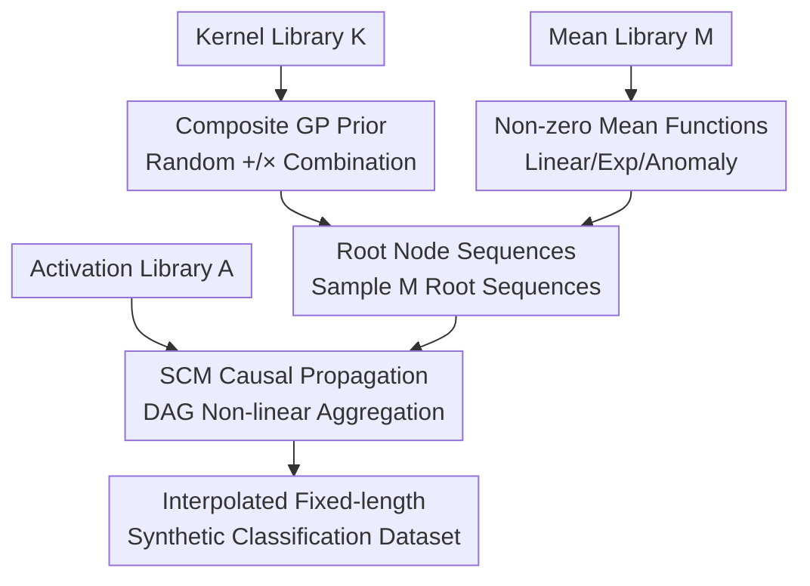

# CauKer: Classification Time Series Foundation Models Can Be Pretrained on Synthetic Data

**Conference**: ICLR2026  
**OpenReview**: [https://openreview.net/forum?id=xBW2FIfswU](https://openreview.net/forum?id=xBW2FIfswU)  
**Code**: https://github.com/ShifengXIE/CauKer  
**Area**: Time Series Foundation Models / Synthetic Data Pretraining  
**Keywords**: Time Series Foundation Models, Synthetic Data, Gaussian Process Kernels, Structural Causal Models (SCM), Scaling Laws

## TL;DR
CauKer combines Gaussian Process (GP) kernel compositions with Structural Causal Models (SCM) to generate purely synthetic time series that possess both realistic structures and inherent cluster properties. Using only this data for pretraining classification Time Series Foundation Models (TSFMs), the method nearly matches the performance of original models trained on real-world datasets orders of magnitude larger across 128 UCR datasets, while demonstrating clean data/model scaling laws for the first time.

## Background & Motivation
**Background**: Time Series Foundation Models (TSFMs) have gained significant attention recently, achieving impressive results in forecasting and classification tasks through strong zero-shot capabilities. The mainstream paradigm relies on data scaling—collecting and cleaning large-scale real-world corpora from various domains for pretraining, with some works utilizing up to 300 billion time points.

**Limitations of Prior Work**: This "real-world data scaling" paradigm is particularly problematic for classification tasks. First, there is a lack of diverse and rich pretraining corpora for time series classification. Second, real-world classification corpora (e.g., UEA) are composed of small, heterogeneous, and highly imbalanced datasets, leading to inconsistent quality. Third, evaluating OOD generalization on real data carries the risk of data leakage. A more critical observation in the paper is that TSFMs **hardly exhibit scaling laws** on such real corpora—increasing data or parameters often leads to fluctuating rather than improving accuracy.

**Key Challenge**: Classification tasks impose two seemingly conflicting requirements on synthetic data. On one hand, generated sequences must have the "look" of real time series, such as seasonality, periodicity, and trends. On the other hand, for classification to be feasible, there must be **meaningful cluster structures** among samples so the model can learn to distinguish different classes. Existing synthetic pipelines focus on only one side: forecasting-oriented kernel methods (e.g., Chronos's KernelSynth) produce zero-mean Gaussian Processes suitable for smooth extrapolation but lack class separability; tabular classification-oriented SCM generators (e.g., TabPFN) can create rich nonlinear causal dependencies but completely lose time series structures.

**Goal**: To design a pure synthetic data generation pipeline specifically for **time series classification** TSFMs, enabling models pretrained solely on synthetic data to match or exceed versions trained on real data while restoring scaling laws.

**Key Insight**: Since the two existing pipelines each possess half of the desired advantages, they should be **welded** together—using Gaussian Processes with kernel compositions for "temporal appearance" and SCMs for "causal separability."

**Core Idea**: Generate synthetic time series that are both realistic and separable using "GP priors with kernel compositions + SCM causal propagation," establishing "data generation" rather than "architectural modification" as the primary path for improving TSFMs.

## Method

### Overall Architecture
CauKer (Causal-Kernel) is a five-step synthetic data generation pipeline. It takes three predefined function libraries as input (Kernel Library $\mathcal{K}$, Mean Library $\mathcal{M}$, Activation Library $\mathcal{A}$) and outputs a batch of univariate synthetic time series of fixed length ( $T=512$ in experiments) for self-supervised pretraining of TSFMs. The framework's backbone consists of: first, randomly sampling and combining kernels from the kernel library to form composite kernels, paired with mean functions sampled from the mean library, to construct several Gaussian Process priors; time series sampled from these GP priors serve as **root nodes** of a Directed Acyclic Graph (DAG); each edge in the graph is assigned an activation function used to nonlinearly propagate and aggregate signals from root nodes to downstream nodes; finally, the outputs of all nodes are interpolated to a uniform length to form the synthetic dataset.

The key intuition is: the GP component ensures "real-world temporal motifs" like periodicity and seasonality, while the SCM component injects nonlinear causal semantics through directed edges, naturally creating cluster structures in the generated sequences. The paper also notes that different nodes in the same SCM can be interpreted as different channels of a multivariate time series sharing the same causal structure—this work treats each node trajectory as an independent univariate sequence to align with univariate TSFM pretraining.

### Key Designs

**1. Kernel Composed GP Prior: Embedding "Temporal Appearance" into Data**

The first requirement for classification synthetic data is that sequences must resemble real time series with seasonality, periodicity, and trends. CauKer follows the kernel library approach of Chronos (Ansari et al.). Step 1 involves sampling $K\sim\mathcal{U}(1,n_\mathcal{K})$ candidate kernels $\{\kappa_i(t,t')\}_{i=1}^K$ i.i.d. from the library. Step 2 uses $K-1$ randomly selected binary operations (addition $+$ and multiplication $\times$) to combine them into a composite kernel $\kappa^* = \kappa_1 \star_1 \cdots \star_{K-1} \kappa_K$. Addition kernels superimpose components of different frequencies/scales, while multiplication kernels create modulations and interactions. Once combined, a single composite kernel can express highly complex temporal motifs. This step inherits the strengths of forecasting-oriented KernelSynth but is only a semi-finished product—sequences generated by zero-mean GPs alone lack class discriminability.

**2. Non-zero Mean Functions: Embedding "Cluster Structure" into Data**

This is the first critical modification in CauKer that distinguishes it from forecasting-oriented kernel methods and is validated as effective by ablation studies. KernelSynth uses **zero-mean** GPs for smooth extrapolation, but classification tasks require preserving mean levels as discriminative cues. In Step 3, CauKer samples $M\sim\mathcal{U}(1,n_\mathcal{M})$ mean functions $\{\mu_i(t)\}$ from a library containing linear functions $ax+b$, exponential functions $ae^{bx}$, and an "anomaly mean function" that inserts random values from $\mathcal{U}(-5,5)$ at random positions. The composite kernels and sampled means form $M$ GP priors $\{\mathrm{GP}(\mu_i,\kappa^*_i)\}$ from which samples are drawn. Intuitively, different mean levels push sequences into different regions of the embedding space, causing clusters with small intra-class and large inter-class distances to emerge. The anomaly mean function objective simulates outlier samples common in real classification data. Hierarchical clustering on 200 generated sequences using DTW distances shows distinct block-like clusters and anomalies in the distance matrix, providing the necessary signals for classification.

**3. SCM Causal Propagation: Injecting Non-linear Causal Semantics with Near-Zero Overhead**

GP alone is insufficient; the success of TabPFN in tabular classification suggests that **structural causality** provides rich nonlinear inter-class dependencies. Steps 4 and 5 of CauKer integrate SCM: Step 4 samples $E\sim\mathcal{U}(1,n_\mathcal{A})$ activation functions $\{\sigma_i\}$ (including linear, ReLU, sigmoid, sine, element-wise modulo $x \bmod c$, Leaky ReLU, etc.). Step 5 randomly generates a DAG with $|E|$ edges, $|V|$ nodes, and $M$ root nodes (indegree zero), uniquely binding an activation function to each node via a bijection $\phi$. Root nodes are assigned the previously sampled GP sequences. The value of each non-root node $v_j$ is obtained by concatenating all incoming edges, passing them through a randomly initialized linear layer (weights/biases $W,b\sim\mathcal{N}(0,1)$), and applying the activation:

$$t_{v_j} = \phi(v_j)\big(W \times [e_{\cdot j}] + b\big)$$

This preserves the periodic structure of the GP while introducing nonlinear causal dependencies through directed edges. A frequently overlooked advantage is **efficiency**: CauKer only samples GPs at the root nodes and propagates this root process along the causal graph, allowing multiple nodes to be extracted as multiple univariate sequences. Generating 1000 sequences of length 512 takes 121.64 seconds with CauKer, slightly faster than KernelSynth (182.25 seconds) using the same kernel library. Over 99% of the time is spent on GP kernel sampling, while graph construction and propagation take less than 1% (approx. 1.14 seconds), effectively doubling the data volume and adding causal structure almost for free.

### Loss & Training
CauKer is responsible only for data generation and is not tied to a specific pretraining objective, making it compatible with various SSL paradigms. The experiments cover two: Mantis (8M, encoder-only) using contrastive learning and MOMENT (77M, encoder-decoder) using masked reconstruction. The losses and architectures follow their respective original papers, with CauKer only replacing the pretraining corpora. Evaluation is performed by freezing the encoder $F:\mathbb{R}^t\to\mathbb{R}^q$ and training a lightweight classifier—Random Forest for Mantis and SVM for MOMENT—on the embeddings, measuring zero-shot accuracy as a proxy for representation quality. To ensure OOD evaluation, CauKer-pretrained models only see synthetic sequences and never touch real classification benchmarks like UCR/UEA.

## Key Experimental Results

### Main Results
Average zero-shot accuracy reported on 128 UCR datasets, comparing different synthetic generators (fixed at 100k samples, length 512):

| Generator | Mantis (%) | MOMENT (%) |
|-----------|------------|------------|
| SCM (TabPFN style) | 73.49 | 59.23 |
| FPFN | 77.52 | 70.85 |
| KernelSynth | 77.70 | 69.31 |
| Mean+KernelSynth | 78.20 | 72.56 |
| **CauKer (Ours)** | **78.31** | **74.24** |

Purely tabular SCM performs worst on time series (MOMENT at only 59.23%), indicating that temporal dependence is indispensable for time series classification. Forecasting-oriented KernelSynth/FPFN show intermediate performance. CauKer is optimal for both models, with particularly significant gains for the general-purpose architecture MOMENT (nearly 5 percentage points higher than KernelSynth).

Sample efficiency comparison (Ours almost matches the original trained on massive corpora):

| Model | Pretraining Set | Scale | UCR Included? | UCR Acc. (%) |
|-------|-----------------|-------|---------------|--------------|
| Mantis | **CauKer** | 100K | No (OOD) | **78.55** |
| Mantis | Original Mantis | 1.89M | Yes (ID) | 78.66 |
| Mantis | UEA | 100K | No | 76.73 |
| Mantis | Forecast Datasets| 100K | No | 75.81 |
| MOMENT | **CauKer** | 10M | No (OOD) | **77.49** |
| MOMENT | Time Series Pile | 13M | Yes (ID) | 78.85 |
| MOMENT | UEA | 100K | No | 73.55 |

Mantis achieves a drop of less than 0.1% accuracy using ~20× less, strictly OOD synthetic data. MOMENT drops just over 1% using ~1.3× less data—noting that the original versions are essentially in-distribution (corpora include UCR training sets), representing a practical upper bound for zero-shot performance.

### Ablation Study

| Configuration | Mantis (%) | MOMENT (%) | Description |
|---------------|------------|------------|-------------|
| KernelSynth | 77.70 | 69.31 | Zero-mean GP, no SCM |
| + Non-zero Mean | 78.20 | 72.56 | Added Mean Functions (Design 2) |
| + SCM Propagation (CauKer) | 78.31 | 74.24 | Added Causal Structure (Design 3) |

The gains from the two steps are clearly additive: adding non-zero means provides a +3.25 point boost for MOMENT, and adding SCM causal structure provides another +1.68 points. The gains are smaller for Mantis (which has strong classification priors) but largest for the general MOMENT, suggesting these designs compensate for MOMENT's lack of inductive bias for time series classification.

### Key Findings
- **Scaling Law as the Key Selling Point**: CauKer synthetic data from 10K to 10M and models from 1M to 783M show monotonic accuracy increases. In contrast, real UEA subsets (0.1%→100%) and various model sizes show fluctuating performance, indicating a "broken" scaling law. The authors attribute this to UEA's composition of heterogeneous, imbalanced small datasets and lack of diversity.
- **Diversity Evidence**: PCA embeddings of CauKer's Mantis representations cover a large area encompassing both UEA and UCR. Nonlinearity and layer-wise CKA show significant structural changes after 100K samples, whereas UEA remains almost unchanged from 600K to 12M—confirming that synthetic data is "richer."
- **Interesting Training Dynamics**: Synthetic data results in higher training loss (harder to learn), but test accuracy climbs more smoothly and continuously, eventually surpassing the original models that quickly memorize real corpora.
- **Unexpected Forecast Transfer**: Without any task-specific modifications, CauKer was used to pretrain Chronos (0.5B parameters). Zero-shot forecasting accuracy was statistically indistinguishable from the original version trained on 84B tokens (Wilcoxon test p=0.84).

## Highlights & Insights
- **Optimal "Welding" of Existing Pipelines**: GP kernel composition provides temporal motifs while SCM provides causal separability. Combining existing tools to complement each other's weaknesses is a strategy transferable to synthetic data generation in other modalities.
- **Non-zero Mean as a Discriminative Cue**: This counter-intuitive but effective modification highlights that while zero-mean GPs are standard for forecasting, classification requires preserving mean levels—explaining why forecasting-oriented synthetic data underperforms in classification.
- **Scaling Law as a "Diagnostic Tool" for Data Quality**: Using the presence of a clean scaling law to judge pretraining corpora is more insightful than looking at final accuracy alone. It also quantifies the lack of diversity in real-world classification corpora.
- **Near-Zero Cost for Causal Structure**: SCM propagation takes <1% of the time but yields steady gains. This "cheap data proliferation" is highly attractive for compute-constrained pretraining.

## Limitations & Future Work
- The authors admit only two models (Mantis and MOMENT) were examined, though they cover contrastive and masking paradigms; they have not scaled to more architectures or large-scale forecasting benchmarks like Time-300B.
- Pretraining experiments are limited to **univariate** inputs, treating node trajectories as independent sequences—while SCM's multi-node nature could naturally support multivariate data. This potential for "multi-channel shared causal structures" remains untapped.
- Function libraries (Kernel/Mean/Activation) are manually predefined; the library design itself might limit the covered pattern space. Automatic search or learning of these libraries could yield further improvements.
- The "discriminability" of cluster structures is supported by qualitative evidence like DTW clustering and CKNNA, but it lacks a direct controllable knob for class count or inter-class distance, making it difficult to precisely tune the difficulty of generated data.

## Related Work & Insights
- **vs KernelSynth (Chronos)**: Both use kernel-composed GPs, but KernelSynth is designed for forecasting, uses zero-mean, and lacks inter-class structure; CauKer adds non-zero means and SCM propagation to convert it from "smooth extrapolation" to "discriminative separability," consistently winning in classification.
- **vs SCM/TabPFN Generators**: TabPFN's SCM excels at nonlinear causality but loses temporal structure; simply porting it to time series results in the worst performance (MOMENT 59.23%). CauKer uses GP priors as root nodes for the SCM to restore seasonal/trend motifs.
- **vs ForecastPFN / TimePFN**: These also use pure synthetic pretraining but target forecasting. CauKer is (to the authors' knowledge) the first synthetic data pipeline targeting **classification** TSFMs and the first to systematically characterize scaling laws for zero-shot time series classification.

## Rating
- Novelty: ⭐⭐⭐⭐⭐ First synthetic data pipeline for classification, novel GP+SCM welding, and scaling law analysis.
- Experimental Thoroughness: ⭐⭐⭐⭐⭐ 128 UCR datasets + three types of scaling (data/model/time) + generator comparisons + forecasting transfer.
- Writing Quality: ⭐⭐⭐⭐ Motivations and design logic are clear; formulas for the 5-step pipeline are complete; figures rely slightly on the appendix.
- Value: ⭐⭐⭐⭐⭐ Establishes "quality data generation" as a primary path for TSFM advancement; code is open-source and reusable.

<!-- RELATED:START -->

## Related Papers

- [\[ICLR 2026\] Can we generate portable representations for clinical time series data using LLMs?](can_we_generate_portable_representations_for_clinical_time_series_data_using_llm.md)
- [\[NeurIPS 2025\] Synthetic Series-Symbol Data Generation for Time Series Foundation Models](../../NeurIPS2025/time_series/synthetic_series-symbol_data_generation_for_time_series_foundation_models.md)
- [\[ICLR 2026\] Adapt Data to Model: Adaptive Transformation Optimization for Domain-shared Time Series Foundation Models](adapt_data_to_model_adaptive_transformation_optimization_for_domain-shared_time_.md)
- [\[ICML 2026\] Mix, Don't Pick: Why Synthetic Corpus Composition Matters for Time Series Foundation Model Pretraining](../../ICML2026/time_series/mix_dont_pick_why_synthetic_corpus_composition_matters_for_time_series_foundatio.md)
- [\[ICLR 2026\] CoRA: Boosting Time Series Foundation Models for Multivariate Forecasting through Correlation-aware Adapter](cora_boosting_time_series_foundation_models_for_multivariate_forecasting_through.md)

<!-- RELATED:END -->
