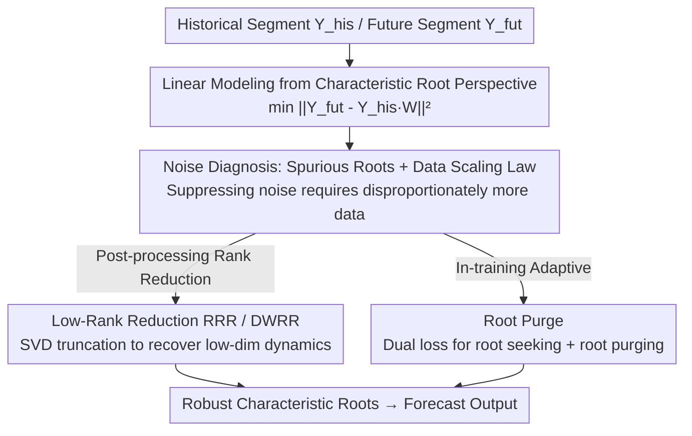

# Characteristic Root Analysis and Regularization for Linear Time Series Forecasting

**Conference**: ICLR 2026  
**OpenReview**: [https://openreview.net/forum?id=JTtwGRACte](https://openreview.net/forum?id=JTtwGRACte)  
**Code**: https://github.com/Wangzzzzzzzz/RootPurge  
**Area**: Time Series Forecasting / Linear Model Theory  
**Keywords**: Time series forecasting, characteristic roots, linear models, low-rank regularization, denoising

## TL;DR
This paper revisits linear time series forecasting models through the **characteristic root** theory of classical linear difference equations. It proves that noise leads models to learn "spurious roots" and that suppressing such noise requires disproportionately more data. Consequently, it proposes two types of "root reconstruction" regularization methods for the weight matrix—Reduced-Rank Reduction (RRR / DWRR) and an adaptive **Root Purge** training loss—pushing simple linear models to SOTA across multiple standard benchmarks.

## Background & Motivation
**Background**: The field of long-term time series forecasting has recently seen an influx of complex architectures (Transformers, CNNs, frequency-domain filtering, etc.). However, multiple studies (DLinear, FITS, SparseTSF) have repeatedly found that minimalist **linear models** can match or even outperform these heavy models on many datasets, while being more robust and interpretable.

**Limitations of Prior Work**: Although linear models perform impressively, there is a lack of systematic theoretical explanation for **why they work and when they fail**. The mathematical roles of "customary" engineering designs, such as instance normalization, channel independence, and long look-back windows, remain unclear. On noisy real-world data, linear models also tend to overfit noise, leading to degraded generalization.

**Key Challenge**: The solution of a linear model is entirely determined by its **characteristic roots**. A clean signal corresponds to a few "dominant roots," whereas observational noise induces the model to learn numerous **spurious roots**, distorting the characterization of true dynamics. Least-squares training converges extremely slowly under noise; suppressing noise influence requires an inhabitatntly large amount of data, leading to low data efficiency.

**Goal**: (1) Use characteristic roots as a "metric" to explain the capabilities, design choices, and noise behavior of linear time series models; (2) Use structural regularization to "purge" spurious roots and recover low-dimensional true dynamics without relying on massive data scaling.

**Key Insight**: Explicitly formulate time series forecasting as a linear difference equation $y_t + a_1 y_{t-1} + \cdots + a_p y_{t-p} = 0$, where the general solution is a combination of powers of characteristic roots $y_t = \sum_i C_i r_i^t$. Thus, "model performance" is equivalent to "accuracy of root identification," allowing forecasting, denoising, and regularization to be derived within this unified framework.

**Core Idea**: Integrate the **characteristic root/rank-nullity theorem** from classical linear system theory into modern learning loss functions. Use low-rank constraints or adaptive null-space learning to "reconstruct characteristic roots," preserving dominant signal roots while suppressing noise.

## Method

### Overall Architecture
The paper first establishes theory and then develops algorithms. The theoretical part analyzes characteristic roots in both **noise-free** and **noisy** scenarios. In the noise-free case, it proves that characteristic roots determine long-term behavior and naturally derives why engineering tricks like instance norm and channel independence are reasonable. In the noisy case, it reveals that models learn spurious roots and derives a "data scaling law"—the amount of data needed to suppress noise far exceeds intuition, necessitating **structural regularization rather than data scaling**.

Forecasting is formulated as least squares $\min_W \lVert Y_{fut} - Y_{his}W\rVert_F^2$, where $Y_{his}\in\mathbb{R}^{N\times L}$, $Y_{fut}\in\mathbb{R}^{N\times H}$, and weights $W\in\mathbb{R}^{L\times H}$. Under a clean signal, the rank of $Y_{his}$ is only $\min(L,K)$ ($K$ is the number of true roots), but with noise, the data matrix becomes almost surely full-rank—masking the low-rank structure. The algorithmic side focuses on two schemes for "reducing rank = purging spurious roots."

### Key Designs

**1. Characteristic Roots as a Unified Metric: Explaining Linear Model Efficacy**

The paper strictly characterizes "what a linear model can fit" using roots. **Fact 1** states: A linear model can represent any time series whose characteristic roots are a subset of its own root set—implying generalization comes from "selecting the right roots" rather than complex parameterization. **Fact 2** further states: Extending the forecast horizon or look-back window $L$ results in a root set that **always retains the roots dominating the true dynamics as a subset**. These points justify two common practices: modeling each prediction step independently ($H$ regression problems) is reasonable as high-horizon models remain consistent with true dynamics; increasing look-back windows does not change the root set, but introduces redundant flexibility in parameterization. In this framework, **instance normalization is equivalent to introducing a unit root** $r=1$, allowing generalization to arbitrary mean shifts; **channel independence** remains effective if the model's degrees of freedom cover the union of all channel roots. This transforms "empirical tricks" into derivable conclusions.

**2. Data Scaling Law under Noise: Why Regularization is Necessary**

Expanding the loss under noise, $\mathbb{E}\big[\lVert(y^*_{fut}-W^\top y^*_{his})+(\varepsilon_{fut}-W^\top\varepsilon_{his})\rVert_2^2\big]$, decomposes into "signal fitting error + noise-induced error." Even if weights perfectly recover signal dynamics, the noise term $\mathbb{E}[\lVert\varepsilon_{fut}-W^\top\varepsilon_{his}\rVert_2^2]$ persists. **Proposition 1** provides a key conclusion: For linear prediction with zero-mean, finite second-moment noise, learned weights converge at a rate of $O(1/\sqrt{T})$ ($T$ is sequence length). This **sublinear** rate means least squares, while unbiased and consistent, converges extremely slowly under high noise. Obtaining low-variance estimates requires disproportionately more data—the "data scaling law." This implies that instead of endless data scaling, **imposing structural constraints** on the model to actively suppress noise is more effective.

**3. Low-Rank Reduction (RRR / DWRR): Truncating Spurious Roots via SVD**

Since noise turns low-rank data matrices into full-rank ones, low-rank constraints are imposed on $W$. **Proposition 2** proves that constraining $W$ to be low-rank is equivalent to implicitly projecting $Y_{his}$ and $Y_{fut}$ into a low-dimensional subspace. A low-rank $W$ acts as a bottleneck, aligning input-output pairs to shared directions of maximum variance and filtering noise components, thus avoiding direct SVD on raw sequences. Two algorithms are implemented: **RRR (Reduced-Rank Regression)** first computes the OLS solution $W_{OLS}=(Y_{his}^\top Y_{his})^{-1}Y_{his}^\top Y_{fut}$, performs truncated SVD on the prediction $\hat Y_{fut}=Y_{his}W_{OLS}$ with rank $\rho$, and projects weights $W_{RRR}=W_{OLS}V_\rho V_\rho^\top$. **DWRR (Direct Weight Rank Reduction)** is more direct, performing SVD truncation on $W_{OLS}$ itself as $W_{DWRR}=U_\rho\Sigma_\rho V_\rho^\top$. Both use rank as a "dial" for root retention, significantly improving generalization when the true process is low-rank.

**4. Root Purge: In-training Adaptive Null-space Learning**

Low-rank reduction is a post-processing rule-based approach relying on accurate rank estimation, which may not hold in practice. Root Purge proposes an **integrated training loss** (Eq. 3):

$$\min_W \underbrace{\lVert Y_{fut}-G_W(Y_{his})\rVert_F^2}_{\text{Root Seeking}} + \lambda\underbrace{\lVert G_W\circ P\,(Y_{fut}-G_W(Y_{his}))\rVert_F^2}_{\text{Root Purging}}$$

where $G_W$ is the linear transformation defined by $W$, and $P$ handles cropping/padding for dimension consistency. The **Root Seeking term** is the standard error. The **Root Purging term** is a regularizer based on a simple but powerful idea: when the input is zero-mean pure noise, the model output should be zero. It functions in two steps: first, use the residual between prediction and ground truth to **estimate noise**, then **re-apply the model to this residual** to see if it falls into the transformation's null space. If the residual is noise and the null space is correctly learned, the output approaches zero. While the purging term cannot vanish (noise is typically full-rank), minimizing it drives the model to distinguish signal from noise and discover low-rank structures aligned with true dynamics.

This mechanism is deeply linked to low-rank reduction via the **rank-nullity theorem**: expanding the null space necessarily reduces rank. Trading off these forces allows **adaptive adjustment of model capacity**. Root Purge is also **domain-agnostic**: $G_W$ can be defined in the time domain ($W_T$) or frequency domain ($\mathcal{F}^{-1}\circ W_F\circ\mathcal{F}$), the latter being particularly suitable for periodic/oscillatory signals.

### Loss & Training
The core training objective is the dual "Root Seeking + $\lambda \cdot$ Root Purging" loss from Eq. (3), with $\lambda$ selected from $\{0.125, 0.25, 0.5\}$. Dimensionality handling: if $H < L$, the output is zero-padded to length $L$ and $\lambda$ is scaled by $L/H$; if $H \ge L$, it is cropped to the first $L$ columns and $\lambda$ remains constant. To save memory, a stop-gradient is applied to $P(\cdot)$. The rank $\rho$ for RRR is tuned on the validation set.

## Key Experimental Results

### Main Results
Datasets include Traffic, Electricity, Weather, Exchange, and ETT. Since the focus is on data scaling properties, the main text emphasizes smaller datasets like ETT, Exchange, and Weather. Baselines span three categories: Transformers (FEDformer, PatchTST), CNNs (TimesNet, TSLANet, FilterNet), and Linear (FITS, SparseTSF, DLinear). Look-back window $L=720$, horizon $H \in \{96, 192, 336, 720\}$. Table shows MSE (lower is better):

| Dataset | H | DLinear | PatchTST | FITS | SparseTSF | RRR | Root Purge |
|--------|-----|---------|----------|------|-----------|------|------------|
| ETTh1 | 96 | 0.384 | 0.385 | 0.379 | 0.362 | 0.367 | **0.359** |
| ETTh1 | 192 | 0.443 | 0.413 | 0.414 | 0.403 | 0.401 | **0.394** |
| ETTh1 | 336 | 0.446 | 0.440 | 0.435 | 0.434 | 0.430 | **0.423** |
| ETTh1 | 720 | 0.504 | 0.456 | 0.431 | 0.426 | 0.425 | **0.421** |
| ETTh2 | 96 | 0.282 | 0.274 | 0.272 | 0.294 | **0.268** | **0.268** |
| ETTh2 | 192 | 0.350 | 0.338 | 0.331 | 0.339 | 0.329 | **0.328** |

RRR and Root Purge consistently outperform all baselines across horizons. RRR outperforms fine-tuned methods without heavy hyperparameter tuning. Root Purge further pushes the performance ceiling of linear time series forecasting while remaining efficient. Both are **especially effective on small datasets**, confirming the theoretical prediction that models relying purely on data scaling suffer when data is scarce.

### Ablation Study
The paper validates theoretical properties across three dimensions:

| Validation Dimension | Phenomenon | Explanation |
|----------|------|------|
| Singular Value Contraction | Regularization suppresses small singular values of $W$ | Confirms Prop. 2: Low-rank projection occurs |
| Data Scaling | Data volume required for same accuracy decreases | Mitigates the $O(1/\sqrt T)$ slow convergence in Prop. 1 |
| Root Reconstruction | Spurious roots suppressed, dominant roots retained | Validates the root set theory of Fact 1/2 |

### Key Findings
- **Highest Gains on Small Data**: On smaller datasets like ETT/Exchange/Weather, structural regularization advantages are most pronounced. This aligns with the data scaling law: least squares eventually converges with massive data, while small data relies on regularization to suppress noise.
- **Frequency Domain Root Purge for Periodic Signals**: Defining $G_W$ in the frequency domain is equivalent to frequency-domain linear filtering, which fits periodic/oscillatory sequences better.
- **Rank-Nullity Self-Regulation**: Root Purge does not require manual rank specification. The tug-of-war between root seeking and root purging automatically finds the appropriate capacity.

## Highlights & Insights
- **Theoreticalizing "Voodoo Tricks"**: Perspectives like instance norm = unit root and channel independence = covering root unions provide a clean, transferable way to analyze other linear time series designs.
- **"Spurious Roots + Data Scaling Law" Diagnosis**: By quantifying the $O(1/\sqrt T)$ slow convergence, the paper explains *why* regularization is needed as a provable conclusion rather than an empirical observation.
- **"Mirroring" Regularization in Root Purge**: Using a model to learn its own null space by applying it to its own residuals is a minimalist but powerful idea that bridges to low-rank regression via the rank-nullity theorem.

## Limitations & Future Work
- **Theory focused on single-channel, distinct roots**: The general solution assumes distinct roots; cases with repeated roots, non-homogeneous, or strong non-linear dynamics require further treatment. Multi-channel relies on the channel independence approximation.
- **Inability to completely eliminate noise in Root Purge**: Noise spans a full-rank space; the purging term can only be minimized, not zeroed, and performance depends on $\lambda$ and data noise structure.
- **Main results skewed toward small-scale data**: Traffic and Electricity results are in the appendix; the performance ceiling for purely linear frameworks in ultra-large-scale, highly non-linear scenarios remains an open question.

## Related Work & Insights
- **vs DLinear / SparseTSF / FITS**: While those proved simple linear models can beat Transformers empirically, this paper explains **why** using root theory and adds root reconstruction regularization to push performance further.
- **vs Reduced-Rank Regression (Classic Stats)**: RRR is a classic method, but this paper reinterprets it within a time series root framework (low rank = filtering spurious roots) and introduces DWRR as a more direct weight-truncation variant.
- **vs Heavy Models (PatchTST / TimesNet)**: On small data, the proposed simple linear + regularization approach achieves comparable or better MSE with significantly lower complexity, echoing that theoretical structural priors are more efficient in specific scenarios.

## Rating
- Novelty: ⭐⭐⭐⭐⭐ Unique perspective using classical root/rank-nullity theory to explain and improve linear time series models.
- Experimental Thoroughness: ⭐⭐⭐⭐ Solid cross-horizon comparison and theoretical validation, though main results favor smaller datasets.
- Writing Quality: ⭐⭐⭐⭐⭐ Clear logical chain; Figure 1 roadmap organizes propositions effectively.
- Value: ⭐⭐⭐⭐ Provides provable explanations and plug-and-play regularization for linear forecasting, highly useful for interpretable and data-efficient forecasting.

<!-- RELATED:START -->

## Related Papers

- [\[ICLR 2026\] TimeSliver: Symbolic-Linear Decomposition for Explainable Time Series Classification](timesliver_symbolic-linear_decomposition_for_explainable_time_series_classificat.md)
- [\[ICLR 2026\] Multi-Scale Hypergraph Meets LLMs: Aligning Large Language Models for Time Series Analysis](multi-scale_hypergraph_meets_llms_aligning_large_language_models_for_time_series.md)
- [\[AAAI 2026\] FreqCycle: A Multi-Scale Time-Frequency Analysis Method for Time Series Forecasting](../../AAAI2026/time_series/freqcycle_a_multi-scale_time-frequency_analysis_method_for_time_series_forecasti.md)
- [\[ICLR 2026\] Reasoning on Time-Series for Financial Technical Analysis](reasoning_on_time-series_for_financial_technical_analysis.md)
- [\[ICLR 2026\] Weight-Space Linear Recurrent Neural Networks](weight-space_linear_recurrent_neural_networks.md)

<!-- RELATED:END -->
