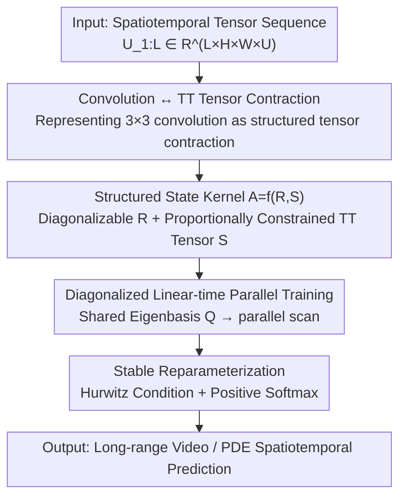

# ConvT3: Structured State Kernels for Convolutional State Space Models

**Conference**: ICLR 2026  
**OpenReview**: [https://openreview.net/forum?id=w7csRoB5CO](https://openreview.net/forum?id=w7csRoB5CO)  
**Code**: https://github.com/voltwin-dev/ConvT3 (Available)  
**Area**: Time Series / Dynamical Systems / State Space Models  
**Keywords**: Convolutional State Space Models, Tridiagonal Toeplitz Tensors, 3×3 State Kernels, Parallel Scan, Spatiotemporal Modeling

## TL;DR
ConvT3 extends the state kernel in Convolutional State Space Models (ConvSSM), previously forced to degenerate into $1\times1$, to an equivalent $3\times3$ convolution. This is achieved by constructing the state tensor using a "diagonalizable SSM matrix + proportionally constrained tridiagonal Toeplitz tensor," enabling stronger spatial modeling capabilities while maintaining linear-time parallel scan trainability. It achieves SOTA on long-range video generation (Moving-MNIST) and physical system (PDEBench) modeling, with more stable training than ConvS5.

## Background & Motivation

**Background**: Spatiotemporal sequence modeling (video prediction, physical system simulation, weather forecasting) requires simultaneously characterizing intra-frame spatial correlations and long-range dependencies across time. Mainstream approaches include three categories: ConvRNNs (e.g., ConvLSTM), which use tensor-valued hidden states + convolutional updates to capture spatial structure; Transformers, which use attention for global dependencies; and recent State Space Models (SSMs, e.g., S4/S5), which treat sequence modeling as a linear-time, long-range memory-friendly recurrence. Among these, ConvSSM (ConvS5) combines the "tensor-valued state" of ConvRNNs with the "linear-time scanning" of SSMs, theoretically offering both spatial expressivity and linear complexity.

**Limitations of Prior Work**: While ConvSSM conceptually allows arbitrary sizes for the state, input, output, and feedforward kernels, its practical implementation, ConvS5, must **restrict the state kernel $A$ to pointwise $1\times1$ convolutions**. This is because the binary associative operator $\circ$ in the parallel scan causes the convolution kernel to "grow" continuously during scanning—larger state kernels would lead to computational explosions during long sequence scans, forcing the degeneration to $1\times1$.

**Key Challenge**: A $1\times1$ state kernel implies that the state evolution itself contains almost no spatial interaction, shifting the burden of spatial modeling to the $B, C, D$ kernels and deeper layer stacking, which fundamentally weakens state dynamics. This creates a dilemma: **desiring larger state kernels to enhance spatial dynamics while avoiding the destruction of the "non-growing/diagonalizable" structure required for parallel scanning**.

**Goal**: To enable ConvSSM to utilize true $3\times3$ state kernels without sacrificing linear-time parallel training, while ensuring numerical training stability.

**Key Insight**: The authors observe that convolution is essentially a linear, shift-invariant operator, which can be rewritten as a contraction with **structured tensors**: 1D corresponds to Toeplitz matrices, and higher dimensions correspond to Toeplitz tensors. A $3\times3$ convolution corresponds exactly to a **Tridiagonal Toeplitz (TT) tensor**. Tridiagonal Toeplitz matrices possess a famous closed-form eigendecomposition—given the upper, lower, and diagonal values, the eigenvalues and eigenvectors can be computed analytically—and TT matrices with the same off-diagonal proportions share the same eigenbasis. This provides an opportunity for "large kernels that are also diagonalizable for parallelism."

**Core Idea**: Construct the state tensor $A$ using a "diagonalizable SSM matrix $R$ (handling hidden dimensions) + a Proportionally constrained Tridiagonal Toeplitz tensor $S$ (handling spatial dimensions)." This makes $A$ mathematically equivalent to a ConvSSM with a $3\times3$ state kernel while remaining diagonalizable, allowing for linear-time parallel scanning—this is ConvT3 (ConvSSM using **T**ridiagonal **T**oeplitz **T**ensors).

## Method

### Overall Architecture

The objective of ConvT3 can be summarized as: **expanding the ConvSSM state kernel from $1\times1$ to $3\times3$ while retaining parallel trainability**. The pipeline operates as follows: first, it establishes the mathematical equivalence "$3\times3$ convolution = tensor contraction with a TT tensor," shifting the problem from "convolutions" to "structured tensors." Then, it uses a construction rule $A:=f(R,S)$ to assemble the state tensor—$R$ is a diagonalizable SSM matrix in the hidden dimension (following S5-style to ensure performance), and $S$ is a **Proportionally constrained Tridiagonal Toeplitz (PTT) tensor** in the spatial dimensions. Since both are diagonalizable and the spatial slices share an eigenbasis, the total state tensor $A$ can be diagonalized by a unified set of bases $Q=Q_P\otimes Q_H\otimes Q_W$. Consequently, after discretization, linear-time parallel scanning can be applied directly. Finally, a reparameterization scheme is used to constrain the state tensor within a numerically stable region. The continuous-time form is:

$$X'(t) = A\,X(t) + B\,U(t),\qquad Y(t) = C\,X(t) + D\,U(t),$$

where the state tensor $X(t)\in\mathbb{C}^{H\times W\times P}$ is tensor-valued ($H,W$ are spatial dimensions, $P$ is the hidden state dimension), and the kernels act via tensor contraction.

### Key Designs

**1. Convolution ↔ Tridiagonal Toeplitz Tensor Contraction: Translating "Large Kernels" to "Structured Tensors"**

Directly using $3\times3$ convolutions in a parallel scan causes kernel growth and computational explosion, which is why ConvS5 degenerates to $1\times1$. ConvT3 bypasses this by changing the mathematical representation: since convolution is linear and shift-invariant, it can be written as a contraction with a Toeplitz-structured tensor. For a $3\times3$ kernel $K\in\mathbb{C}^{D_o\times D_i\times 3\times 3}$, the 2D convolution $K * V$ is equivalent to a contraction $\mathcal{K}V$ with a tridiagonal Toeplitz tensor $\mathcal{K}$ (acting like matrix multiplication across $D_i, N_1, N_2$ dimensions). The "tridiagonal" property corresponds exactly to the kernel size of 3—non-zero entries only fall on the $|i-j|\le1$ bands. This step paves the way for using the closed-form eigendecomposition of TT matrices: a TT matrix $T=\mathrm{tridiag}(l_T,d_T,u_T)$ has eigenvalues $\lambda_i = d_T + 2\sqrt{l_T u_T}\cos\!\big(\tfrac{i\pi}{N+1}\big)$, and **TT matrices with the same off-diagonal ratio share the same eigenbasis**—a key pivot for "unified diagonalization."

**2. Structured State Kernel $A=f(R,S)$: Diagonalizable SSM Matrix ⊕ Proportionally Constrained TT Tensor**

The goal is to create a state kernel larger than $1\times1$ that remains diagonalizable. ConvT3 constructs the state tensor $A$ by combining two parts: $A:=f(R,S)$, where $R\in\mathbb{C}^{P\times P}$ is a **diagonalizable SSM matrix** in the hidden dimension, and $S\in\mathbb{C}^{P\times P\times H\times H\times W\times W}$ is a **Proportionally constrained Tridiagonal Toeplitz (PTT) tensor** in the spatial dimensions. The "proportional constraint" implies that for some non-zero ratios $\alpha_H, \alpha_W$, the lower and upper triangular terms satisfy $l_S=\alpha_H u_S$ (along height) and $l_S=\alpha_W u_S$ (along width), with the additional requirement that $S$ is diagonal along the hidden $P\times P$ dimension. These constraints ensure that the spatial slices of $S$ share eigenbases $Q_H, Q_W$ uniquely determined by $\alpha_H, \alpha_W$. Given $R=Q_P\Lambda Q_P^{-1}$, the combination rule:

$$f\big(R_{(Q_P,\Lambda)},\,S_{(Q_H,Q_W,E)}\big)=(Q_P\otimes Q_H\otimes Q_W)\big[(\Lambda\otimes I_H\otimes I_W)\odot E\big](Q_P\otimes Q_H\otimes Q_W)^{-1}$$

results in an $A$ that maintains the PTT structure. The paper further proves (Theorem 1) that $A$ constructed this way is equivalent to a ConvSSM with a $3\times3$ state kernel.

**3. Linear-time Parallel Training: Regaining Complexity via Unified Eigenbases**

Once a diagonalizable state tensor is established, Theorem 2 provides the diagonal form: letting $Q:=Q_P\otimes Q_H\otimes Q_W$, the system transforms via $X_T(t)=Q^{-1}X(t)$ into:

$$X_T'(t)=A_T X_T(t)+B_T U(t),\quad Y(t) = C_T X_T(t)+D\,U(t),$$

where $A_T=(\Lambda\otimes I_H\otimes I_W)\odot E$ is **diagonal**. Since $A_T$ is diagonal, the parallel scan with binary associative operators can be used after discretization, maintaining linear complexity with respect to sequence length. In practice, the transform $Q_P$ for the hidden dimension is often omitted; the state is assumed to be trained in diagonal form (similar to diagonal SSMs), and applying $Q_P$ to $B, C$ would be inefficient. Thus, the effective transforms are only the spatial parts $Q_H\otimes Q_W$, applied before and after the scan.

**4. Stability-oriented Reparameterization: Hurwitz Condition + Positive Softmax**

ConvS5 often suffers from loss spikes during training. ConvT3 addresses this via parameterization. Stability in continuous SSMs is guaranteed by the Hurwitz condition—the real parts of the diagonalized state matrix must be negative. Conventionally, this requires: (1) $\mathrm{Re}\{\Lambda\}$ (eigenvalues of $R$) to be negative; (2) $E$ (eigenvalues of $S$) to be strictly positive. The **Hurwitz condition** is enforced via $\mathrm{Re}\{\Lambda'\}=-\mathrm{softplus}(\mathrm{Re}\{\Lambda\})$. The **positivity condition** uses the Toeplitz eigenvalue formula $\epsilon(\theta_H,\theta_W)=a+b\cos\theta_H+c\cos\theta_W+d\cos\theta_H\cos\theta_W$, which is bilinear over $\cos\theta_H, \cos\theta_W \in (-1, 1)$. By enforcing positivity at the four extremal points $\epsilon_1,\dots,\epsilon_4$ via $\epsilon_i'=4\cdot\mathrm{softmax}(\epsilon_1,\dots,\epsilon_4)_i$, positivity is guaranteed globally.

## Key Experimental Results

### Main Results

**Long-range Video Generation (Moving-MNIST, generating 800/1200 frames from 100)**: Under the 600-frame training setting, ConvT3 achieves the best results across all metrics and prediction lengths.

| Setting | Metric | ConvT3 | ConvS5 (Prev. SOTA) | Gain |
|------|------|--------|--------------------|------|
| 600-frame train, 100→800 | FVD ↓ | **36** | 47 | +11 |
| 600-frame train, 100→800 | SSIM ↑ | **0.823** | 0.788 | +0.035 |
| 600-frame train, 100→1200 | FVD ↓ | **56** | 71 | +15 |
| 600-frame train, 100→1200 | SSIM ↑ | **0.795** | 0.763 | +0.032 |

**Physical System Modeling (PDEBench: Shallow-Water + Diffusion-Reaction, NRMSE)**:

| Model | #Params | Shallow-Water NRMSE ↓ | Diffusion-Reaction NRMSE ↓ | Inference Time |
|------|---------|-----------------------|----------------------------|----------|
| AViT-B | 116M | 0.00047 | 0.0110 | - |
| AViT-Ti | 7M | 0.00053 | 0.0090 | 2.74 (2.06×) |
| ConvS5 | 6M | 0.00035 | 0.0106 | 1.33 (1.00×) |
| ConvT3 | 6M | **0.00033** | **0.0087** | 1.51 (1.14×) |

ConvT3 achieves the best accuracy across datasets with fewer parameters than large baselines and remains efficient compared to ConvS5 (1.14×). Stability experiments show that ConvS5 loss curves often spike, whereas ConvT3 remains smooth across multiple seeds.

### Ablation Study

| Config | Key Metric | Description |
|------|---------|------|
| ConvS5 | MSE 11.57 / MAE 23.25 | Baseline ($1\times1$ state kernel) |
| MiniT3 (+24 params) | MSE 10.87 / MAE 21.64 | Shared kernel slices, only 3 extra params per layer |
| $\alpha=1$ symmetric | MSE 10.97 | Symmetric off-diagonal ratio |
| $\alpha=-1$ anti-symmetric | MSE 10.99 | Performance similar to symmetric |

### Key Findings
- **Performance comes from structure, not parameter count**: MiniT3 outperforms ConvS5 with only 24 extra parameters, proving that the $3\times3$ structured state kernel itself drives the gain.
- **Insensitivity to off-diagonal ratio**: Results for symmetric ($\alpha=1$) and anti-symmetric ($\alpha=-1$) ratios are nearly identical, suggesting $\alpha$ can be fixed without fine-tuning.
- **Maximum gain when spatial modeling is lacking**: ConvT3 shows the largest advantage over ConvS5 when $B$ or $C$ kernels are restricted to $1\times1$, directly addressing the lack of spatial dynamics in the state.

## Highlights & Insights
- **Reconciling "Large Kernels" and "Parallelism" via Spectral Decomposition**: By leveraging the "shared eigenbasis" of tridiagonal Toeplitz matrices, ConvT3 allows a $3\times3$ state kernel to remain diagonalizable, bypassing the ConvS5 bottleneck.
- **Stability by Parameterization**: The combination of Hurwitz conditions and positive softmax ensures spectral stability throughout training, which is more robust than heuristic clipping or learning rate adjustments.
- **Dimension-agnostic Generalization**: The PTT structure and parallel scanning mechanism only depend on the tridiagonal nature along each spatial axis, naturally extending to $N$-dimensional convolutions.
- **Clean "Structure vs. Parameter" Ablation**: The success of MiniT3 (+24 parameters) provides a convincing argument that the mathematical structure—not parameterization—is the primary driver of performance.

## Limitations & Future Work
- **State kernel size limited to $3\times3$**: The construction relies on tridiagonal Toeplitz tensors. Higher-order kernels (e.g., $5\times5$) would require pentadiagonal Toeplitz structures, and it is unclear if equally elegant closed-form solutions exist.
- **Hidden dimension $Q_P$ approximation**: Omitting the hidden dimension transform for efficiency assumes a diagonalized state, an approximation that may warrant further analysis in extreme cases.
- **Benchmarks focus on structured grids**: Experiments are mostly on Moving-MNIST and regular-grid PDEs; performance on complex real-world videos or unstructured physical fields remains unverified.
- **Fixed ratio $\alpha$**: While results are robust, fixing $\alpha$ imposes a certain symmetry on the spatial kernel, potentially limiting expressivity in specific tasks.

## Related Work & Insights
- **vs. ConvS5 (Smith et al. 2023)**: Directly upgrades ConvS5 by expanding the state kernel from $1\times1$ to $3\times3$ using PTT tensors and resolving training divergence issues.
- **vs. ConvRNN / PredRNN**: Replaces serial recurrence with linear-time parallel scanning while maintaining the "tensor-valued state" spatial expressivity.
- **vs. Transformer / TECO**: Offers better long-range consistency at a lower computational cost on Moving-MNIST by avoiding the quadratic complexity of attention.
- **vs. S4ND (Nguyen et al. 2022)**: While both extend SSMs to multi-dimensional signals, ConvT3 specifically focuses on structured $3\times3$ kernels and stability guarantees.

## Rating
- Novelty: ⭐⭐⭐⭐⭐ Elegant use of tridiagonal Toeplitz spectral properties to liberate ConvSSM from $1\times1$ kernels.
- Experimental Thoroughness: ⭐⭐⭐⭐ Strong results on video and PDE tasks with clean ablations; would benefit from more diversified real-world benchmarks.
- Writing Quality: ⭐⭐⭐⭐ Clear derivations and chain of reasoning; high mathematical barrier due to heavy tensor notation.
- Value: ⭐⭐⭐⭐ Provides a practical path for expanding state kernels in ConvSSMs without losing stability or parallelism.

<!-- RELATED:START -->

## Related Papers

- [\[ICLR 2026\] Learning Linear State-Space Models with Sparse System Matrices](learning_linear_state-space_models_with_sparse_system_matrices.md)
- [\[NeurIPS 2025\] Structured Sparse Transition Matrices to Enable State Tracking in State-Space Models](../../NeurIPS2025/time_series/structured_sparse_transition_matrices_to_enable_state_tracking_in_state-space_mo.md)
- [\[ICML 2026\] HiPPO Zoo: Explicit Memory Mechanisms for Interpretable State Space Models](../../ICML2026/time_series/hippo_zoo_explicit_memory_mechanisms_for_interpretable_state_space_models.md)
- [\[ICML 2026\] Learning Long Range Spatio-Temporal Representations over Continuous Time Dynamic Graphs with State Space Models](../../ICML2026/time_series/learning_long_range_spatio-temporal_representations_over_continuous_time_dynamic.md)
- [\[NeurIPS 2025\] RiverMamba: A State Space Model for Global River Discharge and Flood Forecasting](../../NeurIPS2025/time_series/rivermamba_a_state_space_model_for_global_river_discharge_and_flood_forecasting.md)

<!-- RELATED:END -->
