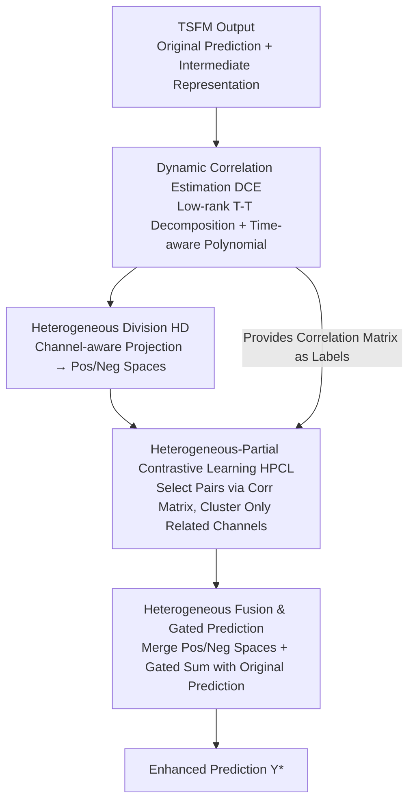

# CoRA: Boosting Time Series Foundation Models for Multivariate Forecasting through Correlation-aware Adapter

**Conference**: ICLR2026  
**OpenReview**: [https://openreview.net/forum?id=JRlNrcTllN](https://openreview.net/forum?id=JRlNrcTllN)  
**Code**: https://github.com/decisionintelligence/CoRA  
**Area**: Time Series / Time Series Foundation Models / Multivariate Forecasting  
**Keywords**: Time Series Foundation Models, Channel Correlation, Plug-and-play Adapter, Contrastive Learning, Low-rank Decomposition

## TL;DR
CoRA is a lightweight plug-and-play adapter that enables "channel-independent" Time Series Foundation Models (TSFMs)—which typically ignore inter-channel correlations—to simultaneously learn dynamic, heterogeneous (positive/negative), and partial (existing only between specific channels) correlations during downstream fine-tuning. It significantly improves multivariate forecasting accuracy across 10 real-world datasets in few-shot settings (using only 5% of samples) while introducing only linear complexity overhead during inference.

## Background & Motivation
**Background**: Time Series Foundation Models (TSFM) have emerged rapidly, either by repurposing Large Language Models (e.g., GPT4TS, CALF, Time-LLM) or through large-scale pre-training on multi-domain time series data (e.g., Moment, Chronos, Timer, TimesFM). These models demonstrate strong generalization and zero/few-shot forecasting capabilities. however, most TSFMs adopt **channel-independent** modeling—treating each variable (channel) as an individual sequence to focus on capturing temporal dependencies.

**Limitations of Prior Work**: In multivariate forecasting, correlations between channels are crucial. The authors categorize these into three complementary aspects: ① **Dynamic Correlation (DCorr)**—channel relationships drift over time (e.g., different coupling strengths at morning vs. night); ② **Heterogeneous Correlation (HCorr)**—channels exhibit both positive and negative correlations; ③ **Partial Correlation (PCorr)**—correlations exist only between specific channels, and indiscriminate interaction across all channels introduces noise. Existing TSFMs either ignore channel relationships entirely or use fixed-weight MLPs to mix all channels (e.g., TTM), which cannot model DCorr (fixed weights) or express HCorr and PCorr effectively.

**Key Challenge**: It is difficult to simultaneously achieve "comprehensive modeling" and "lightweight design" for these three correlations. While many methods handle DCorr, HCorr, or PCorr individually, few cover all three. Common channel interaction mechanisms (MLP / Transformer / GNN) typically have $O(N^2)$ complexity relative to the number of channels $N$. Furthermore, existing correlation "plugins" are mostly designed for end-to-end models: Crossformer requires restructuring the network, CCM requires additional pre-training, and C-LoRA must be trained from scratch with the backbone—none serve as a specialized plug-and-play plugin for TSFM downstream fine-tuning.

**Goal**: Design a plugin that can be trained alongside a TSFM during the fine-tuning stage. It must bypass the issue where pre-training fails to learn universal correlations (due to high inter-dataset variance), characterize all three correlation types, and remain sufficiently lightweight.

**Key Insight**: The authors observed that TSFM fine-tuning already generates two key outputs: the original prediction $\hat{Y}^{ft}_t$ and the intermediate representation $\tilde{X}^{ft}_t$. Instead of modifying the backbone, it is more efficient to "take over" these outputs and add an external small module to learn correlations, subsequently fusing the enhanced prediction with the original one.

**Core Idea**: Use a lightweight adapter that decomposes the correlation matrix into "time-varying + time-invariant" parts for low-cost DCorr representation, followed by dual-branch contrastive learning to extract HCorr and PCorr. The TSFM is never re-pre-trained, and the system maintains linear complexity during inference.

## Method

### Overall Architecture
CoRA is attached externally to the TSFM: inputs include the original multivariate sequence $X_t \in \mathbb{R}^{N\times L}$, the TSFM's original prediction $\hat{Y}_t$, and the intermediate representation $\tilde{X}_t$; the output is the fused enhanced prediction $\hat{Y}^*_t$. The pipeline consists of four steps: (i) **Dynamic Correlation Estimation (DCE)** learns a time-varying correlation matrix $M^{corr}_t$ from representations and input sequences to serve as "labels" for subsequent contrastive learning; (ii) **Heterogeneous Division (HD)** uses a channel-aware projector to map backbone representations into "positive" and "negative" correlation spaces; (iii) **Heterogeneous-Partial Contrastive Learning (HPCL)** clusters only truly correlated channels within each space to capture PCorr; (iv) **Heterogeneous Fusion & Prediction** merges representations from both spaces to generate new predictions, combined with the original via gating. DCE and HPCL only run during training ($O(N^2)$), while only HD is retained during inference, reducing complexity to $O(N)$.

### Key Designs

**1. Dynamic Correlation Estimation (DCE): Expressing drifting correlations via low-rank "time-varying + time-invariant" decomposition and learnable time-aware polynomials.**

This addresses the cost of explicitly modeling time-varying DCorr. Instead of using large additive decompositions, CoRA employs **multiplicative low-rank decomposition**: the learnable part is formulated as $Q_t V Q_t^\top$, where $Q_t \in \mathbb{R}^{N\times M}$ is the time-varying component, $V\in\mathbb{R}^{M\times M}$ is time-invariant, with rank $M < N$. Adding a Pearson coefficient-based prior $R$, the final matrix is:

$$M^{corr}_t = R + Q_t V Q_t^\top .$$

The time-invariant component $V = \mathrm{Sigmoid}(\mathrm{ReLU}(E_1 E_2^\top))$ is constructed from global learnable vectors. The time-varying component is estimated using **learnable time-aware polynomials**, expressing fluctuations through a weighted sum of Hadamard powers of a global shared base $q$:

$$Q_t = \sum_{i=0}^{K} C_{i,t}\, q^i, \quad q^i = \underbrace{q\odot q\odot\cdots\odot q}_{i\ \text{times}} ,$$

where coefficients $C_t = f(\tilde{X}_t)$ are calculated via a simple MLP. Theorem 1 proves this multiplicative decomposition is functionally equivalent to conventional additive decomposition under local stationarity, and Theorem 2 proves the fitting error bound decreases as the polynomial degree $K$ increases.

**2. Heterogeneous Division (HD): Projecting representations into positive/negative spaces with channel-contributed adaptive weighting.**

This addresses the mixing of positive/negative correlations. CoRA uses a **channel-aware projection layer** $P$: it applies LayerNorm + MLP to the input to get $\tilde{X}^{proj}_t$, computes patch-level channel attention $A_t$ via softmax, aggregates cross-channel context $\tilde{X}^{ctx}_t = A_t^\top \tilde{X}^{proj}_t$, and fuses it back to calculate adaptive weights $W_t$. Each channel's projection intensity is adjusted via $\tilde{X}^{out}_t = \tilde{X}^{in}_t + \tilde{X}^{fuse}_t \odot \mathrm{expand}(W_t)$. Two independent projections $P_1, P_2$ map representations into positive $\tilde{X}^{pos}_t$ and negative $\tilde{X}^{neg}_t$ spaces. HD provides the architectural branches for separation, which is then guided by contrastive learning.

**3. Heterogeneous-Partial Contrastive Learning (HPCL): Using the correlation matrix as supervision to cluster only truly correlated channels.**

This targets PCorr to avoid noise from indiscriminate interactions. $M^{corr}_t$ from DCE acts as a label: a learnable threshold $\epsilon$ splits the matrix into positive and negative sparse masks:

$$M^{pos}_t = \begin{cases} m^{corr}_t, & corr > \epsilon \\ 0, & \text{else}\end{cases}, \quad M^{neg}_t = \begin{cases} m^{corr}_t, & corr < -\epsilon \\ 0, & \text{else}\end{cases} .$$

In the positive space, channels $i,j$ are treated as positive pairs if $M^{pos}_t[i,j]\neq 0$. A contrastive loss with temperature $\tau$ pulls "truly correlated channels" together and pushes others apart:

$$\mathcal{L}_{pos} = -\frac{1}{N}\sum_{i=1}^{N}\log\frac{\sum_{j=1}^{N} M^{pos}_t[i,j]\exp(\mathrm{sim}(\tilde{X}^{pos}_t[i],\tilde{X}^{pos}_t[j])/\tau)}{\sum_{k=1}^{N}\exp(\mathrm{sim}(\tilde{X}^{pos}_t[i],\tilde{X}^{pos}_t[k])/\tau)} .$$

$\mathcal{L}_{neg}$ is derived similarly, with $\mathcal{L}_{aux}=\mathcal{L}_{pos}+\mathcal{L}_{neg}$. Since the thresholding naturally selects only relevant channels, PCorr is learned implicitly without additional inference overhead.

**4. Heterogeneous Fusion & Gated Prediction: Merging heterogeneous representations and using channel-level gating to balance CoRA and original TSFM outputs.**

Representations from heterogeneous spaces are re-projected via $P_3, P_4$, summed, and passed through a linear head. A learnable channel-level gating weight $\beta\in[0,1]^N$ performs a convex combination:

$$\hat{Y}^*_t = \beta\,\mathrm{Linear}(\tilde{X}^{pos}_t + \tilde{X}^{neg}_t) + (1-\beta)\hat{Y}_t .$$

This preserves the TSFM's strong generalization while adaptively injecting correlation info for channels that benefit from it.

### Loss & Training
Total Loss = Prediction Loss (MSE) + Contrastive Auxiliary Loss $\mathcal{L}_{aux}$. Training involves DCE and HPCL ($O(N^2)$), while inference only utilizes HD ($O(N)$). Lookback window $L$ is set to 576 for Timer and 512 for others. Evaluations use MSE and MAE on 5% few-shot fine-tuning settings.

## Key Experimental Results

### Main Results
On 10 real-world datasets and 6 backbones (GPT4TS, CALF, UniTime, Moment, Chronos, Timer, TTM), in 5% few-shot settings, CoRA consistently outperforms the base models:

| Dataset | GPT4TS | +CoRA | UniTime | +CoRA | Timer | +CoRA | TTM | +CoRA |
|---------|--------|-------|---------|-------|-------|-------|-----|-------|
| ETTh1 | 0.464 | **0.453** | 0.721 | **0.682** | 0.450 | **0.421** | 0.397 | **0.392** |
| ETTm1 | 0.387 | **0.369** | 0.405 | **0.381** | 0.443 | **0.426** | 0.358 | **0.352** |
| Electricity | 0.208 | **0.201** | 0.201 | **0.194** | 0.241 | **0.236** | 0.179 | **0.173** |
| Traffic | 0.441 | **0.431** | 0.456 | **0.446** | 0.456 | **0.447** | 0.485 | **0.436** |
| Solar | 0.256 | **0.245** | 0.253 | **0.248** | 0.217 | **0.213** | 0.219 | **0.197** |
| Weather | 0.254 | **0.245** | 0.255 | **0.244** | 0.241 | **0.237** | 0.226 | **0.222** |

Notably, when the Channel-Independent (CI) version of TTM is equipped with CoRA, it outperforms the native Channel-Dependent (CD) TTM, suggesting that explicit modeling of the three correlation types is more effective than naive channel mixing.

### Ablation Study
Incremental addition of modules (DCE, HD, HPCL) on ETTm2 and Electricity shows all components are necessary for optimal performance:

| Config | DCE | HD | HPCL | GPT4TS(ETTm2) | UniTime | Timer |
|------|-----|----|------|---------------|---------|-------|
| 1 (None/Naive) | | | | 0.274 | 0.272 | 0.277 |
| 2 | | | ✓ | 0.273 | 0.270 | 0.275 |
| 3 | ✓ | | ✓ | 0.271 | 0.268 | 0.274 |
| 4 | | ✓ | ✓ | 0.270 | 0.269 | 0.273 |
| 5 (Full) | ✓ | ✓ | ✓ | **0.268** | **0.262** | **0.257** |

### Key Findings
- **Synergy is King**: Contrastive learning (HPCL) alone provides limited gains; adding DCE or HD significantly improves results, and their combination is most effective, particularly for Timer (0.277 to 0.257).
- **Effective with Minimal Data**: CoRA maintains robust performance gains even with only 3% training data.
- **Negligible Inference Overhead**: As the number of channels increases from 7 to 321, CoRA's parameter count and inference time increments remain minimal because the $O(N^2)$ components are training-only.

## Highlights & Insights
- **The "Take over, don't modify" Paradigm**: CoRA leaves the TSFM backbone untouched and consumes its predictions and representations. This allows a single adapter design to be applied across 6 heterogeneous backbones with high transferability.
- **Smart Complexity Splitting**: By confining expensive correlation estimation and contrastive learning to the training phase, CoRA resolves the conflict between comprehensive modeling and lightweight requirements.
- **PCorr via Sample Selection**: Using thresholding in contrastive learning to implicitly model sparse interactions (PCorr) is more elegant than building independent prediction heads for clusters (as in CCM).
- **Multiplicative Low-rank Decomposition**: The $Q_t V Q_t^\top$ approach is a clean example of implementing structural priors (time-varying/invariant) in a parameter-efficient manner.

## Limitations & Future Work
- **Complexity Specification Nuances**: While HD is $O(N)$, the $Q_t V Q_t^\top$ term is technically $O(NM)$ where $M<N$. The main text is slightly brief on these details (refer to original Appendix B).
- **Modest Improvement Magnitude**: In several datasets, MSE improvements are in the 2nd or 3rd decimal place. While consistent, the single-point gain might be limited for scenarios requiring massive SOTA leaps.
- **Dependency on Intermediate Representations**: CoRA requires access to the TSFM's internal representations, making it potentially inapplicable to black-box TSFMs that only expose final predictions.

## Related Work & Insights
- **vs TTM**: TTM uses fixed MLPs for indiscriminate mixing; Ours uses time-varying polynomials (DCorr) and dual-branch contrastive learning (HCorr/PCorr).
- **vs CCM**: CCM requires clustering and redundant prediction heads with additional pre-training; CoRA is far more lightweight and designed for fine-tuning.
- **vs C-LoRA / LIFT**: These lack direct TSFM compatibility and may degrade performance in few-shot settings; CoRA leverages TSFM representations to ensure stability.
- **vs Crossformer**: Crossformer uses $O(N^2)$ all-to-all Transformer interactions and requires restructuring; CoRA is $O(N)$ at inference and plug-and-play.

## Rating
- Novelty: ⭐⭐⭐⭐ Integrating three correlation types into a lightweight adapter via low-rank multiplicative decomposition and dual contrastive learning is novel, though individual components have precedents.
- Experimental Thoroughness: ⭐⭐⭐⭐⭐ Comprehensive coverage across 10 datasets, 6 backbones, multiple data scales, and efficiency analyses.
- Writing Quality: ⭐⭐⭐⭐ Clear structure and motivation, though complexity descriptions and some notations are slightly loose.
- Value: ⭐⭐⭐⭐ Effectively fills the channel correlation gap for TSFMs with minimal inference cost, offering high practical utility.

<!-- RELATED:START -->

## Related Papers

- [\[ICLR 2026\] COSA: Context-aware Output-Space Adapter for Test-Time Adaptation in Time Series Forecasting](cosa_context-aware_output-space_adapter_for_test-time_adaptation_in_time_series_.md)
- [\[ICLR 2026\] CauKer: Classification Time Series Foundation Models Can Be Pretrained on Synthetic Data](cauker_classification_time_series_foundation_models_can_be_pretrained_on_synthet.md)
- [\[ICML 2026\] Time-series Forecasting Through the Lens of Dynamics](../../ICML2026/time_series/time-series_forecasting_through_the_lens_of_dynamics.md)
- [\[ICLR 2026\] Bridging Past and Future: Distribution-Aware Alignment for Time Series Forecasting](bridging_past_and_future_distribution-aware_alignment_for_time_series_forecastin.md)
- [\[ICLR 2026\] Context parroting: A simple but tough-to-beat baseline for foundation models in scientific machine learning](context_parroting_a_simple_but_tough-to-beat_baseline_for_foundation_models_in_s.md)

<!-- RELATED:END -->
