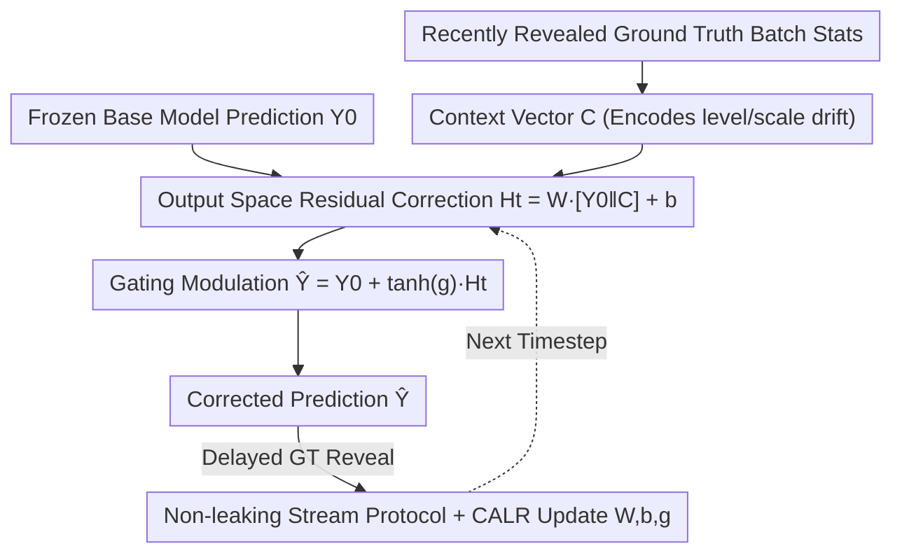

# COSA: Context-aware Output-Space Adapter for Test-Time Adaptation in Time Series Forecasting

**Conference**: ICLR2026  
**OpenReview**: [https://openreview.net/forum?id=L7Z5wBMPrW](https://openreview.net/forum?id=L7Z5wBMPrW)  
**Code**: https://github.com/bigbases/COSA_ICLR2026  
**Area**: Time Series Forecasting / Test-Time Adaptation / Distribution Shift  
**Keywords**: Test-Time Adaptation, Time Series Forecasting, Output-Space Residual, Gating, Adaptive Learning Rate

## TL;DR
COSA attaches a lightweight linear adapter that operates **exclusively in the output space** to a frozen time series forecasting model. It computes a residual using "base model predictions + recent ground truth statistics," constrained by a gating mechanism for calibration. During deployment, these few parameters are updated only on ground truth that arrives with a delay. This approach is much simpler than existing "input + output" dual-adapter schemes, yet it reduces MSE by 13.91–17.03% relative to non-TTA baselines and 10.48–13.05% relative to SOTA TTA methods across 6 datasets, while being 88–90% faster in inference.

## Background & Motivation
**Background**: While time series forecasting models (iTransformer, PatchTST, DLinear, etc.) achieve high accuracy on training distributions, real-world data is **non-stationary**, meaning statistical properties shift over time. Performance degrades when the deployment distribution differs from the training distribution. Solutions like online learning, continual learning, and domain adaptation either modify base model parameters (leading to extra computation, memory overhead, and catastrophic forgetting) or require labeled data and clear task boundaries, making them unsuitable for deployment scenarios with "unlabeled streaming data."

**Limitations of Prior Work**: Test-Time Adaptation (TTA) is a more lightweight approach where only small modules are updated using unlabeled test streams while the base model remains frozen. However, TTA has primarily evolved in computer vision (entropy minimization, pseudo-labeling, etc.). Time series forecasting has two unique characteristics compared to vision: ① It uses normalization methods that preserve periodicity/level information. ② **Once a prediction is made, the ground truth is observed after a short delay**, allowing for direct supervised losses like MSE. Existing time series TTA works (TAFAS, PETSA, DynaTTA) are scarce and **unanimously adopt "dual-adapter" architectures**: they place calibration modules at both the input and output ends of the base model to map inputs to a more manageable domain and then restore the output, using gating to control intensity.

**Key Challenge**: Dual-adapters provide **indirect** distribution calibration. Modifying the input makes it difficult to analyze or predict the resulting impact on the base model's internalized representations. Combined with the added design complexity of modules at both ends, the adaptation behavior becomes opaque and uncontrollable.

**Goal**: Is it possible to **directly correct predictions in the output space** without touching the input? This would bypass the difficult-to-analyze "input transformation -> internal representation" chain and compress the adapter to its simplest form, incurring almost zero extra inference overhead.

**Key Insight**: The authors leverage a critical convenience of time series TTA — **ground truth is revealed after a short delay**. Since ground truth becomes available, one can directly learn a "residual correction" in the output space using MSE, rather than indirectly adjusting distributions at the input end.

**Core Idea**: Replace dual-adapters with a **single output-space adapter**. It takes the base model prediction and a context vector summarizing recent ground truth statistics, passes them through a linear layer to calculate a residual, scales it via a gating constraint, and adds it back to the original prediction. During deployment, only the parameters $\{W, b, g\}$ are updated under a non-leaking protocol.

## Method

### Overall Architecture
The input to COSA is the $L$-step prediction $Y^{(0)}_t \in \mathbb{R}^L$ provided by a frozen base model at time $t$. The output is the corrected prediction $\hat{Y}_t \in \mathbb{R}^L$. A lightweight adapter operates **only in the output space**, without modifying any base model parameters or training procedures. The process pipeline involves: concatenating the base model prediction with a "context vector" → passing it through a linear layer to obtain residual $H_t$ → scaling the residual via gating $\tanh(g)$ → adding it back to the original prediction to get $\hat{Y}_t$. Once the ground truth for that segment is observed after a delay, the recent $B$ pairs of "prediction-ground truth" are collected to update only the adapter parameters $\{W, b, g\}$, while the base model remains frozen.

The authors chose a **single-layer linear** adapter over an MLP for two reasons: ① Efficiency — linear operations have low latency and high throughput (experimentally 34.95% faster than a 2-layer MLP). ② Simplicity-Performance Balance — following LTSF-Linear, linear layers are sufficiently powerful for time series; the single-layer adapter actually performed **5.71% better** on average than a 2-layer MLP.

### Key Designs

**1. Single Output-Space Residual Correction: Direct correction at the output to bypass indirect dual-adapter chains**

This addresses the "uncontrollable impact" of indirect calibration. Instead of modifying inputs, COSA learns an additive residual directly in the output space. Specifically, the base prediction $Y^{(0)}_t$ and context vector $C_t$ are concatenated as the adapter input $X^{(a)}_t = [Y^{(0)}_t \,\|\, C_t] \in \mathbb{R}^L+K$, and the residual is calculated as:

$$H_t = W X^{(a)}_t + b,$$

where $W \in \mathbb{R}^{L \times (L+K)}$ and $b \in \mathbb{R}^L$. The final result is the original prediction plus the scaled residual. This makes adaptation behavior **predictable**, and because it adds only one linear layer at the output, inference overhead is nearly zero, with a complexity of only $O(L\cdot(L+K))$. It is plug-and-play for any base model and remains compatible and stable with normalizers (RevIN, DDN).

**2. Context Vector: Encoding level/scale drift using recently revealed ground truth statistics**

Without additional info, the adapter cannot judge if the current prediction is too high or low relative to the true level. COSA constructs a lightweight context vector $C_t$ to summarize **recently revealed ground truth** statistics, signaling current level/scale shifts to the linear layer. It aggregates values by batch:

$$\mu_t = \mathrm{agg}\big(\{y^{\text{true}}_{t-(kB)+i} : 1 \le i \le B\}\big),\quad 1 \le k \le K,$$

Defaulting to the mean (or median), it stacks the $K$ most recent aggregated values into $C_t = [\mu_1, \mu_2, \ldots, \mu_K]^\top \in \mathbb{R}^K$. This vector captures level/scale changes and slow drifts. It **only uses revealed ground truth**, preventing information leakage. Accuracy improves as $K$ increases, and since $L$ typically dominates the dimension of $X^{(a)}_t$, increasing $K$ adds negligible runtime.

**3. Gating Modulation: Bounding correction magnitude in $[-1,1]$ using $\tanh(g)$**

Directly adding a residual is risky; sporadic perturbations in non-stationary streams can cause large residuals that amplify error. COSA uses a **learnable scalar gate** $g$ to modulate correction intensity:

$$\hat{Y}_t = Y^{(0)}_t + \tanh(g)\, H_t,$$

where $\alpha = \tanh(g) \in [-1, 1]$. The $\tanh$ function structurally constrains the scaling coefficient, stabilizing correction and allowing the adapter to adjust between strong correction when needed and weak correction when uncertain.

**4. Non-leaking Stream Protocol + CALR Adaptive Learning Rate: Fast and stable adaptation on delayed ground truth**

A strict streaming protocol prevents leakage: at time $t$, prediction $\hat{Y}_t$ is generated; only after a delay $\Delta$ is $Y^{\text{true}}_t$ observed. The adapter collects the $B$ most recent pairs for update. The objective is direct MSE with weight decay:

$$\mathcal{L} = \sum_{i=1}^{B} \big\|\hat{Y}_{t-i-1} - Y^{\text{true}}_{t-i-1}\big\|_2^2 + \lambda\big(\|W\|_F^2 + \|b\|_2^2 + \|g\|_2^2\big).$$

For optimization, COSA uses **CALR (cosine-adaptive learning rate)**. It performs cosine annealing $\eta^{(s+1)} = \eta_{\min} + \tfrac{1}{2}(\eta^{(s)} - \eta_{\min})(1 + \cos\tfrac{s\pi}{S})$ within $S$ steps, while also adjusting online based on loss trends: decrease $\eta$ if loss rises, slowly increase $\eta$ if it falls steadily. CALR ensures **stable learning within each window**, preventing error amplification through four mechanisms: ① $\eta \le \eta_{\max}$; ② Adaptive gradient clipping $\|g_\phi\| \leftarrow \min(\|g_\phi\|, \max(c, \mathcal{L}))$; ③ L2 regularization; ④ Bounded gating $\tanh(g) \in [-1,1]$.

### Loss & Training
The only learnable parameters are $\{W, b, g\}$, with the base model frozen. $W$ is initialized via Xavier uniform with gain 0.1, while $b$ and $g$ are initialized to 0. Adam is the optimizer. Default hyperparameters are $K=10$ and $S=3$. Two variants are provided: **COSA-F** (fixed $B=48$) and **COSA-P** (online determination of $B$).

## Key Experimental Results

### Main Results
Testing on 6 datasets (ETT, Exchange, Weather) with various base models (Transformer-based, linear-based, MLP-based). COSA achieved SOTA in **all scenarios**.

| Setting (iTransformer) | Baseline | TAFAS | PETSA | COSA-F | COSA-P |
|--------|------|------|------|------|------|
| ETTh2-720 | .4276 | .4023 | .4043 | **.3487** | .3591 |
| ETTm2-720 | .3451 | .3305 | .3332 | **.2477** | .2606 |
| Exchange-720 | .8540 | .8322 | .8004 | **.3421** | .4460 |
| Weather-720 | .3571 | .3458 | .3459 | **.2480** | .2730 |

Overall, COSA reduced MSE by **13.91–17.03%** relative to non-TTA baselines and **10.48–13.05%** relative to SOTA TTA. The gains were most significant at horizon=720 (up to 32.24% improvement), indicating that long-term forecasting benefits the most.

### Ablation Study
Sensitivity analysis on $S, K, B$, and CALR:
- **Increasing $S$**: Lower MSE, higher wall-clock time.
- **Increasing $K$**: Steady MSE decrease with negligible runtime increase.
- **Decreasing $B$**: Improved MSE but slower.
- **Removing CALR**: Concurrent drop in accuracy (up to 12.13%) and efficiency.

Computational Overhead: Inference time for COSA is **1.25ms** per batch, which is 88–90% faster than SOTA TTA methods like TAFAS (10.96ms) and PETSA (12.63ms).

### Key Findings
- **Highest gains in long-term forecasting**: Direct output modification is far more effective than indirect dual-adapters for long horizons (720).
- **Order-of-magnitude faster inference**: Single adapter structure is deployment-friendly and its inference speed does not depend on the number of adaptation steps $S$.
- **Complementarity**: Combining COSA with normalizers like RevIN/DDN yields an additional ~16.8% MSE reduction.

## Highlights & Insights
- **Maximizing domain-specific features**: Unlike CV TTA which lacks ground truth, COSA targets the delayed feedback inherent in time series, resulting in a minimalist "subtractive" design.
- **Scalar gating**: A single $\tanh(g)$ handles both adaptive intensity and structural stability.
- **Redefining convergence**: In non-stationary streams, CALR focuses on stability within the local window rather than global convergence.
- **Reusable pattern**: The "frozen model + output-space residual + online learning from feedback" paradigm is potentially applicable to any deployment scenario with eventual feedback.

## Limitations & Future Work
- **Dependency on full ground truth**: Currently requires the full prediction interval to be revealed; future work might explore masked updates for partial observations.
- **Non-adaptive $K$ and $B$**: $K$ and $B$ are currently fixed; they could potentially be adjusted based on detected periodicity.
- **Linear representation limit**: Linear residuals might be insufficient for complex non-linear drifts.
- **Parameter count**: While inference is fast, COSA has ~1.21M parameters, which is larger than PETSA (58k).

## Related Work & Insights
- **Comparison with TAFAS/PETSA/DynaTTA**: These methods use indirect input+output calibration. COSA simplifies this to a single output adapter that is more predictable and faster.
- **Comparison with CV TTA (Tent, etc.)**: Vision methods rely on entropy or pseudo-labels due to lack of ground truth; COSA utilizes supervised MSE.
- **Comparison with Online/Continual Learning**: COSA avoids the resource overhead and catastrophic forgetting associated with updating the base model.
- **Leveraging LTSF-Linear**: COSA's performance reinforces the finding that linear layers are surprisingly effective for time series tasks.

## Rating
- Novelty: ⭐⭐⭐⭐
- Experimental Thoroughness: ⭐⭐⭐⭐⭐
- Writing Quality: ⭐⭐⭐⭐
- Value: ⭐⭐⭐⭐

<!-- RELATED:START -->

## Related Papers

- [\[ICLR 2026\] CoRA: Boosting Time Series Foundation Models for Multivariate Forecasting through Correlation-aware Adapter](cora_boosting_time_series_foundation_models_for_multivariate_forecasting_through.md)
- [\[ICLR 2026\] Bridging Past and Future: Distribution-Aware Alignment for Time Series Forecasting](bridging_past_and_future_distribution-aware_alignment_for_time_series_forecastin.md)
- [\[CVPR 2026\] Towards Uncertainty-aware Unsupervised Domain Adaptation for Videos and Time-Series with Causal Optimal Transport](../../CVPR2026/time_series/towards_uncertainty-aware_unsupervised_domain_adaptation_for_videos_and_time-ser.md)
- [\[ICLR 2026\] DistDF: Time-series Forecasting Needs Joint-distribution Wasserstein Alignment](distdf_time-series_forecasting_needs_joint-distribution_wasserstein_alignment.md)
- [\[CVPR 2026\] SATTC: Structure-Aware Label-Free Test-Time Calibration for Cross-Subject EEG-to-Image Retrieval](../../CVPR2026/time_series/sattc_structure-aware_label-free_test-time_calibration_for_cross-subject_eeg-to-.md)

<!-- RELATED:END -->
