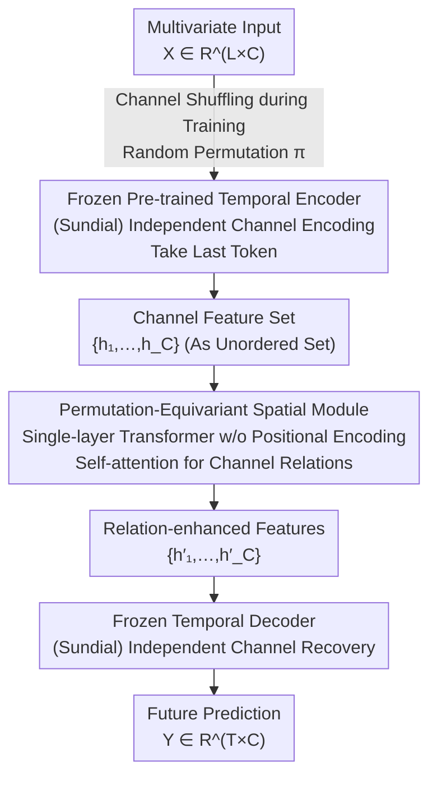

# CPiRi: Channel Permutation-Invariant Relational Interaction for Multivariate Time Series Forecasting

**Conference**: ICLR 2026  
**arXiv**: [2601.20318](https://arxiv.org/abs/2601.20318)  
**Code**: [https://github.com/JasonStraka/CPiRi](https://github.com/JasonStraka/CPiRi)  
**Area**: Time Series  
**Keywords**: Multivariate Time Series Forecasting, Channel Permutation Invariance, Spatio-Temporal Decoupling, Foundation Models, Channel Interaction

## TL;DR
The CPiRi framework is proposed, which achieves Channel Permutation Invariance (CPI) without sacrificing cross-channel modeling capabilities by combining a frozen pre-trained temporal encoder, a trainable permutation-equivariant spatial module, and a channel-shuffled training strategy. It achieves SOTA performance on several traffic benchmarks.

## Background & Motivation

1. **Background**: Multivariate Time Series Forecasting (MTSF) is divided into two major paradigms: Channel-Dependent (CD) models that learn cross-channel features, and Channel-Independent (CI) models that process each channel independently.
2. **Limitations of Prior Work**: CD models (e.g., Informer, Crossformer) essentially memorize the fixed positional order of channels rather than learning semantic relationships. If channels are reordered or added during inference, performance collapses catastrophically (e.g., Informer's error increases by >400% on PEMS-08). Although CI models are naturally immune to channel ordering, they completely ignore cross-channel dependencies, which limits forecasting performance.
3. **Key Challenge**: CD models capture interactions but lack robustness, while CI models ensure robustness but abandon relational reasoning—the two cannot be achieved simultaneously.
4. **Goal**: How to maintain Channel Permutation Invariance (CPI) while modeling cross-channel relationships, allowing the model to be deployed in real-world scenarios where channels change dynamically?
5. **Key Insight**: The authors observe that the strengths of CI and CD are complementary. If temporal feature extraction and spatial relational modeling are completely decoupled, the advantages of both can be inherited. Furthermore, channel shuffling during training forces the spatial module to learn content-driven rather than position-driven relationships.
6. **Core Idea**: Use a frozen foundation model for temporal encoding (CI advantage) and a permutation-equivariant Transformer spatial module to learn cross-channel relationships (CD advantage), with a channel-shuffled training strategy reinforcing content-driven relational reasoning.

## Method

### Overall Architecture
CPiRi resolves the dilemma where Channel-Dependent (CD) models model cross-channel relationships but memorize fixed channel positions (leading to collapse upon reordering), while Channel-Independent (CI) models are immune to ordering but abandon relational reasoning. The solution involves completely decoupling "temporal feature extraction" and "cross-channel relational modeling" into three serial stages. Given input $\mathcal{X} \in \mathbb{R}^{L \times C}$ ($L$ timesteps, $C$ channels), it is first processed by a **frozen Sundial pre-trained encoder** channel-independently—inheriting CI's inherent order immunity. Then, a **trainable permutation-equivariant spatial module** treats the channel features as an unordered set and uses self-attention to model content-driven cross-channel relationships—restoring CD's interaction capability. Finally, a **frozen Sundial decoder** independently recovers the $T$-step future prediction $\mathcal{Y} \in \mathbb{R}^{T \times C}$ for each channel. Only the middle module is trained, and channel shuffling is applied during training to force order-agnostic reasoning.

### Key Designs

**1. Frozen Pre-trained Temporal Encoder: Simultaneously Achieving CI Robustness and Foundation Model Priors**

The root of CD models' fragility is the entanglement of temporal extraction and cross-channel modeling. CPiRi delegates temporal extraction to a frozen Sundial foundation model encoder, which independently encodes each channel into a feature vector $\mathbf{h}_i \in \mathbb{R}^D$ (taking the last token of the sequence instead of mean pooling; ablation shows the last token reduces PEMS-08 WAPE from 12.42% to 9.43%). Channel-independent processing naturally inherits CI's immunity to ordering. Meanwhile, using frozen pre-trained weights transfers temporal priors learned from massive data to alleviate MTSF data scarcity while preventing overfitting—ablation shows performance drops to 10.80% if the encoder is unfrozen and collapses to 52.29% with random initialization.

**2. Permutation-Equivariant Spatial Module: Content-driven Cross-channel Relations via Position-less Self-attention**

Upon obtaining channel features, CPiRi treats $\{\mathbf{h}_1, \ldots, \mathbf{h}_C\}$ as an **unordered set** and feeds it into a single-layer Transformer encoder block, modeling pairwise channel relations via self-attention. The key is the absence of positional encodings, making the module strictly permutation-equivariant: $f(\mathbf{h}_{\pi(1)}, \ldots, \mathbf{h}_{\pi(C)}) = (f(\mathcal{H})_{\pi(1)}, \ldots, f(\mathcal{H})_{\pi(C)})$. Input ordering determines output ordering, and relationships must be derived from feature content rather than memorized channel positions. With complexity at $O(C^2)$, it is far more efficient than iTransformer's $O((T \times C)^2)$, enabling scaling to 8600 channels.

**3. Channel Shuffling Training Strategy: Blocking Positional Shortcuts via Random Permutation Regularization**

Although self-attention is structurally equivariant, random initialization and gradient noise may still allow the model to learn weak positional dependencies. CPiRi applies a random channel permutation $\pi \leftarrow \Pi_C$ to both inputs and targets in each training batch: $\min_\theta \mathbb{E}_{(\mathcal{X},\mathcal{Y})\sim\mathcal{D},\pi\sim\Pi_C}[\mathcal{L}(f_\theta(\mathcal{X}_\pi), \mathcal{Y}_\pi)]$. Any non-equivariant component relying on fixed ordering will incur high loss, pushing the optimization toward truly equivariant solutions. This is equivalent to sampling from a "task distribution" in meta-learning—the model learns a permutation-agnostic relational reasoning skill. Ablation shows that removing shuffling drops WAPE by 0.65%, but more importantly, this step suppresses performance fluctuations under 100% channel shuffling from Informer's >400% to <0.25%.

### Loss & Training
Training utilizes standard MSE/MAE losses with lookback and prediction windows set to $L = T = 336$. Only the parameters of the middle spatial module are updated, while the encoder and decoder remain frozen. Dropout in the spatial module is set to 0.3 to encourage sparse channel relations. A new channel permutation is sampled for each batch, equivalent to a continuously refreshed task distribution.

## Key Experimental Results

### Main Results
Comparing with CI and CD models across 5 traffic datasets, CPiRi achieves SOTA on 4 out of 5 datasets:

| Dataset | Metric | CPiRi | iTransformer | STID | PatchTST (CI) | Gain |
|--------|------|-------|-------------|------|--------------|------|
| PEMS-BAY | WAPE | **3.90%** | 4.21% | 3.91% | 4.87% | vs iT: -7.4% |
| PEMS-04 | WAPE | **11.67%** | 12.99% | 12.43% | 15.54% | vs STID: -6.1% |
| PEMS-08 | WAPE | **9.43%** | 10.70% | 10.90% | 12.37% | vs iT: -11.9% |
| SD | WAPE | **12.25%** | 12.45% | 12.51% | 13.41% | vs iT: -1.6% |
| Electricity | WAPE | **9.90%** | 10.67% | 10.65% | 10.68% | vs STID: -7.0% |

### Ablation Study

| Configuration | PEMS-08 WAPE | Description |
|------|-------------|------|
| CPiRi (Full) | 9.43% | Complete model |
| w/o Spatio-temporal decoupling (Encoder unfrozen) | 10.80% | -1.37%, Overfitting |
| w/o Shuffling strategy | 10.08% | -0.65%, Loss of CPI |
| w/o Pre-trained weights | 52.29% | Catastrophic collapse |
| 3-layer encoder from scratch | 11.17% | Significantly worse than frozen pre-trained |
| Frozen Chronos-2 encoder | 13.16% | Chronos is for short-term; poorly matched |
| w/o Spatial module | 22.69% | Degenerates to CI; large decline |
| Mean pooling vs Last token | 12.42% | Last token superior to average aggregation |

### Key Findings
- **Channel Shuffling Robustness**: CPiRi's WAPE varies by <0.25% under 100% channel shuffling, whereas Informer increases by >400% and STID by >235%.
- **Inductive Generalization**: Training on only 25% of channels and testing on all results in only a ~2% drop in accuracy, while reducing training time by 70%.
- **Large-scale Scalability**: On the CA dataset (8600 channels), CPiRi inference takes only 0.41s per sample with 8GB VRAM, whereas Timer-XL requires 75.68GB.

## Highlights & Insights
- The **design philosophy of complete spatio-temporal decoupling** is quite ingenious: freezing the encoder transfers pre-trained priors and ensures CI properties, allowing the spatial module to focus solely on the relational learning task. This modular design allows independent optimization of the two sub-problems (temporal modeling and channel interaction).
- **Channel shuffling as regularization** is essentially a meta-learning concept—ensuring the model sees all possible permutations during training so that the learned relational reasoning is permutation-agnostic. This trick is transferable to any scenario requiring set inputs (e.g., point clouds, graph node classification).
- The **CPI diagnostic test** is a valuable contribution in itself—it quickly exposes the positional memory flaws of current CD models.

## Limitations & Future Work
- Did not achieve SOTA on METR-LA because STID/Crossformer utilize exogenous holiday features; CPiRi currently only handles pure sequence data and lacks an interface for exogenous variables.
- Highly dependent on the quality of the Sundial pre-trained foundation model—performance drops significantly when switching to the Chronos-2 encoder, indicating sensitivity to encoder selection.
- The spatial module currently uses only a single-layer Transformer block, which might be insufficient for modeling complex relationships in ultra-large-scale channel systems (>8000).
- Dynamic graph structure learning was not explored—current self-attention implicitly learns fully connected relations, whereas channel relations in many real-world scenarios are sparse.

## Related Work & Insights
- **vs iTransformer**: iTransformer performs joint spatio-temporal attention in each layer with $O((T \times C)^2)$ complexity, which is CPI but costly. CPiRi reduces spatial attention to $O(C^2)$ via decoupling.
- **vs PatchTST**: PatchTST is a representative CI model, naturally CPI but ignoring cross-channel relations. CPiRi inherits its robustness while adding relational modeling.
- **vs STID**: STID uses fixed spatial ID embeddings, which essentially memorizes positions. CPiRi uses content-driven dynamic relations.

## Rating
- Novelty: ⭐⭐⭐⭐ The combination of spatio-temporal decoupling and channel shuffling is novel, though individual components (frozen encoders, self-attention equivariance) are not entirely new.
- Experimental Thoroughness: ⭐⭐⭐⭐⭐ Extremely comprehensive, involving 5 benchmarks, large-scale scaling, progressive shuffling, partial channel training, and detailed ablations.
- Writing Quality: ⭐⭐⭐⭐⭐ Theoretical analysis is clear (equivariance proof), experimental design is systemic, and the CPI diagnostic test is a highlight.
- Value: ⭐⭐⭐⭐ Addresses a critical issue in real-world deployment (dynamic sensor changes) with a simple and efficient solution.

<!-- RELATED:START -->

## Related Papers

- [\[ICLR 2026\] Relational Transformer: Toward Zero-Shot Foundation Models for Relational Data](relational_transformer_toward_zero-shot_foundation_models_for_relational_data.md)
- [\[ICLR 2026\] GARLIC: Graph Attention-based Relational Learning of Multivariate Time Series in Intensive Care](garlic_graph_attention-based_relational_learning_of_multivariate_time_series_in_.md)
- [\[ICLR 2026\] T1: One-to-One Channel-Head Binding for Multivariate Time-Series Imputation](t1_one-to-one_channel-head_binding_for_multivariate_time-series_imputation.md)
- [\[ICLR 2026\] PHAT: Modeling Period Heterogeneity for Multivariate Time Series Forecasting](phat_modeling_period_heterogeneity_for_multivariate_time_series_forecasting.md)
- [\[ICML 2025\] Channel Normalization for Time Series Channel Identification](../../ICML2025/time_series/channel_normalization_for_time_series_channel_identification.md)

<!-- RELATED:END -->
