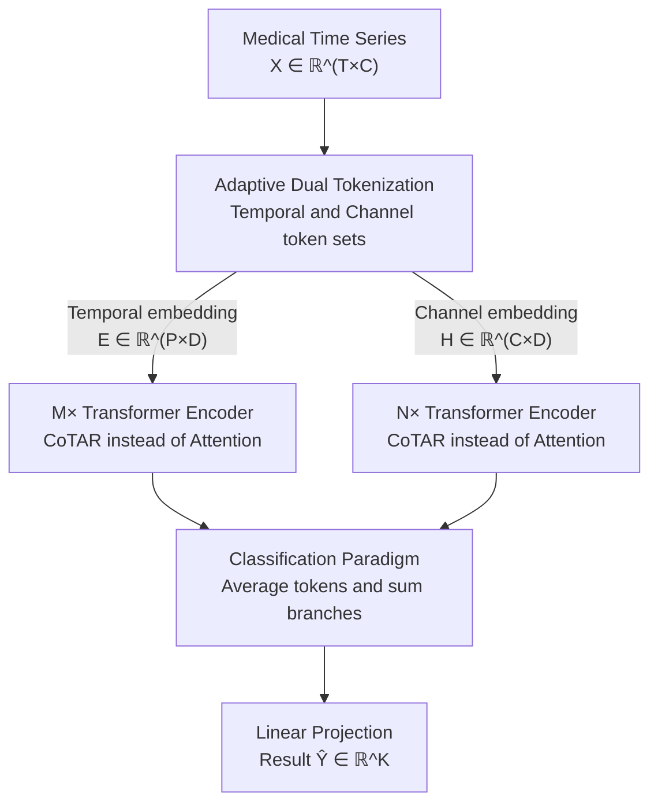

# Decentralized Attention Fails Centralized Signals: Rethinking Transformers for Medical Time Series

**Conference**: ICLR 2026 Oral  
**arXiv**: [2602.18473](https://arxiv.org/abs/2602.18473)  
**Code**: [https://github.com/Levi-Ackman/TeCh](https://github.com/Levi-Ackman/TeCh)  
**Area**: Time Series  
**Keywords**: Medical Time Series, Transformer, Channel Dependency, Core Token, Linear Complexity

## TL;DR
The TeCh framework is proposed, utilizing a Core Token Aggregation-Redistribution (CoTAR) module to replace standard attention in Transformers for modeling channel dependencies in medical time series. By introducing a global "core token" as a proxy to aggregate and redistribute channel information, complexity is reduced from $O(n^2)$ to $O(n)$. It achieves 86.86% accuracy on the APAVA dataset (outperforming Medformer by 12.13%), using only 33% memory and 20% inference time.

## Background & Motivation

**Background**: Analysis of medical time series (EEG/ECG) requires modeling two key patterns: temporal dependency (within a single channel) and channel dependency (interactions across multiple channels). While recent Transformers (e.g., Medformer, PatchTST) excel at temporal modeling, channel dependency remains a weakness.

**Limitations of Prior Work**: Standard attention in Transformers is "decentralized," where each token interacts directly with every other token (peer-to-peer). However, medical signals are inherently "centralized": EEG is centrally controlled by thalamo-cortical loops, and ECG is coordinated by the sinoatrial node. This structural mismatch causes attention mechanisms to dilute primary patterns driven by central sources.

**Key Challenge**: The issue is not that attention lacks power, but that there is a fundamental structural mismatch between its decentralized architecture and inherently centralized signals. When every channel is directly influenced by noisy channels, centrally coordinated signal patterns are overwhelmed.

**Goal**: (a) Design a channel interaction mechanism matching the centralized signal structure; (b) Reduce computational complexity from quadratic to linear; (c) Adaptively handle the varying importance of temporal and channel dependencies across datasets.

**Key Insight**: Inspired by star topologies in distributed systems—where a central server aggregates and distributes information more efficiently than P2P communication. In medical signals, a "core token" can act as a proxy for communication between all channels.

**Core Idea**: Replace peer-to-peer attention with a global core token proxy. All channels first aggregate into the core token, which then redistributes integrated information back to each channel, simulating the signal propagation of central nervous or conduction systems.

## Method

### Overall Architecture
TeCh addresses the fact that medical signals are centrally driven, whereas standard attention treats each channel as an equal node, allowing noise from one channel to directly pollute others. It redefines channel communication. Given an input medical time series $X \in \mathbb{R}^{T \times C}$ ($T$ time steps, $C$ channels), the model uses **Adaptive Dual Tokenization** to create two sets of tokens—one focused on time and one on channels—processed by $M$ and $N$ Transformer Encoders, respectively. These encoders replace standard attention with the **CoTAR** module. Finally, the **Classification Paradigm** averages the outputs of both branches across the token dimension, sums them, and uses a linear layer to project them into classification results $\hat{Y} \in \mathbb{R}^K$. $M$ and $N$ are adjustable; setting one to 0 removes that branch, allowing the model to scale based on data characteristics.

### Key Designs

**1. Adaptive Dual Tokenization: Providing temporal and channel representations for dataset-specific selection**

The relative importance of temporal and channel dependencies varies significantly across medical datasets. Temporal embedding flattens $L$ consecutive time steps across all channels before embedding, resulting in $E \in \mathbb{R}^{P \times D}$ ($P = \lceil T/L \rceil$), which captures temporal dynamics. Channel embedding treats the entire time series of each channel as a single embedding $H \in \mathbb{R}^{C \times D}$, preserving individual channel semantics for inter-channel interaction. The dual approach is essential: TDBrain relies heavily on temporal features, PTB on channel features, while APAVA requires both (Dual outperforming single branches by over 11%).

**2. CoTAR: Using a global core token as a "Central Server" to replace peer-to-peer attention**

CoTAR (Core Token Aggregation-Redistribution) addresses the decentralized structure of standard attention where $QK^T$ allows every token to interact with all others. CoTAR uses a star topology: communication between channels must pass through a mid-station core token.

The process has two stages. **Aggregation**: Given input $O \in \mathbb{R}^{S \times D}$, it is projected via MLP to $\tilde{O} \in \mathbb{R}^{S \times D_c}$, followed by a Softmax across the token dimension to obtain weights $O_w$, and a weighted sum to compress all tokens into a single core token $\tilde{C_o} \in \mathbb{R}^{D_c}$. **Redistribution**: The core token is repeated for every token position, concatenated with the original $O$, and passed through another MLP to output $A \in \mathbb{R}^{S \times D}$. Using only matrix-vector multiplication, complexity is reduced from $O(S^2)$ to $O(S)$. This also provides robustness, as noisy channels can only influence others indirectly through the core token.

**3. Classification Paradigm: Parameter-free branch fusion**

The outputs from the temporal branch $O_{te}$ and channel branch $O_{ch}$ are averaged across the token dimension to obtain $\tilde{O}_{te}$ and $\tilde{O}_{ch}$, then summed:

$$\hat{Y} = (\tilde{O}_{te} + \tilde{O}_{ch})W_y + b_y$$

This simple addition introduces no extra parameters and allows the model to naturally degrade into a single-branch architecture if $M=0$ or $N=0$.

### Loss & Training
- Employs a Subject-Independent protocol: Splitting data by subject to ensure generalization to unseen patients.
- Results averaged over 5 random seeds.
- Best model saved based on validation F1 score.

## Key Experimental Results

### Main Results

| Dataset | Task | TeCh Acc | Medformer Acc | Gain |
|--------|------|---------|-------------|---------|
| APAVA (EEG, 2-class) | AD Diagnosis | **86.86±1.09** | 78.74±0.64 | +9.59% |
| TDBrain (EEG, 2-class) | PD Diagnosis | **93.21±0.61** | 89.62±0.81 | +4.26% |
| ADFTD (EEG, 3-class) | Dementia Cls | **54.54±0.70** | 53.27±1.54 | ~Stable |
| PTB (ECG, 2-class) | MI Diagnosis | **85.96±2.52** | 83.50±2.01 | +5.92% |
| PTB-XL (ECG, 5-class) | Cardiac Cls | **73.53±0.07** | 72.87±0.23 | +0.67% |
| FLAAP (HAR, 10-class) | Activity Rec | **80.60±0.30** | 76.44±0.64 | +3.81% |
| UCI-HAR (HAR, 6-class) | Activity Rec | **94.15±0.96** | 89.62±0.81 | +3.41% |

Efficiency (APAVA, batch=128): TeCh uses only **33% memory** and **20% inference time** compared to Medformer.

### Ablation Study

**Dual Tokenization Ablation (Table 4)**:

| Configuration | APAVA Acc | APAVA F1 | TDBrain Acc | PTB Acc |
|------|----------|---------|------------|--------|
| w/o Tokenization | 50.68 | 50.13 | 53.79 | 72.62 |
| Temporal only | 55.93 | 53.71 | **93.21** | 74.74 |
| Channel only | 75.68 | 73.54 | 67.58 | **85.96** |
| Dual (Ours) | **86.86** | **86.30** | 89.79 | 84.15 |

**CoTAR Ablation (Table 5)**:

| Configuration | APAVA Acc | APAVA F1 | TDBrain Acc | UCI-HAR Acc |
|------|----------|---------|------------|------------|
| w/o CoTAR | 83.31 | 81.99 | 92.69 | 92.40 |
| Attention Sub | 83.42 | 82.09 | 90.40 | 93.13 |
| CoTAR (Ours) | **86.86** | **86.30** | **93.21** | **94.15** |

### Key Findings
- **CoTAR is more consistent than standard attention**: CoTAR outperforms Attention across all 5 datasets with lower standard deviation (0.86 vs 0.96), indicating higher stability in centralized structures.
- **Dual Tokenization significantly improves APAVA**: (+31% Acc vs Temporal only), showing EEG data relies on both temporal and channel patterns.
- **Dataset preferences**: TDBrain favors Temporal (93.21%), while PTB favors Channel (85.96%), validating the adaptive design.
- **Noise Robustness**: Incorporating Gaussian noise into PTB channels leads to a sharp F1 drop in Attention, whereas CoTAR declines slowly because the core token acts as a buffer.

## Highlights & Insights
- **Insight into structural mismatch**: The paper observes that decentralized peer-to-peer architectures are inherently unsuitable for physiologically organized centralized signals.
- **Elegant "Star Proxy" design**: Using simple MLP and Softmax weighting to reduce complexity from quadratic to linear while improving accuracy.
- **Interpretability of the core token**: t-SNE visualizations show the core token resides centrally in both temporal and channel spaces and is class-separable, acting as a "global physiological state summary."

## Limitations & Future Work
- The core token dimension $D_c$ is fixed and may require tuning per dataset.
- Evaluated only on classification tasks; performance on forecasting or anomaly detection is unknown.
- Performance on highly imbalanced datasets (e.g., ADFTD) requires more investigation.
- $M/N$ parameters are currently manually tuned; NAS or adaptive gating could be used.

## Related Work & Insights
- **vs Medformer**: Both focus on channel dependency, but Medformer uses standard attention; TeCh utilizes CoTAR for higher accuracy and efficiency.
- **vs iTransformer**: iTransformer uses channel embedding; TeCh adds the core token proxy and dual tokenization.
- **vs PatchTST**: PatchTST focuses only on Temporal embedding without inter-channel coordination.

## Rating
- Novelty: ⭐⭐⭐⭐⭐ Strong insight into signal organizational structures.
- Experimental Thoroughness: ⭐⭐⭐⭐ Comprehensive testing across medical and HAR datasets.
- Writing Quality: ⭐⭐⭐⭐⭐ Precise problem definition and intuitive analogies (Decentralized vs Centralized).
- Value: ⭐⭐⭐⭐⭐ Establishes a new paradigm for medical time series channel modeling.

<!-- RELATED:START -->

## Related Papers

- [\[ICLR 2026\] Repurposing Foundation Model for Generalizable Medical Time Series Classification](repurposing_foundation_model_for_generalizable_medical_time_series_classificatio.md)
- [\[ICLR 2026\] Understanding Transformers in Time Series Forecasting: A Case Study on MOIRAI](understanding_transformers_for_time_series_forecasting_a_case_study_on_moirai.md)
- [\[ICLR 2026\] Local Geometry Attention for Time Series Forecasting under Realistic Corruptions](local_geometry_attention_for_time_series_forecasting_under_realistic_corruptions.md)
- [\[ICLR 2026\] Understanding Transformers for Time Series: Rank Structure, Flow-of-ranks, and Compressibility](understanding_transformers_for_time_series_rank_structure_flow-of-ranks_and_comp.md)
- [\[ICLR 2026\] GARLIC: Graph Attention-based Relational Learning of Multivariate Time Series in Intensive Care](garlic_graph_attention-based_relational_learning_of_multivariate_time_series_in_.md)

<!-- RELATED:END -->
