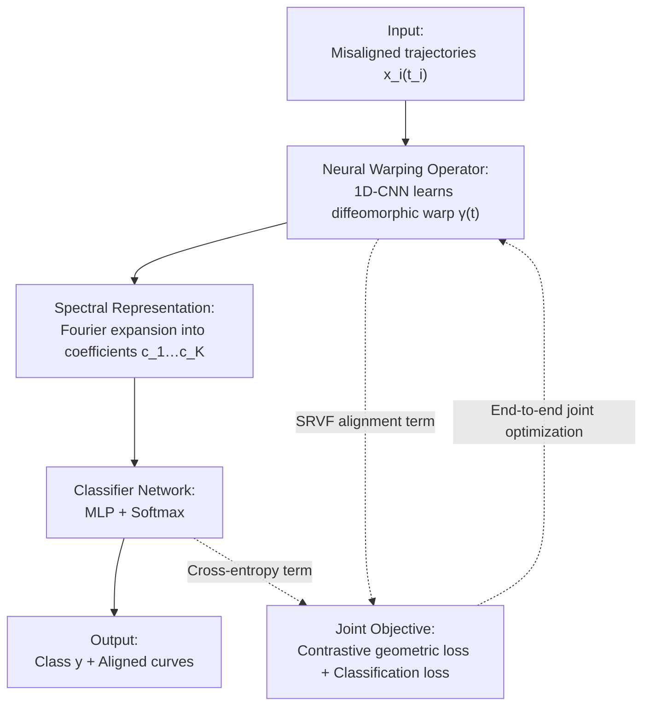

# DeepFRC: An End-to-End Deep Learning Model for Functional Registration and Classification

**Conference**: ICLR2026  
**OpenReview**: [https://openreview.net/forum?id=5vdw8Qmrre](https://openreview.net/forum?id=5vdw8Qmrre)  
**Code**: https://github.com/Drivergo-93589/DeepFRC  
**Area**: Functional Data Analysis / Time Series Classification  
**Keywords**: Functional data analysis, curve registration, diffeomorphic warping, Fourier spectral representation, contrastive alignment

## TL;DR
DeepFRC integrates "curve registration (alignment)" and "curve classification" into a single end-to-end deep network for joint training. This model employs a 1D-CNN to learn diffeomorphic time warping, utilizes Fourier bases for smooth spectral embedding, and applies a class-aware contrastive loss to unify alignment and classification. This work provides the first theoretical registration approximation and generalization bounds for such a joint model, outperforming SOTA in both alignment quality and classification accuracy across five real-world datasets.

## Background & Motivation
**Background**: Functional data refers to curves or trajectories that vary continuously over time or space, pervasive in fields like biomedicine, motion analysis, EEG, and air pollution. Two core tasks in functional data analysis (FDA) are **registration** (alignment, removing phase variation) and **classification**. Phase variation refers to misalignments on the time axis—where two essentially identical curves appear mismatched due to different temporal rhythms. Comparing or classifying them directly leads to errors caused by these "spurious differences."

**Limitations of Prior Work**: Traditional approaches treat these tasks as a sequential two-step process: performing pre-registration followed by feeding the aligned curves into a classifier. This decoupling has two main drawbacks: first, **registration ignores label information**, even though the class strongly influences the evolutionary rhythm of the curve; and second, traditional registration methods (landmark-based, metric-based, or model-based) require manual landmark selection, have high computational costs (e.g., Dynamic Time Warping (DTW) is $O(Nn^2k)$), or are sensitive to noise. Existing neural registration methods (e.g., SrvfRegNet) are fast but remain isolated pre-processing steps.

**Key Challenge**: A natural mutual benefit exists between registration and classification, but the "registration then classification" pipeline severs this pathway. Few attempts at joint modeling (e.g., TTN, or the two-layer model by Tang et al., 2022) are either not designed for functional data—ignoring curve smoothness and infinite-dimensional nature—or rely on parametric and distributional assumptions that are computationally expensive and hard to scale to multi-class problems.

**Goal**: Design an end-to-end framework where registration and classification **mutually reinforce each other in a single network**, while preserving the smoothness of functional data, providing theoretical guarantees, and handling multi-class and multi-dimensional inputs.

**Core Idea**: A diffeomorphic neural operator learns time warping, a Fourier spectral representation performs smooth embedding, and a class-aware contrastive geometric loss pushes alignment toward "intra-class consistency and inter-class separation," making alignment naturally serve classification—jointly optimized end-to-end.

## Method

### Overall Architecture
DeepFRC addresses the problem of learning how to align and classify simultaneously given a set of trajectories $\{(x_i(t_i), y_i)\}_{i=1}^N$ with potentially misaligned sampling points. The framework is a pipeline of three serial modules driven by a joint loss: raw trajectories enter the **Neural Warping Operator** (1D-CNN) to learn a diffeomorphic time warp $\gamma(t)$ for correction; corrected curves are expanded into compact coefficients $c_1,\dots,c_K$ via **Fourier Spectral Representation**; these coefficients are then fed into the **Classifier Network** (MLP+Softmax). Training is conducted using a joint target of "contrastive geometric alignment loss + classification loss," enabling alignment to learn features beneficial for classification while classification learns phase-invariant features.

### Key Designs

**1. Neural Warping Operator: Learning valid diffeomorphic warps via 1D-CNN**

Addressing the limitations of traditional or decoupled registration, DeepFRC uses a 4-layer 1D convolutional network (kernel size 3, channels $16\to32\to64$) to extract temporal features $\tau(x_i(t_i))$. The primary challenge is ensuring the network output is a legal **diffeomorphism**, meeting boundary conditions $\gamma(0)=0,\gamma(1)=1$ and strict monotonicity $\dot\gamma>0$. The authors employ a method of **squared cumulative sums**: $\tilde\gamma_i(t_{ij}) = \frac{\sum_{\mu=0}^{j}\tau_{i\mu}^2}{\sum_{\nu=0}^{n}\tau_{i\nu}^2}$. Squaring ensures non-negative increments, the cumulative sum ensures monotonicity, and normalization ensures the boundary. A second normalization $\gamma_i(t_{ij})=\frac{\sum_{\mu=0}^{j}\tilde\gamma_{i\mu}}{\sum_{\nu=0}^{n}\tilde\gamma_{i\nu}}$ further enhances smoothness. Consequently, the output always falls within the legal warp set $\Gamma$, with a linear complexity of $O(Nn)$.

**2. Spectral Representation: Compressing aligned curves into smooth embeddings via Fourier bases**

Directly vectorizing the aligned curves $\tilde x_i(t)$ into high-dimensional grids is inefficient and ignores smoothness. To produce compact and smooth embeddings, the authors reconstruct the aligned functions via numerically stable 1D linear interpolation on $\{(\gamma_i(t_{ij}), x_i(t_{ij}))\}$. These functions are expanded on a set of Fourier bases $\{\phi_j(t)\}_{j=1}^K$ using least squares: $\tilde x_i(t)\approx\sum_{j=1}^K c_{ij}\phi_j(t)$. The closed-form solution for coefficients is $\tilde c_i = G^{-1}d_i$. Fourier bases avoid additional regularization hyperparameters, and both interpolation and expansion satisfy the Lipschitz continuity required for theoretical analysis (Theorem 3.3). The number of bases $K$ is set to 100.

**3. Class-aware Contrastive Geometric Alignment Loss: Making alignment serve classification**

This design is the key to coupling registration and classification. While standard registration ignores classes, DeepFRC uses a **class-aware contrastive alignment loss** in the SRVF (Square Root Velocity Function) space. The SRVF is defined as $q(t)=\mathrm{sign}(\dot x(t))\sqrt{|\dot x(t)|}$, and the warped SRVF is $(q\star\gamma)(t)=q(\gamma(t))\sqrt{\dot\gamma(t)}$. The loss is:

$$L_1(\Theta_1) = \sum_{j=1}^{C}\frac{\sum_{i:y_i=j}\|Q_i(\gamma_i)-\bar Q^{(j)}\|}{N^{(j)}} + \alpha\sum_{1\le u<v\le C}\|\bar Q^{(u)}-\bar Q^{(v)}\|^{-1}$$

The first term pulls each sample's SRVF toward the **intra-class mean** $\bar Q^{(j)}$, while the second term is a **contrastive separation term** that penalizes small distances between class means. This ensures alignment is not neutral but "aligned for better classification." The final objective combines this with classification cross-entropy $L_2$: $L(\Theta)=L_1(\Theta_1)+\beta L_2(\Theta)$, optimized end-to-end via AdamW.

**4. Theoretical Guarantees: Registration approximation and generalization bounds**

DeepFRC is the first joint registration-classification model to provide theoretical guarantees. **Theorem 3.1 (Low Registration Error)** proves that for any $\epsilon>0$, there exists an estimated $\hat\gamma$ such that the registration error $\Delta Q_{\mathrm{reg}}(\gamma^*,\hat\gamma)<\epsilon$, validating the use of learnable diffeomorphic modules. **Theorem 3.3 (Low Generalization Error)** demonstrates that under assumptions of inter-class separation $|\bar Q^{(u)}-\bar Q^{(v)}|\ge\epsilon_0$ and bounded softmax probabilities, the generalization error $\Delta R_{\mathrm{gen}}(\hat\Theta)\lesssim \frac{T_0^{1-1/c_0}}{N}$. This formally links **registration fidelity to classification performance**. These assumptions are supported by experiments and guide hyperparameter selection (e.g., using $\alpha$ to maximize separation and $\beta$ to balance losses).

### Loss & Training
The joint objective $L(\Theta)=L_1(\Theta_1)+\beta L_2(\Theta)$ is optimized using AdamW. The number of Fourier bases is $K=100$. Classification and alignment weights $\alpha, \beta$ are chosen via data splitting. The training complexity is linear $O(Nn)$, suitable for long sequences. The framework extends to $d$-dimensional inputs by assuming dimensions share a common warp process.

## Key Experimental Results

### Main Results
Evaluations were conducted on Wave, Yoga, Symbol (2/3 classes), and MotionSense datasets using **alignment quality** (ATV, lower is better) and **classification** (ACC, F1, higher is better). Baselines include TTN, SrvfRegNet, and SrvfRegNet combined with various classifiers (FCNN, TSLANet, etc.).

| Dataset | Metric | DeepFRC | TTN (Joint Baseline) | Strongest Sequential Baseline |
|--------|------|---------|-----------------|--------------|
| Wave | ATV / ACC | **5.6** / **96.4%** | 6.3 / 94.7% | 7.3 / 96.4% (+TSLANet) |
| Yoga | ATV / ACC | **16.2** / **89.8%** | 57.7 / 89.4% | 136.0 / 89.3% (+TSLANet) |
| Symbol(2) | ATV / ACC | **4.8** / **96.0%** | 8.6 / 92.0% | 14.8 / 96.0% (+FCNNfourier) |
| Symbol(3) | ATV / ACC | **3.2** / 96.3% | 4.5 / 93.3% | 6.5 / 96.3% (+TSLANet) |
| MotionSense | ATV / ACC | **25.0** / **95.0%** | 35.1 / 85.0% | 37.7 / 95.0% (+TSLANet) |

DeepFRC achieves the **best registration (ATV) on all datasets**, with classification accuracy comparable to or better than SOTA models like TSLANet. Its alignment error is significantly lower (e.g., Yoga 16.2 vs. 136.0).

### Ablation Study
Dissecting the three components: Neural Warping Operator (N.D.O.), Spectral Representation (S.R.), and Classifier Network (C.N.).

| Configuration | Impact | Description |
|------|------|------|
| Full DeepFRC | — | Complete model |
| w/o N.D.O. | Performance drop | Removing registration hurts Yoga/Symbol/MotionSense |
| w/o C.N. | Worse registration | Removing classifier degrades alignment (confirms mutual benefit) |
| w/o S.R. | Both tasks suffer | Spectral representation supports both registration and classification |

Paired t-tests across 10 random seeds confirmed that removing any core component leads to significant degradation ($p<0.01$ in most cases).

### Key Findings
- **Registration and classification are mutually beneficial**: Removing the classifier harms registration, and removing registration harms classification.
- **Spectral representation is the foundation**: Its removal compromises both tasks, showing that Fourier embeddings provide both smoothness and strong classification features.
- **Interpretability gains**: On MotionSense, DeepFRC warps synchronize biomechanical events like "heel strike." On Symbol, it corrects writing speeds, distilling clean class templates from noisy observations.
- **The Trade-off**: While strong classifiers (like TSLANet) can learn phase-invariance implicitly, DeepFRC **explicitly enforces** it via class-aware alignment, simplifying the classification task and producing interpretable results.

## Highlights & Insights
- **"Squared Cumulative Sum" for Diffeomorphisms**: Using network features through squaring, cumulative summing, and normalization guarantees a valid monotonic warp without constraints—an elegant and transferable trick.
- **Class-aware Contrastive Alignment**: Performing alignment to pull intra-class and push inter-class in SRVF space transforms registration from a neutral step into a task-driven component.
- **Theoretical and Architectural Coupling**: Theorems guide hyperparameter choice (maximizing separation and smoothing softmax), embedding theory directly into design.
- **Linear Complexity**: $O(Nn)$ makes it much more practical for long sequences than DTW.

## Limitations & Future Work
- **Shared Warping Assumption**: Extending to multi-dimensional inputs assumes all dimensions share the same warping process, which may fail for multi-lead physiological signals with phase differences between channels.
- **Non-constructive Theory**: Generalization bounds prove existence but cannot directly measure approximation error since ground-truth warps $\gamma^*$ are unknown for real data.
- **Small Dataset Scale**: Evaluation was limited to medium-sized UCR/Kaggle datasets; scalability to large-scale, high-dimensional data remains to be tested.
- **Future Directions**: Relaxing shared warping assumptions, extending contrastive loss to hierarchical classes, and exploring learnable or wavelet bases.

## Related Work & Insights
- **vs. TTN (Lohit et al. 2019)**: TTN lacks functional data design and ignores smoothness, resulting in poor alignment (e.g., Yoga ATV 57.7 vs. 16.2).
- **vs. Tang et al. (2022)**: Their two-layer model uses parametric mixed-effects with Gaussian assumptions and expensive alternating optimization; DeepFRC is non-parametric, end-to-end, and supports multi-class.
- **vs. SrvfRegNet Pipeline**: Sequential schemes ignore labels during registration; DeepFRC achieves significantly lower ATV by making alignment serve classification.
- **vs. TSLANet (Eldele et al. 2024)**: While TSLANet achieves high accuracy through implicit phase-invariance, DeepFRC provides explicit, interpretable alignments more valuable to domain experts.

## Rating
- Novelty: ⭐⭐⭐⭐⭐ First end-to-end joint model with functional design and theoretical bounds.
- Experimental Thoroughness: ⭐⭐⭐⭐ Strong comparison and ablation, though datasets are relatively small.
- Writing Quality: ⭐⭐⭐⭐⭐ Clear motivation and tight integration of theory and method.
- Value: ⭐⭐⭐⭐ Methodological significance for FDA and time series communities.

<!-- RELATED:START -->

## Related Papers

- [\[ICLR 2026\] End-to-End Probabilistic Framework for Learning with Hard Constraints](end-to-end_probabilistic_framework_for_learning_with_hard_constraints.md)
- [\[ICLR 2026\] Brain-Semantoks: Learning Semantic Tokens of Brain Dynamics with a Self-Distilled Foundation Model](brain-semantoks_learning_semantic_tokens_of_brain_dynamics_with_a_self-distilled.md)
- [\[ICLR 2026\] Repurposing Foundation Model for Generalizable Medical Time Series Classification](repurposing_foundation_model_for_generalizable_medical_time_series_classificatio.md)
- [\[ICLR 2026\] CauKer: Classification Time Series Foundation Models Can Be Pretrained on Synthetic Data](cauker_classification_time_series_foundation_models_can_be_pretrained_on_synthet.md)
- [\[AAAI 2026\] Counterfactual Explainable AI (XAI) Method for Deep Learning-Based Multivariate Time Series Classification](../../AAAI2026/time_series/counterfactual_explainable_ai_xai_method_for_deep_learning-based_multivariate_ti.md)

<!-- RELATED:END -->
