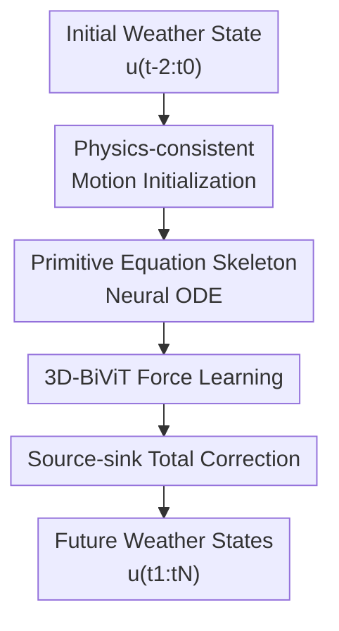

# DeepPrim: a Physics-Driven 3D Short-term Weather Forecaster via Primitive Equation Learning

**Conference**: ICLR 2026  
**OpenReview**: [https://openreview.net/forum?id=EyyWd0hH0q](https://openreview.net/forum?id=EyyWd0hH0q)  
**Code**: https://github.com/DAMO-DI-ML/DeepPrim  
**Area**: Time Series / Weather Forecasting / Physics-informed Spatiotemporal Modeling  
**Keywords**: Physics-driven weather forecasting, primitive equations, Neural ODE, 3D atmospheric dynamics, short-term forecasting  

## TL;DR
DeepPrim explicitly incorporates advection, force terms, and source-sink terms from atmospheric primitive equations into a Neural ODE forecasting framework. By utilizing 3D-BiViT to learn the coupled dynamics across longitude, latitude, and pressure levels, it significantly outperforms most data-driven baselines in global and regional weather forecasting for 6-24 hour horizons.

## Background & Motivation
**Background**: Weather forecasting has long relied on Numerical Weather Prediction (NWP) systems, which simulate atmospheric evolution by solving partial differential equations such as primitive equations, continuity equations, and moisture equations. In recent years, deep learning weather models like GraphCast, Pangu, ClimaX, FuXi, and ClimODE have treated ERA5 reanalysis data as large-scale spatiotemporal fields, often providing strong short-to-medium-term predictions with lower inference costs.

**Limitations of Prior Work**: Traditional NWP is highly interpretable but requires empirical parameterization for unresolved physical processes like turbulence, radiative heating, and condensation/evaporation, which introduces significant errors. Purely data-driven models excel at fitting historical statistical correlations but often treat atmospheric states as 2D image sequences or general videos, failing to fully utilize vertical coupling, advection, and conservation constraints in pressure coordinates. For short-term forecasting within 24 hours, these physical details are critical, as local convection, inter-layer energy transfer, and near-surface wind/temperature changes occur rapidly.

**Key Challenge**: Short-term weather forecasting requires the expressive power of deep networks to absorb massive ERA5 observations while needing atmospheric dynamics to provide the correct inductive bias. Relying solely on neural network end-to-end fitting may lead to models that learn correlations but remain unstable; completely following traditional equation solving re-encounters issues with empirical parameterization and computational complexity.

**Goal**: The authors aim to construct a continuous-time short-term 3D weather forecaster. On one hand, it explicitly learns the structure of Navier-Stokes / primitive equations in pressure coordinates; on the other hand, it uses neural networks to approximate force terms and source-sink processes that are difficult to write precisely in traditional NWP, validating the benefits of this physics-driven design in global and regional forecasting.

**Key Insight**: The paper starts from a specific physical observation: the evolution of forecast variables like temperature, moisture, and geopotential is largely driven by atmospheric motion and advection, while the atmospheric motion itself can be described by momentum equations in pressure coordinates. Therefore, rather than having the network directly output future weather fields, it is better to first learn an intermediate motion field $v^*$, and then transform it into future weather states using advection equations and source-sink corrections.

**Core Idea**: Use learnable force networks and source-sink networks to replace parts that are difficult to parameterize accurately in traditional equations, while retaining the primitive equation skeleton of advection, vertical velocity, and pressure-level coupling. This allows the deep model to learn atmospheric evolution "along the physical structure."

## Method

### Overall Architecture
The input to DeepPrim is the weather state at three consecutive time steps $u(t_{-2}:t_0)$, including surface variables, upper-air variables across multiple pressure levels, and static geographic variables. The output is the weather state for the next $N$ time steps. Instead of a one-time regression of future images, it iteratively updates the weather state $u(t)$ and the intermediate motion field $v^*(t)$ within a Neural ODE system, subsequently correcting the results of the ODE integration using a source-sink network.

In the overall workflow, DeepPrim first uses an initialization network to estimate the initial intermediate motion field from current wind fields, temporal changes, and 3D spatial gradients. During the ODE solving process, physical advection terms are used to advance weather variables, while a 3D-BiViT force network learns the time derivative of the intermediate motion field. Finally, a source-sink network performs a total correction on the integration results to absorb gains or losses from radiation, phase changes, and turbulent mixing not explicitly written in the equations.

The core equations of this framework can be summarized as two coupled dynamics: the intermediate motion field $v^*$ is updated by advection terms and learnable force terms, and the weather state $u$ is updated by horizontal/vertical advection terms driven by $v^*$ and learnable source-sink terms. The paper writes these as $\dot{v}^*=-(v^*\cdot\nabla_p v^*+\omega\partial v^*/\partial p)+Force(u,v^*)$ and $\dot{u}=-(v^*\cdot\nabla_p u+\omega\partial u/\partial p)+Source\text{-}Sink(u,v^*)$, where the vertical velocity $\omega$ is integrated from the horizontal wind divergence using the continuity equation.

### Key Designs
**1. Physics-consistent Motion Initialization: Converting wind fields into integrable dynamic states**

DeepPrim does not directly treat the real horizontal wind $[v_x,v_y]$ as the sole motion state in the ODE. Instead, it introduces an intermediate motion field $v^*$. This is because the model needs to learn not just the observed wind speed itself, but the effective motion best suited for driving advection and force estimation within the neural ODE discrete advancement. If the initial value is poorly estimated, errors propagate forward at each ODE step, causing short-term forecasts to deviate quickly from true evolution.

The initialization network adopts a residual form: $v^*(t_0)=[v_x,v_y]_{t_0}+Conv(u(t_{-2}:t_0),\dot{u}(t_0),\nabla u(t_0),\psi_{ST})$. Here, $\dot{u}(t_0)$ provides recent trends, $\nabla u(t_0)$ contains spatial gradients across longitude, latitude, and pressure levels, and $\psi_{ST}$ encodes spatiotemporal coordinates. The advantage is that the initial motion no longer considers only an instantaneous wind field but perceives how local variables are changing, how layers are coupled, and the current phase of the diurnal or seasonal cycle.

**2. Primitive Equation Skeleton Neural ODE: Learning difficult terms without discarding equation structure**

The key to DeepPrim is not treating physical equations as an extra loss, but placing the equations themselves within the predictor's state transition. The update of weather states explicitly includes horizontal advection like $v^*\cdot\nabla_p u$ and vertical transport like $\omega\partial u/\partial p$; the update of the intermediate motion field also retains a self-advection structure similar to the Navier-Stokes equations. The network is primarily responsible for learning external forces, friction, and complex parameterization processes that are difficult to model precisely.

This design moves both traditional NWP and deep learning one step closer to each other: it does not require a fixed empirical parameterization scheme, nor does it let the neural network operate purely on data correlation. The ODE solver advances the continuous-time system in discrete steps (e.g., $\Delta t=1h$), allowing the model to naturally output short-term forecasts for various lead times (6, 12, 18, 24 hours) while formally retaining the atmospheric dynamics meaning of integration over time.

**3. 3D-BiViT Force Learning: Modeling horizontal intra-layer motion and vertical inter-layer coupling separately**

Pressure levels represent the most important structural information in this paper. While methods like Pangu add pressure levels as height coordinates in a unified attention mechanism, and NeuralGCM focuses on local tendencies within a single vertical column, DeepPrim argues these do not sufficiently distinguish between "horizontal advection within the same pressure level" and "vertical coupling between different levels." Thus, the force network uses a 3D bicomponent ViT: first, it patchifies surface and upper-air variables separately, using different embeddings/projectors for heterogeneity; then, it adds a learnable pressure-level embedding so tokens know their respective levels.

Regarding attention structure, 3D-BiViT first performs intra-pressure self-attention to model influences across longitude/latitude within the same level, followed by cross-pressure self-attention to model vertical coupling at the same horizontal position. This two-stage design echoes viscous friction, high-order gradients, and pressure gradient forces in primitive equations: the atmosphere is neither a stack of independent 2D images nor an isotropic 3D volume, but a physical system where horizontal motion and vertical exchange have distinct properties.

**4. Source-Sink Total Correction: Replacing empirical parameterization with learned gain/loss**

Even if advection and force terms are well-learned, weather variables are influenced by radiative heating/cooling, condensation/evaporation, turbulent mixing, and diurnal cycles. Traditional NWP uses parameterization schemes to approximate these resolved/unresolved processes, but such schemes are non-unique and sensitive to conditions. DeepPrim uses a source-sink network to learn these gains or losses, with inputs including the initial state $u(t_0)$, initial intermediate motion $v^*(t_0)$, preliminary ODE predictions $\{u'(t_i)\}_{i=1}^N$, and spatiotemporal embeddings.

A crucial detail: rather than predicting instantaneous source-sink rates at every ODE step, the paper predicts the total source-sink amount from the start time to the target lead time, adding it residually to the ODE solution: $\hat{u}(t_i)=Conv(u(t_0),v^*(t_0),u'(t_i),\psi_{ST})+u'(t_i)$. This reduces error accumulation during ODE integration and prevents the source-sink network from overfitting local noise at every step. Ablation results show that removing this network significantly worsens RMSE for z500, t2m, and wind speed, indicating that short-term weather changes cannot be explained by advection alone.

### Loss & Training
The training objective is latitude-weighted MSE at the target lead time. The latitude weight $\alpha(h)$ compensates for the varying area of the spherical grid, preventing dense high-latitude grids from being over-amplified. The loss is: $L=\frac{1}{KHW}\sum_k\sum_h\sum_w\alpha(h)(\hat{u}_{k,h,w}(t_N)-u_{k,h,w}(t_N))^2$.

Data is sourced from ERA5 / WeatherBench, with training from 1979-2015, validation in 2016, and testing in 2017-2018. The model supports resolutions of 5.625°, 1.40625°, and 0.25°. The initialization and source-sink networks use ResNet-style backbones, while the force network uses the ViT-style 3D-BiViT. The optimizer is AdamW, with learning rates of $1e^{-5}$ for ODE components and $5e^{-4}$ for others, using linear warmup followed by cosine annealing. The ODE time step is $\Delta t=1h$. The paper mainly employs the Euler method for short-term integration.

## Key Experimental Results

### Main Results
The paper reports results for global and regional weather forecasting. The primary metric is latitude-weighted RMSE for variables: z500, t850, t2m, u10, v10. Representative results for the 5.625° global task at a 24h lead time are shown below (lower is better).

| Variable / 24h RMSE | IFS | ClimaX | ClimODE | DeepPrim | Observations |
|--------|------|--------|---------|----------|------|
| z500 | 51.0 | 96.2 | 193.4 | 121.0 | IFS is still strong on z500; DeepPrim significantly outperforms ClimODE |
| t850 | 0.87 | 1.11 | 1.55 | 1.13 | DeepPrim is close to ClimaX and significantly beats ClimODE |
| t2m | 1.02 | 1.10 | 1.40 | 1.19 | DeepPrim outperforms ClimODE on surface temperature |
| u10 | 1.11 | 1.41 | 2.01 | 1.39 | Wind speed prediction shows gains from physical advection modeling |
| v10 | 1.33 | N/A | 2.48 | 1.43 | DeepPrim also significantly outperforms ClimODE on v10 |

In the 1.40625° task, DeepPrim exceeds IFS on t850, t2m, and u10, reducing RMSE by 36.11% compared to a pre-trained ClimaX. Compared to WeatherGFT, DeepPrim uses about 1/20 of the parameters but performs better on t850 and t2m. In the 0.25° task, its wind speed prediction is particularly notable (24h u10 RMSE of 0.76 vs. IFS 1.23, Pangu 0.91, GraphCast 0.81).

### Ablation Study
| Configuration | z500 6h/24h RMSE | t2m 6h/24h RMSE | u10 6h/24h RMSE | Explanation |
|------|---------|---------|---------|------|
| Full DeepPrim | 50.1 / 121.0 | 0.89 / 1.19 | 0.92 / 1.39 | Full Model |
| w/o Source-Sink | 136.3 / 258.5 | 2.43 / 2.58 | 1.68 / 2.30 | Largest degradation; unresolved physics are crucial |
| w/o $\nabla u$ in Init | 68.3 / 155.7 | 1.03 / 1.34 | 1.04 / 1.60 | No 3D spatial gradient weakens initial motion estimation |
| w/o 3D modules | 65.3 / 139.4 | 1.01 / 1.38 | 0.98 / 1.52 | Removing cross-pressure attention leads to ~12.3% drop |

### Key Findings
- **Source-Sink network is vital**: Removing it increases t2m 6h RMSE from 0.89 to 2.43, suggesting short-term forecasting relies heavily on compensating for radiation and moisture processes.
- **3D modeling is effective**: Correlation plots show stronger relationships between adjacent pressure levels; DeepPrim better tracks vertical sync in temperature during diurnal cycles.
- **Strength in short-term motion-related variables**: At 0.25°, z500 is not as strong as GraphCast, but t850 and wind variables are highly competitive.
- **Efficiency**: Parameters range from 22M to 45M (far smaller than Pangu's 256M); 0.25° inference takes ~9.48s for a 24h sample.

## Highlights & Insights
- Using primitive equations as a skeleton rather than a regularization term. The prediction process itself has the structure of "motion field driving weather evolution."
- The intermediate motion field $v^*$. Since observed wind might not be the optimal state variable for neural ODE integration, the residual initialization bridges observation and learnable dynamics.
- Bicomponent attention in 3D-BiViT. Distinguishing intra-layer and inter-layer interactions has clear meteorological meaning and could transfer to other Earth system modeling tasks like ocean circulation.
- Cumulative source-sink correction. Learning total gain/loss from start to target is more stable than step-wise correction for ODE systems.

## Limitations & Future Work
- **Deterministic**: Currently lacks probabilistic or uncertainty outputs, which are essential for risk assessment in operational weather systems.
- **Lead time limitations**: While superior to ClimODE at 36-144h, it is not yet competitive with systems specifically optimized for long-term rolling forecasts.
- **Solver order**: Euler integration is efficient but low-order. RK4 or adaptive solvers could improve long-term stability but increase training complexity.
- **Strict Conservation**: While physically guided, it is not a strictly conservative solver. Future work could evaluate mass, energy, and moisture conservation errors.

## Related Work & Insights
- **vs ClimODE**: DeepPrim introduces explicit 3D pressure level interaction and source-sink correction, capturing vertical coupling more effectively.
- **vs Pangu-Weather**: While Pangu uses unified 3D attention, DeepPrim decouples horizontal and vertical interactions to specifically serve Navier-Stokes force learning.
- **vs NeuralGCM**: DeepPrim is more focused on short-term forecasting using data-driven modules for non-parameterized terms in primitive equations, offering lightweight inference.
- **Insight**: For scientific machine learning, one should ask which terms belong in the equation skeleton and which suit neural learning. DeepPrim settles on keeping advection and structural integration while delegating complex forcing to networks.

## Rating
- Novelty: ⭐⭐⭐⭐☆
- Experimental Thoroughness: ⭐⭐⭐⭐☆
- Writing Quality: ⭐⭐⭐⭐☆
- Value: ⭐⭐⭐⭐⭐

<!-- RELATED:START -->

## Related Papers

- [\[ICLR 2026\] STDDN: A Deep Learning Framework for Crowd Simulation Guided by the Fluid Continuity Equation](stddn_a_physics-guided_deep_learning_framework_for_crowd_simulation.md)
- [\[ICLR 2026\] Towards Generalizable PDE Dynamics Forecasting via Physics-Guided Invariant Learning](towards_generalizable_pde_dynamics_forecasting_via_physics-guided_invariant_lear.md)
- [\[ICLR 2026\] Unlocking the Value of Text: Event-Driven Reasoning and Multi-Level Alignment for Time Series Forecasting](unlocking_the_value_of_text_event-driven_reasoning_and_multi-level_alignment_for.md)
- [\[ICLR 2026\] Extreme Weather Nowcasting via Local Precipitation Pattern Prediction](extreme_weather_nowcasting_via_local_precipitation_pattern_prediction.md)
- [\[ICML 2025\] A Generalizable Physics-Enhanced State Space Model for Long-Term Dynamics Forecasting in Complex Environments](../../ICML2025/time_series/a_generalizable_physics-enhanced_state_space_model_for_long-term_dynamics_foreca.md)

<!-- RELATED:END -->
## Related Papers

- [\[ICLR 2026\] Towards Generalizable PDE Dynamics Forecasting via Physics-Guided Invariant Learning](towards_generalizable_pde_dynamics_forecasting_via_physics-guided_invariant_lear.md)
- [\[ICLR 2026\] Unlocking the Value of Text: Event-Driven Reasoning and Multi-Level Alignment for Time Series Forecasting](unlocking_the_value_of_text_event-driven_reasoning_and_multi-level_alignment_for.md)
- [\[ICLR 2026\] Extreme Weather Nowcasting via Local Precipitation Pattern Prediction](extreme_weather_nowcasting_via_local_precipitation_pattern_prediction.md)
- [\[ICML 2025\] A Generalizable Physics-Enhanced State Space Model for Long-Term Dynamics Forecasting in Complex Environments](../../ICML2025/time_series/a_generalizable_physics-enhanced_state_space_model_for_long-term_dynamics_foreca.md)
- [\[ICLR 2026\] PMDformer: Patch-Mean Decoupling Information Transformer for Long-term Forecasting](pmdformer_patch-mean_decoupling_information_transformer_for_long-term_forecastin.md)

<!-- RELATED:END -->
