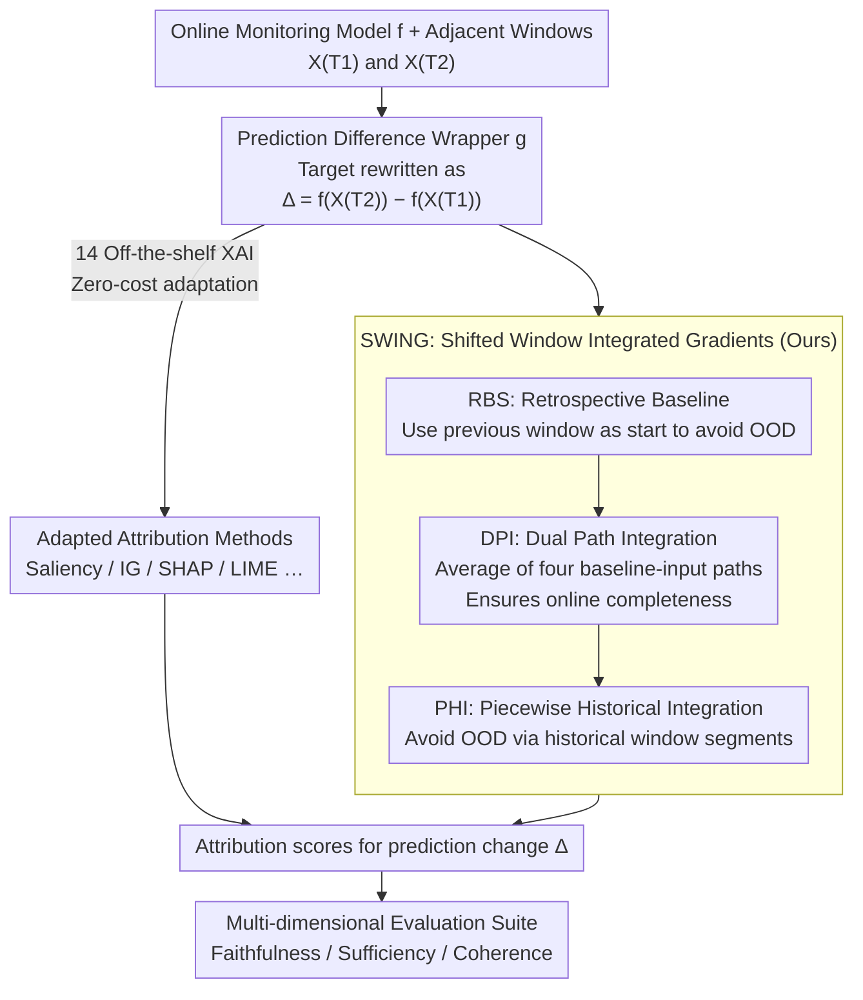

# Delta-XAI: A Unified Framework for Explaining Prediction Changes in Online Time Series Monitoring

**Conference**: ICLR 2026  
**arXiv**: [2511.23036](https://arxiv.org/abs/2511.23036)  
**Code**: [Anonymous GitHub](https://anonymous.4open.science/r/Delta-XAI)  
**Area**: Time Series / Explainable AI  
**Keywords**: XAI, Time Series, Online Monitoring, Feature Attribution, Integrated Gradients

## TL;DR
A unified Delta-XAI framework is proposed to adapt 14 existing XAI methods to the scenario of explaining prediction changes in online time series via a wrapper function. Furthermore, the SWING (Shifted Window Integrated Gradients) method is introduced, which utilizes past observations to construct integration paths for capturing temporal dependencies, consistently outperforming existing methods across multiple evaluation metrics.

## Background & Motivation
Online time series monitoring models are critical in sensitive domains such as healthcare (e.g., ICU monitoring) and finance. Clinicians and decision-makers need to understand why model predictions change between different time steps. While existing time series XAI methods have progressed, they suffer from three core issues:

**Background**: Most XAI methods analyze predictions at each time step independently, ignoring temporal dependencies and failing to explain "why the prediction changed from $t-1$ to $t$."

**Limitations of Prior Work**: Existing methods do not fully exploit the characteristics of online monitoring, where data arrives incrementally and predictions are updated continuously.

**Key Challenge**: There is a lack of a systematic evaluation framework for online scenarios, making it impossible to comprehensively assess the faithfulness, sufficiency, and coherence of explanations.

The **Key Challenge** lies in the need for an XAI framework that can simultaneously explain prediction changes (rather than single-point predictions), adapt to online dynamics, and be evaluated in a principled manner.

The **Key Insight** of this paper is not to reinvent XAI methods but to use a unified wrapper function to adapt 14 existing XAI methods to the new scenario of "explaining prediction differences" while proposing a complete evaluation system. The core innovation is the SWING method, which captures causal temporal dependencies by incorporating observations from past time steps into the integration path.

## Method

### Overall Architecture
The online monitoring model $f$ (e.g., LSTM) incrementally receives sliding windows and continuously outputs class probabilities. However, clinicians often care more about "why the risk changed from $T_1$ to $T_2$" rather than the raw prediction at a single step. For instance, a sepsis probability dropping from $90\%$ to $50\%$ indicates improvement, whereas a rise from $10\%$ to $50\%$ indicates deterioration; the same $50\%$ value carries opposite meanings. Delta-XAI therefore shifts the explanation target from a single prediction $f(X_{T})$ to the prediction change between adjacent steps $\Delta = f(X_{T_2}) - f(X_{T_1})$, outputting the attribution of each input feature to this change.

The pipeline consists of three segments: First, a **wrapper** $g$ is used to rewrite the attribution target of 14 existing XAI methods to $\Delta$, enabling zero-cost adaptation to the "change explanation" problem. Second, as experiments found that classic IG becomes highly effective after adaptation, this paper proposes **SWING**. It replaces the integration baseline of IG from a zero vector to the historical window and utilizes dual-path and piecewise linear integration to avoid Out-Of-Distribution (OOD) artifacts. Finally, a **multi-dimensional evaluation suite** (faithfulness, sufficiency, coherence, etc.) quantifies the explanation quality of each method.

### Key Designs

**1. Prediction Difference Wrapper: From "Explaining a Value" to "Explaining a Change"**

Existing XAI methods are mostly designed for static, single-point predictions—they answer "which features support $f(X_T)$" but cannot address "why the prediction changed from $T_1$ to $T_2$." Simply subtracting single-step attributions is insufficient: since $f$ is non-linear, calculating attribution on differential inputs or subtracting two attributions does not yield a valid explanation. The wrapper defines a new function $g(X_{T_1-W+1:T_2}) := f(X_{T_2}) - f(X_{T_1})$, reframing "explaining the difference" as "explaining the single output of $g$." Thus, any single-step attribution method $\varphi$ can be applied: $\varphi(f, X_{t,d}\mid T_1\!\to\!T_2) = \varphi(g, X_{t,d}\mid T_2)$. This does not modify method internals; 14 paradigms including gradient-based (Saliency, IG, Gradient×Input) and perturbation-based (KernelSHAP, LIME, Occlusion) methods can be adapted at zero cost. For methods satisfying linearity and completeness (IG, SHAP, DeepLIFT), the difference attribution simplifies to the difference of two-step attributions, allowing for cache reuse and proving that "the sum of all feature attributions exactly equals the prediction change" (online completeness), making explanations additive and auditable.

**2. SWING: Replacing Zero Baselines with Historical Windows**

Experiments found that classic IG becomes very strong after wrapper adaptation, but it still has two major flaws: integrating from a **zero baseline** to the current window often results in OOD samples, and linear paths discard temporal context. SWING modifies the IG line integral framework $\varphi^{\gamma}_{\text{IG}}(f, X_{t,d}\mid T)=\int_0^1 \frac{\partial f(\gamma(\alpha))_{\hat c}}{\partial X_{t,d}}\,\frac{\partial \gamma_{t,d}(\alpha)}{\partial \alpha}\,d\alpha$ with three enhancements:

$$\gamma_i(\alpha)=(1-\alpha)\,X_{T_i-W:T_i-1}+\alpha\,X_{T_i-W+1:T_i},\quad \alpha\in[0,1]$$

**Retrospective Baseline Shift (RBS)** changes the integration starting point from a zero vector to the "previous window" $X_{T_i-W:T_i-1}$, ensuring the path stays close to the data manifold and naturally encoding temporal context. **Dual Path Integration (DPI)** solves the issue where RBS uses different baselines for $T_1$ and $T_2$, which would break completeness; it integrates and averages four "baseline-input" path combinations, maintaining the online completeness theorem through symmetry. **Piecewise Historical Integration (PHI)** handles cases where linear paths might still cross OOD regions when steps are far apart by following the actual historical segments. SWING still satisfies the three IG axioms: online completeness, implementation invariance, and anti-symmetry. It is implemented via discrete approximation with $n$ uniform samples.

**3. Multi-dimensional Evaluation Suite: Measuring Quality via Reliable Baselines**

The paper identifies a common pitfall: using **zero/mean** replacement for removed features to measure faithfulness creates OOD samples by ignoring temporal autocorrelation, which exaggerates prediction changes (OOD score 0.840 for zero replacement vs. 0.093 for forward filling on MIMIC-III). The suite thus uses **forward filling** for feature replacement. Metrics include: **Faithfulness**, measuring the Area Under Prediction Difference (AUPD) as features are removed from high to low attribution; **Sufficiency**, seeing if保留 high-attribution features can reconstruct the change (AUPP); and **Coherence**, measuring whether explanations are stable and consistent over time—a dimension unique to online scenarios. All metrics are derived via perturbations and statistical tests without additional training.

### Loss & Training
The contribution lies in the explanation and evaluation methods; no new models are introduced. The target LSTM is trained with standard time series prediction loss. SWING and the wrapper only read gradients from the pre-trained model. The evaluation suite is entirely based on perturbations and statistical tests—there are no additional trainable parameters in the explanation pipeline. The primary cost stems from path integral sampling in SWING ($n$ points) and the overhead of evaluating 14 methods.

## Key Experimental Results

### Main Results
Experiments were primarily conducted on the MIMIC-III clinical dataset using an LSTM as the target model. A systematic comparison was performed between 14 adapted XAI methods and SWING.

| Metric | Best Traditional Method | SWING | Improvement Trend |
|----------|-------------|-------|---------|
| Faithfulness | Integrated Gradients | SWING | Consistently outperfroms IG |
| Sufficiency | IG / Gradient×Input | SWING | Significant advantage in multiple scenarios |
| Coherence | IG | SWING | Stronger temporal consistency |

### Ablation Study

| Configuration | Key Finding | Description |
|------|---------|------|
| Traditional vs. Adapted | Significant performance gain | Effectiveness of the wrapper function |
| Zero-baseline IG vs. SWING | SWING is generally superior | Shifted windows avoid OOD effects |
| Classic Gradient vs. Modern | Classic methods can surpass modern ones | Counter-intuitive: "older" methods perform better after adaptation |
| Different Window Sizes | Optimal at specific sizes | Excessive window size may introduce noise |

### Key Findings
- Classic gradient-based methods (e.g., IG) can outperform specialized time series XAI methods proposed in recent years once temporally adapted, suggesting that "old methods + good adaptation" can be more effective than "specialized new designs."
- SWING effectively captures temporal dependencies while avoiding OOD issues by leveraging the natural structure of online scenarios (using the previous time step as a reference baseline).
- The evaluation framework reveals strengths and weaknesses across different dimensions; no single method is optimal across all (except SWING).
- XAI evaluation in online scenarios is more challenging than in static ones, requiring additional dimensions like temporal coherence.

## Highlights & Insights
- **Unified Framework Philosophy**: Instead of reinventing the wheel, the wrapper function provides a unified adaptation, allowing the framework to immediately benefit from any new XAI method.
- **Counter-intuitive Discovery**: The fact that adapted IG outperforms specialized time series XAI methods suggests that accurate problem definition may be more important than complex architectural design.
- **Simplicity of SWING**: By simply shifting the integration baseline from zero to the previous time step, it simultaneously resolves OOD issues and temporal dependency capture.
- **Completeness of the Suite**: By evaluating faithfulness, sufficiency, and coherence, it provides a standardized evaluation tool for online XAI research.

## Limitations & Future Work
- Experiments were mainly conducted on MIMIC-III with LSTMs; generalization to other datasets (e.g., financial time series) and architectures (e.g., Transformers) needs verification.
- The shifted window mechanism assumes smooth changes between adjacent steps and may be limited during extreme abrupt events (e.g., market crashes).
- The implementation of the wrapper for 14 methods currently focuses on RNN-like models; other architectures may require specific adaptations.
- While the metrics are comprehensive, there is a lack of validation against human expert judgment (human evaluation).
- The computational cost of evaluating all 14 methods is high; practical applications may require a method selection strategy.

## Related Work & Insights
- **Integrated Gradients (IG)**: This work improves directly upon IG, demonstrating that deep understanding of classic methods can yield efficient new approaches.
- **Time Series XAI (e.g., TimeSHAP, WinIT)**: The unified framework places these methods under a single evaluation standard, providing a valuable comparative perspective.
- **Online Learning & Concept Drift**: The online setting of Delta-XAI has potential links to concept drift detection; future work could explore their combination.
- The "adaptation + unified evaluation" paradigm can be extended to other XAI application scenarios, such as explaining online recommendation systems.

## Technical Implementation Details
- SWING integration paths from $x_{t-1}$ to $x_t$ are linear, typically using 50-300 steps to balance accuracy and efficiency.
- The 14 supported XAI methods include: Saliency, InputXGradient, GuidedBackprop, DeepLift, IG (standard and SWING variants), SmoothGrad, GradientSHAP, KernelSHAP, LIME, Occlusion, Feature Ablation, Feature Permutation, Shapley Value Sampling, etc.
- The LSTM model performs online mortality prediction on MIMIC-III using 48-hour multivariate clinical time series (vitals, labs, etc.).
- Faithfulness metrics use a Top-k masking strategy: progressively masking the top-$k$ features by attribution score and measuring the decay curve of the prediction change magnitude.
- Hardware: Intel Xeon Silver 4210 CPU and 8×NVIDIA TITAN RTX GPUs.

## Rating
- Novelty: ⭐⭐⭐⭐ (Unified framework + SWING is novel, though based on clever combinations of existing methods)
- Experimental Thoroughness: ⭐⭐⭐⭐ (Extensive comparison of 14 methods, though dataset variety is limited)
- Writing Quality: ⭐⭐⭐⭐ (Clear problem definition and well-structured diagrams)
- Value: ⭐⭐⭐⭐ (Provides critical benchmarks and tools for online time series XAI)

<!-- RELATED:START -->

## Related Papers

- [\[ICLR 2026\] Online Time Series Prediction Using Feature Adjustment](online_time_series_prediction_using_feature_adjustment.md)
- [\[ICLR 2026\] pyrregular: A Unified Framework for Irregular Time Series, with Classification Benchmarks](pyrregular_a_unified_framework_for_irregular_time_series_with_classification_ben.md)
- [\[ICLR 2026\] Towards Robust Real-World Multivariate Time Series Forecasting: A Unified Framework](towards_robust_real-world_multivariate_time_series_forecasting_a_unified_framewo.md)
- [\[ICLR 2026\] ST-HHOL: Spatio-Temporal Hierarchical Hypergraph Online Learning for Crime Prediction](st-hhol_spatio-temporal_hierarchical_hypergraph_online_learning_for_crime_predic.md)
- [\[ICLR 2026\] A Unified Federated Framework for Trajectory Data Preparation via LLMs](a_unified_federated_framework_for_trajectory_data_preparation_via_llms.md)

<!-- RELATED:END -->
