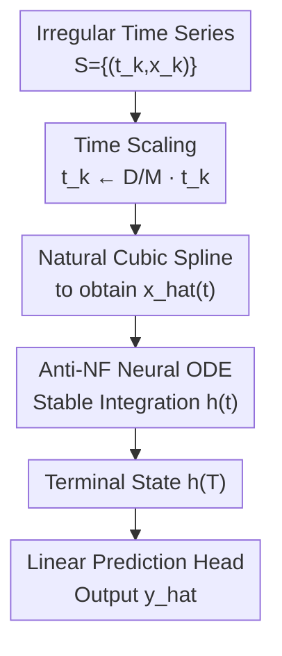

# DeNOTS: Stable Deep Neural ODEs for Time Series

**Conference**: ICLR 2026  
**OpenReview**: [https://openreview.net/forum?id=SFoDJZ1sSk](https://openreview.net/forum?id=SFoDJZ1sSk)  
**Paper**: [OpenReview](https://openreview.net/forum?id=SFoDJZ1sSk)  
**Code**: https://github.com/Ilykuleshov/denots_iclr2025  
**Area**: Time Series / Neural ODEs / Continuous-time Modeling  
**Keywords**: Neural Controlled Differential Equations, Time Scaling, Negative Feedback, Irregular Time Series, Stability  

## TL;DR
DeNOTS shifts the "depth" of Neural CDE from decreasing solver tolerance to explicitly lengthening integration time, and stabilizes long-duration integration with anti-phase negative feedback, achieving stronger expressivity, more stable trajectories, and lower discretization error accumulation across irregular time series classification, regression, and forecasting tasks.

## Background & Motivation
**Background**: Irregular time series often feature non-uniform sampling and missing observations. Neural CDE (NCDE) provides a natural continuous-time framework for such data: first interpolating discrete observations into a continuous control signal $\hat{x}(t)$, then evolving a hidden state $h(t)$ along a differential equation defined by a neural network, and finally using the terminal state $h(T)$ for sequence-level prediction. Compared to standard RNNs, these models explicitly handle observation times; compared to direct imputation followed by Transformers or SSMs, they preserve the structure of continuous-time systems.

**Limitations of Prior Work**: In Neural ODE/CDE, the number of function evaluations (NFE) is often regarded as the continuous-time counterpart to the "number of layers" in discrete networks. Intuitively, more NFEs should imply a "deeper" model with stronger expressivity. However, in practice, NFE is primarily controlled indirectly by the ODE solver's tolerance: reducing tolerance forces the solver to take more steps, but this mainly improves numerical precision rather than stably expanding the function class representable by the model. Experiments in the paper also show that relying on lower tolerance to increase NFE and performance is unreliable.

**Key Challenge**: Pursuing stronger expressivity on a fixed time interval theoretically requires a larger Lipschitz constant for the vector field, which means larger weight norms. As weight norms increase, tanh/sigmoid activations tend to saturate, and ReLU may lead to dying neurons or trajectory explosion. Conversely, if the integration interval is lengthened, NFE increases naturally, but standard vector fields prone to uncontrolled growth of hidden states during long-duration integration. Thus, this paper addresses a specific contradiction: the desire to make Neural CDEs deep without allowing long-interval integration to collapse training stability.

**Goal**: The authors aim to transform the depth of Neural CDE into a controllable modeling hyperparameter rather than a side effect of solver error tolerance. Specifically, the model must achieve three things: enhance expressivity using longer integration times, maintain hidden trajectory stability over long intervals, and prevent discretization errors from accumulating continuously along sequence length.

**Key Insight**: The key observation is that time itself does not have to be merely a physical coordinate given by the data; it can also be treated as a control knob for expressivity. By scaling timestamps as $t_k \leftarrow \frac{D}{M}t_k$, the integration interval is lengthened, requiring more function evaluations from the solver, which is equivalent to giving the model a deeper continuous computational path. Since stretching time amplifies instability, the authors introduce the concept of negative feedback from control systems into the Neural CDE vector field.

**Core Idea**: DeNOTS uses time scaling to explicitly increase continuous depth and utilizes anti-phase negative feedback (Anti-NF) to keep hidden trajectories stable during long-duration integration while preventing the loss of early information.

## Method

### Overall Architecture
The input to DeNOTS is a time series $S=\{(t_k,x_k)\}_{k=1}^n$, and the output is a sequence-level prediction $\hat{y}$. It first normalizes timestamps relative to the dataset scale and multiplies them by a tunable depth parameter $D$. It then uses natural cubic splines to convert discrete observations into a continuous signal $\hat{x}(t)$, followed by integration using a GRU-type vector field with Anti-NF to obtain the terminal hidden state $h(T)$. Finally, a linear head outputs classification or regression results.

The contribution of this workflow is not in introducing a complex backbone but in bundling "continuous depth," "stability," and "error robustness" within the same ODE dynamics: time scaling facilitates depth, Anti-NF prevents trajectory explosion, and synchronized theoretical analysis explains why discretization errors do not grow linearly or exponentially with $T$.

### Key Designs
**1. Time Scaling: Turning NFE from a Numerical Precision Knob to an Expressivity Knob**

Standard Neural CDEs typically solve $\frac{dh(t)}{dt}=g_\theta(\hat{x}(t),h(t))$ and use $h(T)$ as the sequence embedding. To make it deeper, the most direct approach seems to be lowering solver tolerance. However, the paper points out that this confuses two concepts: tolerance controls numerical error, while expressivity concerns how many non-linear transformations the model can compose in continuous time.

The authors provide a Lipschitz perspective: for a vector field $g$, if its Lipschitz constants for input and hidden state are $M_x$ and $M_h$, the effective Lipschitz upper bound of the mapping relative to the initial state contains terms like $e^{M_h t}$. In other words, lengthening the integration interval itself can expand the representable mapping class without increasing weight norms; forcing depth in a fixed interval requires increasing $M_h$, which brings instability. Thus, DeNOTS sets $t_k \leftarrow \frac{D}{M}t_k$, where $D$ is the tunable time scale and $M$ is a normalization constant. In experiments, as $D$ increases, the weight $l_2$ norm actually decreases, suggesting the model utilizes the longer computational path rather than relying on sheer weight magnitude.

**2. Anti-NF: Stabilizing Trajectories while Retaining Long-term Memory**

Time scaling lengthens the integration interval, making standard vector fields prone to hidden state norm explosion. The simplest negative feedback subtracts the current state from the derivative, e.g., Sync-NF in GRU-ODE: $GRU(\hat{x}(t),h(t))-h(t)$. While this restricts trajectories, the update and decay terms act simultaneously, causing old state influence to decay continuously; the model thus forgets early information like early RNNs.

DeNOTS adopts a more subtle approach: it passes $-h(t)$ instead of $h(t)$ into the GRU unit, making the vector field approximately:
$g_\theta(\hat{x}(t),h(t))=(1-z)\odot n - z\odot h$.
Here, $z$ not only gates updates but also modulates negative feedback intensity. When stability is needed, $z\odot h$ pulls the state back; when retention is needed, the gate can weaken this constraint. This is called Anti-NF because the update and feedback terms are not activated synchronously by the same pattern but form an anti-phase division of labor within the gate.

The theoretical form is $\frac{dh}{dt}=a f_\theta(\hat{x},h)-b h$. Under conditions like $aL_h<b$, the system is input-to-state stable: hidden states will not grow infinitely given bounded inputs. Importantly, Anti-NF does not always force a strict forgetting condition like Sync-NF, allowing learnable space for long-term memory.

**3. Stable Error Bounds: Preventing Error Accumulation**

A frequently underestimated issue in Neural CDE is its reliance on approximations: input interpolation and numerical integration both introduce discretization errors. If the vector field is unstable, these errors propagate and amplify, which is dangerous after lengthening the interval.

The paper denotes the true continuous system as $h^*(t)$ and the error-affected system as having an extra perturbation $\xi(t)$ in the vector field. Under the same negative feedback conditions, the terminal hidden state error satisfies a bound like:
$E\|h(T)-h^*(T)\|_2^2 \le (\frac{a}{b-aL_h})^2\xi_{PW}^2$.
This implies that error magnitude is controlled by the feedback margin $b-aL_h$ and instantaneous error, rather than accumulating with total integration time $T$.

### Loss & Training
DeNOTS is a backbone; the training objective varies by task: MSE for regression ($R^2$ reported), binary cross-entropy for binary classification (AUROC reported), and cross-entropy for multi-class classification (Accuracy reported). All models are trained end-to-end using Adam with a learning rate of $10^{-3}$ and early stopping.

In implementation, the paper uses the adaptive DOPRI5 solver from TorchODE with tolerance fixed at $10^{-3}$ and uses AutoDiff for backpropagation. Hidden dimensions are mostly set to 32 to ensure parameter comparability with baselines like GRU, Neural CDE, Neural RDE, Mamba, and Transformers.

## Key Experimental Results

### Main Results
The paper compares DeNOTS with RNN/GRU, Transformer variants, Mamba, GRU-ODE, Neural CDE, and Neural RDE across four benchmarks: UWGL and InsectSound (classification), Pendulum (regression), and Sepsis (binary classification).

| Dataset | Metric | DeNOTS | Strongest Baseline | Conclusion |
|-------|------|--------|---------------|------|
| UWGL | Accuracy | $0.82 \pm 0.03$ | Neural CDE $0.82 \pm 0.03$ | Tied with best; maintains unified stability. |
| InsectSound | Accuracy | $0.44 \pm 0.02$ | TempFormer $0.43 \pm 0.02$ | Slightly outperforms sequence baselines. |
| Pendulum | $R^2$ | $0.79 \pm 0.02$ | Neural RDE $0.78 \pm 0.03$ | Advantageous in irregular regression. |
| Sepsis | AUROC | $0.937 \pm 0.005$ | Sync-NF $0.932 \pm 0.003$ | Best on high-missing medical data. |

A rank table shows DeNOTS holds rank 1 across all tasks with an average rank of 1.0, while Sync-NF SNCDE follows at 1.25.

### Ablation Study
The study systematically evaluates two ways to increase NFE. Core findings: increasing NFE via lower tolerance has weak correlation with performance; time scaling is only reliable when combined with stable vector fields; Anti-NF is the most consistent across task types.

| Configuration | Metric (Sepsis) | Description |
|-------------|----------|------|
| Bump, Tanh Default | AUROC $0.77 \pm 0.02$ | Insufficient expressivity without depth. |
| Bump, Tanh Time Scale | AUROC $0.99 \pm 0.00$ | Stretching time is highly effective. |
| Pendulum, D=20 No NF | $R^2 \approx -6\times 10^6$ | Standard GRU integration is severely unstable. |
| Pendulum, D=20 Anti-NF | $R^2=0.83$ | Best performance; stable and flexible. |

For NFE-metric correlation, Anti-NF + Time Scaling shows Pearson correlations of $0.9, 0.8, 1.0$ across tasks, whereas lowering tolerance only yields $0.5, 0.5, 0.4$, proving that "more solver steps" itself is not the key—using time as an expressivity parameter is.

### Key Findings
- **Time Scaling** is the core empirical finding: increasing $D$ at a fixed tolerance yields more stable positive correlation between NFE and performance than decreasing tolerance.
- **Negative Feedback** is the prerequisite for time scaling. Non-stable or weakly stable vector fields (ReLU, Tanh) fail or explode during long-duration integration.
- **Benefits of Anti-NF in Memory**: On the SineMix task requiring retention of early frequencies, Sync-NF fails ($R^2=0.3$) while Anti-NF succeeds ($R^2=1$).
- **Robustness**: DeNOTS significantly outperforms non-feedback versions under drop attacks and change attacks, with Anti-NF showing slight advantages over Sync-NF in handling perturbations.

## Highlights & Insights
- **Depth as Time Scale**: The paper stops using solver tolerance as a back-door to depth and proposes $D$ as an explicit hyperparameter. This differentiates numerical precision from the richness of the function class.
- **Clean GRU Modification**: Simply passing $-h$ instead of $h$ into the hidden state input of a GRU provides negative feedback while maintaining gating flexibility. This is much lighter than adding complex stability losses.
- **Theory-Practice Alignment**: Stability, error bounds, and interpolation errors directly map to the points where DeNOTS might fail after scaling time.
- **Inspiration for Continuous Models**: While many works normalize time to $[0,1]$, DeNOTS suggests the time interval itself can be a source of modeling capacity. This might extend to SDEs, point processes, or mapping sequences to continuous paths.

## Limitations & Future Work
- **Computational Cost**: Neural CDEs are sequential and cannot be parallelized like Transformers. Time scaling further increases solver steps, making it better for performance-critical or irregularly-sampled tasks rather than low-latency ones.
- **Model Scale**: Experiments used hidden dimensions of roughly 32. It remains to be shown if the benefits hold for much larger models or extremely high-dimensional industrial sequences.
- **Hyperparameter Tuning**: $D$ must be selected via a validation set, and there are no automated rules yet for its selection relative to tolerance or missingness.
- **Theoretical Assumptions**: Practical training trajectories might not always strictly stay within the ideal stable region defined by Lipschitz assumptions.

## Related Work & Insights
- **vs Neural CDE**: DeNOTS adopts the CDE framework but utilizes time scaling as an expressivity parameter and Anti-NF for long-interval stability.
- **vs GRU-ODE / Sync-NF**: Sync-NF forces strict feedback that causes forgetting. Anti-NF uses gates to modulate feedback, allowing for better long-term memory.
- **vs Neural RDE**: Neural RDE uses rough path features for long sequences but can be computationally heavy and occasionally diverges (e.g., on Sepsis). DeNOTS maintains a smaller parameter footprint with better average ranking.
- **vs Transformers / Mamba**: Transformers/Mamba excel at parallelization but require external handling of irregular times. DeNOTS integrates irregular time, continuous dynamics, and error handling into a single ODE framework.

## Rating
- **Novelty**: ⭐⭐⭐⭐☆ Time scaling as a depth mechanism is highly distinct; Anti-NF is an effective refinement.
- **Experimental Thoroughness**: ⭐⭐⭐⭐☆ Covers expressivity correlation, stability, memory, and robustness attacks.
- **Writing Quality**: ⭐⭐⭐⭐☆ Logical and comprehensive, though the density of ODE theory may be high for non-specialists.
- **Value**: ⭐⭐⭐⭐☆ Provides a clear path for making Neural CDEs deep without sacrificing numerical stability.

<!-- RELATED:START -->

## Related Papers

- [\[CVPR 2026\] Stable Spike: Dual Consistency Optimization via Bitwise AND Operations for Spiking Neural Networks](../../CVPR2026/time_series/stable_spike_dual_consistency_optimization_via_bitwise_and_operations_for_spikin.md)
- [\[ICLR 2026\] STABLE: Shift-Tolerant Allocation via Black–Litterman Using Conditional Diffusion Estimates](stable_shift-tolerant_allocation_via_black-litterman_using_conditional_diffusion.md)
- [\[ICLR 2026\] Weight-Space Linear Recurrent Neural Networks](weight-space_linear_recurrent_neural_networks.md)
- [\[ICML 2026\] Interpretability in Deep Time Series Models Demands Semantic Alignment](../../ICML2026/time_series/interpretability_in_deep_time_series_models_demands_semantic_alignment.md)
- [\[ICLR 2026\] Tuning the burn-in phase in training recurrent neural networks improves their performance](tuning_the_burn-in_phase_in_training_recurrent_neural_networks_improves_their_pe.md)

<!-- RELATED:END -->
