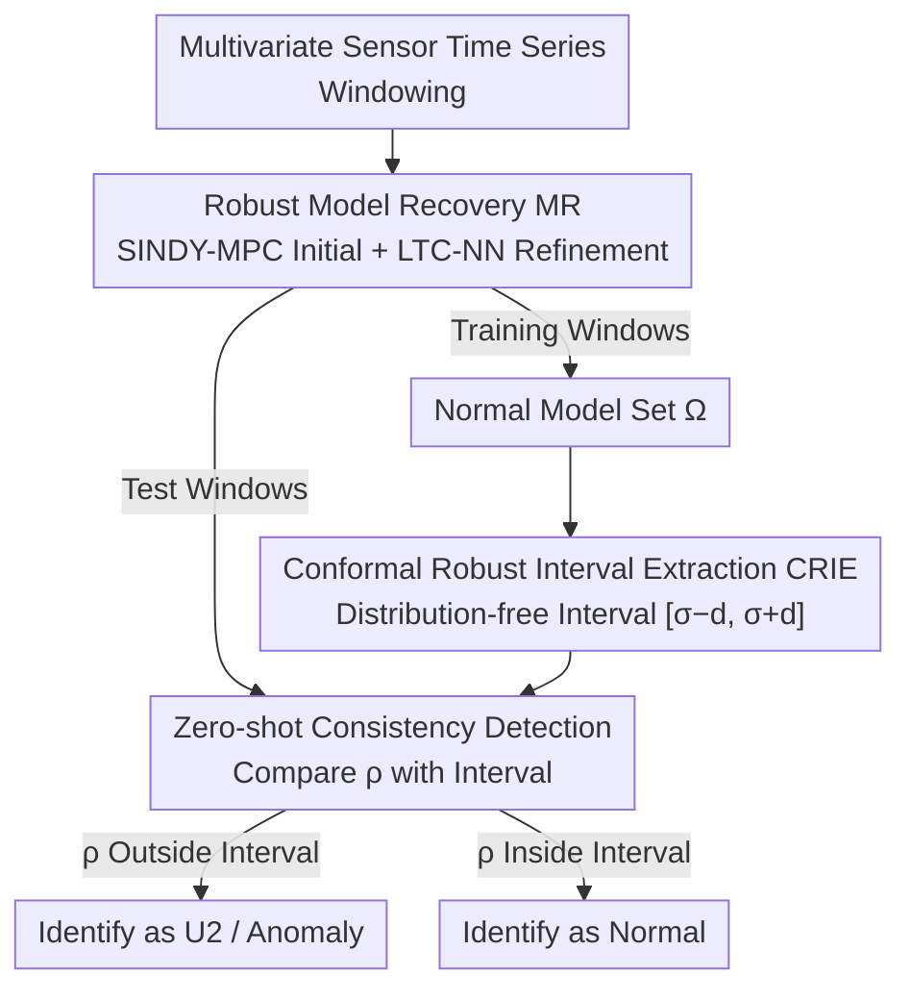

# Detection of Unknown Unknowns in Autonomous Systems

**Conference**: ICLR2026  
**OpenReview**: [https://openreview.net/forum?id=GrsofC2FqF](https://openreview.net/forum?id=GrsofC2FqF)  
**Code**: https://github.com/ImpactLabASU/U2Recognition  
**Area**: Multivariate Time Series Anomaly Detection / Autonomous System Safety  
**Keywords**: Unknown Unknowns (U2), Zero-shot Anomaly Detection, Sparse Dynamics Modeling, Conformal Inference, Autonomous Systems

## TL;DR
Addressing "unknown unknowns" (U2) scenarios that are only exposed after the deployment of autonomous systems (e.g., UAVs, autonomous driving, automated drug delivery), this paper notes that such risks **do not cause marginal distribution shifts**. Consequently, existing multivariate time series anomaly detection (MTAD) methods relying on "distribution shift" collectively fail. The authors propose SPIE-AD, which continuously recovers the underlying sparse dynamics model from signals and utilizes conformal inference to determine if the model deviates from the normal range. This achieves true zero-shot U2 detection, outperforming all baselines across 8 U2 benchmarks and 6 real-world datasets without any cheating tricks.

## Background & Motivation
**Background**: Autonomous systems such as Unmanned Aerial Vehicles (UAV), Autonomous Cars (AC), and Automated Insulin Delivery (AID) are composed of coupled perception, decision-making, and execution modules. They are too complex to exhaustively test all operational scenarios before launch. Scenarios ignored during development but occurring occasionally during deployment are "unknown unknowns" (U2), which are primary triggers for accidents (e.g., Boeing MCAS mis-triggering, wing elevator jamming, electromagnetic attacks on sensors). Detection of U2 currently consists of only sporadic solutions in the image domain, while the time-series signal domain remains nearly blank.

**Limitations of Prior Work**: The industry naturally considers "directly reusing off-the-shelf MTAD methods." However, this paper reveals that this path is non-viable. Mainstream MTAD (ARIMA, Kalman, PCA, Autoencoders, LSTM, Anomaly Transformer, foundation models like OFA, etc.) are built on an implicit assumption: anomalies cause **marginal distribution shifts** (out-of-distribution, OOD). They thus learn a high-dimensional latent space representation of the normal distribution from training data and score deviations. U2 precisely fails to satisfy this assumption.

**Key Challenge**: There is a subtle but fatal difference between U2 and traditional anomalies. Traditional anomalies cause the marginal distribution $P_t(x)$ of a window to deviate from the global $P(x)$, while the dynamics of the underlying generation process remain stationary. U2 is the opposite—it **does not change the marginal distribution** (KS tests show no statistically significant difference between U2 data and normal data) but causes the **functional dependencies between variables to undergo non-stationary drift**. In other words, there are no discriminative features in the raw sensor readings to distinguish normal from U2; any purely data-driven feature method is powerless.

Worse, this paper systematically exposes that high scores reported by SOTA MTAD rely heavily on two unrealistic tricks: **point adjustment (PA)**—where correctly detecting a single point in a continuous anomaly window counts all missed points as hits, severely inflating precision; and **threshold learning (TL) with data leakage**—where anomaly score thresholds are tuned directly on the test set and its labels. This paper proves that with PA+TL, even a **completely non-trained** deterministic algorithm can match or exceed SOTA; once PA/TL are removed, existing methods collapse on U2 benchmarks.

**Goal**: Achieve usable multivariate U2 detection under three realistic constraints: (i) U2 has no distribution shift, (ii) the validation set contains zero anomaly/U2 samples (true zero-shot), and (iii) no PA cheating is allowed.

**Core Idea**: Since U2 is hidden in the **dynamical relationships between variables** rather than the data distribution, the approach avoids modeling the data distribution directly. Instead, it continuously recovers the underlying sparse nonlinear dynamics model coefficients $\omega$ from signals and monitors whether $\omega$ deviates from the robust interval of the "most likely model for normal operation"—replacing data-space shifts with model-space shifts.

## Method

### Overall Architecture
SPIE-AD (SParse model Identification Enhanced Anomaly Detection) moves anomaly detection from the "data space" to the "model space." The system assumes sensor time series follow a sparse nonlinear dynamics equation $\dot{X}(t) = f(X(t), \omega, t)$, where $\omega$ denotes a small set of coefficients defining the sparse model. The workflow follows the classic "train/validate/evaluate" triad, but the objects processed in each stage change from raw signals to recovered model coefficients $\omega$:

- **Training Phase**: Training data is divided into windows. Robust Model Recovery (MR) is performed on each window to obtain a set of coefficients $\omega_i$, forming a collection of normal operating models $\Omega$;
- **Validation Phase**: Using another portion of the training data (without any anomaly labels), Conformal Robust Interval Extraction (CRIE) is performed to obtain a robust interval for normal operation $[\sigma-d, \sigma+d]$;
- **Evaluation Phase**: MR is continuously performed on test windows to obtain $\omega$. Its robustness $\rho$ relative to $\Omega$ is calculated; values falling outside the interval are classified as U2.

### Key Designs

**1. Reformulating U2 as "Dynamics Structure Drift" rather than "Distribution Shift"**

This is the conceptual foundation that dictates all subsequent methodological choices. The authors provide two parallel definitions: Window $W$ is a **U2 event** if and only if the marginal distribution remains constant $P_t(x) \approx P(x)\ \forall t \in W$, but the process becomes non-stationary $\omega(t) \neq \omega(t+\tau)$ (coefficients drift over time). Conversely, $W$ is a **traditional anomaly** if and only if a local marginal shift occurs $P_t(x) \not\approx P(x)$, but the underlying process remains stationary $\omega(t) = \omega(t+\tau)$. This definition mathematically separates U2 from anomalies: the former concerns the model space, the latter the data space. Using KS tests across 8 datasets, the authors demonstrate that standard anomaly data shows CDF differences from normal data as high as 200+ ($H=1$, statistically significant), while U2 data differences are as low as 0.4~2 ($H=0$, non-significant). However, in the **model coefficient space** extracted via SINDY-MPC, U2 and normal data show significant differences. Because the discriminative signal exists only in the model space, purely data-driven MTAD is destined to fail at capturing U2.

**2. Robust Model Recovery (MR): SINDY-MPC Baseline with Liquid Time-Constant Network Refinement**

To operate in the model space, one must stably recover $\omega$ from **real, noisy, low-sampling-rate** signals. For an $n$-dimensional system with $M$-th order nonlinearity, there are $\binom{M+n}{n}$ candidate nonlinear terms; a sparse model retains only a few $p \ll \binom{M+n}{n}$ terms. Directly using $L_2$ sparse regression like SINDY-MPC on real data leads to significant degradation: the variance between $\omega_i, \omega_j$ recovered from adjacent windows is high, making it difficult to distinguish "noise-induced coefficient fluctuation" from "true U2-induced coefficient drift," resulting in uncontrolled false positive rates.

The solution is refinement via **Liquid Time-Constant Neural Networks (LTC-NN)**. The process is as follows: SINDY-MPC provides an initial value $\omega^{(0)}$; window data is fed into a fully connected network of $V$ LTC-NN units, with an output layer of $\binom{M+n}{n}$ nodes using ReLU activation; the key trick is **using the sparse structure of $\omega^{(0)}$ to dropout dense layer nodes** (nodes corresponding to zero terms are dropped), and **clamping the output of the $i$-th node within the interval $[(1-\psi)\omega_i,\ (1+\psi)\omega_i]$** ($\psi$ is a hyperparameter anchoring the refined value near the SINDY initial value). The refined $\omega_{est}$ is fed into an ODE45 solver to reconstruct the signal $Y$, with the loss being the MSE between $X$ and $Y$ across all dimensions/steps: $\sum_t \|Y(t)-X(t)\|^2 < \epsilon$. The continuous-time latent nodes of LTC-NN are naturally suited for characterizing dynamics, making recovery more robust to noise and low sampling rates—the reason SPIE-ADL significantly outperforms the pure SINDY version, SPIE-ADS, on real data.

**3. Conformal Robust Interval Extraction (CRIE): Distribution-free, Zero-shot Characterization of "Normal Model"**

Given a set of normal models $\Omega$, how is it determined if a new model $\omega_v$ has deviated? The authors define a robustness metric $\rho(\omega_v, \Omega) = \frac{1}{|\Omega|}\sum_{i=1}^{|\Omega|} \Omega_i^T \omega_v$, which is essentially the average inner product (projection consistency) between the new coefficients and the normal model set. The challenge is that U2 detection **lacks any anomaly/U2 validation samples** to set a threshold, precluding Extreme Value Theory (EVT) + Peak-Over-Threshold commonly used in SOTA—which requires distribution assumptions and often leaks test data as validation data.

CRIE uses **conformal inference**, a distribution-free tool, to set the interval. The training set is split into two disjoint sets $I_T, I_V$. Coefficients recovered from $I_T$ form $\Omega$. For each $\omega_i$, its robustness relative to the "leave-one-out set" $\rho(\omega_i, \Omega/\omega_i)$ is calculated, and the mean $\sigma$ is taken. Then, $\omega^v_j$ is recovered from $I_V$, the residuals $\rho(\omega^v_j, \Omega) - \sigma$ are calculated and sorted, and the $\lceil(|I_V|/2+1)(1-\alpha)\rceil$-th value is taken as the half-width $d$. The paper cites a theorem by Lei et al. to prove: for any new point, if the reconstruction error satisfies $\|L(X_i,\omega_i)-X_i\|^2 \le \epsilon$, there is a coverage guarantee $P(\rho(\omega_{m+1}^v, \Omega) \in [\sigma-d, \sigma+d]) \ge 1-\alpha$. $\alpha$ is the miscoverage rate, controlling the interval width $d$. The entire process uses only training data and no anomaly labels, avoiding data leakage (violating A2) and distribution assumptions.

**4. Zero-shot Consistency Detection and AnomalySimpleton Evaluation**

The detection algorithm is straightforward: slide a window over test data, perform MR to recover $\omega_i$, calculate robustness $\rho$, and compare it with the CRIE interval $[\sigma-d, \sigma+d]$. Because the model space retains only low-dimensional sparse representations with lower entropy, normal scenarios are easier to characterize. Meanwhile, U2 causes misalignment in variable relationships, amplifying $\rho$ deviations, allowing for **high precision without PA** (addressing A3).

To act as a "truth-revealing mirror" for evaluations, the authors propose **AnomalySimpleton**—a deterministic, non-learning algorithm. It selects a window $W$ from training data and calculates statistics like mean, standard deviation, and skewness. For each test window, it calculates the same statistics and identifies an anomaly if they deviate by more than $P\%$ from training values. $W$ and $P$ are obtained via brute-force search for "two maximally separable clusters" on the **test set** (intentionally taking advantage of PA+TL). Results show it can match or exceed SOTA learning methods—proving that SOTA scores largely stem from evaluation cheating rather than capability, supporting the claim that re-testing at K=100 (without PA) and without anomaly validation sets (without TL) is mandatory.

### Loss & Training
The objective for MR is the reconstruction MSE $\sum_{t=1}^N \|Y(t)-X(t)\|^2 < \epsilon$, where $Y$ is reconstructed via ODE45 using refined coefficients $\omega_{est}$. Hyperparameters (miscoverage rate $\alpha$, SMR polynomial order, sparsity level, window size $k$) are all brute-force searched **on training data only**. The goal is to maximize the robust interval coverage $r > 80\%$ of training points while minimizing interval width $d$, tuned per application. SINDY-MPC uses the original author's code, LTC-NN is modified from Hasani's open-source version, and CRIE/detection are implemented in Matlab 2022b.

## Key Experimental Results

### Main Results
A total of 14 datasets: 6 synthetic U2 (UAVEMA/UAVSimG/F8Stuck/F8Slow/AIDPhantom/AIDCartridge), 2 real-world U2 (Medtronic drug delivery tube blockage, EEG epilepsy seizure), 3 real-world MTAD (SMD/SMAP/MSL), and 3 large-scale univariate (UCR/Yahoo/NAB). All methods report results both **with PA(+)** and **without PA**.

| Dataset | Metric | SPIE-ADL (No PA) | Best Baseline (No PA) | Note |
|:---|:---|:---|:---|:---|
| F8Stuck (Synth) | F1 | 92.0 | AT 80.3 | SPIE high Precision/Recall without PA |
| UAVSimG (Synth) | F1 | 94.2 | GANF 64.3 | Baselines collapse to 60s without PA |
| UAVEMA (Synth) | F1 | 96.5 | GAT 36.0 | Most significant gap |
| AIDCartridge (Synth) | F1 | 91.5 | OFA 13.8 | Learning methods almost fail |
| Medtronic (Real U2) | F1 | 70.0 | OFA 57.9 | LTC-NN provides max gain on noisy real data |
| Epilepsy (Real U2) | F1 | 69.0 | iForest 33.1 | — |

Key Comparison: Nearly all baselines see precision/recall drop to near 0 after **removing validation set labels**, indicating they cannot perform true zero-shot MTAD. The only zero-shot baseline, USAD, relies heavily on PA+TL and is far inferior to SPIE-AD once they are removed.

### Ablation Study

| Configuration | Observation | Explanation |
|:---|:---|:---|
| SPIE-ADS (SINDY-MPC only) | Close to ADL on synthetic sets | Low noise in synth data requires less refinement |
| SPIE-ADL (+LTC-NN refinement) | Leads ADS significantly on real sets | Robust recovery is vital for noisy/low-sample real data |
| AnomalySimpleton with PA+TL | Matches/exceeds SOTA learning methods | Proves SOTA scores rely on evaluation cheating |
| Baselines without Val labels | Precision/Recall → near 0 | Existing MTAD cannot be truly zero-shot |

### Key Findings
- **PA is the "King's New Clothes"**: Anomaly Transformer shows the largest F1 drop between with/without PA. Its high score with PA on F8Slow proves it "detects U2 too late," relying on PA to turn late hits into success.
- **Value of LTC-NN scales with noise**: ADS≈ADL on synthetic data, while ADL pulls away on real data, confirming robust model recovery is designed for real-world low-sampling/high-noise scenarios.
- **Discriminative signal is only in model space**: KS tests on raw signals show no significant distribution difference between U2 and normal data, but differences are significant in the model coefficient space—the root cause for why SPIE-AD works while data-driven MTAD does not.

## Highlights & Insights
- **Problem Redefinition over Methodology**: Clarifying "U2 = Dynamics structure drift, Marginal distribution unchanged" makes it clear why existing methods fail and why modeling dynamics is necessary. This is a textbook example of problem framing.
- **Debunking Evaluation Norms**: Using a non-trained AnomalySimpleton + PA/TL to beat SOTA cleanly demonstrates the bubble in this subfield's metrics. This "inverse baseline" approach is transferable to any field suspected of metric inflation.
- **Combination of Conformal Inference + Sparse Dynamics**: Using conformal inference to provide distribution-free coverage guarantees for the "normal model interval" avoids EVT's distribution assumptions and data leakage. This is an elegant way to bring statistical rigor into zero-shot anomaly detection.
- **Transferable Trick**: Using the sparsity mask from SINDY to dropout a neural network and then clamping its output to the neighborhood of the initial value—this "classical method defines structure, NN performs local refinement" hybrid paradigm is useful in any scenario where NN flexibility is needed without destroying interpretable sparse structures.

## Limitations & Future Work
- **Dependency on Sparse Dynamics Modeling**: The method assumes sensor time series follow sparse nonlinear ODEs. For systems lacking clear physical/biological dynamics or those with extremely high dimensionality that are hard to model sparsely, model recovery might fail.
- **Per-application Brute-force Hyperparameter Search**: $\alpha$, polynomial order, sparsity, and window size must be tuned from scratch for each application, lacking an adaptive mechanism, which incurs non-trivial costs when generalizing to new systems.
- **Recall slightly lower than methods with PA**: The authors acknowledge SPIE-AD misses some legitimate events (lower recall), requiring a trade-off in safety-critical scenarios where "false alarms are better than misses."
- **Fragmented Implementation**: SINDY, LTC-NN, and CRIE are stitched together using different codebases/Matlab. Engineering for real-time deployment is still some distance away; computational complexity details are relegated to the appendix.

## Related Work & Insights
- **vs. Traditional/Deep MTAD (OmniAnomaly, Anomaly Transformer, GANF, GAT, OFA, LSTM, iForest, etc.)**: These learn normal distributions in data space and score based on distribution shifts, typically relying on PA+TL. This paper proves they fail on U2 without distribution shifts and shifts the detection to model space.
- **vs. Zero-shot MTAD (USAD)**: USAD uses autoencoders for zero-shot detection but still reports scores using PA/TL and relies on distribution differences. SPIE-AD removes these assumptions for true zero-shot performance.
- **vs. LLM/VLM Anomaly Detection**: LLM-based approaches are often limited to univariate signals and hard to scale to multivariate; VLM-based approaches (converting signals to images) require heavy compute and image pipelines, making them unusable in resource-constrained autonomous/defense deployments. SPIE-AD works directly on time-series signals.
- **vs. Model Recovery Methods (SINDY-MPC, PINN)**: These focus on solving the recovery problem itself and degrade significantly on real noisy data. This paper uses LTC-NN refinement to improve robustness and integrates model recovery into an anomaly detection loop.

## Rating
- Novelty: ⭐⭐⭐⭐⭐ Redefining U2 as model space drift and moving anomaly detection entirely to model space is a paradigm-level shift.
- Experimental Thoroughness: ⭐⭐⭐⭐ 14 datasets, dual reports for with/without PA, and AnomalySimpleton for validation make it solid; however, some comparisons and complexity analyses are only in the appendix.
- Writing Quality: ⭐⭐⭐⭐ Motivation and failure analysis (A0–A3) are very clear; implementation details are somewhat fragmented with dense notation.
- Value: ⭐⭐⭐⭐⭐ Provides a usable zero-shot U2 detector while systematically exposing metric inflation in MTAD, offering a genuine push for both autonomous system safety and domain evaluation standards.

<!-- RELATED:START -->

## Related Papers

- [\[ICLR 2026\] Learning Mixtures of Linear Dynamical Systems via Hybrid Tensor-EM Method](learning_mixtures_of_linear_dynamical_systems_via_hybrid_tensor-em_method.md)
- [\[ICML 2026\] Embedding Hybrid Systems into Continuous Latent Vector Fields](../../ICML2026/time_series/embedding_hybrid_systems_into_continuous_latent_vector_fields.md)
- [\[ICLR 2026\] Enabling Arbitrary Inference in Spatio-Temporal Dynamic Systems: A Physics-Inspired Perspective](enabling_arbitrary_inference_in_spatio-temporal_dynamic_systems_a_physics-inspir.md)
- [\[ICLR 2026\] Point-wise Anomaly Detection via Fold-bifurcation ODE](point-wise_anomaly_detection_via_fold-bifurcation_ode.md)
- [\[ICLR 2026\] EVEREST: A Transformer for Probabilistic Rare-Event Anomaly Detection with Evidential and Tail-Aware Uncertainty](everest_a_transformer_for_probabilistic_rare-event_anomaly_detection_with_eviden.md)

<!-- RELATED:END -->
