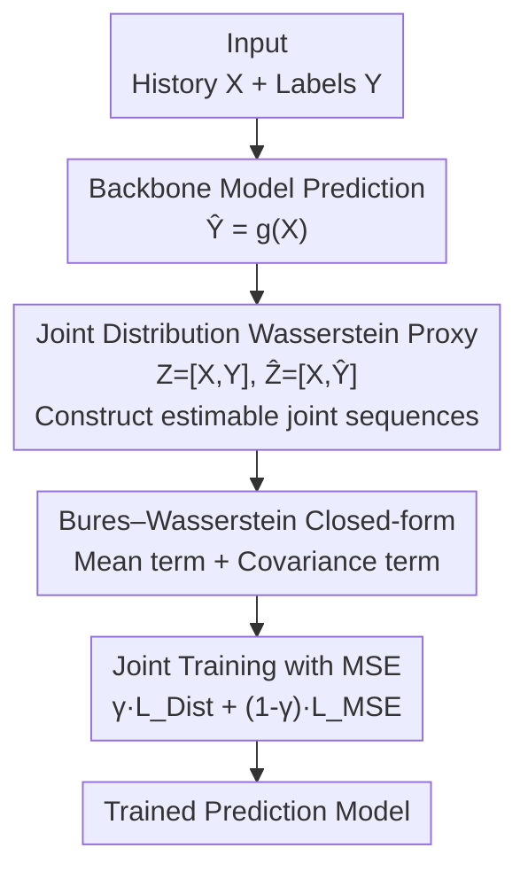

# DistDF: Time-series Forecasting Needs Joint-distribution Wasserstein Alignment

**Conference**: ICLR2026  
**OpenReview**: [https://openreview.net/forum?id=VrdLwUmzBy](https://openreview.net/forum?id=VrdLwUmzBy)  
**Code**: https://github.com/Master-PLC/DistDF  
**Area**: Time-series Forecasting / Learning Objective Design  
**Keywords**: Time-series Forecasting, Learning Objectives, Autocorrelation Bias, Wasserstein Distance, Distribution Alignment

## TL;DR
Addressing the fundamental issue where the MSE loss generates "autocorrelation bias" when label sequences exhibit autocorrelation, DistDF shifts from estimating conditional likelihood to directly aligning the **conditional distributions** of predicted and label sequences. It employs the "Joint-distribution Wasserstein distance" (with a provable upper bound) as a proxy objective, leveraging the Bures–Wasserstein closed-form solution under Gaussian assumptions. This serves as a plug-and-play regularization term added to MSE, consistently achieving state-of-the-art results across multiple datasets and backbone models.

## Background & Motivation

**Background**: Research in deep time-series forecasting follows two main paths: designing network architectures (Transformers, linear models, GNNs, etc.) to model autocorrelation in historical sequences, and designing learning objectives for training. While the former is heavily researched, the latter has been long neglected; most models directly use MSE as the loss, treating multi-step forecasting as independent point-to-point regressions for each future timestamp (standard Direct Forecast, DF).

**Limitations of Prior Work**: MSE essentially estimates the conditional negative log-likelihood of the label sequence, but it implicitly assumes "independence between future steps." Real label sequences $y$ exhibit strong autocorrelation ($y_t$ depends on $y_{<t}$), causing the likelihood estimated by MSE to be **biased**. The authors formalize this bias in Theorem 3.1:

$$\text{Bias} = \|y_{|x}-\hat y_{|x}\|^2_{\Sigma^{-1}_{|x}} - \|y_{|x}-\hat y_{|x}\|^2_2$$

where $\Sigma_{|x}$ is the conditional covariance of the labels given history $x$. The bias disappears only when $\Sigma_{|x}$ is the identity matrix (conditional independence), which is rarely true in real-world data.

**Key Challenge**: Existing patches (FreDF using Fourier transforms, Time-o1 using PCA) attempt to transform labels into "decorrelated components" before performing point-wise MSE. However, they only guarantee **marginal decorrelation** (diagonal $\Sigma$), whereas eliminating bias requires **conditional decorrelation** (diagonal $\Sigma_{|x}$) — the two are not equivalent. Experiments on Traffic data show that over 50.3% of off-diagonal elements in the original conditional correlation matrix have absolute values exceeding 0.1. While FreDF/Time-o1 reduce these values, residual correlation remains significant. Consequently, the bias is mitigated but not eliminated, fundamentally hindering the likelihood-based approach.

**Goal**: Bypass the inherently biased path of "estimating likelihood" and instead "directly align the two conditional distributions" $P_{\hat y|x}$ and $P_{y|x}$.

**Key Insight**: Aligning two distributions does not strictly require calculating likelihood — it only requires minimizing some distribution distance between them. However, conditional distribution distances are nearly impossible to estimate with finite time-series observations: for any given $x$, the dataset typically provides only one label $y$, and the model outputs only one $\hat y$. The empirical sample for each conditional distribution is a single point, making the distance measure meaningless.

**Core Idea**: Use the **joint distribution** $W_p(P_{x,y}, P_{x,\hat y})$ as a proxy. It provably **upper bounds** the expected conditional distribution distance of interest (Lemma 3.3) and can be estimated stably using sufficient samples from the entire dataset. Under Gaussian assumptions, it simplifies to the Bures–Wasserstein closed-form solution, which is differentiable and integrates seamlessly with gradient descent.

## Method

### Overall Architecture

DistDF does not modify model architectures; it replaces the training objective, acting as a model-agnostic plug-and-play loss. Given a batch of historical sequences $X\in\mathbb{R}^{B\times H}$ and labels $Y\in\mathbb{R}^{B\times T}$, any backbone model $g$ calculates the prediction $\hat Y=g(X)$. The key operation is concatenating the history with the "true label / prediction" along the time axis to obtain two **joint sequences** $Z=[X,Y]$ and $\hat Z=[X,\hat Y]$. Including history $X$ is necessary because joint distributions can be estimated from the full dataset and provide an upper bound for the conditional distance. Then, first and second-order statistics (mean vectors and covariance matrices) are calculated for both sequences to compute the distribution distance $L_{\text{Dist}}$ via the Bures–Wasserstein metric. Since pure moment matching loses the sample-wise correspondence (where the $i$-th history matches the $i$-th label), DistDF treats $L_{\text{Dist}}$ as a regularization term added to the point-wise MSE, tuned by weight $\gamma$: $L_{\text{DistDF}}=\gamma\cdot L_{\text{Dist}}+(1-\gamma)\cdot L_{\text{MSE}}$.

### Key Designs

**1. Revealing and Formalizing "Autocorrelation Bias": Rooting Pain Points in Theory**

DistDF begins by proving why existing losses fail rather than just proposing a new one. The authors redefine the training objective as "aligning $P_{\hat y|x}$ and $P_{y|x}$" and point out that MSE essentially estimates the conditional negative log-likelihood while ignoring the dependence of $y_t$ on $y_{<t}$. Theorem 3.1 provides the exact expression: $\text{Bias}=\|y_{|x}-\hat y_{|x}\|^2_{\Sigma^{-1}_{|x}}-\|y_{|x}-\hat y_{|x}\|^2_2$, which is zero only when $\Sigma_{|x}=I$. Furthermore, the authors invalidate "decorrelation before MSE" methods like FreDF/Time-o1: Fourier and PCA only achieve marginal decorrelation (diagonal $\Sigma$), which is not equivalent to the required conditional decorrelation (diagonal $\Sigma_{|x}$). This section establishes a rigorous theoretical foundation for shifting the technical route.

**2. Joint-distribution Wasserstein Proxy: Using Estimable Upper Bounds to Resolve Conditional Estimation**

Directly minimizing the conditional distribution distance $W_p(P_{y|x},P_{\hat y|x})$ is ideal but infeasible due to single-sample observations per $x$. The authors introduce the joint distribution Wasserstein distance $W_p(P_{x,y},P_{x,\hat y})$ as a proxy. Lemma 3.3 establishes the upper bound relationship:

$$\int W_p(P_{y|x},P_{\hat y|x})\,dP(x)\le W_p(P_{x,y},P_{x,\hat y})$$

Minimizing the joint distance effectively reduces the expected conditional distance. Theorem 3.4 ensures that if the joint distance reaches 0, $P_{y|x}=P_{\hat y|x}$ holds strictly (unbiased alignment). Wasserstein distance is chosen for its solid optimal transport theoretical foundations and empirical effectiveness. This proxy resolves the "single sample" dilemma by utilizing empirical sets $S_{x,y}, S_{x,\hat y}$ from the entire dataset.

**3. Bures–Wasserstein Closed-form Solution: Differentiable Moment Matching under Gaussian Assumptions**

To ensure computational efficiency, the authors assume Gaussian distributions $P_{x,y}\sim\mathcal N(\mu_{x,y},\Sigma_{x,y})$. The squared $W_2$ distance then becomes the Bures–Wasserstein closed-form solution (Lemma 3.5):

$$\text{BW}=\|\mu_{x,y}-\mu_{x,\hat y}\|^2_2+\text{Tr}\!\Big(\Sigma_{x,y}+\Sigma_{x,\hat y}-2\big(\Sigma_{x,y}^{1/2}\Sigma_{x,\hat y}\Sigma_{x,y}^{1/2}\big)^{1/2}\Big)$$

This expression splits into **mean alignment** (matching first-order moments) and **covariance alignment** $B(\cdot)$ (matching second-order moments). The formula involves only means, covariances, and matrix square roots, making it fully differentiable. This transforms abstract distribution alignment into matching batch statistics.

**4. Joint Training with MSE: Restoring Sample Correspondence via $\gamma$**

Moment-based $L_{\text{Dist}}$ only considers distribution-level statistics and loses the sample-specific correspondence between history and labels. To maintain the strong supervision necessary for forecasting, DistDF uses the distribution distance as a regularization term: $L_{\text{DistDF}}=\gamma\cdot L_{\text{Dist}}+(1-\gamma)\cdot L_{\text{MSE}}$, where $0\le\gamma\le1$. MSE ensures point-wise correspondence while $L_{\text{Dist}}$ eliminates autocorrelation bias and aligns distributions. This allows DistDF to retain the efficiency of standard DF frameworks while being model-agnostic.

### Loss & Training
The final objective is $L_{\text{DistDF}}=\gamma L_{\text{Dist}}+(1-\gamma)L_{\text{MSE}}$. When integrated with different backbones, baseline hyperparameters are maintained, tuning only $\gamma\in(0,1]$ and learning rate $\eta\in[5\times10^{-5},10^{-3}]$ (adjusted because the distribution distance scale varies by dataset). Optimization uses Adam with early stopping if the validation loss does not decrease for three consecutive epochs.

## Key Experimental Results

### Main Results
Using TimeBridge and Fredformer as backbones, various training objectives were compared (averaged over $T=96/192/336/720$):

| Model/Dataset | Metric | DistDF | Time-o1 | FreDF | Dilate | DF(MSE) |
|------|------|--------|---------|-------|--------|---------|
| TimeBridge·ETTh1 | MSE | **0.434** | 0.439 | 0.439 | 0.464 | 0.442 |
| TimeBridge·Weather | MSE | **0.248** | 0.250 | 0.254 | 0.252 | 0.252 |
| Fredformer·ECL | MSE | **0.173** | 0.178 | 0.179 | 0.187 | 0.191 |
| Fredformer·ETTh1 | MSE | **0.430** | 0.431 | 0.438 | 0.453 | 0.447 |

DistDF achieved the lowest MSE across all backbone/dataset combinations. Naive MSE (DF) performed the worst. Shape-alignment objectives (Dilate/Soft-DTW) provided limited improvement without unbiased guarantees. Likelihood-based objectives (FreDF/Time-o1) were strong but remained sub-optimal compared to DistDF due to lingering bias.

### Ablation Study
Breaking down the Bures–Wasserstein components — mean alignment ($\mu$) and covariance alignment ($\Sigma$) — added to DF (averaged MSE):

| Config | Align μ | Align Σ | ETTm1 | ETTh1 | ECL | Weather |
|------|---------|---------|-------|-------|-----|---------|
| DF | ✗ | ✗ | 0.387 | 0.447 | 0.176 | 0.252 |
| DistDF† | ✓ | ✗ | 0.381 | 0.435 | 0.175 | 0.251 |
| DistDF‡ | ✗ | ✓ | 0.386 | 0.439 | 0.174 | 0.251 |
| DistDF | ✓ | ✓ | **0.379** | **0.430** | **0.172** | **0.248** |

Individually adding mean or covariance alignment consistently outperformed DF. Combining both provided synergistic gains, confirming that simultaneous first and second-order moment matching is required for complete conditional distribution alignment.

### Key Findings
- **Metric Diversity** (Table 3): Replacing the proxy with EMD/MMD/KL still outperformed MSE, proving the value of distribution alignment. Joint-distribution Wasserstein performed best in 14 out of 16 cases.
- **Generalization**: DistDF consistently improved iTransformer, Fredformer, FreTS, and TimeBridge. For example, iTransformer improved by 2.7% and Fredformer by 4.3% on ECL.
- **Hyperparameter Sensitivity**: Performance was stable across a wide range of $\gamma$.
- **Qualitative Results**: Visualizations show DF fails to capture rapid changes between steps 100-200, whereas DistDF characterizes fine-grained fluctuations more accurately.

## Highlights & Insights
- **Theoretic Proof Before Proposal**: DistDF's strength lies in theoretically proving the bias in the "decorrelation + MSE" route (marginal vs. conditional decorrelation), explaining why previous methods were only partial remedies.
- **Proxy via Upper Bound**: Successfully circumventing the single-sample conditional estimation problem by using a provable joint distribution upper bound is a high-level conceptual contribution applicable to other sparse-sample tasks.
- **Complementary Supervision**: The insight that distribution distance must be paired with point-wise MSE to avoid losing sample correspondence is critical for the framework's practical success.

## Limitations & Future Work
- **Gaussian Assumption**: The closed-form solution assumes Gaussianity; performance on highly non-Gaussian or heavy-tailed distributions requires further study.
- **Dependency on MSE**: The distribution distance is not a stand-alone signal and requires tuning $\gamma$ alongside MSE.
- **Batch Statistics**: Mean/covariance are estimated per batch; small batch sizes may introduce noise in second-order moment estimation.
- **Benchmark Scope**: Evaluation focused on standard benchmarks (ETT/ECL/Weather); robustness in high-dimensional or non-stationary extreme scenarios remains to be validated.

## Related Work & Insights
- **vs. MSE / Standard DF**: DF regresses point-wise and ignores autocorrelation; DistDF aligns the conditional distribution, providing a theoretically unbiased approach at the objective level.
- **vs. FreDF / Time-o1**: These use "decorrelation + MSE," but since Fourier/PCA only ensure marginal decorrelation, conditional bias persists. DistDF eliminates this by aligning the distribution directly.
- **vs. Dilate / Soft-DTW**: Shape alignment relies on heuristic geometric matching without unbiasedness guarantees, unlike DistDF (Theorem 3.4).
- **vs. Domain Adaptation**: While DA aligns marginal input distributions for generalization, DistDF aligns conditional output-label distributions as a supervised learning constraint.

## Rating
- Novelty: ⭐⭐⭐⭐⭐ Theoretical reframing of training objectives with the joint-distribution proxy and Bures–Wasserstein solution is highly original.
- Experimental Thoroughness: ⭐⭐⭐⭐ Extensive backbone and metric coverage, though restricted to standard benchmarks.
- Writing Quality: ⭐⭐⭐⭐⭐ Logical flow from theorem-based proof to methodology is very clear.
- Value: ⭐⭐⭐⭐⭐ Model-agnostic, plug-and-play, and theoretically sound; offers a new standard for forecasting loss design.

<!-- RELATED:START -->

## Related Papers

- [\[ICLR 2026\] Bridging Past and Future: Distribution-Aware Alignment for Time Series Forecasting](bridging_past_and_future_distribution-aware_alignment_for_time_series_forecastin.md)
- [\[NeurIPS 2025\] Time-O1: Time-Series Forecasting Needs Transformed Label Alignment](../../NeurIPS2025/time_series/time-o1_time-series_forecasting_needs_transformed_label_alignment.md)
- [\[ICLR 2026\] Quadratic Direct Forecast for Training Multi-Step Time-Series Forecast Models](quadratic_direct_forecast_for_training_multi-step_time-series_forecast_models.md)
- [\[ICLR 2026\] A Spectral-Grassmann Wasserstein metric for operator representations of dynamical systems](a_spectral-grassmann_wasserstein_metric_for_operator_representations_of_dynamica.md)
- [\[ICLR 2026\] JAPAN: Joint Adaptive Prediction Areas with Normalising-Flows](japan_joint_adaptive_prediction_areas_with_normalising_flow.md)

<!-- RELATED:END -->
