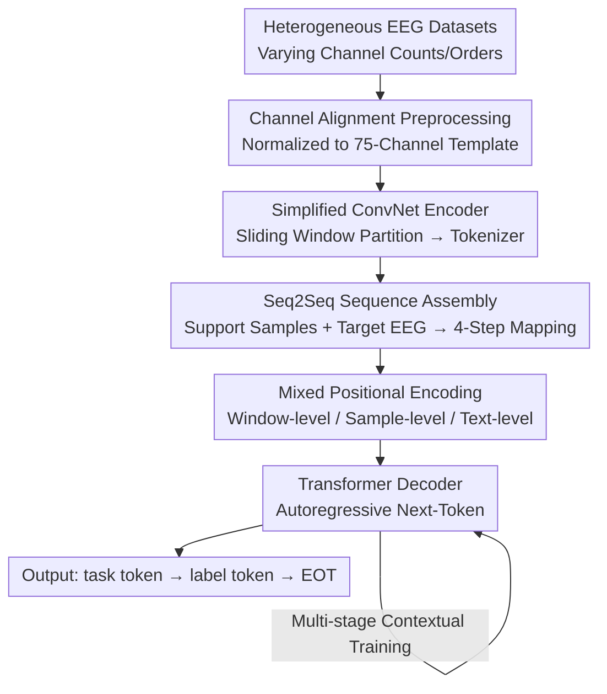

# ECHO: Toward Contextual Seq2Seq Paradigms in Large EEG Models

**Conference**: ICLR2026  
**OpenReview**: [https://openreview.net/forum?id=ClLQ6cLkoR](https://openreview.net/forum?id=ClLQ6cLkoR)  
**Code**: TBD  
**Area**: Time Series / Large EEG Models / In-Context Learning  
**Keywords**: Large EEG Models, decoder-centric, seq2seq, in-context learning, multi-task generalization

## TL;DR
ECHO shifts Electroencephalogram (EEG) modeling from the "encoder-centric representation + lightweight classification head" paradigm to a "decoder-centric sequence-to-sequence generation" approach. By utilizing a series of support samples as in-context examples, a unified model can automatically identify task types and predict labels without fine-tuning, outperforming task-specific Large EEG Models in multi-task settings.

## Background & Motivation
**Background**: As a portable and cost-effective neural recording method, EEG is widely used for heterogeneous tasks such as emotion recognition, motor imagery, and cognitive load assessment. Following the trend of large models, researchers have proposed various Large EEG Models (LEMs). These typically utilize large-scale unlabeled EEG data for self-supervised pre-training (e.g., masked reconstruction or contrastive prediction) to train a powerful **encoder** for generalizable representations.

**Limitations of Prior Work**: These models focus almost entirely on the encoder, **lacking an equally capable decoder**. Downstream applications typically employ a lightweight classification head—orders of magnitude smaller than the encoder—followed by fine-tuning. Consequently, the model's success depends on whether the encoder "distorts" its representations during fine-tuning to accommodate the weak decoder. This adaptation to small-scale downstream data is inherently risky: the encoder may sacrifice general knowledge learned during pre-training (catastrophic forgetting/generalization decay), and the decoder's limited information extraction capacity increases sensitivity to noise and training instability given limited labels.

**Key Challenge**: The current paradigm is hindered by a **decoder bottleneck**, preventing the learned potential of the encoder from being fully released. An alternative is using LLMs as decoders, but this often keeps the "EEG-to-label" mapping within the text embedding space, requiring the projection of EEG tokens and labels into a shared space under text prompt constraints. However, the inductive biases of language models do not reliably transfer to EEG. EEG signals rely on precise localization of temporal dynamics, which mismatches the static semantic patterns of text or images. Forcing them into a text space often leads the model to exploit superficial correlations (mapping noise to semantic labels) while diluting or contaminating task-relevant information. Ultimately, text serves only as a "proxy label space" without bringing the reasoning and In-Context Learning (ICL) capabilities of LLMs to LEMs.

**Goal**: To propose a **decoder-centric** paradigm that allows a LEM to model multi-task EEG simultaneously within a unified framework, using discrete samples as in-context support to maintain task discriminability while acquiring ICL capabilities.

**Key Insight**: Reformulate EEG modeling as **Sequence-to-Sequence (Seq2Seq)** learning. The input is a sequence composed of "target EEG samples + support EEG samples with their task/label tokens." The model performs next-token prediction to infer the task and label of the target sample based on relations established from the support samples.

**Core Idea**: Replace the single "EEG-to-label" mapping with "multi-mapping modeling in sequence space." This makes the decoder (rather than the encoder) the primary component, using support samples to build in-context cues and completing multi-task learning and in-context adaptation in a single decoding pass.

## Method

### Overall Architecture
The input to ECHO is a structured sequence: a start token `<|SOT|>` followed by several **support samples** (each composed of EEG tokens + task tokens + label tokens), then the **target EEG** tokens. The model generates an output sequence autoregressively: first producing the target's task token `<|task|>` (e.g., `<|MI|>`, `<|EMO|>`), then the label token `<|y|>` conditioned on the task, and finally an end token `<|EOT|>`. The pipeline uses simple, standard components (a simplified deep ConvNet encoder + standard Transformer decoder) to attribute performance gains to the **paradigm shift** rather than architectural complexity.

Heterogeneous datasets are denoted as $D=(X,Y,t)$, where $X\in\mathbb{R}^{N\times T\times C}$ represents $N$ samples with $T$ time steps and $C$ channels, $Y$ is the dataset-specific label, and $t$ is the task identifier. The difference between paradigms is clear: Encoder-centric is $f(X\mid t)=C(E(X;\theta_d);\phi_d)\to Y$ (does not generalize across datasets); LLM-centric is $f(X\mid t)=D_{\text{LLM}}(E(X),\langle\text{text}\rangle)\to\langle y\rangle$ (mapping in text space); whereas ECHO represents inputs and outputs as sequences $S_{in}=\{\langle\text{special}\rangle,\{E(X_s)\}_{s=1}^S,E(X),\langle\text{support}\rangle\}$ and $S_{out}=\{\langle\text{support}\rangle,\langle\text{task}\rangle,\langle y\rangle,\langle\text{special}\rangle\}$, using $f(X\mid t)=D(S_{in})\to S_{out}$ for multi-task and contextual modeling.

The authors address three technical challenges: **C1 Channel Inconsistency** → Channel alignment preprocessing; **C2 Heterogeneous Sequence Components** → Mixed positional encoding; **C3 Lack of Symbolic Structure in EEG** → Seq2Seq in-context training.

### Key Designs

**1. Decoder-centric Seq2Seq Paradigm: Upgrading "Labeling" to "Mapping in Sequences"**

This is the core of the paper. ECHO splits a single prediction into **four progressive mapping steps** in a sequence: ① Support samples and their tokens act as "worked examples" for the model to learn mappings between EEG, tasks, and labels; ② The model generalizes these learned mappings to the **target sample**; ③ It performs step-by-step reasoning for the target sample—predicting the task token first, then deriving the label token conditioned on "task + EEG"; ④ It predicts the EOT token to recognize task termination. A single decoder gains both ICL and multi-task capabilities in one forward pass, autonomously selecting the best matching label **without being explicitly told the current task**.

**2. Channel Alignment Preprocessing: Flattening Diverse Electrode Systems into a Unified Template (Solves C1)**

To handle inconsistent channel counts $C$ and orders $\pi(C)$ across datasets, ECHO defines a **standard template channel set** (fixed at 75 channels). For each standard channel $c$, an alias set $M_c$ is maintained. Given an EEG batch, each channel is mapped to $M_c$ based on the order $\pi(C)$ to obtain a matching subset $X_c$, which is then aligned:

$$\bar X=\left\{\frac{1}{|X_c|+1}\sum_{x\in X_c}x \;\middle|\; c\in\pi(C)\right\}\in\mathbb{R}^{N\times T\times|C|}$$

The term $|X_c|+1$ ensures stability; missing channels are zero-filled.

**3. Mixed Positional Encoding: Handling "Continuous EEG" and "Discrete Symbols" (Solves C2)**

ECHO utilizes **three-way positional encoding**: (i) **Window-level** $PE^{enc}_{(n,k)}$ models the temporal structure within a single EEG sample (partitioned into $K$ windows); (ii) **Sample-level** $PE^{dec}_n$ distinguishes between support and target samples by applying a uniform encoding to all tokens within the $n$-th EEG sample; (iii) **Text-level** $PE^{txt}_m$ encodes semantic information for task, label, and EOT tokens. Ablations show that without sample-level encoding, the model fails to distinguish sample boundaries, while removing text-level encoding causes structural collapse.

**4. Multi-stage In-context Training: Inducing ICL via Explicit Curriculum (Solves C3)**

Since EEG lacks the symbolic structure that allows ICL to emerge implicitly in LLMs, ECHO uses a **two-stage curriculum**:
- **Warm-up Phase**: Trains the encoder with a shared classification head across all datasets for 90 epochs to stabilize EEG representations.
- **Contextual Training Phase**: Trains the decoder for 40 epochs. The first 10 epochs use a **fixed number** of support samples (8-shot) to stabilize training, while the remaining epochs **randomize** the number of supports (0–12) to enhance ICL robustness. A differential learning rate is used ($5\times10^{-5}$ for the decoder, $5\times10^{-6}$ for the encoder).

### Loss & Training
Cross-entropy loss is applied to autoregressive next-token prediction. The training uses 8×A100(40GB) GPUs, Adam optimizer, and cosine annealing. Warm-up takes 90 epochs (batch 64), followed by 40 epochs of contextual training (batch 48).

## Key Experimental Results

### Main Results
Testing on 12 public EEG datasets (6 task categories, 26 classes), ECHO is compared as a **strictly multi-task** model against baselines fine-tuned on **single-task** settings.

| Dataset | Metric (ACC-B) | ECHO (Ours) | Strongest Baseline | Note |
|:---:|:---:|:---:|:---:|:---:|
| SEED | 0.8193 | 0.7836 (CodeBrain) | Emotion Valence | Ours outperforms task-specific models |
| Stieger2021-LR | 0.8534 | 0.8424 (CBraMod) | Cursor Control | |
| Mental Arithmetic | 0.6851 | 0.6318 (CodeBrain) | Cognitive Load | |
| Attention | 0.8194 | 0.6785 (LaBraM) | Attention Discrim. | Significant lead |
| High-Gamma | 0.8552 | 0.8320 (EEGNet) | Motor Imagery | |

Overall, cognitive tasks saw an average increase in Balanced Accuracy of +0.0602, while clinical diagnosis tasks saw +0.0409. ECHO uniquely demonstrates the ability to **autonomously identify tasks and paradigms based solely on EEG samples without external prompts**.

### Ablation Study

| Configuration | Key Phenomenon | Explanation |
|:---:|:---:|:---:|
| ECHO (Full) | SEED ACC-B 0.8193 | Full Seq2Seq + Support samples |
| ECHOE (No Seq2Seq, Encoder only) | 0.8193→0.6548 | Removing sequence structure causes degradation |
| ECHO (No Support) | 0.8193→0.7407 | Performance drops across benchmarks, proving ICL utility |
| w/o Sample Pos-Enc | Random performance | Model cannot distinguish sample boundaries |
| w/o Text Pos-Enc | Structural collapse | Output is out-of-order symbols |

### Key Findings
- **Seq2Seq paradigm is the main driver**: ECHO significantly outperforms its encoder-only version (ECHOE) in multi-task settings.
- **ICL provides gains but depends on sample stability**: ICL is effective on structured datasets like SEED but can be sensitive to noise and distribution shifts in cross-subject EEG.
- **Encoder quality determines the ceiling**: ICL cannot fully compensate if the encoder fails to model specific dataset structures (e.g., TUEV).
- **Generalization-Specialization Trade-off**: ECHO may lag behind models specifically optimized for single domains (e.g., BCIC-IV-2a) due to its simplified encoder design.

## Highlights & Insights
- **Paradigm Inversion over Architecture Stacking**: The core contribution is shifting from encoder-centric labeling to decoder-centric generation, using simple components to prove the efficacy of the paradigm itself.
- **Support Samples as Context**: By using EEG samples as worked examples, the model adapts to heterogeneous tasks without parameter updates, truly bringing ICL to continuous biological signals.
- **Three-way Positional Encoding**: This decoupling of temporal, functional, and semantic roles is a transferable trick for any hybrid sequence modeling of continuous and discrete signals.
- **Honest Failure Analysis**: The authors acknowledge that the encoder remains the performance ceiling and ICL is sensitive to sample quality, providing clear directions for future work.

## Limitations & Future Work
- **Encoder Bottleneck**: Using a simplified ConvNet to isolate variables means ECHO lags behind domain SOTA in specific tasks like BCIC-IV-2a.
- **ICL Instability**: Cross-subject variance makes support sample selection difficult; too few samples provide no signal, while too many accumulate noise.
- **Standardized Channel Dependency**: Robustness to electrode systems outside the 75-channel template or unconventional montages is unverified.
- **Inference Overhead**: Longer sequences from concatenated support samples increase latency and memory consumption, which was not extensively analyzed.

## Related Work & Insights
- **vs Encoder-centric LEMs (BIOT, LaBraM)**: These require task-specific fine-tuning and lack multi-task generalization. ECHO handles multi-tasking and ICL within a unified decoder.
- **vs LLM-centric LEMs**: Existing approaches use text spaces as "proxy labels," often ignoring the specific temporal dynamics of EEG. ECHO builds mappings directly in the EEG/Task/Label sequence space.
- **Inductive Bias Mismatch**: The work supports the view that linguistic inductive biases do not reliably transfer to time-series EEG due to the misalignment between static semantics and high-precision temporal dynamics.

## Rating
- **Novelty**: ⭐⭐⭐⭐⭐ High. Paradigm-level shift to decoder-centric Seq2Seq ICL for EEG.
- **Experimental Thoroughness**: ⭐⭐⭐⭐ Strong. 12 datasets across 6 tasks, though some specialized tasks lag.
- **Writing Quality**: ⭐⭐⭐⭐ Clear structure addressing challenges vs. contributions.
- **Value**: ⭐⭐⭐⭐⭐ Opens a new paradigm for releasing the generalization potential of Large EEG Models.

<!-- RELATED:START -->

## Related Papers

- [\[ICML 2026\] Building Social World Models with Large Language Models](../../ICML2026/time_series/building_social_world_models_with_large_language_models.md)
- [\[ICLR 2026\] Semantic-Enhanced Time-Series Forecasting via Large Language Models](semantic-enhanced_time-series_forecasting_via_large_language_models.md)
- [\[ICLR 2026\] TimeOmni-1: Incentivizing Complex Reasoning with Time Series in Large Language Models](timeomni-1_incentivizing_complex_reasoning_with_time_series_in_large_language_mo.md)
- [\[ICLR 2026\] Uni-NTFM: A Unified Foundation Model for EEG Signal Representation Learning](uni-ntfm_a_unified_foundation_model_for_eeg_signal_representation_learning.md)
- [\[ICLR 2026\] Multi-Scale Hypergraph Meets LLMs: Aligning Large Language Models for Time Series Analysis](multi-scale_hypergraph_meets_llms_aligning_large_language_models_for_time_series.md)

<!-- RELATED:END -->
