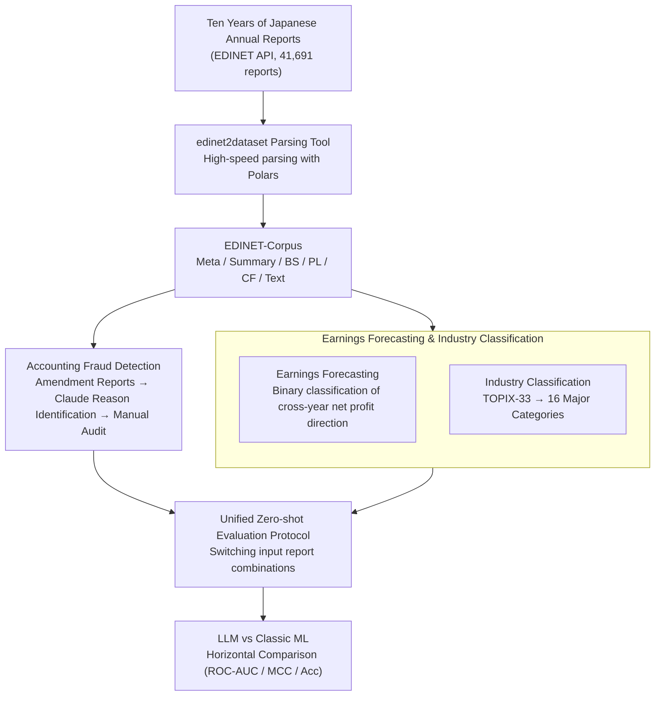

# EDINET-Bench: Evaluating LLMs on Complex Financial Tasks using Japanese Financial Statements

**Conference**: ICLR 2026  
**arXiv**: [2506.08762](https://arxiv.org/abs/2506.08762)  
**Code**: [GitHub](https://github.com/SakanaAI/EDINET-Bench)  
**Area**: Time Series  
**Keywords**: financial benchmark, LLM evaluation, fraud detection, earnings forecasting, Japanese NLP

## TL;DR
The study constructs EDINET-Bench, a financial benchmark based on ten years of Japanese EDINET annual reports. It includes three expert-level tasks: accounting fraud detection, earnings forecasting, and industry classification, finding that even SOTA LLMs only slightly outperform logistic regression.

## Background & Motivation
**Background**: LLMs have surpassed human performance in fields such as mathematics and programming; benchmark datasets are key drivers of this progress. However, benchmark datasets in the financial domain are relatively scarce, and existing benchmarks (FinQA, ConvFinQA, etc.) are mostly simple QA or data extraction tasks.

**Limitations of Prior Work**: Existing financial benchmarks do not involve expert-level reasoning (such as integrating multiple financial statements and text segments) and cannot evaluate the capabilities of LLMs on real high-risk financial tasks.

**Key Challenge**: While LLMs perform excellently on general tasks, the financial domain requires the simultaneous processing of large volumes of tabular data and textual information, along with complex cross-year reasoning.

**Goal**: To provide the first open-source Japanese financial benchmark requiring expert-level reasoning, particularly the first open accounting fraud detection dataset.

**Key Insight**: Utilize ten years of real annual report data from the Japanese EDINET system (similar to the US EDGAR) to construct three challenging tasks.

**Core Idea**: Real annual reports + expert financial tasks = revealing the deficiencies of LLMs in financial reasoning.

## Method

### Overall Architecture
The problem EDINET-Bench aims to solve is that existing financial benchmarks are limited to simple QA or table extraction, lacking public evaluations that require "reading the entire annual report and performing expert reasoning across multiple statements and texts," and there is no open accounting fraud detection data. The authors' approach is to build a data pipeline from raw regulatory documents to evaluatable tasks—first using a self-developed tool `edinet2dataset` to call the EDINET API to batch download and parse approximately 41,691 Japanese annual reports (2014–2025) into a structured corpus, EDINET-Corpus. Then, three tasks are constructed on the corpus: accounting fraud detection, earnings forecasting, and industry classification, where the difficulty lies in "creating reliable labels" for real reports. Finally, a unified zero-shot protocol is used to compare over ten LLMs against classic machine learning baselines under identical prompts and different input combinations.

### Key Designs

**1. edinet2dataset and EDINET-Corpus: Compressing Heterogeneous Regulatory Files into a Unified Structure**

Annual reports are stored as TSV files in EDINET, where each line is an attribute record. The fields are scattered, and feeding them directly to a model is both bloated and difficult to align, making it impossible for downstream components to control "exactly what information the model sees." Referencing the US EDGAR's `edgar-crawler`, the authors wrote `edinet2dataset` to pull approximately 41,691 annual and amendment reports from April 2014 to April 2025 via the EDINET API. High-speed parsing with Polars consolidates each file into six categories: Meta (metadata like company names, EDINET codes), Summary (key financial indicators), Balance Sheet (BS), Profit & Loss (PL), Cash Flow (CF), and Text (sections like company history, business risks). The overall result is stored as the public EDINET-Corpus. This layer is not just data infrastructure; it segments "report content" into combinable modules, allowing downstream ablation on inputs (e.g., "Summary only" vs. "adding three statements" vs. "adding Text").

**2. Accounting Fraud Detection: Inferring Fraud Labels from Amendment Reports**

This is the most critical and data-scarce part of the entire benchmark—fraud lacks public annotation. The authors leveraged a fact: if a report is found problematic, the company issues an **amendment report** that explicitly states the "reason for the amendment" in text. First, 6,712 amendment reports from the decade were downloaded, and the reason text was extracted using `pdfminer`. Claude 3.7 Sonnet was then tasked with determining if each reason actually constituted accounting fraud (as many amendments are just misreporting shareholder stakes or missing executive compensation). This filtered out 668 positive fraud samples, which were manually reviewed to keep the mislabeling rate below 5%. Negative samples were randomly drawn from 700 other companies, taking one report each. Strict splitting ensured the same company did not cross training/test sets to avoid leakage; parsing outcomes yielded 534 fraud and 555 non-fraud samples (865 for training, 224 for testing). Using amendment reports as weak supervision and refining noisy labels with LLM+Human is the core technique that makes this the first open fraud detection dataset.

**3. Earnings Forecasting and Industry Classification: Benchmark Tasks with Direct Labels**

Label construction for these two tasks is simpler than fraud detection but evaluates different capabilities. Earnings Forecasting is a binary classification: pairing annual reports of the same company from adjacent years and using the direction of "net profit attributable to owners of the parent" relative to the previous year as the label. This tests whether the model can infer next year's earnings trend from current reports. Splitting followed time (pre-2020 for training, 549 training, 451 testing) to ensure the test set strictly followed the training period, simulating real prediction scenarios. Industry Classification is multi-class: since using TOPIX-33 sub-sectors directly would result in too few samples per class, the authors merged them into 16 major categories (approx. 30+ companies each, 476 test samples). This relies more on semantic understanding of business descriptions and serves as a control for the model's basic grasp of Japanese financial text.

**4. Unified Zero-Shot Evaluation Protocol: Horizontal Comparison under Controlled Inputs**

To make results comparable, all three tasks used the same zero-shot protocol: the system message was fixed as "You are a financial analyst," and different input combinations (Summary only / +BS+CF+PL / +Text) were switched to observe the marginal impact of information volume. This was enabled by the six-category segmentation in Design 1. Evaluated models included GPT-4o, o4-mini, GPT-5, Claude 3.5 Haiku/Sonnet, Claude 3.7 Sonnet, Kimi-K2, DeepSeek-V3/R1, and Llama 3.3 70B. Concurrently, Logistic Regression, Random Forest, and XGBoost were used as classic ML baselines to verify if LLMs possess a real advantage over traditional statistical methods. This protocol led to the honest conclusion that even the strongest LLMs are only slightly better than logistic regression.

## Key Experimental Results

### Main Results
ROC-AUC for Fraud Detection (Selection):

| Model | Summary | +BS/CF/PL | +Text |
|------|---------|-----------|-------|
| Claude 3.5 Sonnet | 0.64 | 0.63 | **0.73** |
| GPT-5 | 0.56 | 0.62 | 0.67 |
| Logistic Regression† | - | 0.61 | - |

ROC-AUC for Earnings Forecasting:

| Model | Summary | +BS/CF/PL | +Text |
|------|---------|-----------|-------|
| GPT-5 | 0.58 | 0.62 | **0.65** |
| Claude 3.7 Sonnet | 0.55 | 0.58 | 0.61 |
| Logistic Regression† | - | 0.60 | - |

### Ablation Study
Ablation on Input Information Volume:

| Input Configuration | Fraud Detection (avg) | Earnings Forecasting (avg) |
|----------|--------------|---------------|
| Summary only | ~0.58 | ~0.48 |
| +BS/CF/PL | ~0.59 | ~0.52 |
| +Text | ~0.64 | ~0.52 |

### Key Findings
- **LLMs are only slightly superior to Logistic Regression**: In binary tasks, the MCC of even the strongest LLMs remains between 0.1 and 0.3.
- **Textual information is helpful**: Adding the Text section improved the average ROC-AUC of fraud detection by ~0.06.
- **Open-source models lag behind**: DeepSeek-V3/R1 is significantly weaker than closed-source models on financial tasks.
- **Industry classification is relatively simple**: With full reports, Claude 3.5 Sonnet reached 41% accuracy (random baseline for 16 classes is 6.25%).
- Each annual report is approximately 30K tokens, with a single inference cost of about $0.1 (Claude 3.7 Sonnet).

## Highlights & Insights
- **First Open-Source Accounting Fraud Detection Dataset**: Previously, no public evaluation benchmark existed for fraud detection.
- **Open-Source `edinet2dataset` Tool**: Provides a complete pipeline for building financial datasets from EDINET, based on high-speed TSV parsing with Polars.
- **Honest Conclusion**: Explicitly states that providing annual reports for direct LLM reasoning is insufficient and requires more scaffolding (e.g., simulation environments, task-specific reasoning support).
- **Cross-Lingual Value**: This Japanese financial benchmark fills a gap in non-English financial NLP.
- **Rigorous Experimental Design**: Ablations on multiple input configurations, comparisons with classic ML baselines, and transparent cost analysis.
- **Label Quality Control**: Fraud labels were determined by Claude and manually audited, with a mislabeling rate <5%.

## Limitations & Future Work
- Only evaluates zero-shot settings, lacking few-shot and RAG experiments, and has not explored reasoning enhancements like chain-of-thought.
- Fraud labels were generated by Claude 3.7 Sonnet rather than being purely manually annotated, which may introduce systematic bias.
- Most evaluated LLMs have limited understanding of Japanese financial terminology, especially open-source models.
- Data only covers the Japanese market and does not evaluate cross-national generalization.
- Lacks in-depth analysis of LLM reasoning processes (e.g., which statement items are focused on, visualization of reasoning paths).
- Results for fine-tuned Llama-3.2-1B were not fully displayed; lacks sufficient exploration of small model fine-tuning.
- Both fraud detection and earnings forecasting are binary; more granular regression tasks were not explored.
- Report lengths of ~30K tokens approach the context limits of some models, potentially affecting results.

## Related Work & Insights
- Comparison with FinQA/ConvFinQA: EDINET-Bench requires processing entire reports rather than short snippets, closer to real financial analysis scenarios.
- Comparison with FinanceBench: FinanceBench is open-ended QA, while EDINET-Bench requires integrating multiple statements and text for expert reasoning.
- Comparison with FAMMA: FAMMA is based on CFA exams and tutorials; EDINET-Bench is based on real corporate annual reports.
- Comparison with kim2024 (GPT-4 earnings direction prediction): This paper provides open-source data and evaluation code for reproducibility.
- Insight: Financial LLMs need to move beyond simple QA toward agentic development (simulating financial analyst workflows).
- Inspiration for non-English financial NLP: Countries can build local benchmarks using similar methods (e.g., CSRC disclosures in China, EDGAR in the US).
- Future Direction: Combining RAG or multi-agent frameworks may significantly enhance LLM performance in financial reasoning.

## Rating
- Novelty: ⭐⭐⭐⭐ First open-source fraud detection benchmark, though the task design itself is straightforward.
- Experimental Thoroughness: ⭐⭐⭐⭐ Covers 10+ models and 3 input configurations, though lacks advanced experiments like few-shot.
- Writing Quality: ⭐⭐⭐⭐ Clear structure, detailed data construction process, and rich tables.
- Value: ⭐⭐⭐⭐ Open-source tools and datasets provide practical contributions to the financial NLP community, revealing LLM deficiencies in financial reasoning.

<!-- RELATED:START -->

## Related Papers

- [\[ICLR 2026\] Reasoning on Time-Series for Financial Technical Analysis](reasoning_on_time-series_for_financial_technical_analysis.md)
- [\[ACL 2026\] A Unified Framework for Modeling Heterogeneous Financial Data via Dual-Granularity Prompting](../../ACL2026/time_series/a_unified_framework_for_modeling_heterogeneous_financial_data_via_dual-granulari.md)
- [\[ICLR 2026\] Benchmarking ECG FMs: A Reality Check Across Clinical Tasks](benchmarking_ecg_fms_a_reality_check_across_clinical_tasks.md)
- [\[ICLR 2026\] TimeOmni-1: Incentivizing Complex Reasoning with Time Series in Large Language Models](timeomni-1_incentivizing_complex_reasoning_with_time_series_in_large_language_mo.md)
- [\[ICLR 2026\] A Unified Federated Framework for Trajectory Data Preparation via LLMs](a_unified_federated_framework_for_trajectory_data_preparation_via_llms.md)

<!-- RELATED:END -->
