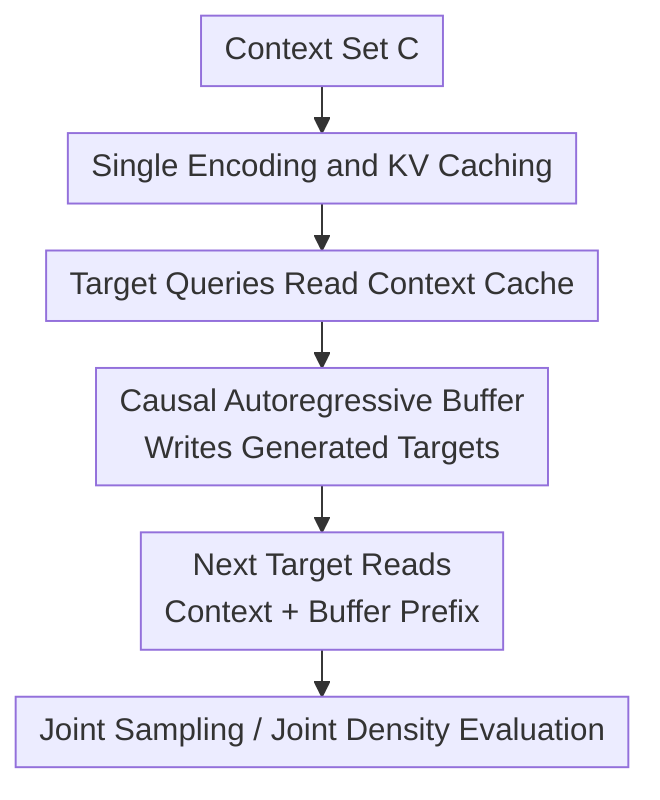

# Efficient Autoregressive Inference for Transformer Probabilistic Models

**Conference**: ICLR 2026  
**Paper**: [OpenReview 5bfUqlOhAH](https://openreview.net/forum?id=5bfUqlOhAH)  
**Code**: https://github.com/acerbilab/transformer-ar-buffer (Available)  
**Area**: time_series / probabilistic methods / amortized inference  
**Keywords**: Autoregressive Buffer, Transformer Neural Processes, Joint Predictive Density, Efficient Inference, Tabular Foundation Models  

## TL;DR
The paper proposes a Causal AR Buffer that decouples "one-time encoding of static context" from "autoregressive modeling of dependencies between targets." Without significant loss in prediction quality, it transforms the high-cost process of joint sampling and joint density evaluation—which typically requires repeated re-encoding—into an efficient, cacheable, and parallelizable workflow. This achieves up to approximately 20x inference acceleration and 7x memory savings across multiple tasks.

## Background & Motivation
**Background**: Set-based Transformer probabilistic models, represented by TNP, PFN, and TabICL, are powerful at "marginal prediction given a context point set." They use a permutation-invariant context encoder to read variable-sized sample sets in one pass and then perform conditional predictions for each target, obtaining a batch of marginal distributions in a single forward pass.

**Limitations of Prior Work**: Many real-world tasks do not satisfy the assumption of "only needing marginal distributions" but instead require consistent joint distributions between multiple targets. Examples include time-series interpolation/forecasting, neuroscience behavioral data modeling, and joint completion of multi-column tables, all of which rely on target-target correlations. In practice, the common approach is to "autoregressively adapt" set-based models at deployment: at step $k$, the previous $k-1$ predictions are appended to the context set to predict the $k$-th target.

**Key Challenge**: The internal mechanism of set-based encoders is bidirectional self-attention. Once a new point is added to the conditional set, the old context representations become invalid, necessitating a complete re-encoding. Consequently, the complexity shifts from a single encoding to re-computation at every step, accumulating to $O(K(N+K)^2)$ (where $N$ is the number of context points and $K$ is the target length). This is extremely costly in scenarios with large contexts, long sequences, or batch sampling, and creates significant memory pressure.

**Goal**: The authors aim to simultaneously satisfy four conditions:
1. Retain the permutation-invariant modeling advantages of set-based models for the initial context.
2. Model autoregressive dependencies between targets to support joint sampling and joint density evaluation.
3. Avoid re-encoding the context at every step.
4. Reuse the existing model paradigm during training to avoid the steep increase in training costs associated with fully autoregressive architectures.

**Key Insight**: A key observation is that the "initial context" and "subsequently generated targets" play different computational roles. The initial context represents static task definition information, suitable for caching after a single encoding; the target history represents dynamic dependency information, suitable for incremental writing via a causal mechanism. Treating both in the same exchangeable set for unified re-encoding is computationally the most expensive approach.

**Core Idea**: Use a separate causal buffer to handle inter-target dependencies while treating the context cache as read-only memory. Each new target only needs to read the "frozen context cache + visible buffer prefix" simultaneously, thereby replacing "repeated full re-encoding" with "incremental updates to a small buffer."

## Method

### Overall Architecture
The method categorizes tokens into three types: Context $C$, Buffer $B$, and Target Query $T$. $C$ is encoded only once and its Key/Value pairs are cached; $B$ employs strict causal attention to maintain the generated history; $T$ reads $C$ and the visible prefix of $B$ during decoding. Overall, the model computes:

$$
p_\theta(y^*_{1:K}\mid x^*_{1:K}, C)=\prod_{k=1}^{K} p_\theta\big(y^*_k \mid r_{tgt}(x^*_k,[r_C(C), b_{1:k-1}])\big),
$$

where $b_k=r_B((x^*_k,y^*_k),[r_C(C),b_{1:k-1}])$. When the buffer is empty ($K=1$), the model reverts to the standard set-based diagonal prediction mode.

The paper specifies four attention constraints (R1-R4): context is read-only, the buffer is strictly causal, information flows only out of the context without writing back, and targets only read the context and the visible buffer prefix without looking at each other. These rules ensure that "cache reusability" and "dependency expressivity" hold simultaneously.

**Complexity Comparison**:

- Traditional AR Re-encoding: $O(K(N+K)^2)$.
- Ours (Buffer Mechanism): $O(N^2+NK+K^2)$.

The bottleneck of the former is performing large-set self-attention at every step; the latter fixes the high-cost $N^2$ as a one-time prefill and handles the target sequence with smaller incremental terms.

### Key Designs
**1. Frozen Context Cache: Removing "Task Definition Information" from the Loop**

The waste in traditional deployment lies in putting the "essentially constant" context into every step of re-computation. In this work, context tokens are first encoded via bidirectional MHSA into $\{KV_C^\ell\}_{\ell=1}^L$, which are then reused as a read-only cache. No path is allowed to write back to the context. This design directly eliminates the primary time-consuming component in the AR loop while preserving the permutation-invariant inductive bias of the set encoder.

This is not merely an engineering cache but an explicit division of modeling assumptions: context expresses "observed evidence," while target history expresses "generation trajectory dependencies." The two types of information converge through read operations rather than repeated merging and re-encoding.

**2. Causal Buffer: Carrying Target Dependencies with Small State instead of Large State Re-computation**

Each new prediction $(x_k^*, y_k^*)$ is written as a buffer token and assigned a sequential positional encoding. Only causal self-attention is allowed within the buffer (position $j$ can only see $<j$), while it can also read the context cache. This effectively adds a "lightweight AR memory" outside the set-based backbone, allowing inter-target dependency to be explicitly modeled via $b_{1:k-1}$.

The key point is that "dependencies are represented in the buffer and no longer implicitly require context re-encoding to absorb history." Thus, each step only incrementally updates the buffer KV, and the computational graph size grows gently with $k$, which is particularly friendly to batch sampling.

**3. Unified Training Mask: Single Model Compatible with Marginal Prediction and AR Conditioning**

The authors do not split training into two models. Instead, they use a structured attention mask to cover both modes in a single forward pass. During training, targets are split into two halves: 50% see only the context ($v_m=0$), and 50% see the context plus a random length buffer prefix ($v_m\sim U\{1,\dots,K\}$). The corresponding objective function is:

$$
\mathcal{L}(\theta)=\mathbb{E}_{D\sim P}\,\mathbb{E}_{(C,B,T)\sim\pi(\cdot|D)}\left[-\sum_{m=1}^{M}\log p_\theta(y_m\mid x_m,C,B_{1:v_m})\right].
$$

This acts as a "buffer length curriculum": the model learns high-quality marginal prediction without a buffer and also learns to stably utilize additional conditional information under variable history lengths. Consequently, the inference stage can switch between "Fast Mode (larger K)" and "Fine-grained Mode (K=1, equivalent to standard AR)."

**4. One-Forward Joint Density Evaluation: Converting Sequential Summation to Parallel Batching**

Standard AR evaluation of joint log-likelihood requires $K$ sequential forward passes:

$$
\log p(y^*_{1:K}\mid x^*_{1:K},C)=\sum_{k=1}^{K}\log p(y^*_k\mid x^*_k,C,\{(x_j^*,y_j^*)\}_{j<k}).
$$

This paper packages "observed target value tokens" as a whole buffer and couples them with corresponding query tokens. By using masks to restrict the $k$-th query to see only $B_{1:k-1}$, all conditional probability terms equivalent to sequential AR are obtained in a single forward pass. This is critical for model comparison tasks (such as the multi-sensory models in the paper) that require extensive density evaluation.

### Mechanism
Take EEG forecasting as an example, with a context length $N=256$ and $K=16$ points to be predicted.

In the first step, the model performs one-time context encoding on the 256 observed points and caches it. Starting from the second step, points are generated one by one: the 1st target reads only the context cache; after obtaining $y_1^*$, $(x_1^*,y_1^*)$ is written to the buffer. The 2nd target reads "context cache + 1st buffer token"; the 3rd target reads "context cache + first 2 buffer tokens," and so on until the 16th target. Throughout the process, the context KV remains unchanged, while only the buffer increases incrementally.

If parallel sampling is required (e.g., sampling 256 future trajectories for the same patient under the same context), the standard approach would maintain 256 expanding and repeatedly re-encoded conditional sets. Ours shares a single context cache, and each trajectory only maintains its own small buffer, making batch scaling more natural.

### Loss & Training
- Training Objective: Negative Log-Likelihood (NLL), with expectation taken over different visible buffer lengths.
- Data Partitioning: Each training task splits samples into context, buffer, and target groups, with randomized buffer ordering.
- Inference Modes:
    - Autoregressive Sampling: Prefill context once, then generate and write to buffer incrementally.
    - Joint Density Evaluation: Package buffer/queries together to get the full log-likelihood in one forward pass.
- Order Sensitivity: Since AR decomposition is sensitive to order, the paper averages over multiple buffer orders to approximate a permutation-invariant estimate.

## Key Experimental Results

### Main Results
The main conclusion of the paper can be summarized as "significant wins in speed/memory, accuracy close to the strongest AR baseline." The key results ($M=16$) are summarized below:

| Task | Metric | TNP-D-AR | Ours (K=16, fast) | Ours (K=1, slow) | Conclusion |
|---|---|---:|---:|---:|---|
| GP Synthetic | Avg. LL ↑ | 2.57 | 2.51 | 2.56 | Slight dip in fast mode; K=1 almost overlaps |
| Sawtooth | Avg. LL ↑ | 1.05 | 1.00 | 1.09 | Maintains high quality; outperforms TNP-A |
| EEG Interpolation | Avg. LL ↑ | 0.51 | 0.58 | 0.52 | K=16 is surprisingly better |
| EEG Prediction | Avg. LL ↑ | 1.07 | 0.85 | 1.21 | K=16 degrades in long-seq; K=1 recovers |

Regarding efficiency, the paper reports the following on a unified optimized implementation:

| Dimension | Comparison with Strong Baselines (TNP-A / TNP-D-AR) | Result |
|---|---|---|
| Joint Sampling Time | Ours vs AR baseline | ~3x-20x acceleration |
| Joint Density Eval | Ours vs TNP-D-AR | ~K fold acceleration (Significant at K=16) |
| Training Step Time | Ours vs TNP-A | ~4x-12x faster |
| Peak Memory | Ours vs TNP-A / TNP-D-AR | ~6x-7x reduction with large contexts |

### Ablation Study
The paper includes various ablations in the appendix. The three most impactful for decision-making are:

| Configuration | Key Observation | Description |
|---|---|---|
| Buffer Size K | Increasing K trades speed for slight quality drift and $O(K^2)$ cost. | Performance-speed knob. |
| Positional Encoding | Fixed learnable buffer positions are effective but limit extrapolation. | Future work points to RoPE/ALiBi. |
| Order Averaging | Averaging multiple orders improves stability in joint density tasks. | Computational cost vs. permutation approximation. |

### Key Findings
- The maximum gain is not making a "single step faster," but rather that by "avoiding context re-encoding," both batch joint sampling and density evaluation become scalable.
- The K=16 fast mode is very close to standard AR in most tasks but shows visible gaps in settings like EEG forecasting which rely more on long-term historical consistency, indicating buffer approximation is not always lossless.
- K=1 (empty buffer equivalent to standard AR) returns to peak accuracy, showing that performance drops come from the "inference mode choice" rather than the training objective damaging the model's capacity.

## Highlights & Insights
- Layering "static context" and "dynamic target dependencies" is the most practical insight. It doesn't invent a new backbone but rearranges responsibilities in the computational graph, remaining compatible with TNP/PFN/TabICL ecosystems.
- The training mask design is highly engineering-friendly. While many papers treat efficient inference as a separate deployment trick, this work jointly trains both modes, avoiding double model maintenance.
- Converting joint density evaluation to a single forward pass is valuable. Many probabilistic modeling scenarios (model comparison, Bayesian evidence approximation) care about more than just sampling. This makes the method an "evaluation accelerator" as much as a "generation accelerator."
- Validation on TabICL shows "middleware" properties: any set-conditioned Transformer probabilistic model can theoretically adopt this mechanism with low migration barriers.

## Limitations & Future Work
- **$O(K^2)$ Complexity Remains**: Causal attention within the buffer implies that costs still rise under long horizon predictions, and fixed position embeddings limit length extrapolation.
- **Quality Drift in Long Buffers**: Compared to "full re-encoding" exact AR, buffer approximation accumulates errors in certain tasks (e.g., EEG forecasting).
- **Order Sensitivity**: AR decomposition depends on target order. Although multi-order averaging is possible, it increases evaluation costs, and the ordering strategy itself might influence conclusions.
- **Verification on Small-to-Medium Scales**: While integrated into tabular foundation models, scenarios like extremely long sequences, multimodal large contexts, or online streaming updates still require systematic evaluation.

Possible improvements:
1. Using RoPE/ALiBi for better positional extrapolation to reduce long-sequence degradation.
2. Introducing speculative draft-verify mechanisms to adaptively switch between speed and quality.
3. Exploring latent bottleneck + buffer combinations to further compress the $N$ dimension while retaining explicit memory of target history.
4. Attempting parameter-efficient fine-tuning (e.g., LoRA/Adapter) to migrate this mechanism to pre-trained PFN/TNP instead of training from scratch.

## Related Work & Insights
- **vs TNP-D-AR (Autoregressive at Deployment)**: Both model target dependencies, but TNP-D-AR merges new points back into the context for re-encoding; Ours uses an independent buffer, avoiding the most expensive computations. Accuracy is usually similar, while Ours has a clear efficiency advantage.
- **vs TNP-A (Autoregressive TNP)**: TNP-A can perform parallel joint density evaluation, but training/inference are overhead-heavy due to double tokens; Ours reduces training and memory costs while retaining parallel evaluation.
- **vs TNP-ND (Multivariate Gaussian Head)**: TNP-ND obtains joint density in one pass, but the distribution shape is constrained by parameterization; Ours achieves more flexible expression via AR factorization, at the cost of order sensitivity and approximation management.
- **vs Pure AR Gen-Models (LLM-style KV cache)**: Ours borrows the efficiency of KV caching but does not abandon set-based context modeling; it can be viewed as a hybrid "set encoder + AR memory" paradigm.

**Personal Insight**: In many probabilistic models that "seemingly require full re-computation," separating "static evidence" from "dynamic trajectory" and designing dual-path caching often yields a higher ROI than simply increasing model size.

## Rating
- Novelty: ⭐⭐⭐⭐☆ Systematically migrates KV cache concepts to set-based probabilistic models with a unified training mechanism; innovative but leans toward architectural refinement rather than a paradigm shift.
- Experimental Thoroughness: ⭐⭐⭐⭐⭐ Covers synthetic functions, EEG, neuroscience model comparisons, and TabICL, reporting speed, memory, and accuracy against multiple baselines.
- Writing Quality: ⭐⭐⭐⭐☆ Problems and complexity analyses are clear and diagrams are intuitive; some appendix details are dense.
- Value: ⭐⭐⭐⭐⭐ Highly practical for probabilistic inference tasks requiring joint prediction and density evaluation, with good plug-and-play potential for engineering.

<!-- RELATED:START -->

## Related Papers

- [\[ICLR 2026\] Relational Transformer: Toward Zero-Shot Foundation Models for Relational Data](relational_transformer_toward_zero-shot_foundation_models_for_relational_data.md)
- [\[NeurIPS 2025\] Transformer Embeddings for Fast Microlensing Inference](../../NeurIPS2025/time_series/transformer_embeddings_for_fast_microlensing_inference.md)
- [\[ICLR 2026\] EVEREST: A Transformer for Probabilistic Rare-Event Anomaly Detection with Evidential and Tail-Aware Uncertainty](everest_a_transformer_for_probabilistic_rare-event_anomaly_detection_with_eviden.md)
- [\[ICLR 2026\] From Samples to Scenarios: A New Paradigm for Probabilistic Forecasting](from_samples_to_scenarios_a_new_paradigm_for_probabilistic_forecasting.md)
- [\[ICML 2026\] U-Cast: A Surprisingly Simple and Efficient Frontier Probabilistic AI Weather Forecasting](../../ICML2026/time_series/u-cast_a_surprisingly_simple_and_efficient_frontier_probabilistic_ai_weather_for.md)

<!-- RELATED:END -->
