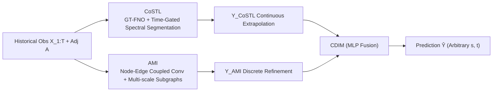

# Enabling Arbitrary Inference in Spatio-Temporal Dynamic Systems: A Physics-Inspired Perspective

**Conference**: ICLR 2026  
**OpenReview**: [https://openreview.net/forum?id=b6Py2zy0fK](https://openreview.net/forum?id=b6Py2zy0fK)  
**Code**: To be confirmed  
**Area**: Spatio-Temporal Prediction / Graph Neural Operators / Dynamical System Modeling  
**Keywords**: Neural Operators, Graph Fourier Transform, Spatio-Temporal Prediction, Arbitrary Inference, Multi-scale Graph Convolution, Magnetic Laplacian  

## TL;DR
PhySTA integrates continuous neural operators with discrete graph neural networks. It employs the Graph-Temporal Fourier Neural Operator (GT-FNO) based on the Magnetic Laplacian to learn continuous dynamics, supplemented by the Adaptive Multi-scale Interaction (AMI) module using node-edge coupled convolutions to correct discrete interaction errors. This enables efficient and generalizable inference for **unobserved regions and arbitrary spatio-temporal points** in graph-structured systems.

## Background & Motivation
- **Background**: Real-world spatio-temporal systems (traffic, climate, air quality) evolve continuously in space and time. However, due to sparse sensor deployment and finite sampling, observations are inherently discrete, creating a gap between "discrete observations" and "continuous dynamics."
- **Limitations of Prior Work**: Neural operators (e.g., DeepONet, FNO) learn continuous mappings in function space and allow cross-resolution generalization but are typically restricted to Euclidean grids. Graph Neural Networks (STGCN, DCRNN, AGCRN, etc.) dominate non-Euclidean domains but focus on discrete node-level propagation, **failing to explicitly model node-edge coupling** and relying on deep stacking for multi-scale interactions, which is inefficient and limits accuracy.
- **Key Challenge**: Continuous evolution modeling (the strength of neural operators) and discrete interaction learning (the strength of GNNs) have remained parallel paradigms. No existing methods effectively combine both on graphs, leading to poor generalization to unseen regions and limited long-term prediction accuracy.
- **Goal**: To learn a continuous operator $\Phi$ on graph-structured domains that, given historical observations $X_{1:T}$ and adjacency $A$, can predict signals at any spatial location $s\in\mathcal{M}$ (including unobserved points) and any future time $t$ as $\hat{x}(s,t)=\Phi(X_{1:T},A;s,t)$.
- **Core Idea**: **"Continuous Operator Foundation + Discrete Interaction Correction."** Specifically, instantiate non-Euclidean systems as spatio-temporal graphs, using operator theory for continuous extrapolation and multi-body dynamics-inspired graph interactions for discrete refinement. These are unified into a "coarse-to-fine" inference path via a MLP-based integration module.

## Method

### Overall Architecture
PhySTA takes historical node observations $X_{1:T}$ and adjacency matrix $A$ as input. It consists of three collaborative components: (1) **CoSTL** (Continuous Spectral-Temporal Learning), which uses GT-FNO with time-gated spectral segment perception to approximate the solution operator in the spectral domain for continuous extrapolation $Y_{\text{CoSTL}}$; (2) **AMI** (Adaptive Multi-scale Interaction), inspired by multi-body dynamics, which utilizes node-edge coupled convolutions across multi-scale subgraphs to capture discrete interactions and correct accumulated errors, producing $Y_{\text{AMI}}$; (3) **CDIM** (Continuous-Discrete Interaction Module), which non-linearly fuses both outputs via an MLP for the final prediction $\hat{Y}$. The former permits continuous generalization across targets, while the latter provides multi-scale refinement on hierarchical graphs.

### Key Designs

**1. GT-FNO: Joint Graph-Temporal Spectral Decomposition for Neural Operators on Directed Graphs.** This is the foundation of continuous modeling. While traditional FNO relies on the Fourier Transform in Euclidean space, PhySTA performs a Graph Fourier Transform (GFT) in the graph domain. It uses complex eigenvectors $\{\phi_q\}$ of the **Magnetic Laplacian** to map node-domain signals to the graph spectral domain, encoding directed dependencies (reducing to a standard Laplacian for undirected graphs): $X_{\text{gft}}(q,t)=\sum_{n=1}^N \phi_q(n)X(n,t)$. A 1D FFT is then applied along the time axis to obtain the joint spectral representation $X_{\text{gtft}}(q,\omega)=\sum_{t=1}^T X_{\text{gft}}(q,t)e^{-i\omega t}$. After processing, the signal is mapped back via an inverse transform: $Y_{\text{CoSTL}}(n,t)=\sum_{k}\sum_{\omega}X_{\text{tgssp}}(k,\omega)\phi_k(n)e^{i\omega t}$. Due to the completeness of the Fourier basis in $L^2$ space, GT-FNO learns to approximate continuous operators rather than discrete function mappings.

**2. Time-Gated Spectral Segment Perception (TGSSP): Differentiated Parameterization + Time-Gating for Non-stationarity.** To prevent parameter explosion from too many spectral modes, TGSSP allocates parameters strategically: "heavy parameters for important bands, shared parameters for secondary ones." Spectral modes are divided into $I_{\text{neg}}, I_{\text{pos}}$ based on eigenvalue signs. The positive band is segmented into low, mid, and high frequencies based on energy thresholds $s=(0.1, 0.95)$. Low-frequency modes use unique kernels $W_k^{\text{low}}$, while others share band-wise kernels with learnable per-mode scaling factors $\alpha_k$. For non-stationarity, a time gate $g(\omega)=\sigma(W_g\tilde{h}(\omega)+b_g)$ is generated from the frequency domain representation of absolute time embeddings $\tilde{h}(\omega)$, adaptively reweighting bands as a spectral-domain attention mechanism.

**3. Adaptive Multi-scale Interaction (AMI): Node-Edge Coupled Convolution + Single-layer Multi-scale Subgraph Correction.** Continuous extrapolation from operator learning can accumulate errors. AMI compensates for this using discrete graph interactions. Inspired by gravitational multi-body interactions, the **node-edge coupled convolution** encodes edge attributes and neighbor features together for FiLM modulation: $\tilde{e}_{ij}=\text{MLP}_e(e_{ij})$, $[\gamma_{ij},\beta_{ij}]=\text{MLP}_\phi([\tilde{e}_{ij};v_j])$, with message passing $m_{ij}=\gamma_{ij}\odot v_j+\beta_{ij}$ and node updates $v_i'=\sigma(\sum_{j\in N(i)}m_{ij})$. To capture long-range dependencies within a **single layer**, three-level subgraphs are constructed: a **coarse** graph using Louvain community detection to capture global trends, a **mid** graph preserving original adjacency for local interactions, and a **fine** graph using Top-K sparse edge weights for refined integration.

**4. CDIM: Non-linear Fusion of Continuous Extrapolation and Discrete Correction.** Finally, $Y_{\text{CoSTL}}$ and $Y_{\text{AMI}}$ are concatenated and passed through an MLP: $\hat{Y}=\text{CDIM}([Y_{\text{CoSTL}},Y_{\text{AMI}}])=W_2(\text{Dropout}(\phi(W_1 z+b_1)))+b_2$. This learns a non-linear correction function, ensuring a coherent coarse-to-fine inference path.

## Key Experimental Results

### Main Results
Evaluations on three real-world datasets (PEMS-BAY/SD traffic, KnowAir) used a 6:2:2 temporal split. Unobserved regions were simulated via random node masking. Mean MAE/MAPE/RMSE are reported for a 12-step horizon.

| Dataset | Metric | Strong Baselines (Sub-optimal) | PhySTA |
|---|---|---|---|
| KnowAir (Mask=0.7) | MAE | STGCN 29.75 / GWNET 30.87 | **27.19** |
| PEMS-BAY (Mask=0.3) | MAE / RMSE | STTN 2.80 / 6.08 | **2.75 / 5.85** |
| PEMS-BAY (Mask=0.5) | MAE | STTN 3.69 | **3.52** |
| SD (Mask=0.3) | RMSE | STTN 92.03 | **91.65** |
| SD (Mask=0.7) | MAE | GWNET 106.50 | **96.09** |

PhySTA achieves optimal or sub-optimal performance across all datasets and mask rates, with significant advantages in high-sparsity scenarios (Mask=0.7).

### Efficiency Comparison

| Model | Parameter Count | GPU Memory (MB) |
|---|---|---|
| ASTGCN | 2,153,034 | 11,028 |
| STGODE | 729,228 | 18,864 |
| AGCRN | 760,580 | 11,140 |
| STTN | 113,740 | 18,864 |
| **PhySTA** | **123,474** | **6,042** |

PhySTA reduces FLOPs by up to 74.6% compared to baselines while maintaining high accuracy with only 123k parameters.

### Ablation Study (PEMS-BAY, Mask=0 / Mask=0.5)

| Variant | MAE (Mask=0) | MAE (Mask=0.5) |
|---|---|---|
| Full Model | **1.66** | **3.52** |
| w/o TGSSP | 1.80 | 4.12 |
| w/o GT-FNO | 2.05 | 5.03 |
| w/o ENCC | 1.73 | 3.87 |
| w/o MSGCN | 1.79 | 3.96 |
| w/o AMI | 1.88 | 4.13 |

### Key Findings
- **GT-FNO is Critical**: Removing it causes MAE to rise from 1.66 to 2.05 (Mask=0), highlighting the importance of continuous spectral operators.
- **AMI provides Robustness**: Excluding AMI results in the largest performance drop under masking, verifying that multi-scale discrete correction is vital for sparse data.
- **Case Study**: The time gate acts as spectral-domain attention, with low-frequency gates remaining open for global trends while high-frequency gates respond to local transients.

## Highlights & Insights
- **Neural Operators on Graphs**: Extending FNO to directed graphs via the Magnetic Laplacian bridges operator learning and graph spatio-temporal prediction.
- **Clear Division of Labor**: CoSTL handles continuous extrapolation and arbitrary point generalization, while AMI handles discrete interaction correction.
- **Single-layer Multi-scale**: Utilizing multigrid concepts (coarse-mid-fine subgraphs) avoids the inefficiency of deep stacking in traditional GNNs.
- **Pragmatic Parameterization**: Differentiated kernels for frequency bands achieve an effective trade-off between accuracy and efficiency.

## Limitations & Future Work
- Error analysis remains qualitative (spectral truncation/finite parameters), lacking quantitative approximation error bounds in the main text.
- Evaluation is limited to traffic and air quality; verification on Euclidean continuous fields (e.g., fluid dynamics) is mentioned but not tested.
- "Arbitrary inference" is mostly tested via node masking; specific quantitative evaluation for interpolation/extrapolation at arbitrary coordinates $s$ is missing.
- Louvain clustering is a preprocessing step; sensitivity to community structures and handling of dynamic graphs are not fully discussed.

## Related Work & Insights
- **Neural Operator Lineage**: DeepONet, FNO, ST-FNO—PhySTA's GT-FNO is a directed graph extension of the FNO paradigm.
- **Spatio-Temporal Graph Lineage**: STGCN, GWNet, DGCRN, STTN—PhySTA addresses their limitations in modeling node-edge coupling and cross-scale dependencies.
- **Physics-Inspired**: Combines operator theory (dynamics), multi-body interaction (coupling), and multigrid solvers (multi-scale subgraphs).

## Rating
- **Novelty**: ⭐⭐⭐⭐ — Successfully extends neural operators to directed graphs and integrates them with multi-scale GNNs.
- **Experimental Thoroughness**: ⭐⭐⭐ — Solid results across many datasets/masking rates, though missing Euclidean field tests.
- **Writing Quality**: ⭐⭐⭐⭐ — Clear motivation and well-structured narrative.
- **Value**: ⭐⭐⭐⭐ — Highly practical for sparse sensing scenarios with significant memory and parameter efficiency.

<!-- RELATED:START -->

## Related Papers

- [\[ICML 2026\] Learning Long Range Spatio-Temporal Representations over Continuous Time Dynamic Graphs with State Space Models](../../ICML2026/time_series/learning_long_range_spatio-temporal_representations_over_continuous_time_dynamic.md)
- [\[ICLR 2026\] Towards Generalizable PDE Dynamics Forecasting via Physics-Guided Invariant Learning](towards_generalizable_pde_dynamics_forecasting_via_physics-guided_invariant_lear.md)
- [\[ICML 2026\] Nested Spatio-Temporal Time Series Forecasting](../../ICML2026/time_series/nested_spatio-temporal_time_series_forecasting.md)
- [\[ICLR 2026\] ST-HHOL: Spatio-Temporal Hierarchical Hypergraph Online Learning for Crime Prediction](st-hhol_spatio-temporal_hierarchical_hypergraph_online_learning_for_crime_predic.md)
- [\[ICLR 2026\] TRIDENT: Cross-Domain Trajectory Spatio-Temporal Representation via Distance-Preserving Triplet Learning](trident_cross-domain_trajectory_spatio-temporal_representation_via_distance-pres.md)

<!-- RELATED:END -->
