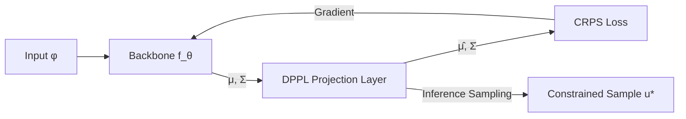

# End-to-End Probabilistic Framework for Learning with Hard Constraints

**Conference**: ICLR 2026  
**OpenReview**: [https://openreview.net/forum?id=RPowYXiRmW](https://openreview.net/forum?id=RPowYXiRmW)  
**Code**: [amazon-science/probharde2e](https://github.com/amazon-science/probharde2e)  
**Area**: Time Series / Scientific Machine Learning  
**Keywords**: Hard constraints, probabilistic forecasting, differentiable projection layer, CRPS, uncertainty quantification

## TL;DR

ProbHardE2E proposes the Differentiable Probabilistic Projection Layer (DPPL), which directly applies hard constraints to distribution parameters to enable end-to-end training. It simultaneously supports strict constraint satisfaction and uncertainty quantification in both probabilistic time series forecasting and PDE solving.

## Background & Motivation

**Background**: Machine learning is widely applied in engineering and scientific tasks, but physical/operational constraints (conservation laws, hierarchical coherence, non-negativity) often must be "hard" satisfied—any violation is unacceptable.  
**Limitations of Prior Work**: Existing methods either treat constraints as soft penalties (no guarantee of satisfaction), apply post-processing projections only during inference (decoupling the training objective from constraints, preventing end-to-end optimization), or only support linear constraints. Furthermore, almost all constrained methods provide only point estimates, lacking uncertainty quantification (UQ).  
**Key Challenge**: It is difficult to simultaneously achieve hard constraint satisfaction, end-to-end training, and probabilistic distribution outputs: projecting samples introduces high sampling overhead, while directly projecting distribution parameters requires differentiable closed-form derivations.  
**Goal**: Build a unified framework that supports linear, nonlinear, and convex inequality constraints, can be optimized in an end-to-end manner, and outputs calibrated probability distributions.  
**Core Idea**: Insert a DPPL after the neural network output layer. This layer maps unconstrained distribution parameters (mean $\mu$, covariance $\Sigma$) to constrained parameters $(\hat\mu, \hat\Sigma)$ through weighted constrained least squares projection. The covariance is propagated using the Multivariate Delta Method, and the model is trained end-to-end using a sample-free closed-form CRPS as the objective.

## Method

### Overall Architecture

ProbHardE2E adopts a Predictor-Corrector dual-step structure: the backbone network $f_\theta$ predicts unconstrained distribution parameters $(\mu_\theta, \Sigma_\theta)$, the DPPL projects them onto the constraint manifold to obtain $(\hat\mu_\theta, \hat\Sigma_\theta)$, and finally, all parameters are updated end-to-end using the closed-form CRPS loss. During inference, exact projection is performed for each sample to ensure strict constraint satisfaction.

### Key Designs

**1. Differentiable Probabilistic Projection Layer (DPPL): Applying Constraints to Distribution Parameters**

The core of DPPL is transforming the constraint satisfaction problem into a weighted constrained least squares problem:

$$u^*(z) := \arg\min_{\hat u:\, g(\hat u)\le 0,\, h(\hat u)=0} \|\hat u - z\|_Q^2$$

For the mean $\mu$ and covariance $\Sigma$ output by the backbone, using the Multivariate Delta Method (Theorem 3.1), if $T(z)=u^*(z)$, the projected distribution parameters are approximated as:

$$\hat\mu = T(\mu), \quad \hat\Sigma = J_T(\mu)\,\Sigma\,J_T(\mu)^\top$$

where $J_T(\mu)$ is the Jacobian of the projection mapping at $\mu$. This ensures the covariance is correctly propagated without needing to project samples individually—**no sampling is required during training**, and the computational overhead is only about 2× that of the unconstrained baseline, saving 3–5× compared to sampling-based schemes.

**2. Unified Handling of Multiple Constraint Types**

DPPL provides different solution strategies for three constraint types (see Table 1):
- **Linear Equality Constraints** $A\hat u = b$: Oblique projection $P_{Q^{-1}}z + (I-P_{Q^{-1}})A^\dagger b$, fully closed-form, equivalent during training and inference.  
- **Nonlinear Equality Constraints** $h(\hat u)=0$: During training, Newton iteration is used to approximate the mean projection, and the Jacobian is calculated via implicit differentiation; during inference, each sample is solved accurately to guarantee strict feasibility.  
- **Convex Inequality Constraints** $g(\hat u)\le 0$: During training, a convex optimization solver is called, and gradients are obtained through sensitivity analysis or argmin differentiation; during inference, convex programming is solved per sample.

Oblique projection ($Q=\Sigma^{-1}$) corrects along the covariance direction, better preserving the uncertainty structure of heteroscedastic data (e.g., spikes in time series); orthogonal projection ($Q=I$) is more beneficial for CRPS in smooth problems.

**3. Using CRPS instead of NLL as the Training Objective**

Existing SciML work commonly uses Negative Log-Likelihood (NLL) for probabilistic training, but NLL is sensitive to distribution assumptions. This paper instead uses the Continuous Ranked Probability Score (CRPS)—a strictly proper scoring rule that is more robust to model misspecification. For univariate Gaussian distributions, CRPS has a closed-form expression, allowing the loss to be calculated directly on distribution parameters above the projection layer, completely eliminating sampling needs:

$$\mathrm{CRPS}_\mathcal{N}(z) = z(2\Phi(z)-1) + 2\phi(z) - \frac{1}{\sqrt{\pi}}$$

In PDE experiments, training with CRPS improved both MSE and CRPS in approximately 75% of dataset-model combinations compared to NLL, with significant effects on nonlinear/sharp solutions.

## Key Experimental Results

### Main Results (PDE — Linear Constraints)

| Dataset | Metric | ProbHardE2E-Ob | ProbConserv | SoftC | VarianceNO |
|--------|------|---------------|-------------|-------|------------|
| Heat (Easy) | CRPS×10⁻³ | **0.304** | 0.392 | 0.354 | 0.396 |
| Advection (Med) | CRPS×10⁻³ | **4.19** | 3.88 | 3.96 | 3.98 |
| Stefan (Hard) | CRPS×10⁻³ | **7.52** | 7.85 | 9.88 | 9.51 |
| Advection | MSE×10⁻⁵ | **131** | 134 | 148 | 149 |

All ProbHardE2E variants achieved Constraint Error (CE) = 0; SoftC and VarianceNO had CE values as high as 18–182×10⁻³.

### Main Results (Time Series Hierarchical Forecasting — CRPS×10⁻³)

| Dataset | ProbHardE2E-Or | ProbConserv | HierE2E | DeepVAR (Unconstrained) |
|--------|---------------|-------------|---------|----------------|
| LABOUR | **28.6** | 45.8 | 50.5 | 38.2 |
| TOURISM | **82.4** | 100.7 | 103.1 | 92.5 |
| WIKI | **212.1** | 264.7 | 216.5 | 229.4 |

All constrained methods achieved CE=0, while DeepVAR CE reached as high as 8398.6 (WIKI).

### Ablation Study (Nonlinear Constraints, PDE)

| Configuration | MSE Gain (vs Inference-only) | CRPS Gain |
|------|--------------------------|-----------|
| ProbHardE2E vs ProbHardInf (m=2,3) | Up to ~15-17× | Up to ~2.5× |
| CRPS Training vs NLL Training | Improved MSE in +75% cases | Comprehensive improvement |
| No-sampling vs 100 Samples/step | 3.3–4.6× Training Speedup | Comparable performance |

### Key Findings

- End-to-end training (applying constraints during training) significantly improves probabilistic prediction accuracy compared to inference-time post-processing, especially under nonlinear constraints.
- Oblique projection ($Q=\Sigma^{-1}$) outperforms orthogonal projection on heteroscedastic problems containing spikes or discontinuities; orthogonal projection converges faster on smooth problems.
- CRPS as a training loss systematically outperforms NLL in UQ performance, particularly in SciML tasks (where NLL was previously the mainstream).

## Highlights & Insights

- Unifies hierarchical time series forecasting and PDE solving into a single framework, revealing the deep structural isomorphism between the two in terms of constraint forms and projection methods.
- The DPPL design of "parameter-level projection + Delta Method covariance propagation" cleverly bypasses the sampling bottleneck in probabilistic projection, balancing efficiency with strict feasibility.
- Replacing NLL with CRPS as the training objective for UQ in scientific machine learning is an important practical recommendation for the field.

## Limitations & Future Work

- Only uses first-order approximation (Delta Method) during nonlinear constraint training, which may introduce bias for highly nonlinear constraint projections.
- Convex inequality constraints still require external convex optimization solvers, which can be computationally expensive in large-batch or high-dimensional scenarios.
- Currently uses a diagonal covariance structure (for scalability). Low-rank or full covariance structures are briefly discussed in Appendix E but lack systematic evaluation.
- Time series applications currently focus mainly on hierarchical linear constraints; more complex nonlinear constraint scenarios for time series remain to be verified.

## Related Work & Insights

- **vs ProbConserv (Hansen et al., 2023)**: Also uses oblique projection but only applies constraints at inference time and only supports linear constraints; ProbHardE2E generalizes this to end-to-end and nonlinear constraints.
- **vs HierE2E (Rangapuram et al., 2021)**: End-to-end but uses orthogonal projection + sampling for quantile loss; ProbHardE2E introduces sample-free CRPS, oblique projection, and supports nonlinear constraints.
- **vs SoftC / PINNs**: Soft constraints do not guarantee satisfaction; DPPL's hard constraints are more reliable in operational/physical scenarios.
- **vs DC3 / OptNet (Amos & Kolter, 2017)**: These differentiable optimization layers only provide point estimates; ProbHardE2E extends them to probability distributions to provide UQ.

## Rating

- Novelty: ⭐⭐⭐⭐ The design of applying constraint projection directly to distribution parameters and propagating covariance via the Delta Method is novel; the cross-domain unified framework is valuable.
- Experimental Thoroughness: ⭐⭐⭐⭐ Covers 4 types of PDEs and 5 types of time series datasets, with complete ablation studies (end-to-end/oblique projection/CRPS/sampling efficiency).
- Writing Quality: ⭐⭐⭐⭐ Theoretical derivations are clear, and Algorithm 1 and Table 1 provide intuitive explanations of the framework.
- Value: ⭐⭐⭐⭐ Directly useful for probabilistic prediction scenarios requiring strict constraint satisfaction (supply chain, physical simulation, hierarchical reporting).

<!-- RELATED:START -->

## Related Papers

- [\[ICLR 2026\] DeepFRC: An End-to-End Deep Learning Model for Functional Registration and Classification](deepfrc_an_end-to-end_deep_learning_model_for_functional_registration_and_classi.md)
- [\[ICLR 2026\] Perturbed Dynamic Time Warping: A Probabilistic Framework and Generalized Variants](perturbed_dynamic_time_warping_a_probabilistic_framework_and_generalized_variant.md)
- [\[ICLR 2026\] Efficient Autoregressive Inference for Transformer Probabilistic Models](efficient_autoregressive_inference_for_transformer_probabilistic_models.md)
- [\[ICLR 2026\] From Samples to Scenarios: A New Paradigm for Probabilistic Forecasting](from_samples_to_scenarios_a_new_paradigm_for_probabilistic_forecasting.md)
- [\[ICLR 2026\] SwiftTS: A Swift Selection Framework for Time Series Pre-trained Models via Multi-task Meta-Learning](swiftts_a_swift_selection_framework_for_time_series_pre-trained_models_via_multi.md)

<!-- RELATED:END -->
