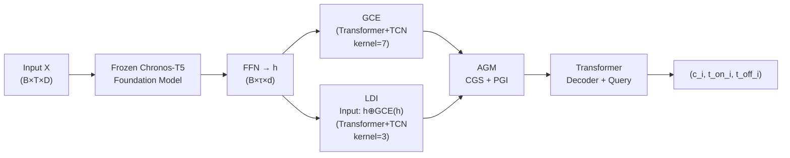

# Enhancing Sparse Event Detection in Healthcare Time-Series via Adaptive Gate of Context–Detail Interaction

**Conference**: ICLR 2026  
**OpenReview**: [https://openreview.net/forum?id=DulnZ7Dv82](https://openreview.net/forum?id=DulnZ7Dv82)  
**Code**: To be confirmed  
**Area**: Healthcare Time-Series / Event Detection  
**Keywords**: Sparse Event Detection, Time-Series, DETR, Adaptive Gating, Medical Biosignals

## TL;DR

A coarse-to-fine framework named GCE-LDI-AGM is proposed. It integrates global context and local details via an adaptive gating mechanism, complemented by Conditional Gating Scaling (CGS) and Positional Gaussian Injection (PGI) as auxiliary supervision. This approach significantly enhances the joint detection of categories and boundaries for extremely sparse events in medical time-series.

## Background & Motivation

**Background**: Detecting events in medical biosignals (such as ECG, emotion recognition, and activity monitoring) requires the simultaneous prediction of event categories and precise temporal boundaries, rather than merely performing anomaly detection or window-based classification. DETR-based methods, which have achieved breakthroughs in image detection through end-to-end set prediction, have been introduced to time-series detection tasks.

**Limitations of Prior Work**: Events in time-series data are often extremely sparse (some categories account for as little as 0.03%), with the vast majority of time steps corresponding to normal states. This leads to low accuracy and training instability in DETR-like methods when predicting sparse events. Additionally, the blurred boundaries of temporal events render traditional anchor alignment strategies ineffective.

**Key Challenge**: It is difficult to balance global context (long-range dependencies) and local details (precise boundaries) under conditions of extreme sparsity. Over-reliance on global features tends to submerge sparse event signals, while focusing on local features lacks sufficient semantic discriminability.

**Goal**: To design a coarse-to-fine detection framework based on existing DETR architectures that simultaneously addresses the problems of category imbalance and imprecise boundary localization for sparse events.

**Key Insight**: Utilizing a frozen Chronos-T5 time-series foundation model as the backbone, the framework introduces dual-path extraction via GCE (Coarse-grained Global Exploration) and LDI (Fine-grained Local Detection). These features are dynamically fused by an Adaptive Gating Module (AGM). The AGM embeds CGS (utilizing binary labels to mitigate category imbalance) and PGI (aligning Gaussian-shaped labels to the feature space to strengthen boundary localization), implementing a "refine where detected" gating strategy.

## Method

### Overall Architecture

The input multivariate or univariate time-series $X \in \mathbb{R}^{B \times T \times D}$ is encoded by a frozen Chronos-T5 foundation model. It then passes sequentially through FFN mapping, GCE coarse-grained global exploration, and LDI fine-grained local detection. These are fused by the AGM and finally processed by a Transformer decoder with learnable object queries to output categories $c_i$, onset times $t^{on}_i$, and offset times $t^{off}_i$ for $N$ events.

### Key Designs

**1. Coarse-to-Fine Dual-Path Feature Extraction (GCE & LDI): Capturing Complementary Temporal Perspectives**

Both GCE and LDI consist of a Transformer encoder paired with a TCN-attention mechanism using dilation rates of [1, 2, 4, 8]. However, they form a coarse-to-fine hierarchy in two dimensions: first, the kernel sizes differ—GCE uses kernel=7 to perceive longer-range patterns, while LDI uses kernel=3 to focus on short-range boundary details; second, the input for LDI incorporates not only the initial features $h_{align}$ but also the output of GCE ($x_{LDI} = h_{align} \oplus f_{GCE}(h_{align})$). This ensures the local module operates under global semantic guidance, avoiding blind extraction of detailed features. The two outputs are mapped to a common representation space via linear alignment layers to ensure consistency during fusion.

**2. Conditional Gating Scaling (CGS): Adapting to Sparse Event Category Imbalance**

CGS utilizes a FFN based on GCE features to predict a binary event label (event/non-event) for each time step. Learning for sparse classes is reinforced using an inverse-frequency weighted cross-entropy loss $L_{BCE}$:

$$w_0 = \frac{1/r_0}{1/r_0 + 1/r_1},\quad w_1 = \frac{1/r_1}{1/r_0 + 1/r_1}$$

where $r_0$ and $r_1$ represent the non-event and event ratios, respectively, with $w_1 > w_0$. The FFN output serves as a conditional scaling weight $w_c$, which performs element-wise weighting on the AGM input $\tilde{x}_{AGM} = w_c \odot x_{AGM}$. This dynamically amplifies event-related features and suppresses redundant normal segment features during forward propagation without requiring additional sampling strategies.

**3. Positional Gaussian Injection (PGI): Softened Boundary Supervision for Enhanced Temporal Localization**

PGI generates Gaussian distribution labels for each annotated event, centered at $c = (t_s + t_e - 1)/2$. Boundaries are explicitly enforced as zero:

$$y_{gaussian}(t) = \begin{cases} \frac{\mathcal{N}(t; c, \sigma^2)}{\max_{u \in [t_s, t_e]} \mathcal{N}(u; c, \sigma^2)}, & t_s < t < t_e \\ 0, & t \in \{t_s, t_e\} \end{cases}$$

This soft label is aligned via cosine similarity loss to the AGM feature space (projected via Conv1D) and the Gaussian embedding encoded by the frozen foundation model:

$$L_{cos} = 1 - \frac{1}{B\tau}\sum_{b,t} \frac{\text{Conv}(\tilde{x}_{AGM})_{b,t} \cdot f_{FM}(y_{gaussian})_{b,t}}{\|\cdots\|_2\|\cdots\|_2}$$

Compared to discrete 0/1 labels, Gaussian soft labels explicitly mark event centers, increase discriminability between adjacent events, and eliminate boundary ambiguity caused by fixed-length window partitioning.

**4. Adaptive Gating Fusion and Multi-Objective Training: Balancing Global and Local Contributions**

After AGM fuses GCE and LDI features via Cross-Attention, it applies CGS weighting and PGI positional injection, eventually producing a time-step-level gating tensor $g \in \mathbb{R}^{B \times \tau \times 1}$ via Conv1D + Sigmoid:

$$h_{gated} = g \odot f_{LDI} + (1 - g) \odot f_{GCE}$$

When the model determines a time step is likely to contain an event ($g$ is large), the weight of local detail features increases; otherwise, it relies on global context. The overall training objective is a weighted sum of three terms:

$$L_{total} = 0.2 \cdot L_{cos} + 0.1 \cdot L_{BCE} + 0.7 \cdot L_{Detection}$$

$L_{Detection}$ uses Hungarian matching with a cost combination of $\lambda_{cls}:\lambda_{ctr}:\lambda_{len} = 1:5:1$ for event center L1 loss and length L1 loss. The final detection loss is $5.0 \cdot L_{loc} + 2.0 \cdot L_{cls}$.

## Key Experimental Results

### Main Results

| Dataset | Metric | Ours | Prev. SOTA (Deformable-DINO) | Gain |
|--------|------|------|------|---|
| MIT-BIH Class 3 | PW-F1 | **90.63** | 86.41 | +4.22 |
| MIT-BIH Class 3 | AF-F1 | **85.96** | 83.22 | +2.74 |
| MIT-BIH Class 6 | PW-F1 | **83.37** | 74.11 | +9.26 |
| MIT-BIH Class 15 | PW-F1 | **74.86** | 63.49 | +11.37 |
| SHDB-AF Class 3 | PW-F1 | **96.23** | 90.86 | +5.37 |
| SHDB-AF Class 5 | AF-F1 | **83.78** | 65.98 | +17.80 |
| WESAD Class 8 | PW-F1 | **73.59** | 69.22 | +4.37 |
| OPP Class 5 | PW-F1 | **64.98** | 58.05 | +6.93 |

### Ablation Study (Focusing on core sparse event categories)

| Configuration | Ultra-Sparse PW-F1 | Description |
|------|------|------|
| Base DETR | ~29–44 | No AGM |
| + GCE/LDI Dual-path | +10–15pp approx. | Coarse-to-fine structure effectiveness |
| + CGS | Further Gain | Mitigation of category imbalance |
| + PGI (Full AGM) | Best | Significant boundary localization gain |

### Key Findings

- For extremely sparse events (SHDB-AF PAT&NOD, representing only 0.03%), the PW-F1 reached 66.41, outperforming the Prev. SOTA by 22.57 pp, verifying the effectiveness of AGM under extreme imbalance.
- For non-sparse categories (e.g., OPP "Stand", 42.36%), the PW-F1 remained at 55.61, indicating the framework does not sacrifice common categories for sparse category gains.
- A split phenomenon was observed in "Ventricular arrhythmia" with high PW-F1 but lower AF-F1, suggesting the model reliably detects occurrences but requires further improvement in boundary alignment precision.
- The overall lead across three metrics (PW-F1 / AF-F1 / mAP) indicates that the improvements are not due to single-dimension tuning.

## Highlights & Insights

- **Temporal Migration of Gating Concepts**: The attention gate concepts from object detection are migrated to the temporal domain and directly bound to sparse event supervision, resulting in a clean architecture with clear motivation.
- **Dual Soft Supervision**: CGS addresses sparsity and imbalance in the category dimension, while PGI addresses boundary ambiguity in the temporal dimension. Their orthogonal complementarity is the core differentiator from other DETR variants.
- **Frozen Foundation Model Backbone**: By utilizing Chronos-T5 for strong temporal representations without fine-tuning, the method reduces data requirements and ensures stability on small-scale medical datasets.
- **Clinical Utility**: Simultaneous output of categories and start/end times is more actionable than pure anomaly detection, allowing clinicians to navigate directly to suspicious segments.

## Limitations & Future Work

- Experiments were limited to biosignal datasets with single or few channels. Generalization to high-dimensional, non-stationary time-series (e.g., ICU multimodal sensors) remains to be fully verified.
- The weak performance of the "Ventricular arrhythmia" category on AF-F1 suggests bottlenecks in temporal alignment for events with long boundaries; finer boundary regression mechanisms could be introduced.
- The framework currently depends on Chronos-T5. The impact of other medical time-series foundation models (e.g., MOMENT, UniTS) is worth exploring.
- The current PGI Gaussian width $\sigma$ is linearly tied to event length; events with highly variable durations (e.g., epileptic seizures) may require an adaptive $\sigma$.

## Related Work & Insights

- **vs DETR/Deformable-DETR/DAB-DETR/DN-DETR/DINO**: These are 1D temporal adaptations of classic image detection methods; they lack specific designs for sparse events. Ours outperforms all six baselines across all datasets.
- **vs Anomaly Detection (e.g., GANF, TranAD)**: These only output anomaly segment markers without category or boundary information, failing to meet clinical needs.
- **vs Window Classification**: These cannot locate precise start/end times or distinguish multiple events within a window.
- **Insight**: The dual auxiliary supervision strategy of CGS+PGI can be generalized to other sparse annotation scenarios (e.g., rare lesion detection in medical images, industrial anomaly detection). The Gaussian soft label approach mirrors Gaussian heatmap supervision in object detection (e.g., CenterNet), a concept not yet fully exploited in the temporal domain.

## Rating

- Novelty: ⭐⭐⭐⭐ Combining AGM gating with CGS/PGI dual soft supervision for sparse event detection is innovative within the DETR framework, though it represents a combination of existing techniques.
- Experimental Thoroughness: ⭐⭐⭐⭐ Comprehensive comparison against six DETR baselines across four datasets and multiple metrics, including ablation and length-based analysis.
- Writing Quality: ⭐⭐⭐⭐ Clear motivation, sufficient chart explanations, and standard mathematical notation.
- Value: ⭐⭐⭐⭐ High clinical demand for sparse event detection in medical time-series; the framework is generalizable with relatively low barriers to deployment.

<!-- RELATED:START -->

## Related Papers

- [\[ICLR 2026\] Towards Multimodal Time Series Anomaly Detection with Semantic Alignment and Condensed Interaction](towards_multimodal_time_series_anomaly_detection_with_semantic_alignment_and_con.md)
- [\[ICLR 2026\] CPiRi: Channel Permutation-Invariant Relational Interaction for Multivariate Time Series Forecasting](cpiri_channel_permutation-invariant_relational_interaction_for_multivariate_time_se.md)
- [\[ICLR 2026\] EVEREST: A Transformer for Probabilistic Rare-Event Anomaly Detection with Evidential and Tail-Aware Uncertainty](everest_a_transformer_for_probabilistic_rare-event_anomaly_detection_with_eviden.md)
- [\[ICLR 2026\] ICDiffAD: Implicit Conditioning Diffusion Model for Time Series Anomaly Detection](icdiffad_implicit_conditioning_diffusion_model_for_time_series_anomaly_detection.md)
- [\[NeurIPS 2025\] MAESTRO: Adaptive Sparse Attention and Robust Learning for Multimodal Dynamic Time Series](../../NeurIPS2025/time_series/maestro_adaptive_sparse_attention_and_robust_learning_for_multimodal_dynamic_tim.md)

<!-- RELATED:END -->
