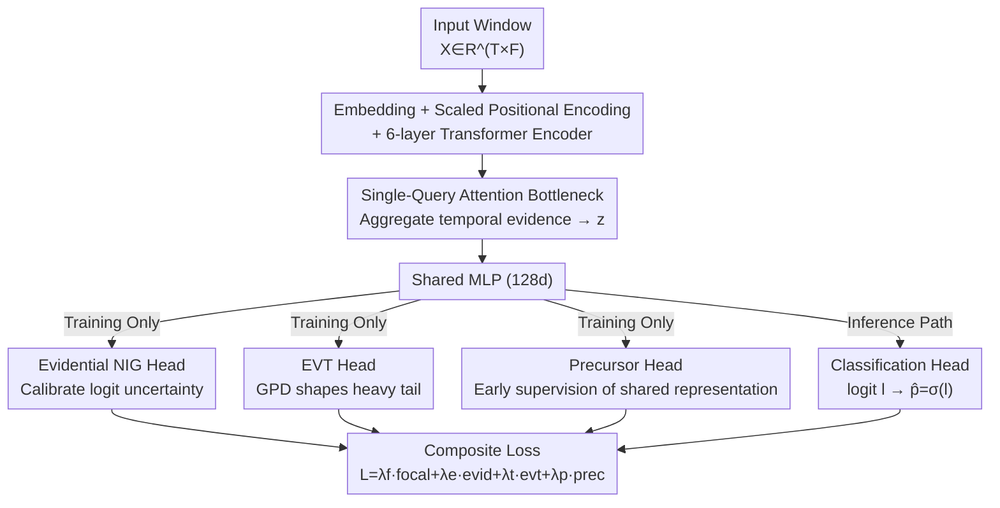

# EVEREST: A Transformer for Probabilistic Rare-Event Anomaly Detection with Evidential and Tail-Aware Uncertainty

**Conference**: ICLR2026  
**OpenReview**: [https://openreview.net/forum?id=ScpCaOVGw1](https://openreview.net/forum?id=ScpCaOVGw1)  
**Code**: To be confirmed  
**Area**: Time Series / Rare Event Prediction / Uncertainty Estimation  
**Keywords**: Rare Event Prediction, Evidential Deep Learning, Extreme Value Theory, Calibration, Solar Flares

## TL;DR
EVEREST utilizes a compact Transformer for multivariate time-series rare-event prediction. It attaches three auxiliary heads to a shared backbone—**active only during training** (an Evidential NIG head for calibration, an EVT head for tail risk, and a Precursor head for early supervision). During inference, only the classification head remains, resulting in zero additional overhead. On ten years of solar flare data, it achieves TSS scores of 0.973/0.970/0.966 for C-class flares at 24/48/72-hour horizons and transfers seamlessly to the industrial anomaly dataset SKAB (F1=98.16%) without architectural changes.

## Background & Motivation
**Background**: Predicting "rare but high-cost" events (solar flares, industrial failures, grid/satellite anomalies) in multivariate time series is a persistent challenge. Major approaches follow two lines: strengthening sequence encoders via frequency domain decomposition (FEDformer), patch tokenization (PatchTST), or purely convolutional long-sequence models; or designing specialized structures for flares (LSTM, CNN–Transformer hybrids, SolarFlareNet). These have improved "discrimination" significantly.

**Limitations of Prior Work**: High-risk operational scenarios require more than just discrimination. First, extreme class imbalance combined with long contexts leads to sparse positive samples and early precursors being diluted, as standard cross-entropy provides negligible gradients in extreme regions. Second, decision-making relies on **calibrated probabilities** for threshold-based alerts; miscalibrated models lose operational value. There is also a need to decompose **aleatoric** and **epistemic** uncertainty. Third, catastrophic consequences reside in the **heavy tails** of the distribution, which average loss functions fail to address. Existing methods rarely solve "calibration" and "tail sensitivity" simultaneously within a compact architecture.

**Key Challenge**: The three objectives—discrimination, calibration, and tail risk—each have mature tools (focal loss, evidential learning, Extreme Value Theory (EVT)), but they belong to different communities, and merging them often increases inference overhead or causes optimization conflicts.

**Goal**: To simultaneously address discrimination, calibration, and tail risk using a **single compact Transformer with zero extra inference overhead**.

**Key Insight**: The authors observe that calibration, tail, and precursor heads can function solely as **training-time regularizers**. They regularize the shared representation $z$ and are discarded at deployment, leaving only the classification head. Thus, the "multi-task benefits" are retained while the "multi-task overhead" is eliminated.

**Core Idea**: Use three "training-time auxiliary heads + a composite loss" to **regularize** a shared Transformer backbone's rare-event logit, which collapses into a standard classifier during inference.

## Method

### Overall Architecture
Input is a window $X \in \mathbb{R}^{T\times F}$ ($T$ time steps, $F$ features). Label $y\in\{0,1\}$ denotes event occurrence within a fixed prediction window. Output is a logit $l$ and probability $\hat{p}=\sigma(l)$, which triggers an alert if it exceeds threshold $\tau$. The network consists of four stages: ① Input embedding + learnable scaled positional encoding; ② A 6-layer standard Transformer encoder; ③ A **single-query attention bottleneck** that compresses the sequence into a latent vector $z$; ④ A shallow shared MLP (128-dim) followed by **four parallel heads**—the main classification head (inference), Evidential NIG head, EVT head, and Precursor head (the latter three active only during training). All heads share the backbone and MLP parameters, optimized via a composite loss. During deployment, only the classification head is used for a single forward pass, with overhead identical to a standard Transformer of the same scale (~0.81M parameters).

### Key Designs

**1. Single-Query Attention Bottleneck: Aggregating scattered weak precursors via global soft attention**

Precursors of rare events are often scattered, weak signals that global average pooling tends to dilute. The authors apply a **single** learnable score vector $w\in\mathbb{R}^d$ over the encoder outputs $H=[h_1,\dots,h_T]\in\mathbb{R}^{d\times T}$ to compute a soft attention distribution and weighted sum:

$$\alpha_t=\mathrm{softmax}_t\big(w^\top h_t\big),\qquad z=\sum_{t=1}^{T}\alpha_t\,h_t.$$

This bottleneck adds only $+d$ parameters and $O(Td)$ FLOPS but concentrates capacity on weak precursors. In the M5–72h task ablation, replacing this with mean pooling dropped performance by $\Delta\text{TSS}=0.427$, highlighting that representation aggregation is critical for rare events.

**2. Evidential NIG Head: Calibration as regularization via closed-form parameters**

To provide reliable probabilities and decompose uncertainty, this head predicts parameters $(\mu,v,\alpha,\beta)$ of a **Normal–Inverse–Gamma (NIG) distribution** over the logit $l$. It minimizes the closed-form evidential NLL, obtaining predictive mean and variance **without Monte Carlo sampling**. It acts as a Bayesian surrogate to regularize logit-level uncertainty. Unlike post-hoc temperature scaling, which only adjusts marginal reliability, the evidential head learns epistemic uncertainty conditioned on the input during training.

**3. EVT Head: Fitting Generalized Pareto to logit excess for tail sensitivity**

Standard losses provide insufficient gradients for catastrophic tail events. Using the **Extreme Value Theory Peaks-Over-Threshold (POT)** framework, for a mini-batch of logits $\{l_i\}$, a high quantile $u$ (def. 90%) is chosen to construct excesses $\{l_i-u : l_i>u\}$. The EVT head predicts **Generalized Pareto Distribution (GPD)** parameters $(\xi,\sigma)$ and maximizes its log-likelihood:

$$\Pr(L>u+x\mid L>u)\approx\Big(1+\tfrac{\xi x}{\sigma}\Big)^{-1/\xi}.$$

By fitting GPD to **logit excesses** rather than residuals, EVT becomes a **training-time tail-shaping regularizer**, redistributing gradient signals to rare, high-risk predictions.

**4. Precursor Head: Early supervision using redundant labels**

The precursor head **reuses the binary label $y$** with standard binary cross-entropy as an auxiliary target. It encourages the latent representation $z$ to encode **early discriminative cues** rather than just proximal features. Removing this in the M5–72h ablation caused a TSS drop of $-0.650$, indicating it substantially shapes the shared backbone.

### Loss & Training
The four heads are jointly optimized via a composite loss addressing discrimination, calibration, tail risk, and early supervision:

$$\mathcal{L}=\lambda_f\mathcal{L}_{\text{focal}}+\lambda_e\mathcal{L}_{\text{evid}}+\lambda_t\mathcal{L}_{\text{evt}}+\lambda_p\mathcal{L}_{\text{prec}}.$$

Reference weights are $(0.8, 0.1, 0.1, 0.05)$. The focal loss term handles class imbalance, with the focusing parameter $\gamma$ linearly annealed from $0$ to $2$ during the first 50 epochs (exploring broadly before focusing on hard samples). Training uses AMP mixed precision, AdamW, and cosine annealing.

## Key Experimental Results

### Main Results
On the SHARP–GOES solar flare benchmark (2010–2023, 9 tasks across 3 thresholds and 3 horizons), EVEREST outperforms LSTM (Liu 2019), 3D-CNN (Sun 2022), and SolarFlareNet (Abduallah 2023) in TSS (True Skill Statistic):

| Method | Horizon | ≥C | ≥M | ≥M5.0 |
|------|---------|-----|-----|-------|
| Liu et al. (2019) | 24h | 0.612 | 0.792 | 0.881 |
| Sun et al. (2022) | 24h | 0.756 | 0.826 | – |
| SolarFlareNet (2023) | 24h | 0.835 | 0.839 | 0.818 |
| **EVEREST** | 24h | **0.973** | **0.898** | **0.907** |
| **EVEREST** | 48h | **0.970** | **0.920** | **0.936** |
| **EVEREST** | 72h | **0.966** | **0.906** | **0.966** |

For the M5–72h task, ECE is 0.016. Compared to Prev. SOTA, Gain in the ≥C–48h task is +0.251 TSS. The model has only 814k parameters and 16.6M FLOPs.

### Ablation Study
Leave-one-component-out results for the M5–72h task:

| Configuration | ΔTSS (Relative to Full) | Description |
|------|------|------|
| Full model | — | Composite loss with four heads |
| w/o Attention Bottleneck | −0.427 | Diluted weak precursors |
| w/o Precursor Head | −0.650 | Largest drop; lacks early backbone shaping |
| w/o EVT Head | −0.285 | Significant degradation in tail sensitivity |
| w/o Evidential NIG Head | −0.064 | Lower ECE but minimal TSS impact |

### Key Findings
- **Precursor Head and Attention Bottleneck are pillars**: One gathers dispersed signals, the other forces early coding. Rare event difficulty lies in representation aggregation, not classification boundaries.
- **Auxiliary heads as robust regularizers**: Performance is stable across logarithmic grids of $(\lambda_{\text{evid}}, \lambda_{\text{evt}})$ and EVT quantiles $u$, proving the method is not sensitive to hyperparameter tuning.
- **Cross-domain Transfer**: Applying the same architecture to the industrial benchmark SKAB yields F1=98.16%, outperforming TranAD.
- **Explainability**: Saliency analysis shows TP predictions are preceded by concurrent rises in USFLUX and MEANGAM, aligning with physical flux emergence.

## Highlights & Insights
- **"Auxiliary at training, discard at inference" paradigm**: Treating calibration (Evidential), tail risk (EVT), and early supervision (Precursor) as training-only task regularizers allows the model to gain multi-task benefits with zero inference cost.
- **Logit-level EVT**: Fitting GPD to logit excesses instead of residuals converts EVT into a differentiable regularizer, "welding" extreme value theory into the neural network's gradient flow.
- **Aggregation is Underrated**: The $+d$ parameter bottleneck yielding a $+0.427$ TSS gain over mean pooling suggests that how we pool temporal features is a neglected aspect of rare event prediction.

## Limitations & Future Work
- **Limitations**: Uses a fixed-length window, potentially missing slow precursor dynamics. Data gaps and quality filters reduce coverage. Possible solar cycle drift between training and deployment. Catastrophic X-class events remain extremely sparse for tail fitting.
- **Future Work**: Implementing streaming/state-space models for infinite context; multi-modal integration (EUV/Radio); and continuous training to mitigate drift across solar cycles.

## Related Work & Insights
- **vs. Time-series Transformers (PatchTST / iTransformer)**: These focus on encoder efficiency, while EVEREST focuses on calibration and tail risk under rarity.
- **vs. Evidential Learning (Amini 2020)**: EVEREST applies NIG heads at the logit level as training-time regularizers with zero inference cost, whereas many methods use sampling or post-hoc scaling.
- **vs. EVT for Extremes (Kozerawski 2022)**: Previous works often fit tails to residuals; EVEREST fits tails to logits during training to guide the optimization.

## Rating
- Novelty: ⭐⭐⭐⭐ Clean integration of Evidence/EVT/Precursor heads as zero-overhead regularizers.
- Experimental Thoroughness: ⭐⭐⭐⭐ Strong results across 9 tasks, ablation, and cross-domain transfer.
- Writing Quality: ⭐⭐⭐⭐ Clear mapping from tripartite challenges to specialized auxiliary heads.
- Value: ⭐⭐⭐⭐ High utility for high-risk operations (space weather, industry) given compactness and calibration.

<!-- RELATED:START -->

## Related Papers

- [\[ICLR 2026\] Efficient Autoregressive Inference for Transformer Probabilistic Models](efficient_autoregressive_inference_for_transformer_probabilistic_models.md)
- [\[ICLR 2026\] Point-wise Anomaly Detection via Fold-bifurcation ODE](point-wise_anomaly_detection_via_fold-bifurcation_ode.md)
- [\[ICLR 2026\] Towards Multimodal Time Series Anomaly Detection with Semantic Alignment and Condensed Interaction](towards_multimodal_time_series_anomaly_detection_with_semantic_alignment_and_con.md)
- [\[ICLR 2026\] ICDiffAD: Implicit Conditioning Diffusion Model for Time Series Anomaly Detection](icdiffad_implicit_conditioning_diffusion_model_for_time_series_anomaly_detection.md)
- [\[AAAI 2026\] ProbFM: Probabilistic Time Series Foundation Model with Uncertainty Decomposition](../../AAAI2026/time_series/probfm_probabilistic_time_series_foundation_model_with_uncertainty_decomposition.md)

<!-- RELATED:END -->
