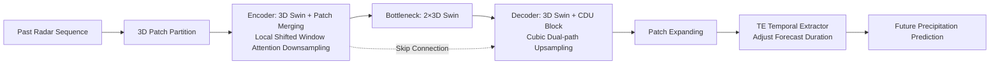

# Extreme Weather Nowcasting via Local Precipitation Pattern Prediction

**Conference**: ICLR 2026  
**OpenReview**: [https://openreview.net/forum?id=fDknsQhSgm](https://openreview.net/forum?id=fDknsQhSgm)  
**Code**: [https://github.com/tony890048/exPreCast](https://github.com/tony890048/exPreCast)  
**Area**: Spatiotemporal Sequence Prediction / Radar Precipitation Nowcasting  
**Keywords**: Precipitation Nowcasting, Extreme Weather, Video Swin Transformer, Upsampling, Radar Dataset  

## TL;DR
A deterministic nowcasting framework, exPreCast, is proposed. By utilizing local spatiotemporal attention, Cubic Dual-path Upsampling (CDU), and a Temporal Extractor (TE), it approaches the extreme precipitation prediction accuracy of diffusion ensemble models on SEVIR/MeteoNet and a newly constructed balanced KMA radar dataset with only 1/30 of the computational cost.

## Background & Motivation
**Background**: With climate change, extreme precipitation events such as heavy rain and typhoons have become more frequent. Accurate precipitation nowcasting is crucial for disaster prevention and mitigation. Radar observations provide high-resolution, real-time precipitation fields, spawning numerous data-driven nowcasting models ranging from ConvLSTM, PhyDNet, SimVP, and EarthFormer to recent diffusion-based generative ensemble methods such as CasCast.

**Limitations of Prior Work**: Current methods face significant drawbacks. While diffusion generative ensembles can predict fine structures and achieve SOTA results, their inference costs are extremely high (e.g., CasCast requires 4567 GFLOPs and nearly 400M parameters on SEVIR), failing to meet real-time operational needs. Conversely, deterministic models are computationally efficient but tend to bias toward "normal precipitation," smoothing out small-scale, high-intensity extreme precipitation. Furthermore, common upsampling methods are suboptimal: linear interpolation smoothes out high-intensity small regions into noise, while pixel-shuffle generates checkerboard artifacts.

**Key Challenge**: Extreme precipitation consists of small-scale, high-intensity, and high-frequency details. These details are either smoothed out by "efficient deterministic models" or are difficult to compute in real-time using "high-precision diffusion models." Achieving both accuracy and efficiency is difficult. Additionally, common evaluation benchmarks are biased (SEVIR focuses on storms, while MeteoNet consists mostly of light rain), making it difficult to test model generalization across the full spectrum of precipitation intensities.

**Goal**: To construct a deterministic framework that is both efficient and capable of preserving extreme precipitation details with flexible forecast durations, while providing a real-world radar benchmark with a balanced distribution of normal and extreme precipitation.

**Key Insight**: The **local shifted window attention** of the Video Swin Transformer is used to align with the prior that "precipitation is determined by local meteorological phenomena." This is paired with **CDU upsampling**, which merges interpolation and pixel rearrangement to preserve high-frequency extreme signals. Finally, a **Temporal Extractor (TE)** decouples the temporal dimension from the forecast duration, allowing a single architecture to cover both short-term and long-term forecasts.

## Method

### Overall Architecture
exPreCast is an encoder-decoder 3D Swin Transformer. The encoder partitions radar volume data into non-overlapping 3D patches, performing hierarchical downsampling and local spatiotemporal feature extraction via multi-level 3D Swin blocks and Patch Merging. After the bottleneck layer, the decoder mirrors the structure for upsampling but replaces standard upsampling with self-developed CDU blocks to preserve high-frequency textures, using skip connections to pass multi-scale features. Finally, Patch Expanding projects the features to the target resolution, and the TE block adjusts the temporal dimension to the required lead time.

### Key Designs

**1. Local Shifted Window Spatiotemporal Attention Backbone: Encoding the "Precipitation is a Local Phenomenon" prior.** Short-term precipitation is dominated by local meteorological features. Therefore, the authors replace global attention with the Video Swin Transformer, restricting self-attention to shifted windows. This allows the model to learn local patterns rather than global correlations. The shifted window mechanism introduces limited cross-window context while maintaining computational efficiency. The encoder-decoder structure with skip connections ensures multi-scale feature flow, allowing small-scale heavy precipitation structures to be recovered after downsampling.

**2. CDU Cubic Dual-path Upsampling: Merging interpolation and pixel rearrangement to remove artifacts and preserve high frequencies.** This is the most critical module for preventing extreme precipitation from being smoothed out. CDU parallels two branches: the interpolation branch uses a 3D convolution for channel mixing, followed by PReLU activation and trilinear interpolation upsampling to obtain $z_{ti}$; the pixel rearrangement branch uses a 3D convolution to expand channels, followed by activation and 3D pixel-shuffle upsampling to obtain $z_{ps}$. Given an input $z_{in}\in\mathbb{R}^{b\times t\times h\times w\times c}$, both branches output $\mathbb{R}^{b\times t^*\times h^*\times w^*\times \frac{c}{2}}$, which are concatenated and fused via another 3D convolution:
$$z_{out}=\mathrm{Conv3D}(z_{ti}\oplus z_{ps})\in\mathbb{R}^{b\times t^*\times h^*\times w^*\times \frac{c}{2}}$$
where $(t^*,h^*,w^*)=(s_t t, s_h h, s_w w)$. The trilinear branch ensures smoothness and suppresses checkerboard artifacts from pixel-shuffle, while the pixel rearrangement branch reconstructs high-frequency details and avoids over-smoothing/aliasing from interpolation. Their complementarity ensures that details are not lost and artifacts are not generated in small-scale, high-intensity regions.

**3. Temporal Extractor (TE): Decoupling the temporal dimension and forecast duration.** Nowcasting requirements vary in duration: immediate warnings require ultra-short terms, while disaster preparation requires long-term horizons. The TE follows the decoder, using spatiotemporal 3D convolutions sliding along $H, W, C$ dimensions to transform the decoder's output temporal dimension $T$ to the target duration $T^*$:
$$Y=\mathrm{Conv3D}_{(T)}(Z_{decoder})\in\mathbb{R}^{B\times T^*\times H\times W\times C}$$
For short-term forecasts, the CDU decoder uses a smaller temporal magnification factor, and the TE extracts minimal effective features. For long-term forecasts, the CDU uses a larger temporal factor to let the transformer learn richer temporal dynamics, which the TE then compresses to the target frame count. Since short- and long-term forecasts share the same historical input, the encoder is reusable. This allows for an efficient transfer learning paradigm where the encoder is frozen after short-term training and only the decoder/TE are fine-tuned for long-term tasks.

## Key Experimental Results

### Main Results
Evaluated using CSI/HSS on three datasets with distinct distributions (SEVIR biased toward extremes, MeteoNet biased toward normal, KMA balanced). CSI with pooling (POOL4/16) better reflects local pattern fidelity.

| Dataset | Model | Parameters (M) | FLOPs (G) | CSI-M (POOL16) | Extreme Threshold CSI (POOL16) | HSS |
|--------|------|--------|---------|---------------|---------------------|-----|
| KMA | CasCast | 391.0 | 1,729 | 0.4837 | CSI-80: **0.1695** | 0.3806 |
| KMA | **exPreCast** | 32.0 | **55** | **0.4841** | CSI-80: 0.1488 | **0.4042** |
| SEVIR | CasCast | 392.9 | 4,567 | **0.5525** | CSI-219: **0.2841** | **0.5602** |
| SEVIR | **exPreCast** | 32.0 | **208** | 0.5427 | CSI-219: 0.2910 | 0.5430 |
| MeteoNet | EarthFormer | 15.1 | 309 | 0.2155 | CSI-47: 0.0472 | 0.3748 |
| MeteoNet | **exPreCast** | 32.0 | **199** | **0.4446** | CSI-47: **0.2525** | **0.4116** |

exPreCast outperforms CasCast in CSI-M and achieves the highest HSS on KMA despite using approximately 1/30 of the FLOPs and 1/10 of the parameters. On SEVIR's extreme thresholds (POOL16), it even surpasses CasCast. On MeteoNet, it comprehensively leads all baselines (CasCast was excluded due to highly unstable results).

### Ablation Study
Comparison of upsampling strategies on KMA 1-hour forecasts (PS=Pixel-shuffle, TI=Trilinear, CDU=Ours):

| Upsampling | CSI-M POOL16 | CSI-80 POOL16 | CSI-M (Last Frame) POOL16 | CSI-80 (Last Frame) POOL16 |
|--------|-------------|---------------|--------------------|---------------------|
| PS | 0.4632 | 0.1379 | 0.3633 | 0.0771 |
| TI | 0.4740 | 0.1436 | 0.3884 | 0.1023 |
| **CDU** | **Superior** | **Superior** | **Most Robust** | **Most Robust** |

CDU is optimal for both pooled metrics and last-frame (long-term) forecasts, while individual PS/TI fail to provide reliable performance for long-term predictions.

### Key Findings
- **Efficiency/Accuracy Balance**: Compared to the diffusion-based CasCast, exPreCast achieves similar or higher extreme precipitation accuracy with an order of magnitude less computation and higher HSS, making it more suitable for real-time operations.
- **CDU is Key to Extreme Signal Fidelity**: Dual-path fusion significantly mitigates checkerboard artifacts and suppresses smoothing, leading to consistent improvements in pooled CSI metrics, particularly benefiting long-term forecasts.
- **Long-term Forecasting Advantage**: In 6-hour (36 frames) forecasts, the transfer-learned exPreCast† leads across all CSI metrics and is the only model capable of capturing heavy precipitation events.

## Highlights & Insights
- **Encoding Domain Priors Directly into Architecture**: Shifted window local attention corresponds to "precipitation locality," CDU corresponds to "extreme precipitation as small-scale high-frequency," and TE corresponds to "variable forecast duration." Each module responds to a physical or task-specific prior.
- **Universality of the CDU "Dual-path Complementarity"**: Interpolation ensures smoothness while pixel rearrangement preserves high frequencies. This fusion approach can be transferred to other dense prediction or super-resolution tasks that require balancing structure and detail.
- **Balanced Dataset Fills Evaluation Gaps**: KMA (2014–2023, 10-minute intervals) naturally covers the full spectrum of precipitation from normal to extreme due to South Korea's monsoon and typhoon climate, offering better generalization testing than the biased SEVIR/MeteoNet.

## Limitations & Future Work
- **Still a Deterministic Model**: Point predictions cannot express precipitation uncertainty and lack the probabilistic/ensemble forecasting capabilities of diffusion models, limiting support for confidence intervals in risk-based decision-making.
- **Extreme High Thresholds Slightly Trail Diffusion**: On KMA's CSI-80 (POOL16), CasCast still holds a slight lead, showing an accuracy gap in the most extreme tail events.
- **Dependency on Specific Regional Climate**: The "balance" of KMA stems from South Korea's unique climate. Whether this generalizes to other climatic zones or requires model retraining has not been fully verified.
- **Flexibility Boundaries of TE**: The degradation of ultra-long-term forecasts (beyond 6 hours) and the upper limit of temporal dynamics that the TE convolution can learn require further evaluation.

## Related Work & Insights
- **Spatiotemporal Sequence Backbones**: ConvLSTM integrates convolutions into recurrences, FourCastNet/AFNO utilizes Fourier operators, and Video Swin uses shifted window attention. This paper chooses the latter with domain-specific modules, demonstrating the rationality of "locality-first" in precipitation tasks.
- **Radar Nowcasting**: EarthFormer (spatiotemporal attention), NowcastNet, and diffusion methods like CasCast/DiffCast represent the performance ceiling. This work proves that targeted design allows deterministic models to approach these ceilings at much lower costs.
- **Upsampling Research**: Moving from linear/pixel-shuffle to the dual-upsampling inspired CDU suggests that the importance of upsampling modules for high-frequency fidelity in dense prediction is often underestimated.
- **Insight**: For tasks involving an "accuracy-efficiency" dilemma, instead of stacking large generative models, injecting domain priors into lightweight deterministic backbones as pluggable modules often yields more practical Pareto points.

## Rating
- Novelty: ⭐⭐⭐⭐ CDU upsampling and TE duration decoupling are cleverly designed and align with domain priors; a solid combination of innovations.
- Experimental Thoroughness: ⭐⭐⭐⭐ Comprehensive coverage across three datasets, short/long-term forecasts, upsampling ablations, and efficiency comparisons; could be strengthened by uncertainty/probabilistic evaluations.
- Writing Quality: ⭐⭐⭐⭐ Clear structure with a one-to-one correspondence between motivations and modules; minor typos do not hinder understanding.
- Value: ⭐⭐⭐⭐ Efficiently approaches diffusion accuracy and provides a balanced KMA dataset; valuable for real-time nowcasting operations and the research community.

<!-- RELATED:START -->

## Related Papers

- [\[CVPR 2026\] Probabilistic Precipitation Nowcasting with Rectified Flow Transformers](../../CVPR2026/time_series/probabilistic_precipitation_nowcasting_with_rectified_flow_transformers.md)
- [\[NeurIPS 2025\] Probability Calibration for Precipitation Nowcasting](../../NeurIPS2025/time_series/probability_calibration_for_precipitation_nowcasting.md)
- [\[ICLR 2026\] Improving Extreme Wind Prediction with Frequency-Informed Learning](improving_extreme_wind_prediction_with_frequency-informed_learning.md)
- [\[ICLR 2026\] Local Geometry Attention for Time Series Forecasting under Realistic Corruptions](local_geometry_attention_for_time_series_forecasting_under_realistic_corruptions.md)
- [\[ICLR 2026\] MixLinear: Extreme Low Resource Multivariate Time Series Forecasting with 0.1K Parameters](mixlinear_extreme_low_resource_multivariate_time_series_forecasting_with_01k_par.md)

<!-- RELATED:END -->
