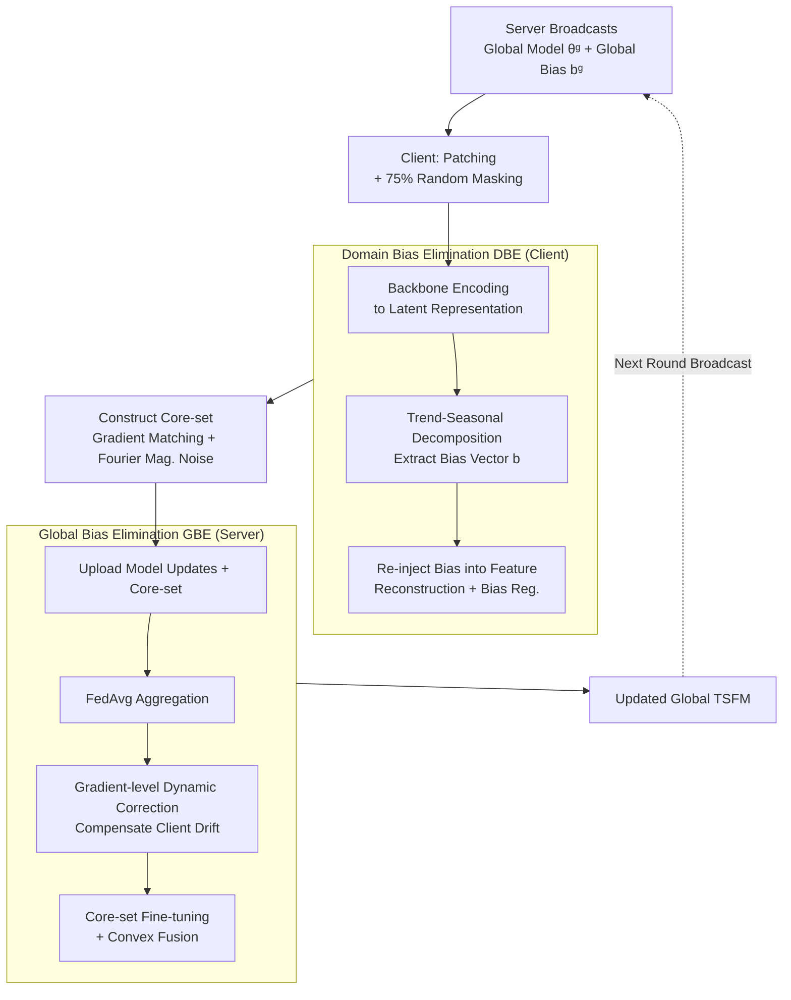

# FeDaL: Federated Dataset Learning for General Time Series Foundation Models

**Conference**: ICLR 2026  
**arXiv**: [2508.04045](https://arxiv.org/abs/2508.04045)  
**Code**: [GitHub](https://github.com/shengchaochen82/FeDaL)  
**Area**: Time Series / Federated Learning  
**Keywords**: Time Series Foundation Model, Federated Learning, Dataset Heterogeneity, Domain Bias Elimination, Cross-domain Generalization

## TL;DR

Ours proposes the FeDaL federated framework, which trains a general time series foundation model from scratch through client-side Domain Bias Elimination (DBE) and server-side Global Bias Elimination (GBE). It achieves competitive or superior performance on 8 types of downstream tasks with significantly fewer parameters than centralized TSFMs.

## Background & Motivation

**Background**: Time Series Foundation Models (TSFMs) such as Moirai, Chronos, and Time-MoE obtain transferable representations through large-scale multi-domain pre-training, but still rely on centralized data access and are typically applicable only to specific tasks (e.g., forecasting). Time Series Pattern Machines (TSPMs) pursue architectural generality but are trained dataset-by-dataset, limiting their zero-shot generalization capabilities. **Limitations of Prior Work**: FFTS, a pioneer in the Federated Foundation Model (FFM) direction, only addresses coarse-grained domain-level heterogeneity (e.g., climate vs. healthcare), ignores structural biases within datasets, and does not support zero-shot inference, preventing it from being a true foundation model. **Key Challenge**: Time series data are naturally siloed and heterogeneous, yet the federated aggregation assumes that client updates are unbiased estimates of the global gradient—this assumption fails when dataset heterogeneity is severe, leading to a global model dominated by bias. This paper systematically identifies three types of dataset-level biases: time resolution bias (different information densities due to different sampling rates in the same window), physical constraint bias (different physical laws reducing cross-domain transferability), and pattern shift bias (exogenous events causing divergence in initially similar trends, which are amplified during aggregation). **Goal**: Train a general TSFM from scratch under federated learning constraints that can support zero-shot inference for multiple downstream tasks and handle dataset-level heterogeneity. **Key Insight**: The distributed architecture of federated learning is a natural solution for decomposing heterogeneity—using DBE on the client to eliminate local biases and GBE on the server to align global representations. **Core Idea**: Reposition federated learning from a "privacy protection tool" to a "heterogeneity decomposition paradigm," producing domain-invariant time-series representations through the dual DBE+GBE mechanism.

## Method

### Overall Architecture

FeDaL adopts the standard "client training - server aggregation" federated learning paradigm, with each communication round involving three stages. On the **client** side, each client holds a time-series dataset, performs patching and random masking (75%) on input sequences, encodes them through a backbone, uses the Domain Bias Elimination (DBE) module to separate dataset-specific biases from representations, and performs reconstruction with bias regularization while constructing a core-set to concentrate local knowledge. On the **server** side, upon receiving model updates and core-sets from clients, it performs Global Bias Elimination (GBE) using three steps: FedAvg aggregation, gradient-level dynamic correction, and core-set fine-tuning, resulting in a corrected global model. After each round, the server broadcasts the updated global model $\theta^g$ and the global bias reference $\mathbf{b}^g$ to enter the next round, with DBE and GBE collaborating to gradually eliminate dataset-level biases.

### Key Designs

**1. Domain Bias Elimination (DBE): Removing dataset-specific non-transferable bias from representations at the client.**

Each dataset has its own time resolution, physical constraints, and pattern shift characteristics. If these biases remain in the backbone, they contaminate the global model during aggregation. DBE explicitly separates them: latent representations of masked inputs undergo trend-seasonal decomposition $\mathbf{h}_t, \mathbf{h}_s = \text{TimeDecomp}(f_{\theta^b}(\tilde{X}), \tau)$, where components are averaged and multiplied by learnable scaling factors to form a bias vector $\mathbf{b} = \text{Mean}(\mathbf{h}_t) \odot \gamma_t + \text{Mean}(\mathbf{h}_s) \odot \gamma_s$. During reconstruction, this bias is re-injected into the latent features to restore the sequence. The objective function is:

$$\mathcal{L} = \mathbb{E}[\|f_{\theta_h}(f_{\theta_b}(\tilde{X}) + \mathbf{b}) - X\|^2] + \lambda\|\mathbf{b} - \mathbf{b}^g\|_2^2$$

where $\mathbf{b}^g$ is the global bias reference aggregated by the server. The regularization term pulls client biases toward the global reference to prevent excessive drift; bias estimation under mini-batch is stabilized using EMA. Trend-seasonal decomposition is used instead of simple averaging to introduce inductive bias—$\mathbf{b}_t$ absorbs low-frequency drift while $\mathbf{b}_s$ absorbs high-frequency periodicity. Once dataset shifts are absorbed by this bias vector, the backbone is forced to learn only transferable temporal structures. DBE is a plug-and-play module that does not change the main architecture and can be attached to any Transformer-based time series model.

**2. Global Bias Elimination (GBE): Cleaning residual cross-client biases remaining after DBE at the server.**

The intensity of de-biasing varies across clients, and FedAvg aggregation still leaves residual biases. GBE eliminates these through two sub-steps. First is **gradient-level dynamic correction**: the server maintains a state vector $\mathbf{s}^r = \mathbf{s}^{r-1} - \beta\sum_i(\theta_i^r - \theta_g^{r-1})$ to record cumulative client-server drift, then uses it to correct the FedAvg result $\hat{\theta}_g^r = \tilde{\theta}_g^r - (1/\beta)\cdot\mathbf{s}^r$, compensating for the parts where clients drifted individually. Second is **core-set tuning**: each client samples mini-batches from local data and learns a set of core-set vectors concentrated with local knowledge via gradient matching $\mathcal{L}_{\text{match}} = \sum_{x}\|\nabla_\theta f_\theta(\mathcal{C}) - \nabla_\theta f_\theta(x)\|_2^2$; before uploading, noise is added only to the magnitude in the Fourier domain while preserving the phase (phase encodes semantic information like periodicity; perturbing it destroys knowledge), protecting privacy while retaining useful signals. The server performs fine-tuning on the corrected model using the aggregated core-set, followed by convex fusion of the two paths $\theta^{g,r} = \alpha\hat{\theta}^{g,r} + (1-\alpha)\theta^{gt,r}$. In short, gradient correction compensates for drift, and core-set tuning further aligns global representations using privacy-safe knowledge abstracts.

### Loss & Training

The client loss consists of masked patch reconstruction and bias regularization. The server executes three steps: weighted average aggregation, gradient correction, and core-set tuning plus convex fusion. Pre-training is conducted on the LOTSA dataset (231B time points, 174 datasets treated as 174 clients). Non-zero-shot downstream tasks require only one epoch of fine-tuning for adaptation.

## Key Experimental Results

### Main Results

**Federated Representation Learning** (Table 1, average Reconstruction MSE across 5 masking rates, lower is better):

| Method | UTSD-H1 | UTSD-H2 | CTSD | Comm. Params |
|------|---------|---------|------|-----------|
| FedAvg | 0.586 | 0.592 | 0.455 | 108.41 MB |
| FedProx | 0.583 | 0.586 | 0.444 | 108.41 MB |
| FFTS | 0.562 | 0.531 | 0.416 | 118.94 MB |
| Standalone | 0.571 | 0.567 | 0.447 | — |
| **FeDaL** | **0.551** | **0.511** | **0.387** | 110.41 MB |

Compared to FFTS, FeDaL reduces MSE by 4.16% on UTSD and 8.86% on CTSD.

**Zero-shot Forecasting** (Table 4, average of ETT series + Weather):

| Method | Type | Avg MSE | Avg MAE | # 1st Place |
|------|------|---------|---------|-----------|
| **FeDaL** | FL | **0.335** | **0.365** | 3 |
| FFTS | FL | 0.348 | 0.379 | 1 |
| Moirai-base | Centralized | 0.357 | 0.361 | 4 |
| Chronos-large | Centralized | 0.434 | 0.400 | 1 |
| Time-MoE-ultra | Centralized | 0.337 | 0.370 | 2 |

### Ablation Study

| Configuration | UTSD MSE | CTSD MSE | Avg. Change |
|------|----------|----------|---------|
| FeDaL (Full) | 0.573 | 0.405 | — |
| w/o Bias Alignment | 0.602 | 0.434 | ↓6.11% |
| w/o DBE | 0.637 | 0.452 | ↓9.17% |
| w/o Core-set Tuning | 0.590 | 0.430 | ↓4.57% |
| w/o Gradient Correction | 0.600 | 0.431 | ↓5.57% |
| w/o GBE | 0.610 | 0.444 | ↓8.05% |

### Key Findings

- DBE contributes the most (9.17% average drop when removed), indicating that local bias is the primary issue.
- Gradient correction and core-set tuning in GBE both have independent contributions; removing the entire GBE leads to an 8.05% drop.
- In full-shot long-term forecasting (Table 3), FeDaL achieves the best MSE on ETTh1/ETTm1/Weather/ILI, ranking first in 9 out of 12 metrics.
- Federated scaling behavior analysis (first of its kind): More clients plus a moderate participation rate yield the best results, with data volume increases bringing stable improvements.

## Highlights & Insights

- Federated learning is not just a privacy-preserving tool but also a natural computing paradigm for handling heterogeneity—turning the disadvantage of "scattered data" into the advantage of "bias decomposition."
- DBE is a plug-and-play module that can be added to any Transformer-based time series model without changing the main architecture.
- The Fourier domain noise strategy for the core-set is clever—perturbing only the magnitude while preserving the phase, as the phase encodes semantic information such as periodicity.
- This work provides the first systematic study of the scaling behavior of TSFM in a federated setting, offering empirical guidance for training decentralized foundation models.

## Limitations & Future Work

- Core-set tuning increases communication overhead by approximately 2MB per round, which may accumulate in large-scale scenarios.
- Validated only based on the Transformer architecture; newer time-series architectures like SSM (e.g., Mamba) have not been tested.
- Hyperparameters ($\lambda$, $\alpha$, $\beta$, core-set size $K$) require careful tuning; sensitivity analysis shows extreme values significantly reduce performance.
- Lack of in-depth comparison with personalized federated learning methods (e.g., Per-FedAvg).

## Related Work & Insights

- **vs FFTS**: FFTS only handles coarse-grained domain-level heterogeneity and does not support zero-shot inference. FeDaL handles dataset-level bias and supports zero-shot/single-epoch adaptation for 8 types of tasks.
- **vs Moirai/Chronos/Time-MoE**: These centralized TSFMs require pooling all data and have larger parameter counts. FeDaL achieves competitive performance under privacy-preserving constraints with fewer parameters (Zero-shot Avg MSE 0.335 vs Time-MoE-ultra 0.337).

## Rating
- Novelty: ⭐⭐⭐⭐ The intersection of FL and TSFM is novel; DBE/GBE designs are original.
- Experimental Thoroughness: ⭐⭐⭐⭐⭐ 8 types of tasks, 54 baselines, and federated scaling behavior analysis provide comprehensive coverage.
- Writing Quality: ⭐⭐⭐⭐ Clear illustrations of the three types of biases and a logical structure.
- Value: ⭐⭐⭐⭐ Provides a practical solution for general time-series modeling in privacy-protected scenarios.

<!-- RELATED:START -->

## Related Papers

- [\[ICLR 2026\] GTM: A General Time-series Model for Enhanced Representation Learning](gtm_a_general_time-series_model_for_enhanced_representation_learning_of_time-series.md)
- [\[ICML 2026\] FactoryNet: A Large-Scale Dataset toward Industrial Time-Series Foundation Models](../../ICML2026/time_series/factorynet_a_large-scale_dataset_toward_industrial_time-series_foundation_models.md)
- [\[ICLR 2026\] A Unified Federated Framework for Trajectory Data Preparation via LLMs](a_unified_federated_framework_for_trajectory_data_preparation_via_llms.md)
- [\[AAAI 2026\] Optimal Look-back Horizon for Time Series Forecasting in Federated Learning](../../AAAI2026/time_series/optimal_look-back_horizon_for_time_series_forecasting_in_federated_learning.md)
- [\[ICLR 2026\] Beyond Accuracy: Are Time Series Foundation Models Well-Calibrated?](beyond_accuracy_are_time_series_foundation_models_well-calibrated.md)

<!-- RELATED:END -->
