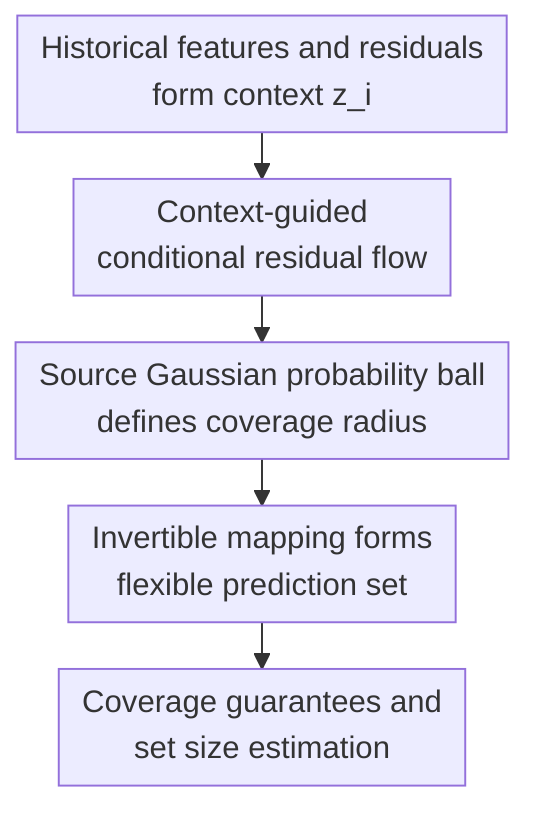

# Flow-based Conformal Prediction for Multi-dimensional Time Series

**Conference**: ICLR 2026  
**OpenReview**: [https://openreview.net/forum?id=Uv3efQiPBZ](https://openreview.net/forum?id=Uv3efQiPBZ)  
**Paper**: [OpenReview](https://openreview.net/forum?id=Uv3efQiPBZ)  
**Code**: https://github.com/Jayaos/flow_cp  
**Area**: Time Series  
**Keywords**: Multi-dimensional time series, conformal prediction, uncertainty quantification, guided flow, classifier-free guidance

## TL;DR
This paper proposes FCP, which utilizes flows with classifier-free guidance to learn multi-dimensional predictive residual distributions conditioned on historical context. It maps probability balls in a Gaussian source space into flexible prediction sets, maintaining target coverage while significantly reducing set volume on wind power, traffic, and solar radiation data.

## Background & Motivation
**Background**: Time series forecasting increasingly relies on black-box machine learning models, ranging from LSTMs to complex Transformers or foundation models, to provide point forecasts. However, in real-world applications like power grids, transportation, and meteorology, knowing a single point forecast is often insufficient. These systems prioritize understanding the set in which future outcomes are likely to fall. Consequently, conformal prediction (CP) has become a natural choice due to its distribution-free coverage guarantees.

**Limitations of Prior Work**: Classical CP is most effective under the assumption of exchangeability, where non-conformity scores on a calibration set can directly determine quantiles. Time series data, however, possess inherent temporal dependencies, where both observations and residuals may be correlated. Applying independent and identically distributed (i.i.d.) calibration directly leads to unstable coverage or set sizes. Another limitation is multi-dimensional output: many tasks predict multiple stations, sensors, or variables simultaneously. Simply constructing intervals for each dimension ignores inter-dimensional correlations, while copula, ellipsoidal, or rectangular sets are constrained by fixed geometric shapes.

**Key Challenge**: The paper addresses a dual challenge: prediction sets must adapt to past contexts (avoiding the assumption that all time points are identically distributed), and multi-dimensional sets must be flexible enough without being restricted to hyper-rectangles or ellipses. Existing methods usually address only one side: time series CP often focuses on univariate intervals, while multi-dimensional CP typically assumes exchangeability or relies on fixed shapes.

**Goal**: The authors aim to construct a conformal prediction method suitable for a single multi-dimensional time series. It should take point forecasts from any black-box base predictor, capture temporal dependencies using historical features and residuals, output a multi-dimensional prediction set at each time step, and provide both marginal coverage guarantees and finite-sample conditional coverage error bounds.

**Key Insight**: The authors observe that flows are naturally invertible mappings capable of transforming a simple source distribution into a complex target distribution in any dimension. By mapping a Gaussian probability ball from the source space to the residual space, one can obtain prediction sets unrestricted by fixed geometric templates. By using a Transformer to encode historical context as guidance, the flow learns conditional residual distributions at each time point rather than a global distribution.

**Core Idea**: Use guided flow to learn the "predictive residual distribution conditioned on historical context $z_i$," and map a ball covering $1-\alpha$ probability mass from a source Gaussian space to a multi-dimensional conformal prediction set for the current time step via an invertible flow.

## Method

### Overall Architecture
FCP does not replace the original time series predictor but acts as an uncertainty quantification module attached to any point predictor $\hat f$. The base predictor first provides $\hat y_i = \hat f(x_{(i-k):i})$. FCP calculates the residual $\hat\epsilon_i = y_i - \hat y_i$, concatenates past features and residuals into context $z_i$, and encodes this into guidance $h_i = \mathrm{Enc}(z_i)$ via a Transformer.

During training, the guided flow learns an invertible transformation from a source Gaussian $p_0 = \mathcal{N}(0, \gamma I_{d_y})$ to the conditional residual distribution. During prediction, a ball containing $1-\alpha$ probability mass is defined in the source space. This ball is then pushed to the residual space using the flow conditioned on $h_i$, and finally shifted around the point prediction $\hat y_i$ to form the prediction set.

The core of this framework is that the conformal score is no longer a handcrafted distance in the original space, but the radius of the candidate residual after being mapped back to the source space. For a candidate $y$, the residual is $\hat\epsilon = y - \hat y_i$. FCP computes $\hat e_i(y) = \|\psi^{-1}_{1|h}(\hat\epsilon \mid h_i)\|$. If this radius does not exceed the radius of the $1-\alpha$ probability ball in the source Gaussian, $y$ is included in the prediction set.

### Key Designs
**1. Context-guided conditional residual flow: Incorporating temporal dependence into the distribution**

In time series, the scale, direction, and inter-dimensional correlation of residuals often change with recent history. For example, in wind power data, residuals of multiple wind farms may shift together under certain weather conditions. FCP concatenates features and residuals from the last $w$ steps into $z_i$ and uses a Transformer encoder to obtain $h_i$, allowing the flow to directly learn $q(\hat\epsilon_i \mid h_i)$. This treats temporal dependency as a feature of the conditional distribution rather than just a calibration weight.

**2. Source space probability ball thresholds: Replacing fixed geometries with flow-based probability mass**

The main difficulty in multi-dimensional CP is not the "coverage" goal, but "what the set should look like." Rectangles are often too large, and ellipsoids only capture second-order correlations. Optimal transport or normalizing flow methods usually require extra calibration or assume exchangeability. FCP leverages the invertibility of flows: in the source space $p_0 = \mathcal{N}(0, \gamma I_{d_y})$, the ball $B_{1-\alpha}$ has an explicit probability mass with radius $r_{1-\alpha} = \sqrt{\gamma} \, \chi^{-1}_{d_y}(1-\alpha)$, where $\chi^{-1}_{d_y}$ is the inverse CDF of the chi distribution with $d_y$ degrees of freedom. The prediction set $\hat C_i(z_i, \alpha) = \{y : \|\psi^{-1}_{1|h}(y - \hat y_i \mid h_i)\| \le r_{1-\alpha}\}$ can curve, stretch, and skew, avoiding restrictions of convex templates.

**3. Classifier-free guidance training: Adjusting intensity between conditional fit and set efficiency**

FCP adopts classifier-free guidance (CFG). During training, $h_i$ is replaced with a null condition $h_\emptyset$ with probability $p_\emptyset$, training the vector field for both conditional and unconditional states. During inference, the guidance scale $w$ is used to adjust $\tilde u_{t|h} = (1-w)u_{t|h}(x \mid h_\emptyset) + w u_{t|h}(x \mid h)$. A larger $w$ increases reliance on context, typically resulting in sets that fit local distributions better and have smaller volumes, though excessive guidance may cause slight under-coverage.

**4. Jacobian ODE and Sobol sampling: Quantifying irregular prediction sets**

Since FCP prediction sets lack fixed geometries, their volume cannot be calculated using closed-form formulas. The authors express the set size as the integral of the Jacobian determinant over the source ball: $\int_{B_\alpha} |\det J_{\psi_{1|h}}(x \mid h)| dx$. They use the log-determinant Jacobian ODE: $\frac{d}{dt} \log |\det J_{\psi_{t|h}}| = \mathrm{div}(u_{t|h}(\psi_{t|h}(x \mid h) \mid h))$ and estimate the average volume expansion using Sobol quasi-Monte Carlo sampling to ensure a fair evaluation of flexibility vs. efficiency.

### Loss & Training
FCP uses flow matching. For each training sample, residuals $\hat\epsilon_i = y_i - \hat y_i$ and guidance $h_i = \mathrm{Enc}_\theta(z_i)$ are calculated. Source samples $x_0 \sim p_0$ and time $t \sim \mathrm{Unif}(0, 1)$ are sampled. Using a linear scheduler $\alpha_t = t, \sigma_t = 1-t$, the intermediate point is $x_t = \alpha_t \hat\epsilon_i + \sigma_t x_0$, and the target velocity is $u_{t|\hat\epsilon} = \dot\alpha_t \hat\epsilon_i + \dot\sigma_t x_0$. The loss with CFG is $\mathbb{E} \|u^\theta_{t|h}(x_t \mid (1-\eta)h_i + \eta h_\emptyset) - u_{t|\hat\epsilon}\|^2$, where $\eta \sim \mathrm{Bernoulli}(p_\emptyset)$.

## Key Experimental Results

### Main Results
The paper evaluates FCP on wind, traffic, and solar datasets with a target coverage of 0.95. Base predictors include LOO bootstrap linear regression and LSTM.

| Dataset / Base Predictor | Output Dim | Metric | FCP | Strong Baseline | Interpretation |
|--------|------|------|------|----------|------|
| Wind / LOO Bootstrap | $d_y=2$ | Coverage / Size | 0.951 / 0.88 | MultiDimSPCI 0.953 / 1.31 | Similar coverage, FCP set is smaller |
| Wind / LOO Bootstrap | $d_y=8$ | Coverage / Size | 0.956 / 19.4 | MultiDimSPCI 0.951 / 205.5 | Massive volume advantage in high dim |
| Traffic / LOO Bootstrap | $d_y=8$ | Coverage / Size | 0.965 / 1.53 | Local Ellipsoid 0.980 / 3.82 | FCP reaches target coverage with tighter sets |
| Solar / LSTM | $d_y=4$ | Coverage / Size | 0.961 / 2.09 | MultiDimSPCI 0.976 / 6.46 | FCP maintains smaller volume on solar data |

A clear trend is that while baselines perform well in low dimensions, their volumes explode in higher dimensions. For Wind ($d_y=8$), copula methods reach sizes of 77.4 or higher, while FCP stays at 19.4, showing that fixed-shape methods become overly conservative with multi-dimensional correlated residuals.

### Ablation Study

| Configuration | Data / Dim | Coverage | Set Size | Description |
|------|---------|------|------|------|
| FCP with Encoder | Wind + LOO, $d_y=2$ | 0.951 | 0.88 | Full model with Transformer context |
| FCP w/o Encoder | Wind + LOO, $d_y=2$ | 0.948 | 1.13 | Slightly lower coverage, larger sets |
| FCP with Encoder | Wind + LSTM, $d_y=8$ | 0.953 | $2.48\times10^3$ | Successful in high-dim LSTM scenarios |
| FCP w/o Encoder | Wind + LSTM, $d_y=8$ | 0.935 | $5.55\times10^3$ | Under-coverage and >2x volume without encoder |

### Key Findings
- The Encoder is a core component. It transforms historical dependencies into conditional residual distributions. Removing it leads to under-coverage and significantly larger volumes in high-dimensional LSTM scenarios.
- FCP's advantages grow with dimensionality. Fixed-shape methods inflate in volume or sacrifice coverage at $d_y=8$, whereas flow-mapped irregular sets better fit the correlation structure.
- The CFG guidance scale $w$ acts as a practical knob for the coverage-efficiency trade-off.

## Highlights & Insights
- Connecting source space probability balls of flows to conformal prediction is an elegant solution. It places the "coverage threshold" in a simple, precisely controllable space and handles geometric complexity via invertible mappings.
- Instead of treating temporal dependence as an external correction for CP, the paper conditions the residual distribution directly. This is more natural for time series, where error geometries vary across different historical contexts.
- CFG provides a continuous adjustment from global to strong conditional residual distributions, a strategy transferable to other conditional CP problems like robotics or multi-asset risk.

## Limitations & Future Work
- Computational cost: FCP requires solving ODEs for training and inference, and volume estimation involves divergence calculations and Sobol sampling, which is more expensive than rectangular or ellipsoidal formulas.
- Theoretical assumptions: Marginal coverage depends on the flow's accuracy in approximating the target distribution; conditional error bounds involve bi-Lipschitz and Lipschitz continuity assumptions.
- Scalability: The experiments demonstrate up to $d_y=8$. For grids with hundreds of nodes, the cost of ODE solvers needs further validation.
- Multi-step forecasting: Residual distributions would be affected by recursive error propagation. Extending FCP to multi-step horizons while maintaining manageable set sizes is a natural next step.

## Related Work & Insights
- **vs MultiDimSPCI**: While both focus on multi-dimensional time series CP, MultiDimSPCI uses ellipsoidal sets and conditional non-conformity score modeling. FCP's flexible shapes yield significantly smaller volumes in high-dimensional wind/traffic scenarios.
- **vs Copula-based CP**: Copula methods usually out-put hyper-rectangles or combinations of marginal intervals. FCP captures correlations without restricting sets to combinations of independent intervals.
- **vs OT-CP**: OT-CP methods transport scores to a reference distribution but often depend on exchangeable calibration samples. FCP uses neural ODE flows for context-adaptive mapping at the cost of higher training complexity.

## Rating
- Novelty: ⭐⭐⭐⭐⭐ Leveraging guided flow + CFG to simultaneously address temporal dependence and multi-dimensional set shapes is a compelling solution.
- Experimental Thoroughness: ⭐⭐⭐⭐ Extensive datasets, predictors, and baselines provided, though higher dimensions and multi-step forecasting could be further verified.
- Writing Quality: ⭐⭐⭐⭐ Clear structure and helpful visualizations of set shapes.
- Value: ⭐⭐⭐⭐⭐ High practical value for UQ in multi-sensor/multi-station time series forecasting where tight, reliable multi-dimensional sets are required.

<!-- RELATED:START -->

## Related Papers

- [\[ICLR 2026\] ResCP: Reservoir Conformal Prediction for Time Series Forecasting](rescp_reservoir_conformal_prediction_for_time_series_forecasting.md)
- [\[ICML 2026\] Simulation-Augmented Multi-Step Split Conformal Prediction for Aggregated Forecasts](../../ICML2026/time_series/simulation-augmented_multi-step_split_conformal_prediction_for_aggregated_foreca.md)
- [\[ICLR 2026\] Time-Gated Multi-Scale Flow Matching for Time-Series Imputation](time-gated_multi-scale_flow_matching_for_time-series_imputation.md)
- [\[ICLR 2026\] Online Time Series Prediction Using Feature Adjustment](online_time_series_prediction_using_feature_adjustment.md)
- [\[ICLR 2026\] Understanding Transformers for Time Series: Rank Structure, Flow-of-ranks, and Compressibility](understanding_transformers_for_time_series_rank_structure_flow-of-ranks_and_comp.md)

<!-- RELATED:END -->
