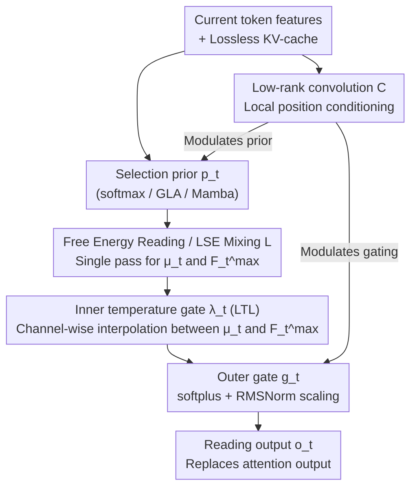

# Free Energy Mixer

**Conference**: ICLR 2026  
**arXiv**: [2602.07160](https://arxiv.org/abs/2602.07160)  
**Code**: Available (linked in the paper)  
**Area**: Time Series / LLM Efficiency  
**Keywords**: Attention Mechanism, Free Energy, Channel-wise Selection, log-sum-exp, Plug-and-Play

## TL;DR
This work proposes the Free Energy Mixer (FEM), which reformulates the reading of attention values as a free energy (log-sum-exp) optimization problem. By achieving channel-wise value-aware posterior selection, it overcomes the inherent bottleneck of standard attention, characterized as "lossless storage but lossy retrieval." FEM can serve as a plug-and-play replacement for softmax/linear attention, RNNs, and SSMs, delivering consistent improvements across NLP, vision, and time-series tasks.

## Background & Motivation

**Background**: The attention mechanism in Transformers stores all historical information losslessly via a KV-cache, then retrieves values through a convex combination of probability weights—a pattern of "lossless storage but lossy processing." Existing improvements include sparse attention, low-rank projections, kernelized attention, and linear RNNs/SSMs.

**Limitations of Prior Work**: The reading operation of standard attention uses the same weights for all value dimensions ($\mathbf{o}_t = \sum_i \alpha_{t,i} \mathbf{v}_i$), meaning the output must fall within the convex hull of the value vectors. Consequently, **channel-wise index selection is unachievable**—even if different channels need to retrieve information from different historical positions, a single attention head cannot do so.

**Key Challenge**: $H$ attention heads provide at most $t^H$ head-level argmax patterns, which is significantly fewer than the $t^D$ patterns required for channel-wise free selection (when $H \ll D$). Increasing the number of heads reduces per-head width, and stacking more layers cannot recover the channel-wise indexing information lost after the initial convex mixing.

**Goal**: How can channel-wise, value-aware selection capabilities be added to the attention mechanism without altering asymptotic complexity?

**Key Insight**: Treat value reading as a selection problem under information constraints—given a prior distribution $p_t$ (from Q/K), find a posterior distribution $q$ for each channel $j$ that maximizes expected utility while constraining the KL divergence from the prior. The solution to this variational problem takes the log-sum-exp form.

**Core Idea**: Replace the linear reading of attention with free energy (log-sum-exp), introducing independent value-aware posterior selection for each value channel. This allows for a smooth transition from average reading to channel-wise hard selection without increasing asymptotic complexity.

## Method

### Overall Architecture
FEM is not a new attention mechanism but a **plug-and-play "reading layer."** It takes the selection prior $p_t$ calculated by any existing mechanism (softmax attention, GLA, Mamba, AFT) as input. It replaces the original reading, which "calculates a convex average using $p_t$," with a channel-wise, value-aware free energy reading. This replaces the attention output in the Transformer block while keeping other components (MLP, embedding) unchanged, and the asymptotic complexity remains consistent with the original mechanism.

The reading pipeline is as follows: after the prior $p_t$ is received, a **low-rank convolution (C)** injects local positional information and modulates both the prior and subsequent gating. The core **Free Energy Reading / LSE Mixing (L)** calculates both the mean branch $\mu_t$ and the high-temperature branch $F_t^{\max}$ in a single pass. The **inner temperature gate $\lambda_t$ (Linearized Temperature Learning LTL, T)** interpolates between these two branches per channel to decide "how hard" the selection is. Finally, an **outer gate $g_t$ (G)** scales the output magnitude to obtain the final reading $\mathbf{o}_t$.

### Key Designs

**1. Free Energy Reading: Replacing "Average" Reading with "Channel-wise Adjustable Hardness" Selection**

Standard attention retrieval is $\mu_{t,j} = \sum_i p_t(i) v_{i,j}$, where all channels share the same set of weights $p_t$, locking the output inside the convex hull of value vectors. FEM formulates the retrieval of each value channel $j$ as a constrained optimization problem: maximize expected utility $\max_{q} \mathbb{E}_{i \sim q}[v_{i,j}]$ subject to the KL divergence from the prior $p_t$ not exceeding budget $B_{t,j}$. Introducing the Lagrange multiplier $\beta_{t,j}$, the optimal posterior is $q_{t,\beta}^{(j)}(i) \propto p_t(i) \exp(\beta v_{i,j})$, and the corresponding objective value is the free energy (log-sum-exp form):

$$\mathcal{F}_{t,j}(\beta) = \frac{1}{\beta} \log \sum_i p_t(i) \exp(\beta v_{i,j})$$

The inverse temperature $\beta$ acts as a "hardness knob": $\beta \to 0$ degenerates to standard mean reading, while $\beta \to \infty$ converges to argmax hard selection, with a continuous spectrum in between. This is effective because free energy can be decomposed as $\mathcal{F}_{t,j}(\beta) = \mathbb{E}_{p_t}[v_{i,j}] + \frac{1}{\beta} \text{KL}(p_t \| q^{(\beta)})$—the retrieved value is always at least the expected mean, with the gain exactly quantified by the KL divergence. Crucially, each channel has its own $\beta_{t,j}$ and posterior $q^{(j)}$, allowing different channels to independently retrieve from different historical positions, bypassing the convex hull constraint caused by "single-head, single-set weights."

**2. Linearized Temperature Learning (LTL): Making Channel-wise Temperature Learnable without Breaking Parallelism**

Ideally, each $(\text{step}, \text{channel})$ requires an independent $\beta$, but solving for $\beta$ directly breaks parallel computation. LTL fixes a maximum inverse temperature $\beta_{\max}$ and computes only two branches—the baseline mean $\mu_t$ and the high-temperature free energy $F_t^{\max}$—and then uses a learnable gate $\lambda_t \in [0,1]^{D}$ for channel-wise interpolation:

$$\tilde{F}_t(\lambda_t) = (1-\lambda_t) \odot \mu_t + \lambda_t \odot F_t^{\max}$$

These two branches can be computed in a single pass (by concatenating $[v_{i,j}, e^{\beta_{\max} v_{i,j}}]$ for mixing), so the asymptotic complexity is identical to the prior. The reason two-point interpolation can replace channel-wise $\beta$ optimization is that the paper uses the Intermediate Value Theorem to prove that $\lambda \mapsto \beta^*$ is a strictly monotonic mapping: optimizing $\lambda$ is equivalent to optimizing the underlying hidden channel-wise temperature $\beta^*$, compressing the continuous spectrum between two points without losing expressivity.

**3. Double Gating: Inner Gating Controls "Selection Hardness," Outer Gating Controls "Read Strength"**

The final reading is determined by both inner and outer gating:

$$\mathbf{o}_t = \mathbf{g}_t \odot \big[(1-\lambda_t) \odot \mu_t + \lambda_t \odot F_t^{\max}\big]$$

The inner layer is the temperature gate $\lambda_t$ described above, controlling the degree from mean to hard selection. The outer gate $\mathbf{g}_t$ (parameterized with softplus + RMSNorm) scales the final output magnitude. Outer gating is not just a simple scalar multiplication—it is equivalent to applying power scaling $[\sum_i p_t(i) \exp(\beta^* v_{i,j})]^{g_{t,j}}$ to the free energy, further expanding the expressible reading space. When $\lambda = 0, g = 1$, the module perfectly degenerates to standard attention, ensuring FEM is a strict superset.

**4. Low-rank Convolutional Local Conditioning (Module C): Injecting Position Sensitivity via Lightweight Local Convolutions**

Drawing on the local convolution approach of Mamba/DeltaNet, FEM uses an adaptive low-rank convolution to extract local, position-sensitive features to modulate the selection prior $p_t$ and FEM's gating. It uses a simple time-decay kernel, supporting $O(1)$ streaming updates, with a total cost of only $O(TH_c)$ (where $H_c = d/16 \ll D$), adding almost no budget. This component compensates for the local positional information missing in pure free energy reading, making the module more stable on position-sensitive tasks like Compress and Selective Copy.

### Loss & Training
- FEM itself introduces no additional loss, using standard losses for downstream tasks (cross-entropy for language modeling, MSE for time series, etc.).
- Parameter budget strategy (i): $d = D/2$, $r = 4$, maintaining the same $4D^2$ parameter count as standard attention.
- In all experiments, FEM directly replaces attention without changing other hyperparameters.

## Key Experimental Results

### MAD Synthetic Benchmark — Attention Mechanism Diagnosis

| Model | Compress | Fuzzy Recall | In-Ctx Recall | Memorize | Selective Copy | Average |
|------|----------|-------------|--------------|----------|---------------|------|
| Transformer (SMAttn) | 44.3 | 24.5 | 99.9 | 85.7 | 95.1 | 74.7 |
| DiffTransformer | 42.9 | 39.0 | 99.9 | 83.7 | 95.8 | 76.4 |
| GatedDeltaNet | 45.0 | 29.8 | 99.9 | 80.2 | 94.3 | 74.9 |
| **FEM-SM** | **53.1** | **43.1** | 99.9 | **85.9** | **99.3** | **80.2** |
| **FEM-GLA** | 53.0 | 19.1 | 99.9 | 86.3 | 99.0 | 74.9 |

### Ablation Study (Average MAD Score)

| Configuration | Average | Description |
|------|------|------|
| SMAttn (Baseline) | 74.7 | Standard Transformer |
| +C (Low-rank Conv) | 76.3 | +1.6, Local conditioning |
| +C,L (LSE) | **78.8** | +2.5, **Largest jump**, LSE is core |
| +C,L,T (Temperature) | 79.4 | +0.6, Temperature fine-tuning |
| +C,L,T,G (Full FEM) | **80.2** | +0.8, Outer gating adds final touch |

### Language Modeling (1.3B parameters, 100B tokens)

| Model | Open LLM Avg Rank↓ | Top1 Count↑ |
|------|-------------------|----------|
| Transformer | 4.56 | 1 |
| **FEM-SM** | **2.06** | **9** |
| GLA | 5.63 | 0 |
| **FEM-GLA** | 3.88 | 1 |

### Time Series Forecasting (MSE)

| Dataset | FEM-SM | iTransformer | PatchTST | DLinear |
|--------|--------|-------------|----------|---------|
| Weather | **0.222** | 0.232 | 0.221 | 0.233 |
| ETTh1 | 0.419 | 0.454 | **0.413** | 0.422 |
| ETTm1 | **0.341** | 0.373 | 0.346 | 0.347 |
| ETTm2 | **0.242** | 0.265 | 0.247 | 0.252 |

### Key Findings
- **LSE Mixing (L) is the core component**: It contributes the largest performance jump (+2.5 points) on the MAD benchmark, directly validating the critical role of free energy reading for Compress & Recall tasks.
- **FEM elevates linear-time methods (GLA, Mamba) to levels near the latest attention variants**, narrowing the gap between linear and quadratic complexity models.
- **Computational efficiency is manageable**: Training latency for full FEM-SM is 0.041s vs. standard Transformer 0.027s, with throughput at 104K vs. 154K tokens/s—approximately 30% overhead.
- In 1.3B scale language modeling, FEM-SM achieved the best results in 9 out of 16 benchmarks, with an average rank of 2.06 (vs. 4.56 for Transformer).

## Highlights & Insights
- **The diagnosis of "lossless storage but lossy retrieval"** is profound: the authors provide rigorous geometric proofs (convex hull constraints) and information-theoretic analysis ($t^H$ vs. $t^D$ capacity) of the fundamental limitations of standard attention. They systematically analyze why "more heads/deeper layers/dimension-wise QK/richer mixers" cannot resolve this issue.
- **The mathematical elegance of the Free Energy Variational Framework**: Defining value reading as utility maximization under KL constraints naturally leads to the log-sum-exp form, where the temperature parameter corresponds to the Lagrange multiplier of the KL budget. This framework unifies the continuous spectrum from average to argmax.
- **Plug-and-play + Prior-agnostic design** makes FEM extremely versatile: it can be applied to softmax attention, GLA, Mamba, and AFT while maintaining the original asymptotic complexity. It constitutes a rare "free lunch" style improvement.
- **Ingenious LTL design**: By proving the monotonicity of $\lambda \mapsto \beta^*$, the continuous spectrum of dynamic temperatures is compressed into a two-point interpolation, requiring only one forward pass.

## Limitations & Future Work
- Lack of validation on large-scale language models (>10B) and ultra-long contexts (>128K)—the authors acknowledge limited computational resources.
- Absence of custom CUDA kernels; the current 30% overhead could be optimized in engineering terms, but the paper does not provide this.
- Value space dimensionality is halved ($d = D/2$); while total parameters match, whether value expressivity is compromised lacks in-depth analysis.
- The advantage in time-series forecasting is less pronounced than in NLP and synthetic benchmarks—performing slightly worse than PatchTST on ETTh1/ETTh2.

## Related Work & Insights
- **vs. Differential Transformer**: DiffTrans eliminates attention noise through a differential mechanism but still operates within the convex hull; FEM breaks the convex hull constraint.
- **vs. Mamba/SSM**: SSMs store history in a fixed-size state, which is inherently lossy storage; FEM maintains lossless storage (KV-cache) while performing lossless retrieval.
- **vs. GatedDeltaNet/DeltaNet**: These linear RNNs update states using the delta rule; FEM can be stacked on top of them (FEM-GLA/Mamba) with significant performance gains.
- The theoretical framework of this paper serves as an excellent baseline and analytical tool for future directions in attention mechanism improvement.

## Rating
- Novelty: ⭐⭐⭐⭐⭐ The diagnosis of lossy retrieval in attention and the free energy solution are highly original contributions.
- Experimental Thoroughness: ⭐⭐⭐⭐ Broad coverage across synthetic tasks, NLP, vision, and time series, though missing ultra-large-scale validation.
- Writing Quality: ⭐⭐⭐⭐⭐ Extremely rigorous theoretical analysis with a complete logical chain from problem definition to solution.
- Value: ⭐⭐⭐⭐⭐ As a plug-and-play general mechanism improvement, it holds high theoretical and practical value and may influence the future design of attention mechanisms.

<!-- RELATED:START -->

## Related Papers

- [\[NeurIPS 2025\] xLSTM-Mixer: Multivariate Time Series Forecasting by Mixing via Scalar Memories](../../NeurIPS2025/time_series/xlstm-mixer_multivariate_time_series_forecasting_by_mixing_via_scalar_memories.md)
- [\[NeurIPS 2025\] Neural Stochastic Flows: Solver-Free Modelling and Inference for SDE Solutions](../../NeurIPS2025/time_series/neural_stochastic_flows_solver-free_modelling_and_inference_for_sde_solutions.md)
- [\[CVPR 2026\] SATTC: Structure-Aware Label-Free Test-Time Calibration for Cross-Subject EEG-to-Image Retrieval](../../CVPR2026/time_series/sattc_structure-aware_label-free_test-time_calibration_for_cross-subject_eeg-to-.md)
- [\[ICML 2025\] VisionTS: Visual Masked Autoencoders Are Free-Lunch Zero-Shot Time Series Forecasters](../../ICML2025/time_series/visionts_visual_masked_autoencoders_are_free-lunch_zero-shot_time_series_forecas.md)
- [\[ICLR 2026\] Routing Channel-Patch Dependencies in Time Series Forecasting with Graph Spectral Decomposition](routing_channel-patch_dependencies_in_time_series_forecasting_with_graph_spectra.md)

<!-- RELATED:END -->
