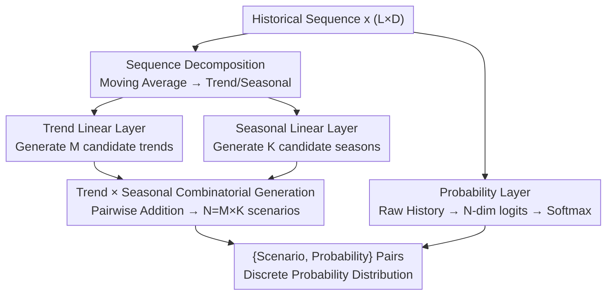

# From Samples to Scenarios: A New Paradigm for Probabilistic Forecasting

**Conference**: ICLR 2026  
**arXiv**: [2509.19975](https://arxiv.org/abs/2509.19975)  
**Code**: [GitHub](https://github.com/Fifthky/TimePrism)  
**Area**: Time Series  
**Keywords**: probabilistic forecasting, time series, scenario generation, discrete probability, linear model

## TL;DR
The authors propose the Probabilistic Scenarios paradigm, which replaces sampling by directly outputting a finite set of {scenario, probability} pairs. Using TimePrism—a model consisting of only three parallel linear layers—they achieve 9/10 SOTA results across 5 benchmark datasets.

## Background & Motivation
**Background**: Probabilistic time series forecasting is the foundation for decision-making under uncertainty. Mainstream methods are divided into parametric distribution models, generative models (diffusion), and structured probabilistic models (flow/copula), all of which rely on sampling to represent the predictive distribution.

**Limitations of Prior Work**: The sampling paradigm suffers from three inherent flaws: (i) **Lack of Probabilities**: Generated trajectories do not have associated probability values; (ii) **Insufficient Coverage**: Finite samples struggle to capture low-probability, high-impact tail events; (iii) **Inference Overhead**: The computational cost of generating multiple samples grows linearly with the number of samples.

**Key Challenge**: High-quality probabilistic forecasting requires a large number of samples to adequately approximate the distribution, but heavy sampling results in prohibitive computational costs, and sampling itself does not provide explicit probabilities.

**Goal**: To design a probabilistic forecasting paradigm that does not rely on sampling and can output a complete discrete probability distribution in a single forward pass.

**Key Insight**: Simplify the learning objective from "approximating a continuous probability space" to "learning a probability distribution over a finite set of scenarios," similar to the concept of VQ-VAE but applied directly to the output trajectory space.

**Core Idea**: Use a simple linear model to directly generate $N$ future scenarios and their corresponding probabilities, completely bypassing the need for sampling.

## Method

### Overall Architecture
This paper addresses the "three sins" of the sampling paradigm—trajectories without probabilities, failure to cover tail events with finite samples, and escalating computational costs as sample size increases. The solution redefines probabilistic forecasting as a one-step output function $f(\mathbf{x}) = (\mathcal{Y}_{\text{pred}}, \mathbf{p})$: given the history $\mathbf{x}$, it directly outputs $N$ complete future scenarios $\mathcal{Y}_{\text{pred}} = \{\mathbf{y}_n\}_{n=1}^N$ and a probability vector $\mathbf{p}$ satisfying $\sum p_n = 1$. This provides a discrete probability distribution in a single forward pass without any sampling.

TimePrism, which implements this paradigm, uses only three parallel linear layers to complete the pipeline through three streams: first, the history is decomposed into trend and seasonal components using moving averages; the trend linear layer and seasonal linear layer each generate a set of candidate components, which are then combined via a Cartesian product to produce all $N$ scenarios; in parallel, a third linear layer processes the raw undecomposed history to output the probability for each scenario. These three streams merge at the end into {scenario, probability} pairs.

### Key Designs

**1. Sequence Decomposition: Breaking scenario generation into low-dimensional sub-problems**

Directly outputting $N$ scenarios of length $H$ via a linear layer would cause parameters to expand linearly with $N$ and force the model to memorize diversity in a high-dimensional output space. TimePrism first uses a moving average to decompose the input history $\mathbf{x} \in \mathbb{R}^{L \times D}$ into a trend component $\mathbf{x}_{\text{trend}}$ and a seasonal component $\mathbf{x}_{\text{season}}$. This allows the trend and periodic fluctuations to be modeled in smoother, more easily fitted subspaces, laying the groundwork for combinatorial generation.

**2. Trend × Seasonal Combinatorial Generation: Sustaining $N$ scenarios with $\mathcal{O}(\sqrt{N})$ parameters**

The trend linear layer generates $M$ candidate trend predictions from $\mathbf{x}_{\text{trend}}$, and the seasonal linear layer generates $K$ candidate seasonal predictions from $\mathbf{x}_{\text{season}}$. These are combined via pairwise addition to obtain all scenarios $\mathcal{Y}_{\text{pred}} = \{\mathbf{y}_{t,m} + \mathbf{y}_{s,k} \mid m \in [M], k \in [K]\}$, where $N = M \times K$. The key benefit is that parameters only need to support $M+K$ components to produce $M\times K$ scenarios via Cartesian product. When $M\approx K$, the complexity is $\mathcal{O}(\sqrt{N})$, significantly lower than the $\mathcal{O}(N)$ required for direct generation. Furthermore, this structure naturally decouples "trend direction" and "periodic patterns," allowing for more economical coverage of uncertainty.

**3. Probability Layer: Assigning a learnable weight to each scenario**

Scenario generation alone is insufficient; the other half of the paradigm is explicit probability. The third linear layer does not use the decomposed components but instead takes the original undecomposed history as input to output $N$-dimensional logits $\boldsymbol{\pi}$, which are normalized into a probability vector $\mathbf{p}$ via Softmax. Using the raw history ensures that the probability distribution depends on the complete historical pattern rather than a single trend or seasonal signal, allowing the probability assignment to complement scenario fidelity as a true discrete distribution.

### Loss & Training
The training jointly optimizes scenario accuracy and probability assignment with a total loss $\mathcal{L}_{\text{Prism}} = \mathcal{L}_{\text{recon}} + \lambda \cdot \mathcal{L}_{\text{prob}}$ (with $\lambda=1$). The reconstruction term uses a Winner-Take-All (WTA) strategy: it identifies the winner scenario $n^* = \arg\min_n \|\mathbf{y}_{gt} - \mathbf{y}_n\|_2^2$ closest to the ground truth and calculates MSE only for that scenario. This encourages different scenario heads to specialize in specific future patterns rather than collapsing to the mean. The probability term uses cross-entropy $\mathcal{L}_{\text{prob}} = -\log \frac{\exp(\pi_{n^*})}{\sum_j \exp(\pi_j)}$ to assign the highest probability to the winner, teaching the probability layer to identify which scenarios occur more frequently. To prevent gradient starvation of non-winner heads, a relaxed WTA is used during training to maintain convergence stability.

## Key Experimental Results

### Main Results
Weighted CRPS on 5 benchmark datasets (Electricity, Exchange, Solar, Traffic, Wikipedia):

| Model | Elec. | Exch. | Sol. | Traf. | Wiki. |
|------|-------|-------|------|-------|-------|
| TimeGrad | 0.232 | 0.845 | 0.241 | 0.162 | 0.517 |
| TACTiS-2 | 0.299 | 0.648 | 0.236 | 0.257 | 0.484 |
| TimeMCL | 0.370 | 1.12 | 0.290 | 0.262 | 0.640 |
| **TimePrism** | **0.133** | **0.468** | **0.085** | **0.111** | **0.506** |

TimePrism also achieved SOTA on the Distortion metric across all 5 datasets.

### Ablation Study
Effect of scenario count $N$ (Solar dataset):

| N | CRPS | Distortion | FLOPs (relative) |
|---|------|------------|-------------|
| 1 | 0.199 | 0.266 | 1.0x |
| 16 | 0.137 | 0.307 | 4.2x |
| 256 | 0.093 | 0.158 | 19.9x |
| 625 | 0.085 | 0.101 | 34.8x |
| 1024 | 0.082 | 0.092 | 48.3x |

Performance gains tend to saturate at $N=625$.

### Key Findings
- TimePrism's inference FLOPs are constant ($5.1 \times 10^5$) and do not grow with the number of samples, whereas TimeGrad requires $1.9 \times 10^{10}$ FLOPs for 100 samples.
- Visualizations show that TimePrism captures common peak scenarios with high probability while identifying rare low-peak scenarios with low probability, a distinction sampling models cannot make.
- The combinatorial architecture ($N = M \times K$) ensures that parameter growth remains between $\mathcal{O}(\sqrt{N})$ and $\mathcal{O}(N)$.

## Highlights & Insights
- **Paradigm Innovation**: A fundamental shift from "approximating continuous distributions via sampling" to "directly generating discrete scenarios + probabilities," which is conceptually simple yet effective.
- **Minimalist Architecture Validation**: Achieving SOTA using only three parallel linear layers (without non-linear activations) demonstrates the powerful potential of the paradigm itself.
- **Unified Evaluation Framework**: The authors propose Weighted CRPS and Distortion as complementary metrics and provide fair calculation formulas for both paradigms.
- **Efficiency Advantage**: Single forward pass architecture reduces inference costs by 1-5 orders of magnitude compared to strong baselines.

## Limitations & Future Work
- Linear models may not be suitable for extremely high-dimensional series or those without clear trend/seasonal patterns.
- The model uses fixed input/output lengths, lacking flexibility for variable-length sequences.
- Multivariate modeling uses a weight-sharing strategy, making cross-variable relationship modeling relatively simple.
- The optimal scenario number $N$ depends on data complexity and currently requires manual setting.
- The WTA loss may cause some scenario heads to be ignored in early training (the "winner-take-all" effect), which relaxed WTA only partially mitigates.
- The method has not been validated on larger-scale benchmarks like GIFT-Eval.
- Lack of sensitivity analysis regarding different prediction horizons.

## Related Work & Insights
- Comparison with TimeMCL: TimeMCL also outputs discrete scenarios but does not directly model probability, leading to inferior CRPS results; this work unifies scenario fidelity and probability matching via the probability layer.
- Conceptual analogy with VQ-VAE: Applying discretization directly to the output trajectory space rather than the latent space.
- Comparison with TACTiS-2: TACTiS-2 can compute probability density but still requires sampling to obtain trajectories, whereas this work directly outputs discrete scenarios.
- Comparison with TimeGrad: Diffusion models require iterative sampling; the FLOPs for 100 samples are $10^4$ times higher than those of TimePrism.
- Future work could integrate this paradigm into powerful backbones like Transformers or Diffusion to unlock stronger multivariate modeling capabilities.
- Adaptive mechanisms for the number of scenarios are also a valuable future direction.

## Rating
- Novelty: ⭐⭐⭐⭐⭐ Fundamental innovation in the probabilistic forecasting paradigm.
- Experimental Thoroughness: ⭐⭐⭐⭐ Extensive datasets, baselines, and ablations, though limited to the time series domain.
- Writing Quality: ⭐⭐⭐⭐⭐ Clear motivation with a complete logical chain from problem to solution.
- Value: ⭐⭐⭐⭐⭐ Opens a new direction for probabilistic forecasting; the minimalist model reaching SOTA is highly persuasive.

<!-- RELATED:START -->

## Related Papers

- [\[ICLR 2026\] End-to-End Probabilistic Framework for Learning with Hard Constraints](end-to-end_probabilistic_framework_for_learning_with_hard_constraints.md)
- [\[ICLR 2026\] Reliable Probabilistic Forecasting of Irregular Time Series via Marginal Consistent Flows](reliable_probabilistic_forecasting_of_irregular_time_series_through_marginalizat.md)
- [\[ICML 2026\] Beyond Extrapolation: Knowledge Utilization Paradigm with Bidirectional Inspiration for Time Series Forecasting](../../ICML2026/time_series/beyond_extrapolation_knowledge_utilization_paradigm_with_bidirectional_inspirati.md)
- [\[AAAI 2026\] Scaling LLM Speculative Decoding: Non-Autoregressive Forecasting in Large-Batch Scenarios](../../AAAI2026/time_series/scaling_llm_speculative_decoding_non-autoregressive_forecasting_in_large-batch_s.md)
- [\[ICLR 2026\] Efficient Autoregressive Inference for Transformer Probabilistic Models](efficient_autoregressive_inference_for_transformer_probabilistic_models.md)

<!-- RELATED:END -->
