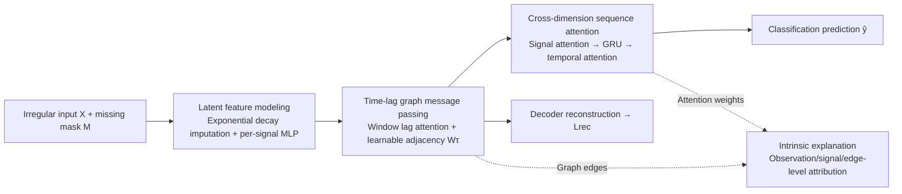

# GARLIC: Graph Attention-based Relational Learning of Multivariate Time Series in Intensive Care

**Conference**: ICLR 2026  
**OpenReview**: [https://openreview.net/forum?id=4ZAwmIaA9y](https://openreview.net/forum?id=4ZAwmIaA9y)  
**Code**: To be confirmed  
**Area**: Irregular Multivariate Time Series / Interpretable Medical AI  
**Keywords**: ICU Monitoring, Irregular Sampling, Missing Value Imputation, Graph Attention, Self-interpretable Models, Time Series Classification

## TL;DR
GARLIC chains "exponential decay imputation + time-lagged signal graph message passing + cross-dimensional sequence attention" into an end-to-end pipeline. It not only achieves a new SOTA for ICU irregular multivariate time series prognosis but also provides endogenous explanations at the observation, signal, and edge levels using learned attention weights and graph edges.

## Background & Motivation
**Background**: Continuous ICU monitoring generates massive multivariate time series (vital signs, labs, medications), characterized by irregular sampling intervals, heterogeneous signals, and prevalent missingness. Clinical deployment further requires models to be both accurate and interpretable.

**Limitations of Prior Work**: Standard sequence models (RNN/Transformer) are unfriendly to irregular sampling—naive imputation contaminates downstream tasks. Specialized methods like GRU-D, Latent-ODE, and mTAND handle temporal irregularity but generally ignore **inter-signal dependencies**. RAINDROP, which claims to learn graphs, actually demonstrates its best performance with fixed graphs, indicating limited gains from its graph learning. On the interpretability side, post-hoc explainers (Integrated Gradients, SHAP) require extra computation and may provide inconsistent attributions for similar inputs, while endogenous interpretable architectures (RETAIN, shapelets) either sacrifice accuracy or fail on irregular sampling.

**Key Challenge**: Missingness modeling, inter-signal relationship modeling, and endogenous interpretability have previously been treated in isolation. No existing work simultaneously leverages inter-signal dependencies while embedding explanations directly into the forward pass during missingness handling.

**Goal**: To develop a unified framework that solves irregular sampling, missingness, and transparent decision-making simultaneously without sacrificing accuracy or efficiency.

**Core Idea**: **Relation as Explanation**—all attention weights and graph edges are learned end-to-end. The forward computation itself is the source of explanation. Observation-level attribution is obtained by back-tracing the forward path, eliminating the need for external explainers.

## Method

### Overall Architecture
GARLIC combines "local reconstruction" and "global reasoning" into a modular pipeline: it first performs time-aware imputation and encoding in signal-specific latent spaces, then uses learnable time-lagged graphs for message passing to reconstruct missing values from local temporal and signal contexts. Finally, it uses cross-dimensional sequence attention to extract global dependencies across both time and signal dimensions for classification. Reconstruction is an auxiliary task, while classification is the main task; the two are trained separately using alternating decoupled optimization to avoid gradient conflicts.

### Key Designs
**1. Decay Imputation + Signal-specific Encoding: Preventing Missingness from Contaminating Dynamics.** For the interval $\Delta t$ since the last observation, a learnable decay pulls stale observations toward the empirical mean: $\hat{x}_{k,t} = \gamma_t x_{k,t'} + (1-\gamma_t)\bar{x}_k$, where $\gamma_t = \exp\{-\max(0, w_k\Delta t + b_k)\}$, with $w_k, b_k$ being learnable per signal. The imputed values and missingness masks are concatenated into an augmented input $\tilde{x}_{k,t} = [x_{k,t}m_{k,t} + \hat{x}_{k,t}(1-m_{k,t}),\, m_{k,t}]^\top$, then fed into **signal-specific** two-layer MLPs to obtain embeddings $z_{k,t}$. Signal-specific encoding preserves the distinct scales, dynamics, and semantics of each signal—a shared encoder would flatten these differences.

**2. Time-Lagged Graph Message Passing: Decoupling "Temporal Locality" and "Inter-signal Dependencies" in Short Windows.** Physiological signals are primarily influenced by recent history and related signals, so reasoning occurs only within a window of length $\tau+1$. First, sinusoidal position encoding is added for per-signal intra-window lag attention $\bar{e}_{k,t} = \sum_{j=t-\tau}^{t}\beta_{k,j,t}v_{k,j}$, aggregating short-term temporal contexts into $\bar{E}_t$. Then, message passing $H_t = W_\tau \bar{E}_t$ is performed using a time-lagged summary graph $G_\tau$ defined by a learnable adjacency matrix $W_\tau \in \mathbb{R}^{K\times K}$, allowing related signals to exchange information. Decoupling temporal encoding (attention) and graph propagation (adjacency matrix) enables flexible capture of short-term dynamics and signal relations. Adjusting the lag $\tau$ further allows for multi-scale physiological dependency modeling.

**3. Cross-dimensional Sequence Attention: Two-stage Cascade of Signal then Time.** At each time step $t$, SignalAttn is first applied across $K$ signals for weighted aggregation $\bar{u}_t = \sum_k \alpha^{sig}_{k,t}u_{k,t}$. The sequence $\{\bar{u}_t\}$ is then fed into a GRU to model the progression of clinical states. Finally, Temporal Self-Attention $Y = \text{TemporalAttn}(\{g_{t'}+PE(t')\})$ compensates for the GRU's local bias and captures long-range dependencies directly. Prediction $\hat{y}$ is output via a classification head after average pooling. Unlike RETAIN (which aggregates signal contributions uniformly across time) or IMV-LSTM (which aggregates time before calculating importance), GARLIC calculates signal-level attention at every time step before any recurrent modeling, preserving instantaneous signal saliency.

**4. Forward-as-Explanation Attribution Chain + Alternating Decoupled Optimization.** Explanations are not external but traced back along the forward path: first, joint saliency $s_{k,t'} = \sum_t \alpha^{time}_{t',t}\cdot\alpha^{sig}_{k,t}$ is calculated by element-wise multiplication of temporal and signal attention. Then, saliency is propagated across signals and redistributed over time using the transposed graph $W_\tau^\top$ and window attention $\beta$ to get $a_{k,t} = \sum_j [(W_\tau^\top S)_{k,t+j}\cdot\beta_{k,t+j,\tau-j}]$. Finally, the contribution of imputed positions is redistributed uniformly back to observed positions of the same signal using masks to get $a^{final}_{k,t}$, ensuring attribution is perfectly consistent with forward computation. For training, since reconstruction (faithful recovery) and classification (discriminative features) objectives conflict, an alternating decoupled optimization inspired by DeFRCN is used. In phase one, the classification head is frozen, and $\theta_{a,b}$ is updated using $L_{rec}+\lambda_g L_{graph}+\lambda_c L_{cls}$. In phase two, $\theta_{a,b}$ is frozen, and only the classifier $\theta_c$ is updated using classification loss. This suppresses gradient interference and stabilizes training. The total loss is $L = \sum_{k,t}m_{k,t}(x_{k,t}-\hat{x}_{k,t})^2 + \lambda_g\|W_\tau\|_1 - \lambda_c\log\hat{y}_y$, where the $\ell_1$ term sparsifies the graph to enhance interpretability and suppress overfitting.

## Key Experimental Results

### Main Results
Three ICU benchmarks (P12 In-hospital Mortality, P19 Sepsis Onset, MIMIC-III Mortality), AUROC/AUPRC (%, mean±std for 5 seeds):

| Model | P12 AUROC | P12 AUPRC | P19 AUROC | P19 AUPRC | MIMIC-III AUROC | MIMIC-III AUPRC |
|------|-----------|-----------|-----------|-----------|-----------------|-----------------|
| GRU-D | 84.45 | 50.74 | 88.73 | 47.81 | 86.36 | 56.14 |
| ODE-RNN | 83.02 | 48.64 | 89.97 | 54.29 | 88.07 | 61.03 |
| mTAND | 84.30 | 50.05 | 81.73 | 37.27 | 88.00 | 57.73 |
| RAINDROP | 83.03 | 45.91 | 87.41 | 46.33 | 87.18 | 57.06 |
| Warpformer | 84.88 | 50.62 | 89.95 | 54.10 | 89.17 | 61.52 |
| MTSFormer | 83.65 | 50.31 | 87.88 | 48.80 | 88.14 | 61.09 |
| RETAIN | 83.08 | 49.27 | 78.09 | 26.04 | 82.40 | 46.55 |
| IMV-LSTM | 84.02 | 49.08 | 84.80 | 42.87 | 86.85 | 54.96 |
| **GARLIC** | **86.40** | **56.89** | **90.96** | **55.29** | **90.09** | **64.85** |

GARLIC ranks first across all 6 metrics. Gains are particularly striking on P12, which has the most severe missingness (AUPRC ~6 points higher than the runner-up), validating its robustness to sparse irregular sequences.

### Ablation Study
Module-wise ablation (P12/P19, see Appendix D.1) confirms that latent feature modeling, time-lagged graph message passing, and cross-dimensional sequence attention all contribute substantially to overall performance. Removing any module leads to performance degradation.

Explanation Fidelity (Input Removal, IMV-LSTM as baseline, P12, AUROC/AUPRC %):

| Setting | IMV-LSTM P12 AUROC | IMV-LSTM P12 AUPRC | IMV-LSTM P19 AUROC | IMV-LSTM P19 AUPRC |
|------|--------------------|--------------------|--------------------|--------------------|
| All | 84.02 | 49.08 | 84.80 | 42.87 |
| Top 50% | 76.23 | 34.46 | 82.07 | 36.05 |
| Random 50% | 75.23 | 37.03 | 76.28 | 23.31 |
| Bottom 50% | 70.12 | 26.83 | 79.61 | 28.59 |

Performance degrades monotonically following the "Keep Top Important → Random → Keep Least Important" order, proving that attribution rankings align with true predictive power.

### Key Findings
- **Explanation Fidelity (ROAR-style Input Removal)**: Retaining the Top-50% based on attribution is statistically equivalent to the full input (TOST), and performance strictly follows a monotonic decrease (Full > Top-50% > Random-50% > Bottom-50%, confirmed by Page's L test), indicating that attribution scores correctly capture the most predictive features.
- **Efficiency**: On P12, while achieving the best accuracy, GARLIC's training time and GPU memory usage are comparable to 15 strong baselines, meaning it does not trade computational cost for accuracy.
- **Generalization**: It also outperforms others on data imputation and human activity recognition tasks outside the ICU, showing the method is not limited to medical scenarios.
- **Graph Trustworthiness**: Learned structures of the time-lagged summary graph align with clinical intuition according to preliminary AI agent evaluations, though the authors admit rigorous verification by medical experts is still needed.

## Highlights & Insights
- **"Explanation embedded in the forward pass" instead of post-hoc explainers**: Attention weights and graph edges are learned end-to-end. Attribution is simply back-tracing the forward path, fundamentally avoiding the extra computation and attribution inconsistency issues of SHAP/IG.
- **Leveraging inter-signal dependencies during the missingness modeling stage**: Most methods only use graphs during classification. GARLIC allows related signals to exchange information during missingness reconstruction, which is a key reason it remains more stable than static graph methods like RAINDROP or MTGNN.
- **Alternating Decoupled Optimization** is a transferable trick: By updating the "faithful reconstruction" and "discriminative classification" objectives in stages, it achieves training stability and accuracy gains at very low cost.

## Limitations & Future Work
- The learned time-lagged graph is currently only evaluated crudely by AI agents and **lacks rigorous clinical validation by medical experts**; the clinical credibility of the graph remains an open question.
- Attribution for unobserved positions during decay imputation is essentially "approximate redistribution" (spread uniformly to observed positions of the same signal), which might introduce explanation bias in extremely sparse signals.
- Tasks across the three datasets are framed as binary classification; robustness under multi-class classification, continuous risk prediction, and cross-hospital distribution shifts has not been fully verified.
- The lag $\tau$ is a hyperparameter requiring grid search; adaptive window selection or multi-scale automatic fusion represents a natural next step.

## Related Work & Insights
- **Irregular Time Series Classification**: From GRU-D/Latent-ODE/mTAND (modeling temporal dynamics) to RAINDROP/MTGNN (introducing graphs), GARLIC differentiates itself via "utilizing signal dependencies during the reconstruction stage."
- **Time Series Interpretability**: Post-hoc (IG, SHAP, LIME) vs. Self-interpretable (RETAIN, shapelets, IMV-LSTM, DARNN). GARLIC belongs to the latter but solves the issue of losing instantaneous saliency by calculating signal-level attention before recurrent modeling and incorporating graph propagation into the attribution chain.
- **Insights**: When interpretability is a hard constraint, rather than searching for explanations post-training, it is better to design the explanatory structure as part of the forward computation—this is both computationally efficient and inherently consistent, a strategy transferable to other high-stakes decision-making scenarios.

## Rating
- **Novelty**: ⭐⭐⭐⭐ — While individual components (decay imputation, graph message passing, attention) are not pioneering, the combination of "graphical dependency during reconstruction + forward-as-attribution + alternating decoupled optimization" is a meaningful new assembly for irregular medical time series.
- **Experimental Thoroughness**: ⭐⭐⭐⭐ — Covers three ICU benchmarks + 15 baselines + module-wise ablation + ROAR-style fidelity (with TOST/Page's L tests) + efficiency and cross-domain generalization; missing only clinical validation of the graph.
- **Writing Quality**: ⭐⭐⭐⭐ — Clear logic from motivation to method and attribution chain; formulas and figures are well-coordinated, and the attribution derivation is well-explained.
- **Value**: ⭐⭐⭐⭐ — Simultaneously achieves accuracy and endogenous interpretability in high-risk clinical scenarios without degrading efficiency, showing clear deployment value.

<!-- RELATED:START -->

## Related Papers

- [\[ICLR 2026\] CPiRi: Channel Permutation-Invariant Relational Interaction for Multivariate Time Series Forecasting](cpiri_channel_permutation-invariant_relational_interaction_for_multivariate_time_se.md)
- [\[ICLR 2026\] Relational Transformer: Toward Zero-Shot Foundation Models for Relational Data](relational_transformer_toward_zero-shot_foundation_models_for_relational_data.md)
- [\[ICLR 2026\] ASTGI: Adaptive Spatio-Temporal Graph Interactions for Irregular Multivariate Time Series Forecasting](astgi_adaptive_spatio-temporal_graph_interactions_for_irregular_multivariate_tim.md)
- [\[ICLR 2026\] Learning Recursive Multi-Scale Representations for Irregular Multivariate Time Series Forecasting](learning_recursive_multi-scale_representations_for_irregular_multivariate_time_s.md)
- [\[ICLR 2026\] Local Geometry Attention for Time Series Forecasting under Realistic Corruptions](local_geometry_attention_for_time_series_forecasting_under_realistic_corruptions.md)

<!-- RELATED:END -->
