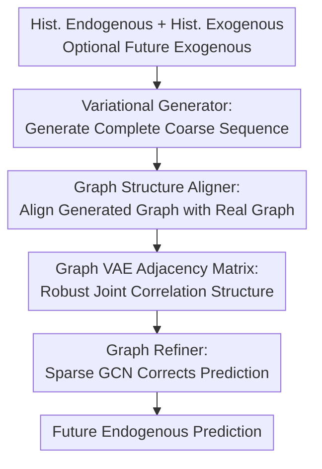

# GCGNet: Graph-Consistent Generative Network for Time Series Forecasting with Exogenous Variables

**Conference**: ICLR 2026  
**OpenReview**: [https://openreview.net/forum?id=EO5jwQ5NCw](https://openreview.net/forum?id=EO5jwQ5NCw)  
**Paper**: OpenReview  
**Code**: https://github.com/decisionintelligence/GCGNet  
**Area**: Time Series Forecasting  
**Keywords**: Exogenous variable forecasting, graph consistency, generative time series, Graph VAE, robust forecasting

## TL;DR
GCGNet addresses time series forecasting with exogenous variables by converting both generated and ground-truth complete sequences into patch-level graph structures. It constrains the generator with graph consistency and refines predictions using sparse graph convolutions. It achieves top performance across most metrics on 12 real-world datasets and maintains strong robustness when future exogenous variables are missing or masked.

## Background & Motivation
**Background**: Forecasting with exogenous variables utilizes not only the target's historical endogenous variables $X^{endo}$ but also historical exogenous variables $X^{exo}$ and, in many scenarios, future exogenous variables $Y^{exo}$ available in advance. For example, in electricity price forecasting, the target is the future price, while exogenous variables might include future load, wind power, or meteorological data. These signals are not identical to the target but directly influence its future trajectory.

**Limitations of Prior Work**: Mainstream deep models typically decouple "temporal correlation" and "channel correlation." Some methods encode along the time dimension first, then integrate exogenous variables via cross-attention or MLPs; others aggregate channels before temporal prediction. This two-step strategy is clear but splits an inherently coupled problem into sequential sub-problems: the second step might override relationships learned in the first, or the first step might form biases without sufficient exogenous information.

**Key Challenge**: The true value of exogenous variables lies in "a specific exogenous channel influencing an endogenous target during a specific future time interval." This is neither pure temporal dependency nor pure channel dependency, but a joint correlation across time slices and variables. Furthermore, real-world data often suffers from sensor failures, transmission errors, or missing values. Estimating correlations directly from noisy observations is prone to following noise.

**Goal**: The authors aim to build a forecasting framework capable of handling both historical and future exogenous variables. It should fill in missing future exogenous data using model-generated alternatives and, more importantly, learn robust joint correlation structures rather than relying solely on point-to-point prediction errors.

**Key Insight**: The paper explicitly represents "correlation" as a graph. Each temporal patch is a graph node, and edges represent relationships between patches. Thus, temporal dependencies and channel influences are jointly expressed via edges in the same graph. Introducing a VAE ensures that graph structures and future sequences are not hard-matched from noisy observations but learned as stable distributions within a latent space.

**Core Idea**: Use a VAE to generate coarse predictions, align the "graph structure of the generated sequence" with the "graph structure of the real sequence," and then use this generated graph to refine the predictions. This forces the model to predict both values and the underlying joint correlation structure.

## Method

### Overall Architecture
The input to GCGNet includes historical endogenous sequences $X^{endo} \in \mathbb{R}^{N \times T}$, historical exogenous sequences $X^{exo} \in \mathbb{R}^{D \times T}$, and optional future exogenous sequences $Y^{exo} \in \mathbb{R}^{D \times F}$. The output is the future endogenous sequence $\hat{Y}^{endo} \in \mathbb{R}^{N \times F}$. The model consists of three steps: the Variational Generator produces coarse future predictions; the Graph Structure Aligner converts both generated and ground-truth sequences into graphs for structural alignment; the Graph Refiner uses the adjacency matrix of the generated graph for message passing to refine the final prediction.

The crux is not merely "predicting then adding a graph module." The graph structure from the Graph Structure Aligner serves as both a training constraint and the actual input for the Graph Refiner. If the learned graph is meaningless, the final prediction loss degrades. Thus, the graph structure is intrinsically part of the prediction loop.

### Key Designs
**1. Variational Generator: Completing the future for structural alignment**

A challenge in exogenous forecasting is the inconsistency of input completeness: ground-truth future endogenous variables $Y^{endo}$ are available for supervision during training but not during inference; future exogenous variables $Y^{exo}$ may or may not be available depending on the business case. GCGNet uses a Variational Generator to produce coarse predictions $\tilde{Y}^{endo}$ and, if necessary, $\tilde{Y}^{exo}$. If real future exogenous variables are available, $Y^{exo}$ is used; otherwise, the generated $\tilde{Y}^{exo}$ is substituted.

Formally, the generator produces $\tilde{Y}^{endo}=VAE(X^{endo})$ and $\tilde{Y}^{exo}=VAE(X^{exo})$. The complete sequence $\tilde{S}$ is formed by concatenating historical/future exogenous data (or generated substitutes) and historical/coarse future endogenous data. Crucially, the graph aligner looks at the complete sequence formed by both history and future, allowing it to learn how "past exogenous patterns extend into future targets" rather than treating the future segment as an isolated regression target.

**2. Graph Structure Aligner: Constraining the generator with graph-level consistency**

Relying solely on point-level losses like $\|Y^{endo}-\hat{Y}^{endo}\|$ might result in close numerical values without capturing the correct correlation structure. GCGNet segments both the ground-truth complete sequence $S$ and generated sequence $\tilde{S}$ into non-overlapping patches, map them into patch embeddings $S_p, \tilde{S}_p \in \mathbb{R}^{(N+D) \times L \times d}$, where $L=\lceil (T+F)/p \rceil$ and $p$ is the patch size.

The Graph VAE calculates relationships between patches via two projection matrices: $A'=GELU((W_1X_p)(W_2X_p)^\top)$, then symmetrizes it as $\tilde{A}=\frac{1}{2}(A'+A'^\top)$ for an undirected graph. To filter noise, a VAE generates a smoother adjacency matrix $A=VAE(\tilde{A})$. The ground-truth sequence yields $A$ and the generated sequence yields $\hat{A}$. During training, the alignment loss $L_{align}=\|A-\hat{A}\|_1$ is minimized.

This design moves from "do values look similar" to "do relationships between values look similar." For exogenous forecasting, this is more fundamental than point errors, capturing couplings such as future load-price linkage.

**3. Graph Refiner: Enforcing the graph to serve the final prediction**

Since the real and generated graphs in the Graph Structure Aligner share a Graph VAE, there is a risk of degradation: the VAE might output similar matrices regardless of input. The Graph Refiner breaks this by making the generated graph $\hat{A}$ an actual input for prediction.

Specifically, the Graph Refiner treats generated patch embeddings $\tilde{S}_p$ as node features and $\hat{A}$ as edge weights. Since the full adjacency matrix might be too dense, the model retains only top-$k$ edges per node to form a sparse matrix $A_s$. Multi-layer GCNs propagate information over $A_s$ to get a refined representation $H=GCN(\tilde{S}_p,A_s)$, which is linearized into $\hat{Y}^{endo}$.

If the Graph VAE learns a meaningless graph, the GCN will propagate incorrect information to the prediction head, and the prediction loss will penalize it. This ensures the graph structure is a functional component validated by the final task.

### Example
In electricity price forecasting, a model uses prices, load, and wind power from the past 168 hours, plus load and wind forecasts for the next 24 hours. The Variational Generator first creates a coarse future price trajectory. The model then patches the combination of historical/future load/wind and prices. The Graph VAE estimates edges between these patches—for instance, a future high-load patch should have a strong link to a future price-increase patch. The Graph Refiner then uses these strong connections to correct the coarse price curve, ensuring it responds correctly to exogenous future signals.

### Loss & Training
The total loss consists of four parts: the prediction loss $L_f=\|Y^{endo}-\hat{Y}^{endo}\|_1$, the graph alignment loss $L_{align}=\|A-\hat{A}\|_1$, and the KL divergence terms for the Variational Generator ($L^V_{KL}$) and Graph VAE ($L^G_{KL}$).

$$L_{total}=L_f+L_{align}+L^V_{KL}+L^G_{KL}$$

Training is end-to-end. For experimental settings, lookback is usually 168 and horizon 24 for short-term, while lookback 720 and horizon 360 are used for long-term forecasting. Results are evaluated using MSE and MAE.

## Key Experimental Results

### Main Results
GCGNet was compared against 10 baselines across 12 datasets, including native exogenous models (TimeXer, TFT, TiDE) and others extended via MLP fusion (CrossLinear, PatchTST, etc.). GCGNet achieved the most first-place rankings (30 in MSE, 32 in MAE).

| Dataset | Metric | GCGNet Avg | Best Baseline Avg | Description |
| :--- | :--- | :--- | :--- | :--- |
| NP | MSE / MAE | 0.346 / 0.337 | xPatch 0.378 / 0.370 | Price forecasting; significant lead in averages |
| PJM | MSE / MAE | 0.093 / 0.186 | xPatch 0.104 / 0.194 | Superior to TimeXer, TFT, and xPatch |
| DE | MSE / MAE | 0.387 / 0.387 | Amplifier 0.473 / 0.441 | Notable gain in German price scenarios |
| Energy | MSE / MAE | 0.122 / 0.262 | TFT 0.130 / 0.283 | Maintained lead with exogenous energy vars |
| Colbun | MSE / MAE | 0.098 / 0.154 | TimeKAN 0.128 / 0.175 | Clear advantage in hydrological daily forecasting |

### Ablation Study
Ablations on NP, PJM, DE, and Energy datasets show that removing the Graph Refiner or replacing the Graph VAE with a deterministic learner significantly degrades performance.

| Configuration | Avg MSE | Avg MAE | Description |
| :--- | :--- | :--- | :--- |
| GCGNet | 0.323 | 0.360 | Full model |
| Replace Var. Generator | 0.363 | 0.386 | Using MLP instead of VAE hurts generative utility |
| Remove $L_{align}$ | 0.474 | 0.446 | Large degradation; graph consistency is key |
| Remove Graph Refiner | 0.605 | 0.513 | Worst degradation; validates the prediction loop |

### Key Findings
- **Missing Future Exogenous Variables**: When $Y^{exo}$ is unavailable, GCGNet's generative capability allows it to outperform baselines. On NP, it achieved 0.425 MSE vs. TimeXer's 0.440.
- **Robustness to Masking**: Under 50% "Zero mask" scenarios, GCGNet significantly outperforms TimeXer (e.g., 0.204 vs 0.289 MSE on NP), proving the robustness of the learned joint correlation.
- **Joint Modeling Benefit**: Visualization suggests that two-step models (like PatchTST+MLP) often over-fit to noisy future exogenous signals, whereas GCGNet's graph alignment keeps the prediction closer to the ground truth.
- **Sensitivity**: Optimal patch and VAE latent dimensions are usually between 64 and 256. Sparse rates around 50% balance denoising and information retention.

## Highlights & Insights
- The core innovation is supervising the correlation structure *behind* the prediction. GCGNet requires the generated graph to match the real one, explaining "why" a prediction is made.
- The Graph Refiner serves as an effective anti-degradation mechanism by forcing the graph structure to minimize task loss.
- The Variational Generator makes the framework versatile, handling both available and unavailable future exogenous data.
- Using patches as nodes is a pragmatic choice to reduce complexity and capture stable local relationships rather than point-to-point noise.

## Limitations & Future Work
- **Complexity**: The architecture includes multiple VAEs and a GCN, leading to higher training and tuning costs compared to simple MLPs.
- **Systematic Bias**: While robust to random noise/missing values, its performance against systematic forecasting biases in exogenous variables (common in industry) requires further study.
- **Interpretability**: While patch-level graphs are more interpretable than black boxes, direct validation against domain knowledge (e.g., which specific power load affects which price window) is still limited.
- **Future Directions**: Exploring dynamic sparsity or using the Graph VAE's edges as diagnostic signals for the forecasting system.

## Related Work & Insights
- **vs TimeXer/ExoTST**: These typically treat exogenous variables as auxiliary information via cross-attention. Ours integrates them into a unified graph structure for joint propagation.
- **vs PatchTST**: While PatchTST focuses on temporal modeling via local patches, it is often channel-independent. Ours leverages patches to build cross-variable bipartite-style graphs.
- **vs D3VAE/TimeVAE**: These use generative models for temporal structure. Ours extends this to graph-consistent alignment for the specific challenge of exogenous variables.

## Rating
- **Novelty**: ⭐⭐⭐⭐☆ Combines generative forecasting with graph structure alignment; tightly coupled to the problem definition.
- **Experimental Thoroughness**: ⭐⭐⭐⭐⭐ Comprehensive coverage across 12 datasets, masking experiments, and ablation studies.
- **Writing Quality**: ⭐⭐⭐⭐☆ Clear motivation and logic; though some tables and notation are dense.
- **Value**: ⭐⭐⭐⭐⭐ Strong practical relevance for industrial forecasting (load, price, hydrologic) where external signals are noisy or partially available.

<!-- RELATED:START -->

## Related Papers

- [\[ICML 2026\] DAG: A Dual Correlation Network for Time Series Forecasting with Exogenous Variables](../../ICML2026/time_series/dag_a_dual_correlation_network_for_time_series_forecasting_with_exogenous_variab.md)
- [\[ICLR 2026\] Reliable Probabilistic Forecasting of Irregular Time Series via Marginal Consistent Flows](reliable_probabilistic_forecasting_of_irregular_time_series_through_marginalizat.md)
- [\[ICLR 2026\] Aurora: Towards Universal Generative Multimodal Time Series Forecasting](aurora_towards_universal_generative_multimodal_time_series_forecasting.md)
- [\[ICLR 2026\] Routing Channel-Patch Dependencies in Time Series Forecasting with Graph Spectral Decomposition](routing_channel-patch_dependencies_in_time_series_forecasting_with_graph_spectra.md)
- [\[ICLR 2026\] GARLIC: Graph Attention-based Relational Learning of Multivariate Time Series in Intensive Care](garlic_graph_attention-based_relational_learning_of_multivariate_time_series_in_.md)

<!-- RELATED:END -->
