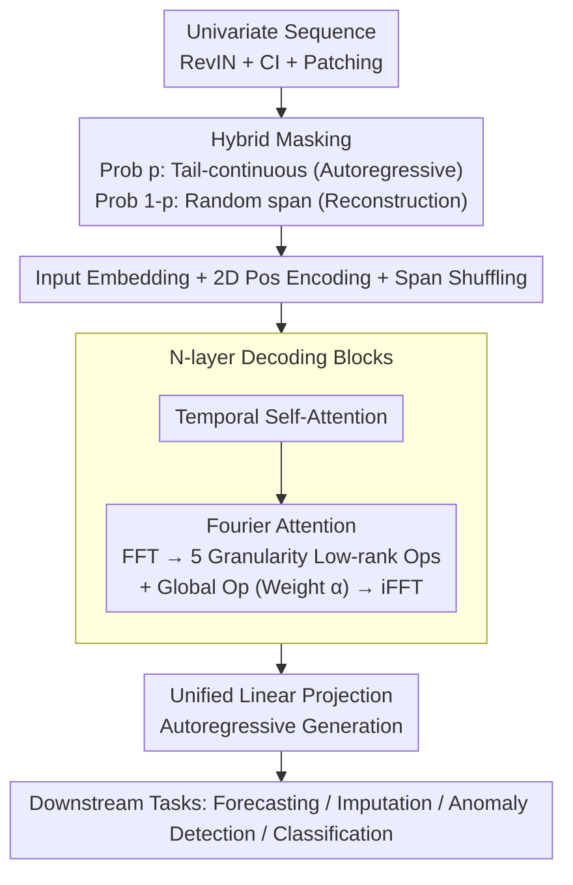

# GTM: A General Time-series Model for Enhanced Representation Learning

**Conference**: ICLR 2026  
**arXiv**: [2502.03264](https://arxiv.org/abs/2502.03264)  
**Code**: [https://github.com/MMTS4All/GTM](https://github.com/MMTS4All/GTM)  
**Area**: Time Series  
**Keywords**: Time-series foundation model, frequency-domain attention, hybrid masking pre-training, multi-task, time-granularity-aware

## TL;DR
GTM is proposed as a general time-series foundation model that captures time-granularity-aware features through a frequency-domain attention mechanism and unifies reconstruction and autoregressive pre-training objectives via hybrid masking. It achieves SOTA performance across multiple tasks, including forecasting, imputation, anomaly detection, and classification.

## Background & Motivation

1. **Background**: Time-series foundation models (TSFMs) are categorized into two types: forecasting-specific models (e.g., TimesFM, Lag-Llama) and multi-task models (e.g., Timer, UniTS). The former optimizes for forecasting, while the latter attempts to cover various downstream tasks.
2. **Limitations of Prior Work**: (a) Existing models primarily extract features in the time domain, neglecting distribution differences related to time granularity in the frequency domain; (b) Multi-task TSFMs typically require modifications to tokenization, pre-training strategies, or projection heads for different tasks, failing to be truly "task-agnostic."
3. **Key Challenge**: How to learn rich time-series representations (including frequency-domain information) within a unified architecture and pre-training framework that seamlessly adapts to all generative downstream tasks?
4. **Goal**: (a) Design a frequency-domain attention mechanism to capture frequency distribution differences across different time granularities (second/minute/hour/day); (b) Unify reconstruction and autoregressive pre-training objectives so the model fits various generative tasks without task-specific modifications.
5. **Key Insight**: Through FFT and 2D kernel density estimation (KDE) analysis of large-scale time-series data, the authors found significant differences in the joint distribution of amplitude-frequency and phase-frequency across different time granularities. This critical but overlooked dimension directly guides the model design.
6. **Core Idea**: Utilize Fourier attention to capture time-granularity-aware frequency features and hybrid masking (random + tail-continuous) to unify reconstruction and autoregressive objectives, achieving the first generative-task-agnostic time-series foundation model.

## Method

### Overall Architecture
GTM is a decoder-only Transformer. The pipeline ensures a single set of weights learns rich representations containing frequency-domain information while adapting to all generative downstream tasks with zero modification. Univariate sequences are normalized via RevIN, split by channel independence (CI), and patched into patch tokens. Then, hybrid masking is applied: each sample follows either "tail-continuous masking + autoregression" or "random span masking + reconstruction" based on a probability switch. Masked spans are randomly shuffled. The shuffled tokens, superimposed with 1D/2D position encodings, are fed into $N$ layers of stacked decoding blocks. Each block first passes through a temporal self-attention layer, followed by a Fourier attention layer to inject frequency-domain information. Finally, a unified linear projection layer autoregressively generates the masked positions. The entire model is pre-trained on the large-scale unlabeled UTSD-12G dataset, and the same weights and generation process are reused for downstream forecasting, imputation, and anomaly detection.

### Key Designs

**1. Hybrid Masking Pre-training: Unifying Reconstruction and Autoregression via a Probability Switch**
Purely reconstructive pre-training learns rich representations but lacks extrapolation capability, while purely autoregressive pre-training excels at forecasting but yields limited representation quality. Previous multi-task TSFMs often switched tokenization or strategies for different tasks. GTM uses a hyperparameter $pred\_ratio$ (probability $p$) as a switch: each sample applies a tail-continuous mask for autoregressive objectives with probability $p$, and random span masking for reconstruction with probability $1-p$. The reconstruction branch uses full attention to see the entire context, while the autoregressive branch uses causal attention to prevent leakage. Thus, the same pre-trained weights possess both representation and forecasting capabilities, allowing zero-modification reuse for downstream imputation (reconstruction) and forecasting (autoregression).

**2. 2D Position Encoding + Span Shuffling: Length Awareness for Masked Spans**
Hybrid masking randomly rearranges masked spans and appends [START]/[END] tokens. The model must know the length of the segment to be filled to align outputs correctly. Borrowing from GLM, GTM superimposes 1D and 2D position encodings on input embeddings: $\mathbf{H}_{in} = \mathbf{W}_{emb} \mathbf{X}_{in} + \mathbf{W}_{1D\_pos} + \mathbf{W}_{2D\_pos}$. The 1D encoding captures the global position of the patch in the original sequence, while the 2D encoding captures the relative position within the span and the span length. Combined with span shuffling, this ensures length-controllable generation and increases pre-training robustness.

**3. Fourier Attention: Injecting "Sampling Granularity" as a Prior into Frequency Modeling**
Empirical analysis of massive sequences shows systematic differences in amplitude/phase distributions across second, minute, hour, and day scales—a dimension usually ignored by TSFMs modeled purely in the time domain. GTM adds a frequency-domain branch after temporal self-attention in each block: the temporal output undergoes FFT along columns $\mathbf{H}_{\text{FFT}} = \text{FFT}(\mathbf{H}_{\text{TemAttOut}})$. Five low-rank matrix pairs $\{(\mathbf{A}_i, \mathbf{B}_i)\}_{i=1}^5$ correspond to day/hour/minute/second/millisecond granularities, plus a fully connected global branch $\mathbf{W}_{\text{full}}$ for granularity-agnostic patterns. The time granularity of the current sequence is encoded as a 5-tuple query (e.g., ETTm as $[0,0,15,0,0]$), which yields weights $\alpha$ via softmax with learnable keys. Transformations are aggregated: $\mathbf{H}_{\text{FourierAtt}} = \sum_{i=1}^{5} \alpha_i (\mathbf{A}_i \mathbf{B}_i) \mathbf{H}_{\text{FFT}} + \mathbf{W}_{\text{full}} \mathbf{H}_{\text{FFT}}$, followed by iFFT. Low-rank decomposition minimizes parameters, while attention allows adaptive selection of frequency operators.

### Loss & Training
The model uses MSE to supervise the reconstruction/prediction of masked positions: $\text{Loss} = \frac{1}{|\mathbf{Y}|} \sum_i \|\mathbf{X}_{out_i} - \mathbf{y}_i\|^2$. The autoregressive branch generates tokens sequentially: $\mathbb{P}(\mathbf{X}_{out}) = \prod_i \mathbb{P}(\mathbf{X}_{out_i} \mid \mathbf{X}_{P_{crpt}}, \mathbf{S}_{\sigma(j \leq i)})$. Pre-training is conducted only on UTSD-12G with strict isolation from evaluation data. Downstream forecasting, imputation, and anomaly detection use the exact same architecture, whereas classification requires a replaced projection head.

## Key Experimental Results

### Main Results — Long-term Forecasting
Average MSE/MAE, prediction length $T \in \{96, 192, 336, 720\}$:

| Dataset | GTM MSE | PatchTST MSE | TimesNet MSE | GPT4TS MSE | Gain |
|--------|---------|-------------|-------------|-----------|------|
| ETWh1 | **0.404** | 0.413 | 0.458 | 0.427 | vs PatchTST: -2.2% |
| ETTm1 | **0.339** | 0.352 | 0.400 | 0.352 | vs PatchTST: -3.7% |
| Weather | **0.225** | 0.225 | 0.259 | 0.237 | Par with PatchTST |
| Traffic | **0.385** | 0.390 | 0.620 | 0.414 | vs PatchTST: -1.3% |
| Electricity | **0.161** | 0.159 | 0.192 | 0.167 | PatchTST slight lead |

### Ablation Study

| Config | ETTh1 MSE | ETTm1 MSE | Weather MSE | Description |
|------|-----------|-----------|------------|------|
| GTM Full | 0.404 | 0.339 | 0.225 | Complete model |
| w/o Freq Module | ~0.415+ | ~0.345+ | ~0.230+ | Baseline version |
| w/o Granularity | ~0.410+ | ~0.342+ | ~0.228+ | Freq module w/o granularity |
| w/o Pre-train | 0.435 | 0.351 | 0.244 | MSE increases 0.5%-7.8% |

### Other Tasks
- **Imputation**: ETTh1 MSE 0.053 (vs GPT4TS 0.069, +23.1% gain); ETTm1 MSE 0.021 (vs TimesNet 0.027, +25.0% gain).
- **Anomaly Detection**: Avg F1 87.01% (vs GPT4TS 86.72%).
- **Classification**: Best on 5/10 datasets, second best on 4/10.
- **Zero-shot Forecasting**: Avg MSE 0.380 (vs Timer-1B 0.392, MOIRAI-S 0.405).

### Key Findings
- The **time-granularity-aware module** in Fourier attention contributes most; removing it degrades performance across all datasets.
- Pre-training yields consistent gains: Forecasting MSE drops by 0.5%-7.8%, Imputation MSE drops by 1.2%-11.7%, and Anomaly Detection F1 increases by 1.2%.
- The model follows the scaling law: performance improves with increased layers, dimensions, and pre-training data.
- Fine-tuning with only 10% of data outperforms the few-shot performance of TimesFM.

## Highlights & Insights
- **Novelty in granularity-aware frequency modeling**: The empirical analysis of frequency distribution differences across granularities and their adaptive integration via low-rank matrices elegantly incorporates prior knowledge. This trick is transferable to any multi-time-scale scenario (e.g., remote sensing, audio).
- **Unified Pre-training via Hybrid Masking**: Addresses the long-standing divide between reconstruction and autoregressive paradigms. A simple probability switch allows the model to be natively compatible with both imputation and forecasting.
- **True Generative-Task Independence**: Zero architecture changes for forecasting, imputation, and anomaly detection is a significant milestone in the TSFM field.

## Limitations & Future Work
- Uses Channel Independence (CI), ignoring cross-channel relationships—could incorporate spatial modules like CPiRi.
- Time granularity encoding is manual (5-tuple); could granularity representations be learned automatically?
- Classification still requires a modified projection head (not entirely task-agnostic)—could prompt or in-context learning be used?
- UTSD-12G domain coverage might affect zero-shot generalization; some datasets (e.g., Traffic) lag behind Timer-1B.

## Related Work & Insights
- **vs Timer**: Timer uses pure autoregressive pre-training and requires task-specific strategy switching; GTM unifies objectives via hybrid masking.
- **vs PatchTST**: PatchTST pioneered CI + patching but focuses on the time domain; GTM adds frequency-domain analysis.
- **vs MOIRAI**: MOIRAI targets cross-frequency learning but uses a masked Transformer; GTM explicitly models granularity differences via Fourier attention.
- **vs UniTS**: UniTS uses task tokenization/tokens; GTM achieves multi-tasking without task-specific tokens.

## Rating
- Novelty: ⭐⭐⭐⭐ (Fourier attention and hybrid masking are meaningful innovations)
- Experimental Thoroughness: ⭐⭐⭐⭐⭐ (Forecasting, imputation, anomaly detection, classification, zero-shot, few-shot, ablation, scaling law)
- Writing Quality: ⭐⭐⭐⭐ (Clear structure, though complexity analysis of Fourier attention could be deeper)
- Value: ⭐⭐⭐⭐ (First generative-task-agnostic TSFM with high industrial deployment potential)

<!-- RELATED:START -->

## Related Papers

- [\[ICLR 2026\] Uni-NTFM: A Unified Foundation Model for EEG Signal Representation Learning](uni-ntfm_a_unified_foundation_model_for_eeg_signal_representation_learning.md)
- [\[ICLR 2026\] FeDaL: Federated Dataset Learning for General Time Series Foundation Models](fedal_federated_dataset_learning_for_general_time_series_foundation_models.md)
- [\[ICLR 2026\] TEN-DM: Topology-Enhanced Diffusion Model for Spatio-Temporal Event Prediction](ten-dm_topology-enhanced_diffusion_model_for_spatio-temporal_event_prediction.md)
- [\[ICLR 2026\] Semantic-Enhanced Time-Series Forecasting via Large Language Models](semantic-enhanced_time-series_forecasting_via_large_language_models.md)
- [\[ICLR 2026\] TRIDENT: Cross-Domain Trajectory Spatio-Temporal Representation via Distance-Preserving Triplet Learning](trident_cross-domain_trajectory_spatio-temporal_representation_via_distance-pres.md)

<!-- RELATED:END -->
