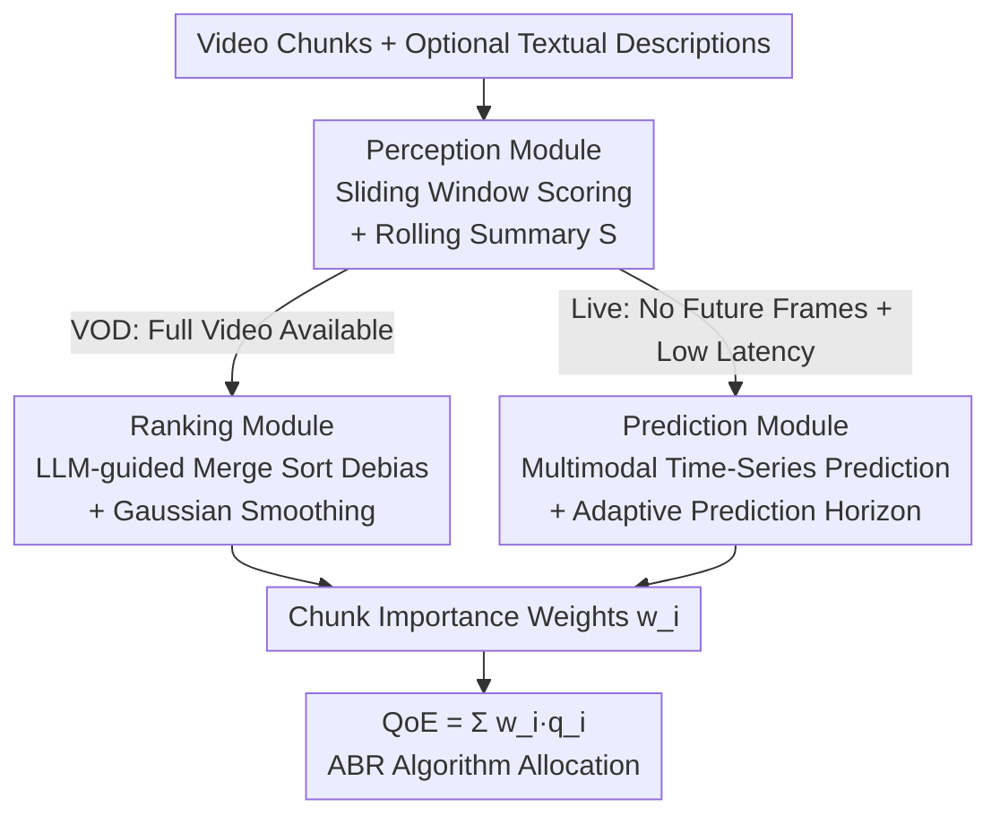

# HiVid: LLM-Guided Video Saliency For Content-Aware VOD And Live Streaming

**Conference**: ICLR 2026  
**arXiv**: [2602.14214](https://arxiv.org/abs/2602.14214)  
**Code**: TBD  
**Area**: Time Series  
**Keywords**: video saliency, LLM-as-judge, content-aware streaming, time series forecasting, adaptive bitrate

## TL;DR
The HiVid framework is proposed, marking the first use of LLMs as human proxies to generate content importance weights for video chunks. Through a perception module (sliding window scoring), a ranking module (LLM-guided merge sort to remove scoring bias), and a prediction module (multimodal time series forecasting for adaptive latency), it achieves content-aware streaming. HiVid improves VOD PLCC by 11.5%, live streaming prediction by 26%, and human MOS correlation by 14.7%.

## Background & Motivation
**Background**: Content-aware video streaming allocates higher bitrates to more important chunks using the metric $QoE = \sum_i w_i \cdot q_i$. Current methods include CV highlight detection models (DETR, VASNet, etc.) and manual crowdsourced labeling (SENSEI).

**Limitations of Prior Work**: CV models lack semantic understanding and have poor generalization. Large Video Language Models (VideoLLaMA3, VILA) suffer from severe hallucinations in subjective scoring tasks. Manual labeling is extremely costly ($78/100 per video) and infeasible for live streaming scenarios.

**Key Challenge**: There is a need for a weight generation scheme that balances accuracy (semantic understanding) with efficiency (real-time and low cost).

**Goal**: Address three challenges: (1) LLMs cannot process video directly and have limited tokens; (2) Inconsistency in local scoring within sliding windows; (3) Live streaming requires real-time inference, but LLM latency is uncertain.

**Key Insight**: Use LLMs as "human proxies" for zero-shot subjective reasoning, bypassing token limits via windowing and rolling context summaries.

**Core Idea**: LLM perception + merge sort debiasing + multimodal prediction for adaptive latency = end-to-end content-aware streaming.

## Method

### Overall Architecture
HiVid treats the LLM as a "human proxy" to assign subjective importance weights $w_i$ to video chunks, which are fed back into $QoE = \sum_i w_i \cdot q_i$ to guide bitrate allocation. A Perception module divides arbitrary-length videos into sliding windows for segment-wise scoring, serving as the common foundation for all scenarios. For Video-on-Demand (VOD), a Ranking module follows to remove scoring bias between windows using sorting. For live streaming, a Prediction module runs in parallel with Perception, using multimodal time series forecasting to mask the inference latency of the LLM. Both paths finally send chunk weights $w_i$ to the QoE model for bitrate allocation by the Adaptive Bitrate (ABR) algorithm.

### Key Designs

**1. Perception Module: Bypassing Token Limits via Sliding Windows and Summaries**

The "foundation" of the framework addresses the fact that LLMs do not consume video directly and have limited tokens. HiVid samples the first frame of each video chunk as an anchor frame and groups every $m$ frames into a window sent to the LLM (default GPT-4o). Each window prompt requires two outputs: scores for these $m$ frames and a compressed textual summary of the content for the next window, i.e., $R_{(k-1)m+1}^{km}, S_{km} = LLM(F_{(k-1)m+1}^{km}, S_{(k-1)m})$. The summary $S$ acts as compressed historical context (initialized with title and background), allowing subsequent windows to score with "prior knowledge." Processing a video of length $D$ requires only $\lceil D/m \rceil$ calls, keeping costs linear.

**2. Ranking Module: Neutralizing Inter-window Bias via LLM-guided Merge Sort**

In the VOD branch, since different windows are scored independently, absolute scores suffer from systematic drift—for instance, equally compelling scenes might get 65-70 in one window and 75-85 in another. Since VOD has access to the full video, HiVid uses relative ranking instead of absolute scores. It adapts the merge sort framework but replaces the "comparison of two elements" with "LLM-based ranking." When merging two sorted groups, $m/2$ frames are sampled from each to form a new list of length $m$ for the LLM to re-rank. The top $m/2$ are extracted, and the rest return to their groups. A single comparison sorts $m$ frames with $O(m)$ complexity; the total sorting is $O(k \log k)$ where $k = \lceil D/m \rceil$. The finalized ranks are normalized to $[0,1]$ as weights, and Gaussian smoothing $w_i = GS(s, \sigma, w_i)$ (kernel $s=D$) is applied for smooth transitions.

**3. Prediction Module: Masking Uncertain LLM Latency in Live Streaming**

In the live branch, there are no future frames and weights must be output in real-time, yet LLM latency $\Delta t$ fluctuates with input tokens. HiVid trains a multimodal time-series model to "forecast" future chunk weights. It uses a frozen CLIP to align historical frames and text summaries, followed by content-aware attention. Using time-series features as Q and concatenated image-text features as K/V: $Attn(F(x_w), F(x_{cat}), F(x_{cat})) = softmax\left(\frac{Q_w K_{cat}^T}{\sqrt{d}}\right) \cdot V_{cat}$. The "adaptive prediction horizon" dynamically determines how far to forecast based on current LLM latency $\Delta t$ and prediction latency $\delta$, covering the window where the LLM is busy. The training uses a correlation loss $loss = MSE(x, x_{gt}) + \lambda(1 - \text{Pearson}(x, x_{gt}))$ to ensure the overall trend of the weight sequence is preserved.

### Loss & Training
Perception and Ranking modules rely entirely on zero-shot LLM reasoning without training. Only the Prediction module requires training; multiple models are pre-trained for different $L_{out}$, and the one with the smallest sufficient horizon is selected at inference based on measured latency.

## Key Experimental Results

### Main Results
Saliency scores across three datasets (PLCC/mAP50):

| Method | Youtube-8M PLCC | TVSum PLCC | SumMe PLCC |
|------|----------------|-----------|------------|
| DETR | 0.57 | 0.42 | 0.38 |
| SL-module | 0.59 | 0.43 | 0.39 |
| VideoLLaMA3 | 0.54 | 0.41 | 0.35 |
| **Ours (HiVid)** | **0.66** | **0.50** | **0.47** |

### Ablation Study
Impact of window parameter $m$ on overhead and accuracy (201s video):

| m | Total API Calls | Total Cost | Total Time/h |
|---|------------|--------|----------|
| 2 | 1458 | $8.12 | 1.26 |
| 6 | 384 | $2.41 | 0.67 |
| 10 | 202 | $1.35 | 0.54 |

$m=10$ is optimal for the accuracy-cost tradeoff.

### Key Findings
- HiVid exceeds the runner-up SL-module by 11.5% in average PLCC and 6% in mAP50.
- In live scenarios, HiVid's multimodal prediction improves upon the strongest time-series baseline iTransformer by 26%.
- Real-world MOS correlation improved by 14.7%, validating actual streaming QoE gains.
- Video understanding models (VILA, Flamingo) underperform compared to CV baselines in subjective scoring tasks.

## Highlights & Insights
- **First systematic framework utilizing LLMs for video-level content-aware streaming**: Extends the LLM-as-judge concept from text to video streaming.
- **LLM Merge Sort**: An elegant adaptation of a sorting algorithm using an LLM as the comparison function, with $O(k \log k)$ overhead.
- **Adaptive Prediction Horizon**: A key design for practical deployment that handles asynchronous LLM inference latency.
- **End-to-End Validation**: A complete chain from scoring accuracy to actual streaming QoE.
- **Multimodal Content-Aware Attention**: Novel attention design combining CLIP-aligned image+text features with time-series signals.

## Limitations & Future Work
- Dependency on closed-source GPT-4o API leads to high costs ($1.35/video), hindering large-scale deployment.
- The Perception module only views the first frame as an anchor, potentially missing intra-chunk dynamic changes (e.g., fast action).
- In live scenarios, the initial $\lceil(\Delta t + \delta)/d\rceil + m$ chunks lack LLM scores and default to a weight of 1.
- Ranking overhead remains significant for extremely long videos due to the cost of $O(k \log k)$ LLM calls.
- Explored only GPT-4o; open-source alternatives (Llama/Qwen) were not tested.
- Quality relies heavily on LLM subjective judgment; different LLMs may introduce different biases.

## Related Work & Insights
- While SENSEI uses manual crowdsourcing for high accuracy at extreme cost, HiVid achieves an accuracy-efficiency balance using LLMs.
- Compared to attention-based highlight detection like DETR, LLMs show clear advantages in semantic content understanding.
- Comparison with VideoLLaMA3/VILA: Video understanding models suffer from hallucinations in subjective tasks; the LLM vision+text strategy is superior.
- Provides a reference for the Network Systems + AI cross-domain: asynchronous design patterns for introducing LLM inference into online systems.

## Rating
- Novelty: ⭐⭐⭐⭐ Innovative combination of LLM-as-judge for streaming, though technical modules lean towards engineering integration.
- Experimental Thoroughness: ⭐⭐⭐⭐⭐ 3 datasets, 17 baselines, ablation studies, and human user studies.
- Writing Quality: ⭐⭐⭐⭐ Problem-driven structure (3 challenges, 3 modules), rigorous narrative.
- Value: ⭐⭐⭐⭐ Practical significance for content-aware streaming, though generalized insights for the broader academic community are slightly limited.

<!-- RELATED:START -->

## Related Papers

- [\[AAAI 2026\] Interpreting Fedspeak with Confidence: A LLM-Based Uncertainty-Aware Framework Guided by Monetary Policy Transmission Paths](../../AAAI2026/time_series/interpreting_fedspeak_with_confidence_a_llm-based_uncertainty-aware_framework_gu.md)
- [\[ICLR 2026\] Towards Generalizable PDE Dynamics Forecasting via Physics-Guided Invariant Learning](towards_generalizable_pde_dynamics_forecasting_via_physics-guided_invariant_lear.md)
- [\[ICLR 2026\] STDDN: A Deep Learning Framework for Crowd Simulation Guided by the Fluid Continuity Equation](stddn_a_physics-guided_deep_learning_framework_for_crowd_simulation.md)
- [\[ICLR 2026\] Rating Quality of Diverse Time Series Data by Meta-learning from LLM Judgment](rating_quality_of_diverse_time_series_data_by_meta-learning_from_llm_judgment.md)
- [\[ICLR 2026\] Bridging Past and Future: Distribution-Aware Alignment for Time Series Forecasting](bridging_past_and_future_distribution-aware_alignment_for_time_series_forecastin.md)

<!-- RELATED:END -->
