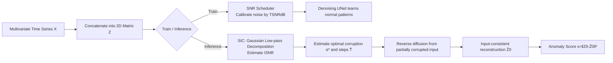

# ICDiffAD: Implicit Conditioning Diffusion Model for Time Series Anomaly Detection

**Conference**: ICLR 2026  
**OpenReview**: [https://openreview.net/forum?id=HIkuWAikXC](https://openreview.net/forum?id=HIkuWAikXC)  
**Code**: TBD  
**Area**: Time Series Anomaly Detection / Diffusion Models  
**Keywords**: Time Series Anomaly Detection, Diffusion Models, SNR Noise Scheduling, Implicit Conditioning Generation, Input-Consistent Reconstruction  

## TL;DR
Addressing the inherent stochasticity issues in diffusion models for time series anomaly detection—such as "random reconstruction from Gaussian noise" and "reconstructing sine waves as cosine waves"—ICDiffAD utilizes a Signal-to-Noise Ratio (SNR) based noise scheduler and a per-sample implicit conditioning mechanism. This allows the reverse diffusion to start from a "partially corrupted input" rather than pure noise, achieving input-consistent reconstruction while maintaining generative flexibility, thereby reducing the false positive rate by 60%.

## Background & Motivation
**Background**: The mainstream of Time Series Anomaly Detection (TSAD) consists of reconstruction-based methods—using Autoencoders, VAEs, or Transformers to learn normal patterns on anomaly-free data and treating reconstruction error as the anomaly score. Recently, generative models (GANs, Diffusion Models) have shown promise due to their ability to approximate complex data manifolds through iterative denoising, with Diffusion Models being particularly adept at characterizing complex temporal dynamics.

**Limitations of Prior Work**: Time series possess two inherent difficulties: (i) **Intrinsic noise**, where anomalous signals are submerged by random jitter, sensor artifacts, or measurement errors, causing models to "memorize noise" rather than learn causal temporal dependencies; (ii) **Temporal heterogeneity**, where non-stationary distributions and regime shifts make training dynamics unstable. These factors lower reconstruction fidelity and increase false positives. Although Diffusion Models are theoretically superior, they introduce a neglected **Key Challenge**: **Generative models inherently produce multiple "reasonable-looking" reconstructions from Gaussian noise** (e.g., Figure 1 in the paper shows a sine wave reconstructed as a cosine wave under low SNR). This directly conflicts with the "input-consistent reconstruction" requirement of reconstruction-based TSAD, where stochasticity in high-variance regions dramatically increases false positives.

**Key Challenge**: Existing remedies (self-conditioning, partial interpolation, or mask-then-impute frameworks) attempt to introduce partial original information as conditions but **often include the anomalies themselves as conditional inputs**. This causes errors to accumulate during reconstruction, incorrectly "preserving" local anomalies. The realism-fidelity trade-off remains a deadlock for vanilla diffusion in TSAD: the need for both generative flexibility and reconstruction determinism.

**Goal**: To achieve **input-consistent reconstruction** without sacrificing the generative capability of diffusion models, and to replace the three entangled and difficult-to-tune hyperparameters ($\beta_{min}$, $\beta_{max}$, $T$) with an intuitive, physically interpretable SNR quantity.

**Core Idea**: **Use SNR to unify and quantify "how much noise to add."** During training, an SNR scheduler learns normal patterns across a quantifiable corruption spectrum. During inference, an SNR Implicit Conditioning (SIC) mechanism estimates the optimal noise intensity and denoising steps "just enough to guide" each input. This allows reverse diffusion to start from a partially corrupted input, washing away anomalous components while retaining normal trends.

## Method

### Overall Architecture
ICDiffAD concatenates multivariate time series $X \in \mathbb{R}^{L\times K}$ along the feature dimension into a 2D matrix $Z$ (borrowing from DiffAD to allow kernels to learn cross-variable correlations). It then performs two processes: In the training phase, the **SNR Scheduler** determines the noise scale injected at each step, allowing the model to learn normal patterns under various corruption intensities calibrated by SNR. In the inference phase, the **SNR Implicit Conditioning (SIC)** mechanism estimates two key variables for each test sample—the optimal corruption factor $\bar\alpha_{\hat T}$ and the denoising step count $\hat T$. These are used to "partially corrupt" the input before starting reverse diffusion to obtain an input-consistent reconstruction $\hat Z_0$. The anomaly score is the L2 distance between the original sequence and the reconstruction: $s=\lVert Z_0-\hat Z_0\rVert_2^2$.

### Key Designs

**1. SNR Scheduler: Replacing three entangled hyperparameters with one physical quantity.** Traditional noise scheduling is determined by $\beta_{min}, \beta_{max}$, and $T$, which define different but related physical dynamics—a large $T$ with a small $\beta_{max}-\beta_{min}$ yields a finer denoising process, but a large $T$ slows inference, and a bandwidth that is too small leads to insufficient corruption during training. ICDiffAD reparameterizes these into a target signal-to-noise ratio $\text{TSNR}_{dB}=10\log_{10}\frac{M_T}{M_0-M_T}$, where $M_0=\mathbb{E}[\lVert Z_0\rVert_F^2]$ is the initial signal energy and $M_T$ is the final energy. From the recursive relation $M_t=\alpha_t M_{t-1}$, the step-wise decay factor is explicitly solved:

$$\alpha_t=\exp\!\Big(\frac{\log(M_T/M_0)}{\sum_{s=1}^{T} g(s)}\cdot g(t)\Big)$$

Here, $g(t)$ (e.g., linear $g(t)=t$) only governs the overall trend of noise injection, while the SNR scheduler ensures the **total energy dissipation exactly equals the user-defined TSNR**, with the final noise level precisely hitting the target. This provides two benefits: first, back-calculating $\beta$ from an interpretable TSNRdB removes heuristic tuning; second, the instantaneous SNR at each step $\text{SNR}(t)=\frac{\bar\alpha_t}{1-\bar\alpha_t}$ becomes quantifiable ($\bar\alpha_t=\prod_{s=1}^t\alpha_s$), making "how much signal energy is preserved at this step" readable and controllable. Ablations show that lower TSNR (more aggressive noise) performs better on multi-scale anomaly datasets (MSL/SMD/PSM gains of 10.3/7.5/16.2 points from 30dB to -20dB) because it forces the model to learn reconstruction across various noise scales.

**2. SNR Implicit Conditioning (SIC): Per-sample estimation of "just enough" corruption.** This is the key to solving stochasticity. Vanilla diffusion starting from a single noise $Z_T$ produces multiple trajectories $\{Z_t^{(i)}\}$, leading to irreducible variance in anomaly scores. The SIC approach is: each input requires a different amount of "original information preservation," so estimate it per sample. For a test instance $Z_{test}$, a zero-phase Gaussian low-pass decomposition is first performed: $Z_{test}=Z_{con}+N$, where $Z_{con}=G_\sigma(Z_{test})$ represents the low-frequency components (normal trends) and $N$ represents the residual (high-frequency noise and anomalies). The Inference SNR (ISNR) is calculated as:

$$\text{ISNR}=\frac{\lVert G_\sigma(Z_{test})\rVert_F^2}{\lVert Z_{test}-G_\sigma(Z_{test})\rVert_F^2+\delta}$$

Parameters are then determined in two phases: **Phase 1** derives the optimal corruption factor $\alpha^*=\frac{\text{ISNR}}{\text{ISNR}+\mu^2(Z_{test})+\sigma^2(Z_{test})}$ based on ISNR and sample statistics. **Phase 2** projects $\alpha^*$ to the nearest feasible step in the pre-trained schedule $\hat T=\arg\min_{t\le T}\lvert\bar\alpha_t-\alpha^*\rvert$. Finally, the input is corrupted to $Z_{\hat T}=\sqrt{\bar\alpha_{\hat T}}Z_{test}+\sqrt{1-\bar\alpha_{\hat T}}\epsilon$ before reverse diffusion—providing **just enough noise to wash away anomalous high-frequency components without erasing normal correlations**.

**3. Implicit vs. Explicit Conditioning: Avoiding anomaly leakage.** Existing imputation-based diffusion models (DiffAD, ImDiffusion) follow a mask-then-impute path, where part of the input is treated as a visible condition to fill in another part—the problem is that the conditional part might contain anomalies, causing errors to accumulate. ICDiffAD's "implicitness" lies in the fact that it **does not explicitly feed raw data segments as conditions into the network**. Instead, it guides generation by controlling the starting point (the partially corrupted input) via the SNR-estimated $\bar\alpha_{\hat T}$. The reverse process $p_\theta(Z_{0:\hat T}\mid Z_{test}^{con})=p_\theta(Z_{\hat T})\prod_{k=1}^{\hat T}p_\theta(Z_{k-1}\mid Z_k)$ no longer relies on potentially contaminated conditional segments, fundamentally preventing the "preservation and amplification" of anomaly information.

## Key Experimental Results

### Main Results
Evaluation was conducted on five real-world multivariate benchmarks (MSL / SMAP / SMD / PSM / SWaT) using the mean of five random seeds and a **strict point-wise exact matching** protocol (avoiding the overestimation caused by point-adjustment). The table below shows the Average F1 (%):

| Category | Method | Average F1 |
|----------|---------|------------|
| Classical | IF | 37.65 |
| Classical | CBLOF | 38.98 |
| Reconstruction | SARAD (Prev. SOTA) | 38.71 |
| Reconstruction | TimesNet | 26.72 |
| Diffusion | DiffAD | 24.24 |
| Diffusion | ImDiffusion | 9.75 |
| — | **ICDiffAD (Ours)** | **43.81** |

Looking at individual datasets, ICDiffAD is the best or joint best on MSL (33.17), SMAP (28.01), SMD (23.68), and PSM (56.87). On SWaT, its 77.34 is slightly lower than classical methods (as SWaT anomalies are relatively simple).

### Ablation Study
Incremental component addition (Average F1):

| IC | SNR | SIC | Average F1 |
|----|-----|-----|------------|
| × | × | × | 36.52 |
| ✓ | × | × | 40.27 |
| ✓ | ✓ | × | 42.74 |
| ✓ | ✓ | ✓ | **43.81** |

Adding Implicit Conditioning (IC) alone yields a 3.75-point gain, the SNR scheduler adds 2.47 points, and SIC completes the performance. The choice of $g(t)$ (linear/quadratic/cosine) makes little difference, indicating the SNR scheduler is robust to the trend function.

### Key Findings
- Compared to DiffAD, the **false positive rate is reduced by 60.23%** while maintaining competitive recall, leading to a better precision-recall balance.
- ImDiffusion's catastrophic failure (14.49% lower F1 than DiffAD) highlights the fragility of the imputation paradigm that uses anomalies as conditions.
- The Gaussian bandwidth $\sigma$ is a key dial: complex series (PSM) perform best at $\sigma=1$ (light corruption, preserving complex info), while simpler patterns (MSL/SMAP/SMD) benefit from higher $\sigma$ to improve precision at the cost of recall.

## Highlights & Insights
- **Replacing uninterpretable hyperparameters with physical quantities**: Unifying $\beta_{min}, \beta_{max}, T$ via SNR is the most elegant part of this work—reducing tuning overhead and making "signal preservation per step" readable.
- **Accurate diagnosis and targeted solution**: The paper identifies the conflict between vanilla diffusion's stochasticity and "input-consistent reconstruction" in TSAD, using the "sine $\to$ cosine" example. It solves this via implicit conditioning and per-sample corruption estimation.
- **Adaptive per-sample behavior**: ISNR estimates the "just enough" noise intensity for each test instance rather than using a global setting, which is core to balancing fidelity with normal trend preservation.

## Limitations & Future Work
- **Dependency on $\sigma$**: The Gaussian low-pass bandwidth $\sigma$ is sensitive to different datasets (trade-off between precision and recall), and no automatic selection scheme is provided.
- **Absolute F1 remains low**: Under strict point-wise evaluation, the average F1 is only 43.81%, showing TSAD is still far from practical utility. It did not outperform SARAD on SMD or SWaT, indicating it is not universally superior for all heterogeneous/simple patterns.
- **Computational Overhead**: Diffusion inference requires multi-step denoising. Although SIC shortens the trajectory via $\hat T \le T$, it is still heavier than single-forward reconstruction methods.
- **Future Directions**: Making $\sigma$ and TSNR learnable/adaptive; extending to long-range dependencies and streaming online detection.

## Related Work & Insights
- **Diffusion-based TSAD**: Includes DiffusionAE (diffusion on AE outputs), DiffADT (state space models as denoisers), MODEM (multi-resolution refinement), and imputation-based methods like DiffAD/ImDiffusion. The difference here is the explicit SNR control and implicit conditioning to avoid anomaly leakage.
- **Reconstruction/Representation Methods**: Anomaly Transformer, TimesNet, D3R, SARAD, Deep SVDD, DCDetector, etc.
- **Insight**: For any generative-to-reconstruction task, this paper provides a general framework—use a physical quantity (SNR) to **quantify and control the starting point of stochasticity**, making generative flexibility serve rather than undermine deterministic requirements.

## Rating
- **Novelty**: ⭐⭐⭐⭐ — Reparameterizing diffusion noise via SNR and using per-sample ISNR for implicit conditioning is a sharp, effective combination for the TSAD stochasticity problem.
- **Experimental Thoroughness**: ⭐⭐⭐⭐ — Five standard benchmarks, strong baselines across four categories, strict point-wise evaluation, and thorough ablations; however, absolute performance is still modest on some sets.
- **Writing Quality**: ⭐⭐⭐⭐ — Problems are diagnosed clearly (sine-to-cosine), and the motivation is well-articulated with complete mathematical derivations.
- **Value**: ⭐⭐⭐⭐ — Provides a practical solution for the core contradiction of diffusion in TSAD. The 60% FP reduction is significant for real-world monitoring/AIOps.

<!-- RELATED:START -->

## Related Papers

- [\[ICLR 2026\] Towards Multimodal Time Series Anomaly Detection with Semantic Alignment and Condensed Interaction](towards_multimodal_time_series_anomaly_detection_with_semantic_alignment_and_con.md)
- [\[ICLR 2026\] Point-wise Anomaly Detection via Fold-bifurcation ODE](point-wise_anomaly_detection_via_fold-bifurcation_ode.md)
- [\[ICLR 2026\] When Foundation Models Are One-Liners: Limitations and Future Directions for Time Series Anomaly Detection](when_foundation_models_are_one-liners_limitations_and_future_directions_for_time.md)
- [\[ICLR 2026\] TEN-DM: Topology-Enhanced Diffusion Model for Spatio-Temporal Event Prediction](ten-dm_topology-enhanced_diffusion_model_for_spatio-temporal_event_prediction.md)
- [\[ICLR 2026\] Understanding the Implicit Biases of Design Choices for Time Series Foundation Models](understanding_the_implicit_biases_of_design_choices_for_time_series_foundation_m.md)

<!-- RELATED:END -->
