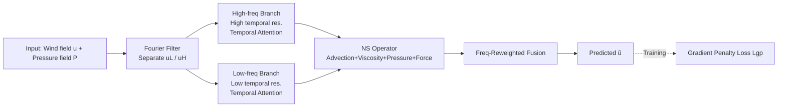

# Improving Extreme Wind Prediction with Frequency-Informed Learning

**Conference**: ICLR 2026  
**OpenReview**: [https://openreview.net/forum?id=IJAPVmxQYU](https://openreview.net/forum?id=IJAPVmxQYU)  
**Code**: To be confirmed  
**Area**: Time Series / Weather Forecasting / Physics-Informed Machine Learning  
**Keywords**: Extreme wind speed prediction, Frequency domain analysis, Gradient penalty loss, Navier-Stokes physical embedding, Frequency separation reweighting, ERA5  

## TL;DR
This paper theoretically proves from a frequency domain perspective that the "MSE training + pattern shift → high-frequency amplitude contraction" mechanism is the root cause of the systematic underestimation of extreme wind speeds by data-driven models. Accordingly, it proposes a triad of **gradient penalty loss + NS physical embedding structure + frequency-separated reweighting**, which significantly enhances extreme wind prediction accuracy without sacrificing overall performance.

## Background & Motivation
- **Background**: Deep learning models such as FourCastNet and Pangu-Weather have significantly outperformed traditional Numerical Weather Prediction (NWP) in global weather forecasting, excelling at producing smooth and overall accurate wind field predictions.
- **Limitations of Prior Work**: Models trained with MSE and conventional wind speed data systematically underestimate amplitudes and smooth out short-term violent ramps in **extreme wind speeds**. This bias persists even when overall accuracy is high, leading to underestimated risks in wind power operations and missed reports of rapid ramps (wind power output is approximately proportional to the cube of wind speed $v^3$, and extreme winds cause turbine shutdowns, making the cost of error extremely high).
- **Key Challenge**: Existing extreme weather models suffer from four gaps: (i) barely explaining why errors amplify at extremes; (ii) implicit reliance on large volumes of data containing extreme samples, which are naturally scarce; (iii) stacking more complex structures to catch sharp changes; (iv) pure data-driven approaches failing to grasp intrinsic dynamics, leading to uncontrollable regional errors.
- **Goal**: To first theoretically explain the mechanism of extreme wind underestimation and then design a directly deployable, data-efficient improvement to make extreme predictions more accurate while maintaining robust overall performance.
- **Key Insight**: **[Frequency Domain Attribution]** MSE is decomposed into amplitude contraction error, pattern translation error, and noise, proving that pattern shifts lead to the compression of high-frequency component amplitudes; **[Targeted Solution]** Use gradient penalty loss to increase the weight of amplitude contraction terms, employ an NS physical structure to suppress translation errors, and use frequency-separated reweighting to counter high-frequency decay.

## Method

### Overall Architecture
The method consists of "one theory + three components": The theoretical part models prediction error as $\tilde u(x)=a\,u(x+\Delta)+\varepsilon(x)$ (scaling $a$, translation $\Delta$, noise $\varepsilon$). Through Fourier transform and Rayleigh’s energy theorem, a three-term decomposition of MSE is derived, indicating that amplitude contraction is most severe at high frequencies. Accordingly, the engineering part designs a **gradient penalty loss** (to address amplitude contraction), an **NS physical embedding structure** (to address translation error), and **frequency separation and reweighting** (to address high-frequency decay). The input wind speed field $u$ and pressure field $P$ sequentially pass through frequency filters, temporal attention, and NS operators, predicting high/low-frequency components respectively before fusion for the final result.

### Key Designs

**1. Frequency Domain Error Decomposition: Quantifying why "contraction" occurs.** The authors assume the prediction and ground truth satisfy $\tilde u(x)=a\,u(x+\Delta)+\varepsilon(x)$. In the frequency domain, the phase is denoted as $\theta_k=2\pi(k_x\Delta_x/N+k_y\Delta_y/M)$. Using Rayleigh’s energy theorem to equate spatial MSE to the frequency domain, the expected error is decomposed into $E[\text{MSE}]=C_1\sum_k\{a-E[\cos\theta_k]\}^2\|\hat u(k)\|^2+\{1-E^2[\cos\theta_k]\}\|\hat u(k)\|^2+\sigma^2$, which contains **scaling (contraction) error + translation error + noise**. A key inference is that the optimal scaling $a_{\text{opt}}=E[\cos\theta_k]=1-\tfrac{C_2(k\cdot\Delta)^2}{2}+o(\|k\|^2)<1$ decreases as frequency $k$ increases—this mathematically explains that **when optimization is stuck on translation errors, the model reduces loss by "compressing overall amplitude," with high-frequency components contracting most severely**, which is the root cause of extreme wind underestimation.

**2. Gradient Penalty Loss: Making "amplitude compression" unprofitable.** Since contraction originates from pattern shifts, a correction term insensitive to shifts but reflecting the intensity of spatial variation is added—matching the gradient norm of the prediction and ground truth: $L_{gp}(\tilde u,u)=\text{MSE}(\tilde u,u)+\lambda\big|\|\nabla\tilde u\|^2-\\|\nabla u\|^2\big|$. Since $\|\nabla\tilde u\|^2$ is typically small in practice, this is equivalent to $\text{MSE}-\lambda\|\nabla\tilde u\|^2$, where $\|\nabla\tilde u\|^2\propto\sum_k\|k\|^2\|\hat{\tilde u}(k)\|^2$ effectively increases the weight of high-frequency residuals. Physically, the authors provide an **energy-enstrophy interpretation**: the MSE term performs "energy matching" while the gradient term performs "enstrophy (L2 norm of vorticity) matching." From the energy balance of 2D incompressible NS, $\tfrac12\tfrac{d}{dt}\|u\|^2+\nu\|\nabla u\|^2=\langle F,u\rangle$, it is known that enstrophy controls the kinetic energy dissipation rate and is weighted by $k^2$ toward high frequencies in the spectrum. Thus, the loss forces the network to preserve the amplitude of small-scale structures, making "uniform compression" an inefficient means of reducing loss.

**3. NS Physics-Embedded Structure: Using first principles to suppress translation error.** Translation errors mainly stem from uncertainty in the direction/magnitude of wind field movement, which pure neural networks can only learn implicitly. The authors decompose the NS equation $\partial_t u=-u\cdot\nabla u-\tfrac1\rho\nabla P+\nu\nabla^2 u+F$ into four operators embedded in the network (NS Operator): **Advection operator** (nonlinear transport $u\cdot\nabla u$), **Viscosity operator** (diffusion $\nu\nabla^2u$), **Pressure operator** (pressure gradient force $\tfrac1\rho\nabla P$, using pressure data, or merged into the body force if missing), and **Body force operator** (using a learnable neural network to capture dynamics unexplained by the first three). The first three operators provide physically reasonable coarse predictions and constrain translation magnitude and direction, while the body force operator performs refinement—both directly constraining translation error and reducing the burden on the learnable parts, thereby lowering parameter count and training costs.

**4. Frequency Separation and Reweighting: Handling scales separately.** A Fourier filter splits the wind field into low frequency $u_L$ and high frequency $u_H$ (transform → frequency mask $\hat u_f(k)=\hat u(k)\cdot M(k)$ → inverse transform). For each branch, a SENet-inspired **temporal attention** is applied (Squeeze each time slot, Excitation outputs weights reflecting the importance of each slot). A key difference lies in the **resolution division**: high frequencies are critical for short-term dynamics and are processed with higher temporal resolution (shorter intervals); low frequencies correspond to long-term trends and are processed with lower resolution, simultaneously capturing short-term sharp changes and large-scale coherence.

## Key Experimental Results

### Main Results

The dataset is ERA5 reanalysis (10m U/V wind + surface pressure, 1h temporal resolution, 0.25° spatial resolution, using 24 hours as the prediction unit where the first 23h predict the 24th). Metrics are overall RMSE and Ex-RMSE (Extreme Attentive RMSE) focused on extreme regions.

| Model | 1h RMSE | 1h Ex-RMSE | 3h RMSE | 3h Ex-RMSE | 5h RMSE | 5h Ex-RMSE |
|------|---------|------------|---------|------------|---------|------------|
| CNN | 0.4639 | 0.3183 | 1.0442 | 0.7355 | 2.0757 | 1.0693 |
| ConvLSTM | 0.3471 | 0.2294 | 0.7834 | 0.5357 | 1.0644 | 0.8097 |
| PINN | 0.3946 | 0.2541 | 0.8283 | 0.5646 | 1.1434 | 0.7347 |
| **Ours** | **0.3287** | **0.1868** | **0.6622** | **0.4329** | **0.9076** | **0.6158** |

In next-frame (1h) prediction, compared to CNN/ConvLSTM/PINN, overall RMSE decreased by 29.1%/5.3%/16.7%, and Ex-RMSE decreased by 41.3%/18.6%/26.5%; Ours consistently leads across longer lead times of 3h and 5h.

### Ablation Study

| Variant | RMSE | Ex-RMSE |
|------|------|---------|
| Only NS operator (NS op) | 0.7061 | 0.4577 |
| W/O gradient loss | 0.3351 | 0.2632 |
| W/O NS structure | 0.3754 | 0.2363 |
| W/O frequency separation | 0.4199 | 0.2703 |
| **Full Model (Ours)** | **0.3287** | **0.1868** |

### Key Findings
- **Gradient loss specifically addresses extremes**: Removing the gradient penalty term leaves the overall RMSE almost unchanged (0.3287→0.3351), but Ex-RMSE deteriorates significantly (0.1868→0.2632), confirming that the gradient term targetedly reconstructs sharp gradients and vorticity in high-impact areas.
- **$\lambda$ follows a U-curve**: A small positive value (optimal $\lambda^\star=0.02$) significantly reduces extreme errors without harming overall accuracy; for $\lambda\ge0.15$, optimization becomes unstable and the model fails to converge—because the gradient term lacks positional alignment, excessive values cause large fluctuations unrelated to location.
- **Complementarity of the three components**: Keeping only the NS operator results in the largest error (indicating the neural NS operator alone is insufficient); removing frequency separation causes both RMSE and Ex-RMSE to rise significantly, proving that explicit decoupling of high and low frequencies is vital for capturing both large and small-scale structures.

## Highlights & Insights
- **From "Phenomenon" to "Mechanism"**: Using frequency domain decomposition to prove $a_{\text{opt}}<1$ and its decrease with frequency provides a rare theoretical attribution for why models underestimate extreme winds, rather than relying solely on empirical tuning.
- **Plug-and-play loss improvement**: The gradient penalty loss simply adds a gradient norm difference to the MSE; it is easy to implement, can be attached to any backbone, and is supported by a PDE interpretation via energy-enstrophy.
- **Efficiency via physics priors**: The NS operator delegates the "where and how much the wind moves" to physical operators for a coarse estimation, with the neural network only fitting the residual. This constrains translation errors and reduces parameter and data requirements, fitting the reality of scarce extreme samples.

## Limitations & Future Work
- The error modeling relies on simplified assumptions of "scaling + translation + noise," and more complex error causes have yet to be characterized.
- Validation is currently concentrated on regional areas, short lead times (1–5h), and 2D wind fields; generalization to longer lead times, 3D scenarios, and other meteorological variables remains to be tested.
- The gradient penalty term lacks positional alignment information, requiring careful tuning of $\lambda$ (unstable if too large), and lacks an adaptive mechanism.

## Related Work & Insights
- **Data-driven Meteorology**: Large models like FourCastNet and Pangu-Weather excel at overall forecasting but exhibit systematic smoothing biases for extreme events—this work specifically addresses that gap.
- **Dedicated Extreme Weather Models**: RNN/CNN/LSTM capture spatio-temporal dependencies, and VAE/diffusion perform data augmentation to mitigate scarcity, but few offer theoretical explanations; this paper provides a frequency-domain-interpretable alternative.
- **Physics-Informed Machine Learning**: Unlike PINNs that use NS/RANS as soft constraints, this paper decomposes NS into explicit operators as structural inductive biases and uses an energy-enstrophy perspective to explain the loss. It offers valuable insights on how to inject physical priors in data-scarce scenarios and use frequency analysis to locate systematic biases in deep models.

## Rating
- **Novelty**: ⭐⭐⭐⭐ —— Frequency domain error decomposition + energy-enstrophy explanation for gradient loss provides rare theoretical attribution for extreme underestimation. The components are somewhat compositional but the perspective is fresh.
- **Experimental Thoroughness**: ⭐⭐⭐ —— ERA5 multi-lead-time, ablation, and λ-scanning are complete and self-consistent, but baselines are classical (CNN/ConvLSTM/PINN). Comparisons with Pangu/FourCastNet are missing, and it is limited to regional 2D short-term scenarios.
- **Writing Quality**: ⭐⭐⭐⭐ —— The logic from theoretical derivation to engineering design is clear. The link from frequency insight → loss → structure → frequency separation is well-maintained, with ample formulas and diagrams.
- **Value**: ⭐⭐⭐⭐ —— Extreme wind prediction has direct economic value for wind power, and the gradient penalty loss is plug-and-play with strong transferability; the frequency attribution methodology is also inspiring for other extreme event predictions.

<!-- RELATED:START -->

## Related Papers

- [\[ICLR 2026\] Extreme Weather Nowcasting via Local Precipitation Pattern Prediction](extreme_weather_nowcasting_via_local_precipitation_pattern_prediction.md)
- [\[ICLR 2026\] ST-HHOL: Spatio-Temporal Hierarchical Hypergraph Online Learning for Crime Prediction](st-hhol_spatio-temporal_hierarchical_hypergraph_online_learning_for_crime_predic.md)
- [\[ICLR 2026\] SONATA: Synergistic Coreset Informed Adaptive Temporal Tensor Factorization](sonata_synergistic_coreset_informed_adaptive_temporal_tensor_factorization.md)
- [\[AAAI 2026\] M2FMoE: Multi-Resolution Multi-View Frequency Mixture-of-Experts for Extreme-Adaptive Time Series Forecasting](../../AAAI2026/time_series/m2fmoe_multi-resolution_multi-view_frequency_mixture-of-experts_for_extreme-adap.md)
- [\[ICLR 2026\] MixLinear: Extreme Low Resource Multivariate Time Series Forecasting with 0.1K Parameters](mixlinear_extreme_low_resource_multivariate_time_series_forecasting_with_01k_par.md)

<!-- RELATED:END -->
