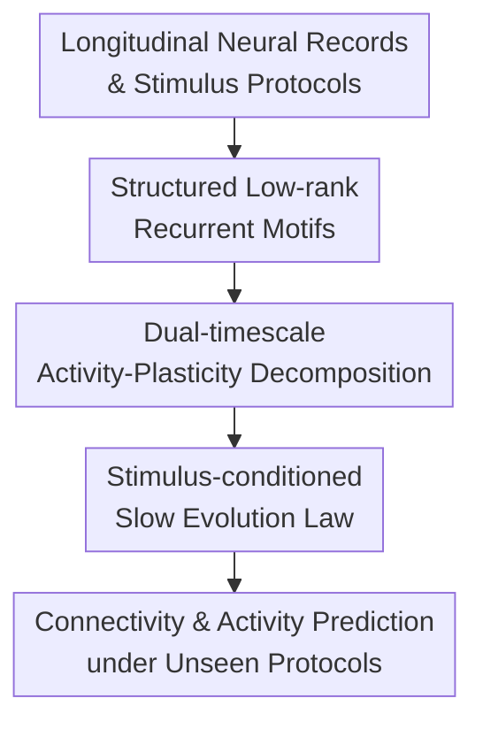

# Inferring brain plasticity rule under long-term stimulation with structured recurrent dynamics

**Conference**: ICLR2026  
**OpenReview**: [https://openreview.net/forum?id=kc5jbYHedw](https://openreview.net/forum?id=kc5jbYHedw)  
**Code**: https://github.com/ncclab-sustech/STEER.git  
**Area**: Time Series / Neural Dynamics  
**Keywords**: Brain Plasticity, Long-term Stimulation, Recurrent Dynamics, Low-rank Dynamical Systems, Deep Brain Stimulation  

## TL;DR

This paper proposes STEER, which models brain network reorganization under long-term neural stimulation as a stimulus-conditioned slow-timescale dynamical law. By utilizing structured low-rank RNNs to interpret fast intra-session neural activity, it enables the inference of interpretable plasticity rules from longitudinal recordings. The model predicts network evolution under unseen stimulation protocols in Lorenz systems, BCM rules, stimulus-induced task learning, and Parkinsonian rat DBS data.

## Background & Motivation

**Background**: The nervous system continuously reorganizes during learning, memory, and therapeutic stimulation. On short timescales, rules such as Hebbian learning, STDP, and BCM describe how local synapses change with activity. In machine learning, various RNNs, state-space models, and low-rank neural dynamical models can reconstruct non-linear activity trajectories from population neural recordings within a session.

**Limitations of Prior Work**: Applying these tools to long-term stimulation scenarios faces a more difficult challenge: fast neural activity is recorded within a day, while connectivity structures and plasticity states change across days or weeks. Traditional biophysical rules are interpretable but mostly cover local synaptic updates on millisecond-to-minute scales. Flexible neural system identification models, while fitting data well, often absorb slow cross-session changes into high-dimensional parameter drifts. Consequently, such models might predict immediate activity but fail to explain how stimulation cumulatively alters the network.

**Key Challenge**: What truly needs to be identified is not "a set of parameters for the $k$-th recording and another for the $k+1$-th," but rather *why* these parameters change. That is, brain plasticity induced by long-term stimulation should be treated as a testable slow dynamical object rather than noise, a confound, or a black-box session embedding for fast dynamics.

**Goal**: The authors aim to solve three sub-problems from longitudinal neural recordings: first, separating fast intra-session neural activity from slow cross-session network reorganization; second, representing plasticity states with low-dimensional variables that map to changes in recurrent connectivity motifs; third, extrapolating connectivity and activity for future sessions given new stimulation protocols, rather than just replaying trajectories seen in the training set.

**Key Insight**: A key observation is that long-term neural stimulation is typically not a random perturbation but an external input with a specific protocol, intensity, schedule, and feedback control. Therefore, cross-session changes can be formulated as a stimulus-conditioned evolution law $z_{k+1}=g_\theta(z_k,\bar{u}_k)$. If $z_k$ is a low-dimensional plasticity embedding, $g_\theta$ can be interpreted as the inferred brain plasticity rule.

**Core Idea**: Replace unstructured session parameter drift with "structured low-rank recurrent motifs + stimulus-conditioned slow variable updates." This transforms brain plasticity under long-term stimulation from a black-box fitting problem into a predictive, interpretable dynamical modeling problem suitable for counterfactual stimulus design.

## Method

### Overall Architecture

The input to STEER is a set of time-ordered longitudinal neural recordings $\{y^k_{1:T}\}_{k=1}^D$ and the corresponding stimulation inputs $u^k_{1:T}$ for each session. The model assumes that recurrent connectivity remains approximately stable within each session, allowing a fast RNN to describe intra-session neural activity. However, connectivity changes slowly between sessions, controlled by a low-dimensional plasticity embedding $z_k$ and a stimulus-conditioned update rule $g_\theta$.

Overall, STEER expresses the cross-session connectivity matrix $W_k$ as a weighted sum of shared low-rank motifs. It encodes $z_k$ from neural recordings, maps $z_k$ to motif scales $c_k$, and assembles the recurrent connectivity for the current session using $c_k$. On the slow timescale, $z_k$ must satisfy $z_{k+1}=g_\theta(z_k,\bar{u}_k)$, forcing the model to learn how stimulation protocols drive the progression of plasticity states rather than just finding independent embeddings for each session.

In this framework, "Structured low-rank recurrent motifs" correspond to connectivity parameterization; "Dual-timescale decomposition" corresponds to the division of labor between the fast RNN and the plasticity embedding; and the "Stimulus-conditioned slow evolution law" corresponds to the $g_\theta$ plasticity rule. Together, they ensure the model fits neural activity while explaining cross-session changes as structured network reorganization.

### Key Designs

**1. Structured Low-rank Recurrent Motif: Compressing cross-session connectivity changes into interpretable motif scales**

In longitudinal recordings, the dimension of connectivity matrices can easily become unmanageable. If an $N\times N$ matrix $W_k$ is learned freely for every session, the model gains enough degrees of freedom to fit data but struggles to identify true plasticity laws. STEER stacks connectivity from all sessions into a tensor $W\in\mathbb{R}^{N\times N\times D}$ and uses CP decomposition: $W=\sum_{r=1}^R a_r\circ b_r\circ c_r$. For the $k$-th session, the connectivity matrix is $W_k=\sum_{r=1}^R c_r^k a_r b_r^\top$.

The intuition is that $a_r b_r^\top$ represents recurrent motifs shared across sessions, while $c_r^k$ represents the expression strength of the $r$-th motif in the $k$-th session. Thus, brain plasticity across days or weeks is manifested as continuous changes in a few motif scales rather than arbitrary drift. The model uses constraints like $\|a_r\|_2=\|b_r\|_2=1$, orthogonal penalties, and optional Dale’s principle masks to reduce decomposition ambiguity, making motifs more biologically interpretable.

**2. Dual-timescale Activity-Plasticity Decomposition: Fitting intra-session activity via fast RNN and cross-session reorganization via $z_k$**

The fast dynamics in STEER are represented by a low-rank RNN. The hidden state $h^k(t)$ of the $k$-th session evolves according to $\tau \frac{d}{dt}h^k(t)=-h^k(t)+(\sum_r c_r^k a_r b_r^\top)\phi(h^k(t))+W_{in}u^k(t)$, and is mapped to observed neural signals by a linear decoder. Millisecond-to-second non-linear responses are handled by $h^k(t)$, while connectivity differences between sessions are handled solely via $c_k$.

The slow variable $z_k$ is extracted from session data and inputs by a PlasticityEncoder, identifying motif scales via $c_k=Mz_k+b_c$. The key is not just adding an embedding, but defining its semantics: $z_k$ modulates connectivity only through a few motif scales, forcing it to explain structural changes rather than absorbing observation noise. A sparse $M$ further aligns plasticity dimensions with specific motifs, facilitating comparisons with functional connectivity or BCM thresholds.

**3. Stimulus-conditioned Slow Evolution Law: Making plasticity rules a target for prediction**

Embeddings $z_k$ and scales $c_k$ alone are insufficient, as the model might still encode sessions independently. STEER requires $z_k$ to satisfy stimulus-conditioned residual dynamics: $z_{k+1}=z_k+\tau_z(W_z\phi(z_k)-z_k+B_u\bar{u}_k+b_z)$, where $\bar{u}_k$ summarizes the $k$-th session's stimulation protocol. This elevates external stimulation from a standard input to a condition for slow variable evolution, allowing the model to predict how connectivity will change under different stimulation schedules.

The loss $L_{slow}$ penalizes inconsistencies between encoded $z_{k+1}$ and predicted $g_\theta(z_k,\bar{u}_k)$, while $L_{smooth}$ encourages smooth variations in motif scales. Together, they constrain the model to maintain interpretable continuity across sessions. The model is also tested using forward-in-time holdout (training on the first 60% of sessions, testing on the last 40%) to verify the extrapolative power of the slow evolution law.

### Loss & Training

The total objective of STEER consists of three parts: $L=L_{fast}+\lambda_{slow}L_{slow}+\lambda_{smooth}L_{smooth}$. Here, $L_{fast}=\sum_k\sum_t\|y_t^k-\hat{y}_t^k\|_2^2$ handles intra-session multi-step prediction using H-step rollout (teacher forcing for the first step, followed by autoregressive rolling) to avoid over-reliance on one-step accuracy.

$L_{slow}=\sum_k\|z_{k+1}-g_\theta(z_k,\bar{u}_k)\|_2^2$ constrains the slow-timescale plasticity rule, and $L_{smooth}=\sum_k\|c_{k+1}-c_k\|_2^2$ reflects the gradual nature of long-term plasticity. During training, the state encoder/decoder, plasticity encoder, motif factors, weight inference, and plasticity predictor are jointly optimized. Staged training (fast then slow) was also tested and showed similar trends, though joint training performed slightly better.

For counterfactual prediction, the model does not require future real embeddings. Given a new stimulus sequence $\{\tilde{u}^k\}$, it iterates $\tilde{z}_{k+1}=g_\theta(\tilde{z}_k,\tilde{\bar{u}}_k)$, reconstructs $\tilde{c}_k$, assembles $\tilde{W}_k$, and simulates the fast RNN. This distinguishes STEER from standard session-conditioned RNNs by enabling the prediction and design of future states under unseen protocols.

## Key Experimental Results

### Main Results

| Experimental Setup | Evaluation Target | Ours (STEER) | Baseline / Reference | Conclusion |
|--------------------|-------------------|--------------|----------------------|------------|
| Lorenz Param Evolution | Unseen Trajectory EV | system 61: 0.961; system 100: 0.974 | MD-SSM, Hierarchical PLRNN | STEER predicts high-quality trajectories for unseen parameter states. |
| Lorenz Param Evolution | Plasticity Rule Similarity | DSA = 0.169 | Shuffled DSA = 0.302 | Lower DSA indicates latent trajectories closer to true parameter evolution. |
| BCM Plasticity | Intra-session EV | EV > 0.9 | MD-SSM, Hierarchical PLRNN | STEER maintains competitive fast-timescale prediction accuracy. |
| BCM Plasticity | $\|W\|_2$ Cross-session Alignment | Original: $0.9606\pm0.0036$ | Shuffled: $-0.0025\pm0.0132$ | Slow changes depend on true temporal order, not just architecture. |
| PD-DBS Longitudinal Rat Data | $\Delta c$ vs. $\Delta FC$ Alignment | Significantly higher than week-shuffle | Within-subject week shuffle | Inferred plasticity aligns with functional connectivity changes. |

### Ablation Study

| Configuration | Key Metric | Description |
|---------------|------------|-------------|
| STEER (Original Order) | $\|W\|_2$ alignment 0.9606; EV 0.9397 | Correctly utilizes temporal structure; stable fast/slow predictions. |
| STEER (Shuffled Order) | $\|W\|_2$ alignment -0.0025; EV 0.9450 | Fast prediction remains high, but slow plasticity trajectory vanishes. |
| Joint Training | $corr(c,c_{pred})=0.9934$ | Fast/slow joint optimization reduces errors in early/late sessions. |
| Staged Training | $corr(c,c_{pred})=0.9866$ | Training fast then slow yields similar trends but slightly weaker prediction. |
| 5-session Forecasting | tracks $W$ changes in BCM/Task | Validates extrapolation beyond short-step teacher forcing. |
| Low-rank vs Full-rank MD-SSM | Higher session EV, lower $\|W\|_2$ structure | Shared motifs and slow rules are critical for identifying plasticity. |

### Key Findings

- In the Lorenz benchmark, rank-3 is sufficient to cover three independent parameters. STEER achieves EV > 0.96 for unseen systems and captures temporal parameter structures with low DSA.
- In the BCM benchmark, STEER’s motif scales correlate significantly with the principal components of the true sliding thresholds ($r=0.711$ and $r=0.395$), suggesting $c$ acts as a low-dimensional order parameter for homeostatic plasticity.
- In stimulus-induced task learning, rank-7 STEER accurately recovers complex transitions from random connectivity to ring-attractor structures, outperforming baselines in cycle-wise weight similarity.
- In PD-DBS data, the $\Delta c_{mag}$ in the PD-DBS group during the intervention period (w4 to w5) is higher than in PD and Sham groups, suggesting DBS-related network reorganization.
- Shuffle controls are vital: shuffling session order during evaluation or training preserves fast prediction but significantly degrades slow plasticity metrics, proving STEER captures non-random temporal trajectories.

## Highlights & Insights

- **Explicitly modeling plasticity as a rule rather than drift**: Unlike models that simply allow session parameters to vary, STEER treats $z_{k+1}=g_\theta(z_k,\bar{u}_k)$ as a core object, enabling the learning of how stimulation drives the evolution of slow states.
- **Low-rank motifs as constraints for interpretability and generalization**: The decomposition $W_k=\sum_r c_r^k a_rb_r^\top$ reduces connectivity degrees of freedom and compresses changes into motif scale trajectories, which are easier to align with E/I structure or neuromodulatory gain.
- **Graded validation from ground truth to real disease data**: The chain of verification—Lorenz (parameter evolution), BCM (known bio-plasticity), Task-learning (adaptive stimulation), and PD-DBS (longitudinal real data)—is more robust than single-dataset visualization.
- **Shuffle controls address "slow hallucination" risks**: By performing evaluation-stage and training-stage shuffles, the authors distinguish between true dynamical laws and static session heterogeneity or architectural smoothing.
- **Utility for other long-term interventions**: This "fast response + slow law" decomposition is transferable to TMS, optogenetics, rehabilitation, or long-term pharmacological studies, provided multi-session data and protocol summaries exist.

## Limitations & Future Work

- PD-DBS data has limited session counts and population size. The paper demonstrates $c$ alignment with FC but has not yet linked latent plasticity directly to individual behavioral improvements or clinical scores.
- While $g_\theta$ is more interpretable than drift, it remains a learned recurrence. Future work could embed cell-type-specific gains, homeostatic set points, or regional connectivity priors.
- The low-rank motif assumption is suitable for shared structures but may struggle with local sparse rewiring, non-low-rank lesion effects, or intense non-stationary noise.
- Counterfactual design currently demonstrates framework capability; actual use in closed-loop therapy requires safety constraints, including reachable sets for $z$ and $c$, and stimulus intensity limits.
- The real data is currently limited to PD rat DBS; extrapolation to human subjects or other modalities still requires cross-species and cross-protocol validation.

## Related Work & Insights

- **vs. Hebbian / STDP / BCM**: These classic rules emphasize local synaptic changes based on pre/post activity (short timescale). STEER models circuit-level changes as low-dimensional slow dynamics, suitable for longitudinal day/week-scale intervention data.
- **vs. RNN / PLRNN in System Identification**: While RNNs fit non-linear trajectories, slow changes are often relegated to session-specific parameters. STEER explicitly separates these and binds plasticity to shared motifs and stimulus-conditioned laws.
- **vs. MD-SSM**: STEER argues that without session-invariant motifs and explicit slow rule constraints, models suffer from high fast prediction but low plasticity identifiability. BCM and task-learning results support this claim.
- **vs. SINDy**: SINDy discovers sparse explicit equations for observable states. STEER handles latent connectivity and neural recordings by first establishing a plasticity embedding and then learning the evolution, trading closed-form simplicity for suitability in longitudinal neural data.
- **Insight**: Combining STEER's slow law with an optimizer could allow it to search for stimulus protocols that drive the network toward a specific target $c$, directly enabling adaptive neuromodulation and closed-loop treatment design.

## Rating

- Novelty: ⭐⭐⭐⭐⭐ Explicitly modeling long-term plasticity as a stimulus-conditioned latent law combined with structured motifs is highly distinctive.
- Experimental Thoroughness: ⭐⭐⭐⭐☆ Extensive benchmarks with shuffle and hyperparameter analysis; behavioral validation in PD-DBS remains preliminary.
- Writing Quality: ⭐⭐⭐⭐☆ Clear narrative and complete methodology; some figures/values could be further expanded into tables for easier reference.
- Value: ⭐⭐⭐⭐⭐ Significant potential for neural dynamics, longitudinal intervention modeling, and closed-loop DBS design.

<!-- RELATED:START -->

## Related Papers

- [\[ICLR 2026\] Brain-Semantoks: Learning Semantic Tokens of Brain Dynamics with a Self-Distilled Foundation Model](brain-semantoks_learning_semantic_tokens_of_brain_dynamics_with_a_self-distilled.md)
- [\[ICLR 2026\] PMDformer: Patch-Mean Decoupling Information Transformer for Long-term Forecasting](pmdformer_patch-mean_decoupling_information_transformer_for_long-term_forecastin.md)
- [\[ICML 2025\] A Generalizable Physics-Enhanced State Space Model for Long-Term Dynamics Forecasting in Complex Environments](../../ICML2025/time_series/a_generalizable_physics-enhanced_state_space_model_for_long-term_dynamics_foreca.md)
- [\[AAAI 2026\] CometNet: Contextual Motif-guided Long-term Time Series Forecasting](../../AAAI2026/time_series/cometnet_contextual_motif-guided_long-term_time_series_forecasting.md)
- [\[ICML 2026\] FRACTAL: State Space Model with Fractional Recurrent Architecture for Computational Temporal Analysis of Long Sequences](../../ICML2026/time_series/fractal_ssm_with_fractional_recurrent_architecture_for_computational_temporal_an.md)

<!-- RELATED:END -->
