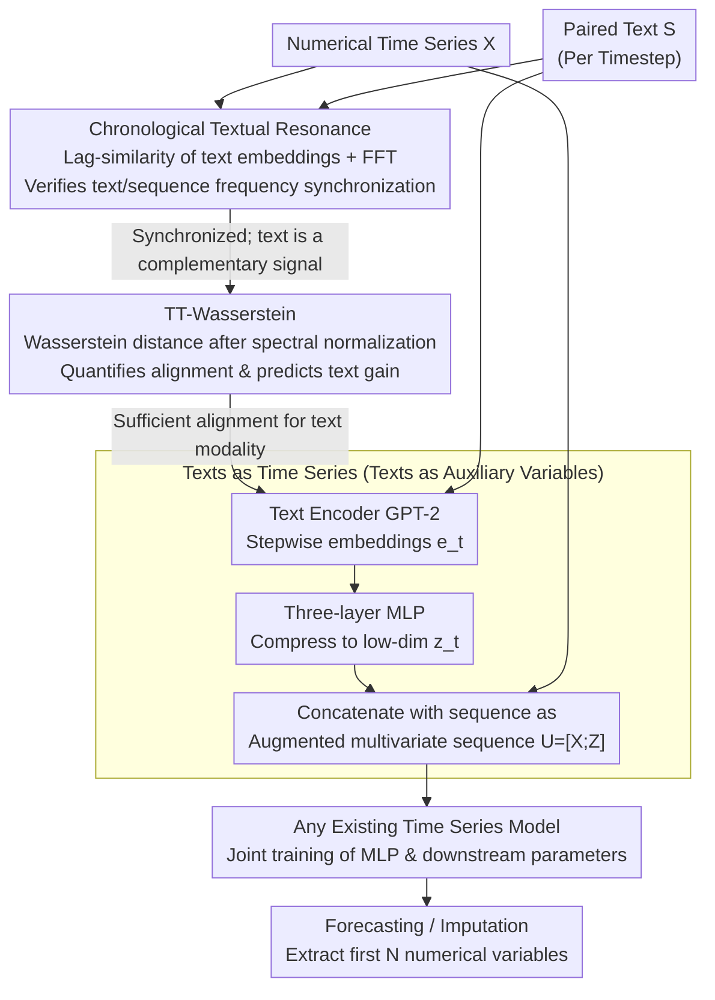

# Language in the Flow of Time: Time-Series-Paired Texts Weaved into a Unified Temporal Narrative

**Conference**: ICLR2026  
**arXiv**: [2502.08942](https://arxiv.org/abs/2502.08942)  
**Code**: [iDEA-iSAIL-Lab-UIUC/TaTS](https://github.com/iDEA-iSAIL-Lab-UIUC/TaTS)  
**Area**: Time Series  
**Keywords**: multimodal time series, text-augmented forecasting, Chronological Textual Resonance, plug-and-play framework  

## TL;DR
This work discovers that text paired with time series exhibits a periodicity similar to the time series itself (Chronological Textual Resonance). It proposes the TaTS framework, which transforms textual representations into auxiliary variables to enhance the forecasting and imputation performance of any existing time series model in a plug-and-play manner.

## Background & Motivation

**Background**: In real-world scenarios, time series data is often accompanied by step-by-step textual information (e.g., infection rates + government announcements during a pandemic, economic indicators + news reports). However, most existing models only process numerical data, wasting the complementary information contained in the text.

**Key Challenge**: Current advanced multimodal methods (such as MM-TSFLib) utilize text but ignore the unique positional characteristics and periodicity of time-series-paired text. The text is often simply concatenated rather than being treated as a signal that evolves synchronously with the sequence.

**Key Insight**: The authors were inspired by the Platonic Representation Hypothesis (PRH), which suggests that different modalities converge toward a shared representation space when describing the same phenomenon. If time series and paired text describe the same evolving event, they should exhibit similar periodicity. This transforms the question of "is text worth using" from an empirical judgment into a verifiable and measurable problem.

**Goal**: To systematically answer two questions: what are the unique attributes of time-series-paired text? And how can this textual information be integrated to improve forecasting and imputation without modifying the downstream models?

## Method

### Overall Architecture

The problem addressed is that time series are often accompanied by paired text at each timestep, yet mainstream models waste this complementary information. The overall approach of TaTS consists of three stages: establishing the foundation, quantifying alignment, and the fusion mechanism. First, it establishes the foundation with an observation: the periodicity of paired text is highly synchronized with the sequence itself (termed Chronological Textual Resonance, CTR), proving text is a complementary signal rather than noise. Second, it uses a metric (TT-Wasserstein) to quantify how well the text and sequence are aligned; better alignment predicts greater gains from the text. Third, it implements a lightweight fusion—encoding and compressing the text at each timestep into low-dimensional vectors, treated as "auxiliary variables" concatenated with the original numerical sequence. This augmented sequence is fed into any off-the-shelf time series model for joint training. Textual information is thus seamlessly injected into the forecasting/imputation pipeline without changing a single line of the downstream model architecture.

### Key Designs

**1. Chronological Textual Resonance: Proving the Hidden Periodicity in Text**

If text and time series describe the same event, according to PRH, their representations should converge to a shared space and exhibit similar periodicity. The authors formalize this by using a text encoder to convert text $s_t$ at each timestep into an embedding $e_t$, calculating lag-similarity $d_l = \sum_t \cos(e_t, e_{t+L})$, and performing an FFT on the $d_l$ sequence to identify the dominant frequency. Across three real-world categories (Economy, Social Good, Traffic), the dominant frequency of text embedding lag-similarity aligns closely with the time series. The authors propose three causes for CTR: shared external drivers (seasons, economic cycles), text narrating the sequence trends, and text carrying additional variables with aligned periodicity. This discovery is the foundation of the method—because they are synchronized, incorporating text provides signal rather than noise.

**2. TT-Wasserstein: Predicting Utility via a Scalar**

Since the strength of CTR varies across datasets, a metric is needed to quantify alignment. TT-Wasserstein normalizes the power spectra of the time series and text into distributions and calculates the Wasserstein distance between them. A lower value indicates better alignment and higher potential gain from text. To verify this measures alignment, the authors performed timestamp shuffling on Time-MMD (destroying alignment), which significantly increased TT-Wasserstein. Experiments showed that lower ratios correspond to higher gains (e.g., Economy showed a 64.8% improvement with a low raw/shuffled ratio of 22.3%). This index explains performance variance across datasets and helps decide whether to use the text modality before deployment.

**3. Texts as Time Series: Plug-and-Play as Auxiliary Variables**

With "frequency synchronization" established, the fusion can be extremely lightweight. First, a pre-trained language model (default GPT-2) encodes text per timestep: $e_t = \mathcal{H}_{\text{text}}(s_t) \in \mathbb{R}^{d_{\text{text}}}$. Since the embedding dimension is high, a three-layer MLP compresses it to a low dimension $z_t = \text{MLP}(e_t) \in \mathbb{R}^{d_{\text{mapped}}}$, reducing noise and parameters. Finally, the mapped text representation is concatenated as an auxiliary variable with the original sequence along the variable dimension $U = [X; Z^\top] \in \mathbb{R}^{T \times (N + d_{\text{mapped}})}$. The entire sequence is fed into any existing time series model, where the MLP and downstream parameters are trained jointly. During inference, only the first $N$ variables are output. This "text as auxiliary variable" design leaves the downstream architecture untouched, allowing it to be applied to 9 mainstream models with minimal costs (~1% more parameters, ~8% more training time) for an average ~14% performance boost.

## Key Experimental Results

### Forecasting (9 Time-MMD datasets × 9 models)
- TaTS outperforms uni-modal and MM-TSFLib on all datasets.
- Average improvement exceeds 5% on 6/9 datasets, with Environment exceeding 30%.
- Economy dataset shows the most significant gains: iTransformer MSE dropped from 0.014 to 0.008 (↓ 42.9%), and Transformer MSE dropped from 0.584 to 0.079 (↓ 86.5%).

### Imputation (Climate/Economy/Traffic)
- Maximum improvement of 67.2% (PatchTST MAE on the Economy dataset).

### Comparison with Other Baselines (Table 4)
- Significantly outperforms covariate/convolutional methods like N-BEATS, N-HiTS, and TCN.
- Surpasses ChatTime (zero-shot multimodal foundation model) and GPT4MTS.

### Correlation between TT-Wasserstein and Gain
- The lower the raw/shuffled TT-Wasserstein ratio, the greater the TaTS improvement (e.g., Economy ratio of 22.3% corresponds to a 64.8% gain).

### Efficiency
- The MLP adds only ~1% in parameters and ~8% in training time, while providing an average ~14% performance gain.

## Highlights & Insights
- **Novel Insight**: First to discover and formalize the CTR phenomenon, providing a theoretical lens for multimodal time series.
- **Concise & Effective**: Adds a lightweight MLP without modifying any downstream model architectures, enabling plug-and-play usage.
- **High Generality**: Compatible with 9 mainstream time series models (Transformer/Linear/Frequency-based) and supports both forecasting and imputation tasks.
- **Practical Metric**: TT-Wasserstein can predict the potential gain of textual modeling, guiding practical application decisions.

## Limitations & Future Work
- The text encoder is fixed to a pre-trained LM (GPT-2); end-to-end fine-tuning of the text encoder was not explored.
- The MLP mapping dimension $d_{\text{mapped}}$ requires manual setting; although experiments suggest low sensitivity, an automated selection mechanism is lacking.
- When text quality is extremely low (e.g., randomly shuffled), TaTS may perform slightly worse than numerical-only models. While a mitigation strategy for dropping low-quality text is provided, automatic detection is not implemented.
- Only considers timestamp-aligned paired text; it does not handle irregular or asynchronous text-time series pairing scenarios.
- Only MLP, gated residual, and cross-attention fusion were tested; more complex fusion strategies might yield further improvements.

## Related Work & Insights

| Method | Characteristics | Limitations |
|------|------|------|
| MM-TSFLib | First multimodal time series library | Ignores positional characteristics of text |
| ChatTime | Zero-shot multimodal reasoning | Performance inferior to supervised TaTS |
| N-BEATS/N-HiTS | Covariate modeling | Not designed specifically for text; poor effectiveness |
| StockNet/Dandelion | Financial domain text fusion | Lacks timestamp alignment; poor generality |
| **TaTS (Ours)** | Plug-and-play, treats text as auxiliary variables | Requires timestamp-aligned paired text |

## Related Work & Insights
- The CTR phenomenon is essentially a specific instance of PRH in the multimodal time series context, providing a path to explore alignment between other modalities (e.g., images, audio) and time series.
- TT-Wasserstein, as a data quality metric, could be generalized to other multimodal scenarios to evaluate inter-modal alignment.
- The concept of "text as auxiliary variables" may be applicable to other heterogeneous data fusion scenarios (e.g., using knowledge graph embeddings as auxiliary variables for time series).
- As LM scale increases (BERT → GPT-2 → LLaMA2), performance slightly improves, suggesting that stronger text encoders can further unlock multimodal potential.

## Rating
- Novelty: ⭐⭐⭐⭐ — The CTR phenomenon and TT-Wasserstein metric are original.
- Experimental Thoroughness: ⭐⭐⭐⭐⭐ — 18 datasets, 9 models, and comprehensive ablation studies.
- Writing Quality: ⭐⭐⭐⭐ — Clear logic and rich visualization.
- Value: ⭐⭐⭐⭐ — The plug-and-play design is highly practical, though applicability is limited to the availability of paired text.

<!-- RELATED:START -->

## Related Papers

- [\[ICLR 2026\] SRT: Super-Resolution for Time Series via Disentangled Rectified Flow](srt_super-resolution_for_time_series_via_disentangled_rectified_flow.md)
- [\[ICLR 2026\] UniCA: Unified Covariate Adaptation for Time Series Foundation Model](unica_unified_covariate_adaptation_for_time_series_foundation_model.md)
- [\[ICLR 2026\] Flow-based Conformal Prediction for Multi-dimensional Time Series](flow-based_conformal_prediction_for_multi-dimensional_time_series.md)
- [\[ICLR 2026\] Time-Gated Multi-Scale Flow Matching for Time-Series Imputation](time-gated_multi-scale_flow_matching_for_time-series_imputation.md)
- [\[ICLR 2026\] pyrregular: A Unified Framework for Irregular Time Series, with Classification Benchmarks](pyrregular_a_unified_framework_for_irregular_time_series_with_classification_ben.md)

<!-- RELATED:END -->
